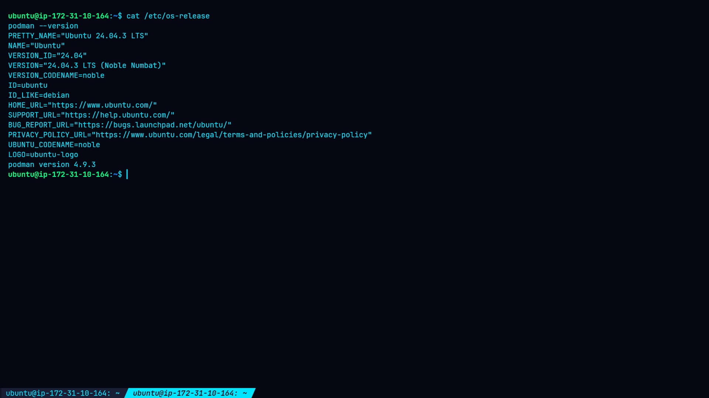
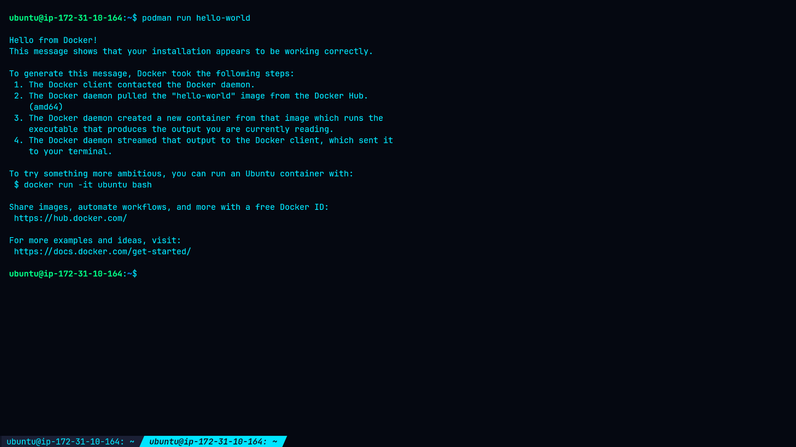
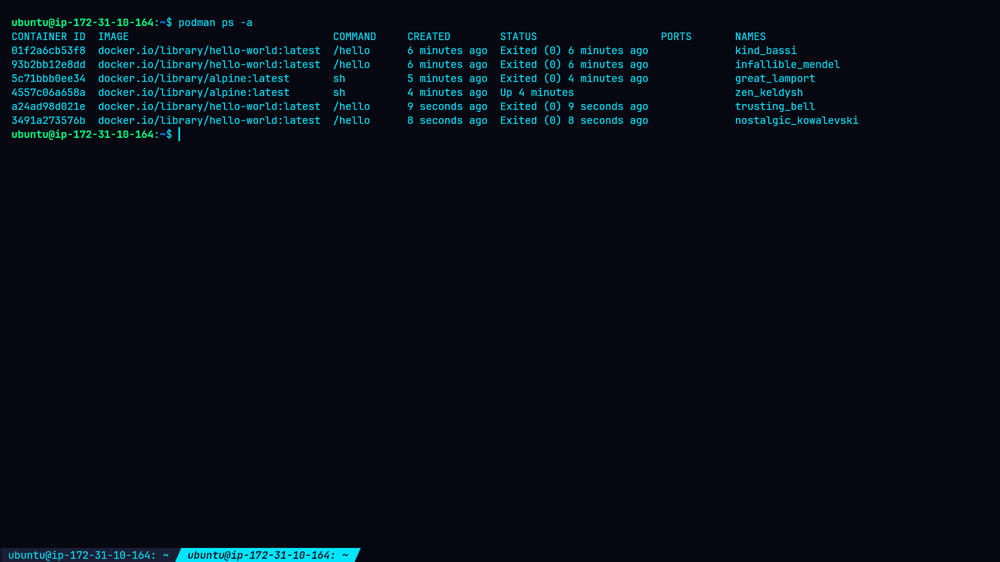
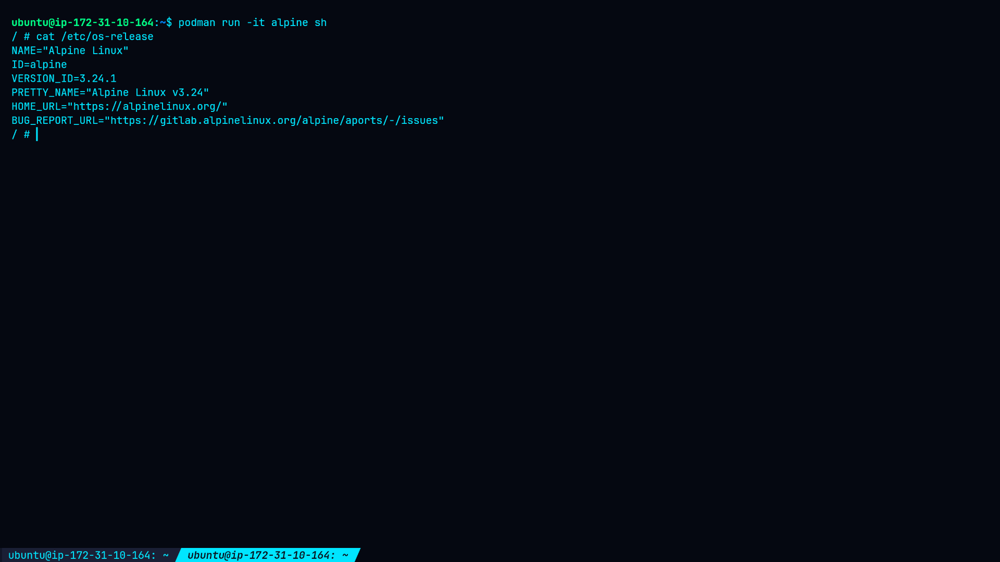

# Lab 1 — Introduction to Containers

## 🎯 Objective

This lab introduces the fundamentals of containerization and provides hands-on experience with **Podman**.

By completing this lab, I learned:

* Fundamental concepts of containerization
* Container isolation and portability
* How to pull container images
* How to run and inspect containers using Podman
* How container processes and filesystems are isolated from the host

---

## 🖥️ Environment

| Component        | Details                 |
| ---------------- | ----------------------- |
| Operating System | Ubuntu 24.04.3 LTS      |
| Container Engine | Podman 4.9.3            |
| Architecture     | AMD64                   |
| User             | `ubuntu`                |
| Container Images | `hello-world`, `alpine` |

---

# 1. Verify Podman Installation

First, I verified the host operating system and Podman installation.

### Check OS

```bash
cat /etc/os-release
```

### Check Podman

```bash
podman --version
```

### Result

```text
Ubuntu 24.04.3 LTS
podman version 4.9.3
```

Podman was already installed and working correctly.

---

# 2. Run a Hello World Container

## 2.1 Pull the Image

I pulled the official `hello-world` container image:

```bash
podman pull hello-world
```

Podman successfully downloaded:

```text
docker.io/library/hello-world:latest
```

### Result

```text
Trying to pull docker.io/library/hello-world:latest...
Getting image source signatures
Copying blob ... done
Writing manifest to image destination
```

---

## 2.2 Run the Container

```bash
podman run hello-world
```

### Result

```text
Hello from Docker!
This message shows that your installation appears to be working correctly.
```

Although the message refers to Docker, the container was executed using **Podman**.

This confirms that Podman was able to:

1. Create the container
2. Start the container
3. Execute the application
4. Display the output
5. Exit successfully

---

## 2.3 Verify Container Status

```bash
podman ps -a
```

### Result

The containers exited with status:

```text
Exited (0)
```

`Exit code 0` indicates successful execution.

Example:

```text
CONTAINER ID  IMAGE                                 COMMAND  STATUS
01f2a6cb53f8  docker.io/library/hello-world:latest  /hello   Exited (0)
93b2bb12e8dd  docker.io/library/hello-world:latest  /hello   Exited (0)
```

Two containers were present because `podman run` creates a new container each time it is executed.

---

# 3. Explore Container Isolation

To demonstrate container isolation, I launched an Alpine Linux container.

## 3.1 Start Alpine Container

```bash
podman run -it alpine sh
```

Podman pulled the Alpine image and opened an interactive shell.

The container prompt changed to:

```text
/ #
```

---

## 3.2 Identify the Container Operating System

Inside the container:

```bash
cat /etc/os-release
```

### Result

```text
NAME="Alpine Linux"
ID=alpine
VERSION_ID=3.24.1
PRETTY_NAME="Alpine Linux v3.24"
```

The host system is Ubuntu, while the container provides an Alpine Linux userspace.

This demonstrates that containers can package their own filesystem, libraries, utilities, and userspace environment.

---

# 4. Verify Container Hostname

Inside the Alpine container:

```bash
hostname
```

### Result

```text
5c71bbb0ee34
```

The container had its own hostname rather than using the host's hostname.

---

# 5. Inspect Container Processes

Inside the Alpine container:

```bash
ps
```

### Result

```text
PID   USER     TIME  COMMAND
1     root     0:00  sh
9     root     0:00  ps
```

The shell appeared as **PID 1** inside the container.

This demonstrates process namespace isolation: the container has its own process view.

---

# 6. Exit the Container

```bash
exit
```

After exiting, the terminal returned to the Ubuntu host:

```text
ubuntu@ip-172-31-10-164:~$
```

---

# 🔬 Evidence

The following screenshots provide visual evidence of the practical work performed during this lab.

## 1. Podman Installation

Podman 4.9.3 was successfully verified on Ubuntu 24.04.3 LTS.



---

## 2. Hello World Container

The `hello-world` image was successfully executed using Podman.



---

## 3. Container Status

The container exited successfully with status code `0`.



---

## 4. Alpine Container Isolation

The container reported Alpine Linux 3.24.1 while the host system is Ubuntu.



---

## 5. Process Isolation

The Alpine container showed its own process namespace.


---

# 🧠 Key Concepts Learned

## Containerization

A container packages an application together with its required libraries, dependencies, and userspace environment.

## Isolation

Containers use Linux kernel features such as namespaces and cgroups to isolate processes and resources.

## Portability

Because the application and its dependencies can be packaged into an image, containers can run consistently across different environments.

## Containers vs Virtual Machines

Containers generally share the host's Linux kernel, whereas virtual machines typically run a complete guest operating system with its own kernel.

---

# 🔎 Practical Findings

The lab demonstrated:

* Podman installation and version verification
* Container image retrieval
* Container creation and execution
* Successful container exit status
* Alpine Linux userspace inside an Ubuntu host
* Container-specific hostname
* Process namespace isolation

For detailed observations and findings, see [`findings.md`](findings.md).

---

# 🛡️ Remediation & Security Recommendations

No security vulnerability was identified during this introductory lab.

However, basic container security practices should be followed when moving toward production environments:

* Prefer rootless containers
* Use trusted container images
* Keep images updated
* Minimize container privileges
* Remove unnecessary packages and services
* Scan images for known vulnerabilities
* Apply CPU and memory limits where appropriate
* Monitor container activity
* Secure private container registries

For detailed recommendations, see [`remediation.md`](remediation.md).

---

# 📋 Methodology

The lab followed this workflow:

```text
Environment Verification
        ↓
Podman Verification
        ↓
Image Retrieval
        ↓
Container Execution
        ↓
Container Status Verification
        ↓
Alpine Container Deployment
        ↓
OS / Hostname / Process Inspection
        ↓
Container Exit
        ↓
Evidence Collection
```

For the detailed methodology, see [`methodology.md`](methodology.md).

---

# 💻 Commands

The commands used during the lab are documented separately in [`command.md`](command.md).

Key commands included:

```bash
podman --version
podman pull hello-world
podman run hello-world
podman ps -a
podman run -it alpine sh
cat /etc/os-release
hostname
ps
exit
```

---

# ✅ Lab Completion

**Status: COMPLETED**

| Requirement                 | Status |
| --------------------------- | ------ |
| Install/verify Podman       | ✅      |
| Pull `hello-world` image    | ✅      |
| Run `hello-world` container | ✅      |
| Verify container status     | ✅      |
| Run Alpine container        | ✅      |
| Verify container OS         | ✅      |
| Verify container hostname   | ✅      |
| Inspect container processes | ✅      |
| Exit container              | ✅      |

---

# 🚀 Next Steps

Further containerization practice can include:

* Podman networking
* Container volumes
* Container environment variables
* Building custom container images
* Podman Compose
* Container security
* Kubernetes and OpenShift
* Container vulnerability scanning

---

## 📚 References

* [Podman Documentation](https://podman.io/docs/)
* [Red Hat Container Documentation](https://docs.redhat.com/)
* [Alpine Linux Documentation](https://docs.alpinelinux.org/)

---

## 📁 Lab Documentation

| File                               | Description                             |
| ---------------------------------- | --------------------------------------- |
| [`README.md`](README.md)           | Complete lab documentation and evidence |
| [`methodology.md`](methodology.md) | Lab methodology and validation process  |
| [`command.md`](command.md)         | Commands used during the lab            |
| [`findings.md`](findings.md)       | Practical findings and observations     |
| [`remediation.md`](remediation.md) | Container security recommendations      |
| [`screenshots/`](screenshots/)     | Practical evidence screenshots          |
