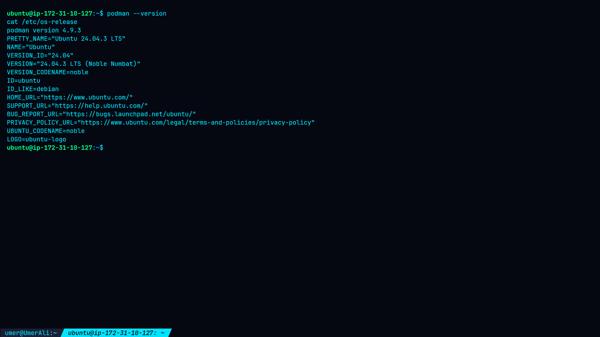
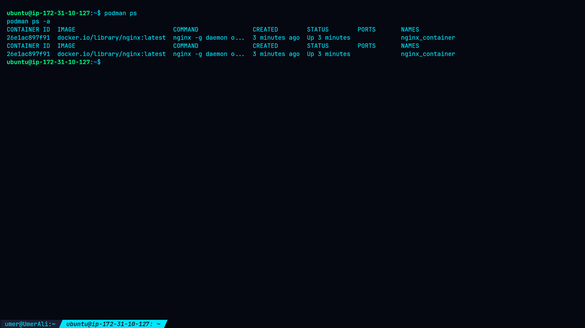
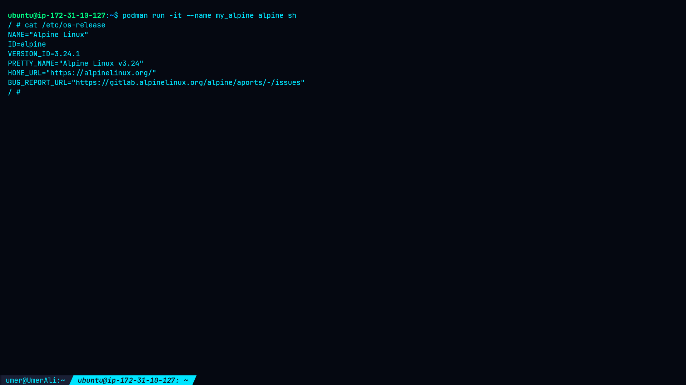
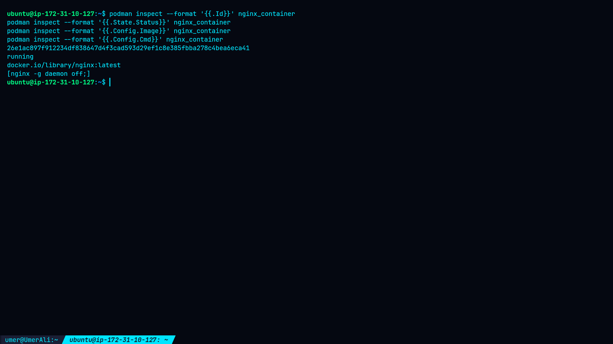
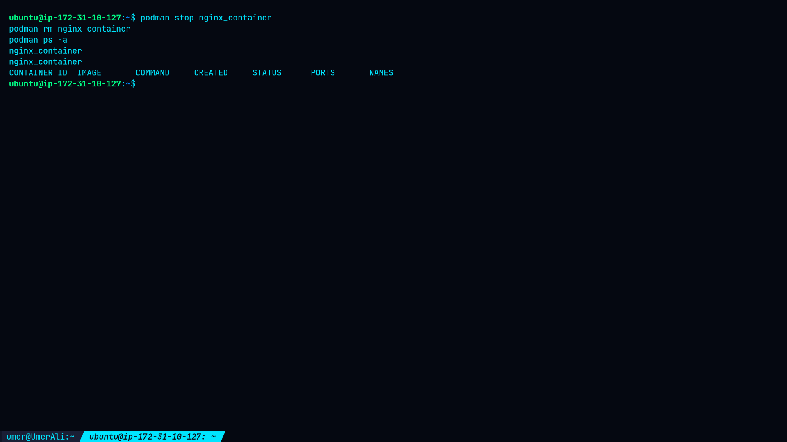

# Lab 2 — Exploring Podman CLI

## 🎯 Objective

This lab explores the fundamental **Podman CLI commands** used to manage container lifecycles and inspect container configuration.

By completing this lab, I learned:

* How to list running and stopped containers
* How to create and run containers
* How to stop and restart containers
* How to remove containers
* How to inspect container configuration
* How container processes affect container lifecycle
* How to troubleshoot container image name resolution
* How to use fully qualified container image references
* How to verify container cleanup

---

## 🖥️ Environment

| Component        | Details            |
| ---------------- | ------------------ |
| Operating System | Ubuntu 24.04.3 LTS |
| Container Engine | Podman 4.9.3       |
| Architecture     | AMD64              |
| User             | `ubuntu`           |
| Execution Mode   | Rootless           |
| Runtime          | `runc`             |
| Network          | `slirp4netns`      |
| Storage Driver   | `overlay`          |
| Cgroup Version   | v2                 |
| Environment      | AWS EC2            |
| Container Images | `alpine`, `nginx`  |

---

# 1. Verify Podman Environment

First, I verified the host operating system and Podman installation.

## Check Operating System

```bash
cat /etc/os-release
```

## Check Podman Version

```bash
podman --version
```

### Result

```text
Ubuntu 24.04.3 LTS
podman version 4.9.3
```

Podman was already installed and working correctly.

### 📸 Evidence



---

# 2. List Containers

Before creating any containers, I checked the current container inventory.

## List Running Containers

```bash
podman ps
```

## List All Containers

```bash
podman ps -a
```

### Result

Both commands initially returned an empty container list.

The difference between the two commands is:

* `podman ps` — displays currently running containers.
* `podman ps -a` — displays running, stopped, created, and other existing containers.

### 📸 Evidence



---

# 3. Run an Alpine Container

I created an interactive Alpine Linux container using Podman.

## 3.1 Start Alpine Container

```bash
podman run -it --name my_alpine alpine sh
```

Podman pulled the Alpine image and started an interactive shell inside the container.

---

## 3.2 Identify the Container Operating System

Inside the container, I checked `/etc/os-release`.

```bash
cat /etc/os-release
```

### Result

```text
NAME="Alpine Linux"
ID=alpine
VERSION_ID=3.24.1
PRETTY_NAME="Alpine Linux v3.24"
HOME_URL="https://alpinelinux.org/"
BUG_REPORT_URL="https://gitlab.alpinelinux.org/alpine/aports/-/issues"
```

This confirmed that the container was running **Alpine Linux 3.24.1**.

---

## 3.3 Verify Container Hostname

I then checked the hostname from inside the container.

```bash
hostname
```

### Result

```text
6c5ae1c51715
```

The hostname was different from the host system, demonstrating that the container has its own isolated container identity.

---

## 3.4 Exit the Container

```bash
exit
```

After exiting the interactive shell, the container stopped.

I verified the state from the host:

```bash
podman ps
```

```bash
podman ps -a
```

The container appeared under the stopped containers list.

Example:

```text
CONTAINER ID  IMAGE                            COMMAND  CREATED         STATUS        NAMES
6c5ae1c51715  docker.io/library/alpine:latest  sh       ...             Exited (0)    my_alpine
```

### 📸 Evidence



---

# 4. Stop the Container

The Alpine container was explicitly stopped using:

```bash
podman stop my_alpine
```

Then I verified the container state:

```bash
podman ps -a
```

### Result

The container remained in the stopped state.

This demonstrated how Podman can manage the lifecycle of an existing container without deleting it.

---

# 5. Restart the Container

I tested the restart operation:

```bash
podman restart my_alpine
```

Then checked running containers:

```bash
podman ps
```

The container did not remain running.

I then checked all containers:

```bash
podman ps -a
```

### Finding

The Alpine container was created with:

```text
sh
```

as its main process.

Because the interactive shell had already exited, restarting the container caused the main process to terminate again.

Therefore, the container did not remain active after the restart.

This demonstrates an important container concept:

> A container normally remains running only while its primary process is running.

---

# 6. Test Container Restart with a Long-Running Process

To test lifecycle behavior with a process designed to remain active, I created another Alpine container:

```bash
podman run -d --name my_alpine_lifecycle alpine sleep 300
```

The container started in detached mode.

I verified it:

```bash
podman ps
```

Then tested restart:

```bash
podman restart my_alpine_lifecycle
```

During this test, Podman reported a stop timeout:

```text
WARN[0010] StopSignal SIGTERM failed to stop container my_alpine_lifecycle in 10 seconds, resorting to SIGKILL
```

The container subsequently appeared in a `Stopping` state.

For cleanup, I used:

```bash
podman rm -f my_alpine_lifecycle
```

The cleanup completed successfully.

I then ran:

```bash
podman system migrate
```

and verified:

```bash
podman ps -a
```

### Finding

The restart test exposed **environment-specific stop/restart behavior** in this rootless Podman 4.9.3 EC2 environment.

This was recorded as a troubleshooting observation rather than a confirmed security vulnerability.

---

# 7. Remove a Container

To independently verify container removal, I created a new Alpine container:

```bash
podman create --name my_alpine alpine sh
```

I checked the container:

```bash
podman ps -a
```

The container appeared with the status:

```text
Created
```

I then removed it:

```bash
podman rm my_alpine
```

Finally:

```bash
podman ps -a
```

### Result

The container was successfully removed and the container list was empty.

---

# 8. Run an Nginx Container

The next task was to run an Nginx container.

I first attempted to use the short image name:

```bash
podman run -d --name nginx_container nginx
```

### Result

The command failed with:

```text
Error: short-name "nginx" did not resolve to an alias and no unqualified-search registries are defined in "/etc/containers/registries.conf"
```

This occurred because the Podman environment did not have an unqualified image search registry configured.

---

# 9. Run Nginx Using a Fully Qualified Image

Instead of using the short image name, I specified the complete registry and image path:

```bash
podman run -d --name nginx_container docker.io/library/nginx
```

Podman successfully pulled:

```text
docker.io/library/nginx:latest
```

and started the container.

I verified the running container:

```bash
podman ps
```

### Result

```text
CONTAINER ID  IMAGE                           COMMAND               STATUS
26e1ac897f91  docker.io/library/nginx:latest  nginx -g daemon off;  Up
```

The Nginx container was running successfully.

---

# 10. Inspect the Nginx Container

Podman provides detailed container information through:

```bash
podman inspect nginx_container
```

I also used formatted inspection commands to extract specific values.

## Container ID

```bash
podman inspect --format '{{.Id}}' nginx_container
```

### Result

```text
26e1ac897f912234df838647d4f3cad593d29ef1c8e385fbba278c4bea6eca41
```

---

## Container State

```bash
podman inspect --format '{{.State.Status}}' nginx_container
```

### Result

```text
running
```

---

## Container Image

```bash
podman inspect --format '{{.Config.Image}}' nginx_container
```

### Result

```text
docker.io/library/nginx:latest
```

---

## Container Command

```bash
podman inspect --format '{{.Config.Cmd}}' nginx_container
```

### Result

```text
[nginx -g daemon off;]
```

---

## Additional Inspection Findings

The inspection also showed:

* Runtime: `runc`
* Network mode: `slirp4netns`
* Rootless execution
* Container was not privileged
* PID namespace was private
* UTS namespace was private
* Restart policy was not configured
* Auto-removal was disabled
* Nginx was running as the foreground process
* Container stop timeout was 10 seconds

The container exposed the internal Nginx port:

```text
80/tcp
```

but no host port was published.

### 📸 Evidence



---

# 11. Clean Up Nginx Container

After completing the inspection, I stopped the Nginx container:

```bash
podman stop nginx_container
```

Then removed it:

```bash
podman rm nginx_container
```

Finally, I verified the container inventory:

```bash
podman ps -a
```

### Result

The final container list was empty.

### 📸 Evidence



---

# 🧠 Key Concepts Learned

## Container Lifecycle

The basic container lifecycle can be represented as:

```text
Create → Run → Stop → Restart → Remove
```

Podman provides individual commands for each lifecycle stage.

---

## Container Main Process

A container depends on its primary process.

In the Alpine exercise, the primary process was:

```text
sh
```

When the interactive shell exited, the container stopped.

This explains why simply restarting the container did not make it remain active.

---

## Container Inspection

The `podman inspect` command provides detailed information about:

* Container ID
* Image
* State
* Command
* Runtime
* Networking
* Capabilities
* Namespaces
* Restart policy
* Resource configuration

This makes `podman inspect` useful for troubleshooting and security reviews.

---

## Rootless Containers

The environment used rootless Podman.

The Podman configuration reported:

```text
rootless: true
```

Rootless containers reduce the need for privileged host access and are generally preferred when workloads do not require elevated privileges.

---

## Fully Qualified Image References

The short image name:

```bash
nginx
```

did not resolve in this environment.

The fully qualified image reference:

```bash
docker.io/library/nginx
```

worked successfully.

Using explicit registry references makes the intended image source clear.

---

# 🔬 Practical Evidence

The following screenshots were captured during the actual lab execution.


### Environment Verification


### Container Listing


### Alpine Container


### Nginx Inspection


### Nginx Cleanup


---

# 🔎 Findings

| Test                            | Result                           |
| ------------------------------- | -------------------------------- |
| Podman environment verification | ✅ PASS                           |
| Container listing               | ✅ PASS                           |
| Alpine container execution      | ✅ PASS                           |
| Container stop                  | ✅ PASS                           |
| Container restart               | ⚠️ Environment-specific behavior |
| Container removal               | ✅ PASS                           |
| Nginx deployment                | ✅ PASS                           |
| Nginx inspection                | ✅ PASS                           |
| Nginx cleanup                   | ✅ PASS                           |
| Short `nginx` image resolution  | ⚠️ Registry configuration issue  |

The restart behavior and short-name resolution issue were useful troubleshooting observations encountered during the actual lab.

---

# 🔐 Security Recommendations

* Use rootless containers where practical.
* Use trusted, fully qualified image references.
* Pin image versions or digests for reproducible deployments.
* Keep container images updated.
* Avoid privileged containers unless specifically required.
* Minimize Linux capabilities.
* Expose only required network ports.
* Inspect container configuration before deployment.
* Scan container images for vulnerabilities.
* Remove unused containers and images.
* Monitor container lifecycle and runtime errors.

---

# ✅ Lab Completion

| Objective            | Status      |
| -------------------- | ----------- |
| List containers      | ✅ Completed |
| Run Alpine container | ✅ Completed |
| Stop container       | ✅ Completed |
| Restart container    | ✅ Tested    |
| Remove container     | ✅ Completed |
| Run Nginx            | ✅ Completed |
| Inspect Nginx        | ✅ Completed |
| Clean up containers  | ✅ Completed |

**Lab Status: COMPLETED**

---

# 🚀 Next Steps

The next container-security exercises can include:

* Podman networking
* Port publishing
* Container volumes
* Environment variables
* Containerfiles
* Podman Compose
* Container image scanning
* Rootless container hardening
* Container capabilities
* Container resource limits
* Kubernetes fundamentals
* OpenShift fundamentals

---

## 📚 References

* Podman Documentation
* Red Hat Container Documentation
* Alpine Linux Documentation
* Nginx Documentation
