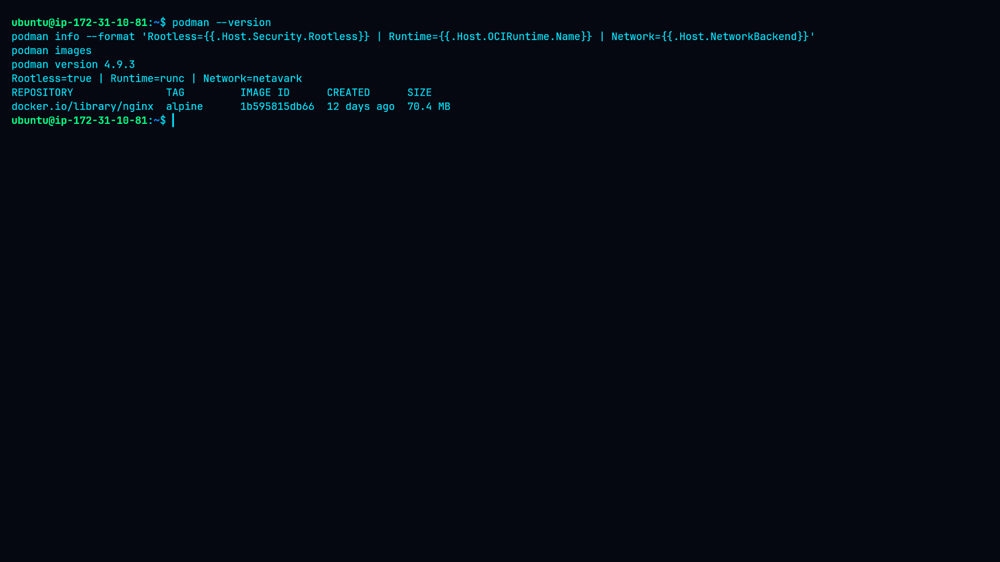
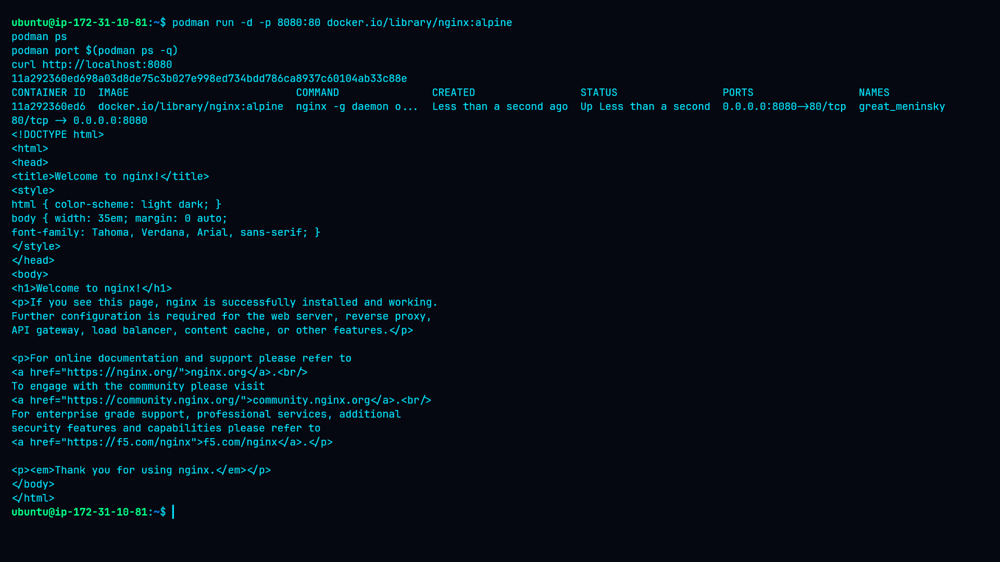
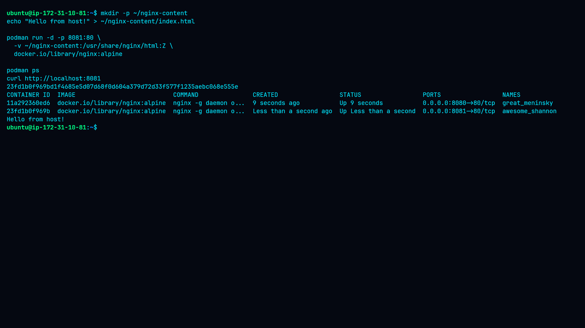
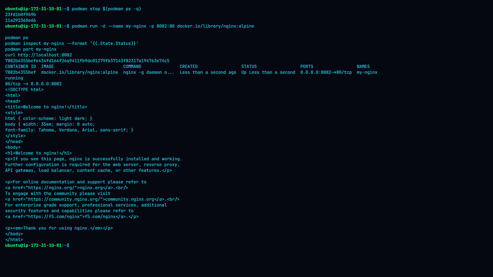
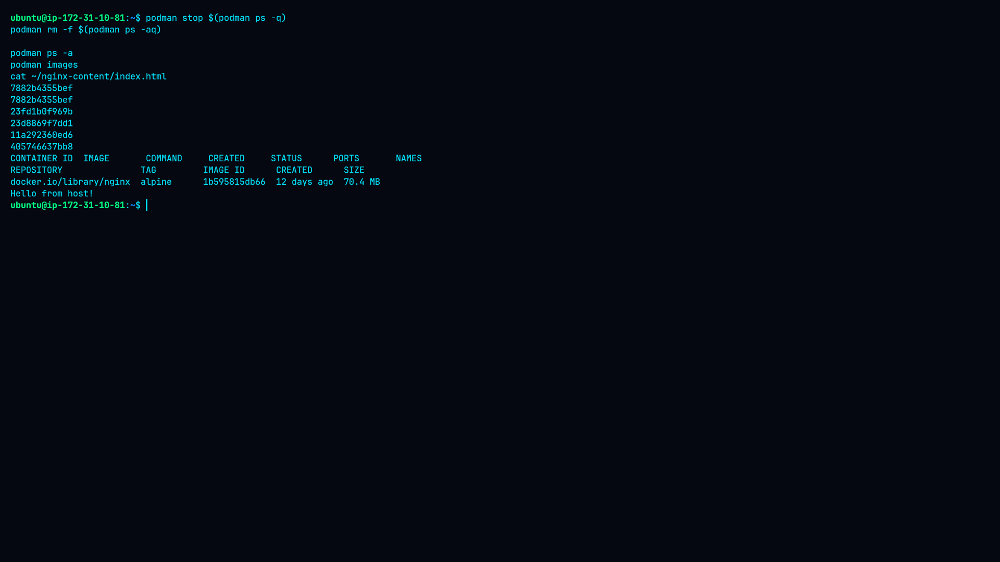

# 🐳 Lab 3 — Running Containers with Podman

## 🎯 Objective

The objective of this lab is to gain practical experience with running and managing containers using **Podman**.

This lab covers:

* Running containers in detached mode
* Mapping container ports to host ports
* Mounting host directories into containers
* Assigning custom names to containers
* Inspecting container configuration
* Testing containerized services
* Cleaning up containers and verifying host data persistence

---

# 🖥️ Environment

| Component        | Details                          |
| ---------------- | -------------------------------- |
| Platform         | Ubuntu Linux / AWS EC2           |
| Container Engine | Podman                           |
| Execution Mode   | Rootless                         |
| OCI Runtime      | runc                             |
| Network Backend  | netavark                         |
| Container Image  | `docker.io/library/nginx:alpine` |
| Application      | Nginx                            |

---

# 📦 Prerequisites

* Podman 3.0+
* Linux environment recommended
* Basic command-line knowledge
* Internet access for pulling the Nginx image

Verify Podman:

```bash
podman --version
```

---

# 🧪 Lab Tasks

## 1. Run a Container in Detached Mode

The Nginx Alpine image was started using detached mode:

```bash
podman run -d docker.io/library/nginx:alpine
```

The running container was verified with:

```bash
podman ps
```

The `-d` option allows the container to run in the background.

---

## 2. Map Host Port to Container Port

The Nginx container listens on port `80`.

A host-to-container port mapping was configured:

```bash
podman run -d -p 8080:80 docker.io/library/nginx:alpine
```

The mapping was verified:

```bash
podman port <container_id>
```

Observed:

```text
80/tcp -> 0.0.0.0:8080
```

The service was tested using:

```bash
curl http://localhost:8080
```

The Nginx welcome page was returned successfully.

---

## 3. Mount a Host Directory

A host directory was created:

```bash
mkdir -p ~/nginx-content
```

A custom HTML file was created:

```bash
echo "Hello from host!" > ~/nginx-content/index.html
```

The directory was mounted into the Nginx document root:

```bash
podman run -d -p 8081:80 \
  -v ~/nginx-content:/usr/share/nginx/html:Z \
  docker.io/library/nginx:alpine
```

The mounted content was tested:

```bash
curl http://localhost:8081
```

Result:

```text
Hello from host!
```

The mount was also verified using `podman inspect`.

---

## 4. Assign a Custom Container Name

A container was created with the custom name `my-nginx`:

```bash
podman run -d \
  --name my-nginx \
  -p 8082:80 \
  docker.io/library/nginx:alpine
```

The container state was verified:

```bash
podman inspect my-nginx --format '{{.State.Status}}'
```

Result:

```text
running
```

The port was verified:

```bash
podman port my-nginx
```

Result:

```text
80/tcp -> 0.0.0.0:8082
```

The service was tested:

```bash
curl http://localhost:8082
```

---

# 🔬 Practical Evidence

## 1. Podman Environment



This screenshot documents the Podman environment used during the lab. It shows the Podman version, rootless execution mode, OCI runtime, network backend, and available Nginx image.

---

## 2. Detached Container


This screenshot demonstrates that the Nginx container was successfully started in detached mode and was running in the background.

---

## 3. Port Mapping



This screenshot confirms that host port `8080` was mapped to container port `80`. The HTTP request to `localhost:8080` also confirms that the Nginx service was reachable.

---

## 4. Volume Mount



This screenshot demonstrates the bind mount between the host directory and the Nginx web root.

The response:

```text
Hello from host!
```

confirms that Nginx served content from the host-mounted directory.

---

## 5. Custom Container Name



This screenshot confirms that the container was assigned the custom name `my-nginx`, was running successfully, and was accessible through host port `8082`.

---

## 6. Cleanup



This screenshot confirms that the containers were successfully removed after completing the lab.

The Nginx image remained available, while the host-mounted file remained on the host filesystem.

---

# 🧠 Key Concepts Learned

### Detached Containers

Detached mode allows containers to run in the background:

```bash
podman run -d IMAGE
```

### Port Publishing

Podman can publish a container port to the host:

```bash
-p HOST_PORT:CONTAINER_PORT
```

Example:

```bash
-p 8080:80
```

### Bind Mounts

Host directories can be mounted into containers:

```bash
-v HOST_PATH:CONTAINER_PATH
```

Example:

```bash
-v ~/nginx-content:/usr/share/nginx/html:Z
```

### Custom Container Names

Containers can be given meaningful names:

```bash
--name my-nginx
```

This makes administration easier than relying only on generated container IDs.

---

# 🔎 Findings

| Test                             | Result       |
| -------------------------------- | ------------ |
| Detached container execution     | ✅ Successful |
| Port `8080 → 80` mapping         | ✅ Successful |
| Nginx HTTP test                  | ✅ Successful |
| Host volume mount                | ✅ Successful |
| Host content served by container | ✅ Successful |
| Custom container name            | ✅ Successful |
| Rootless execution               | ✅ Verified   |
| Container cleanup                | ✅ Successful |
| Host data persistence            | ✅ Verified   |

---

# 🔐 Security Recommendations

* Prefer **rootless containers** where possible.
* Expose only the ports required by the application.
* Restrict bind mounts to the minimum required host directories.
* Use trusted and regularly updated container images.
* Avoid unnecessary container privileges such as `--privileged`.
* Apply CPU and memory limits for production workloads.
* Remove unused containers and images.
* Monitor container logs, processes, network activity, and resource usage.

For detailed recommendations, see:

* [`findings.md`](findings.md)
* [`remediation.md`](remediation.md)

---

# 🧹 Cleanup

The lab containers were removed after testing:

```bash
podman stop $(podman ps -q)
podman rm -f $(podman ps -aq)
```

Final verification:

```bash
podman ps -a
```

The container list was empty.

The Nginx image remained available:

```bash
podman images
```

The host-mounted content remained available:

```bash
cat ~/nginx-content/index.html
```

Result:

```text
Hello from host!
```

This confirms that removing the containers did not remove the host filesystem data.

---

# 📚 Documentation

| Document                           | Description                                       |
| ---------------------------------- | ------------------------------------------------- |
| [`command.md`](command.md)         | Commands used throughout the lab                  |
| [`methodology.md`](methodology.md) | Practical methodology and validation process      |
| [`findings.md`](findings.md)       | Findings and security observations                |
| [`remediation.md`](remediation.md) | Security recommendations and remediation guidance |

---

# 📁 Lab Structure

```text
03-Running-Containers-with-Podman/
├── README.md
├── command.md
├── findings.md
├── methodology.md
├── remediation.md
└── screenshots/
    ├── 01-podman-environment.png
    ├── 02-detached-container.png
    ├── 03-port-mapping.png
    ├── 04-volume-mount.png
    ├── 05-custom-name.png
    └── 06-cleanup.png
```

---

# ✅ Lab Completion

All practical objectives were completed successfully.

**Status:** `Completed`

The lab demonstrated practical Podman skills including container execution, networking, bind mounts, container naming, inspection, service testing, cleanup, and basic container security considerations.

