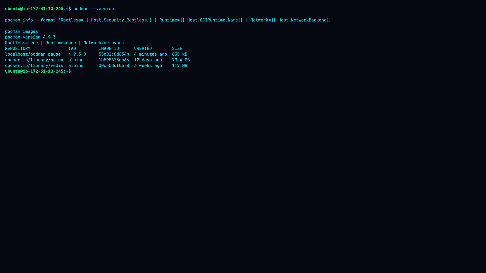
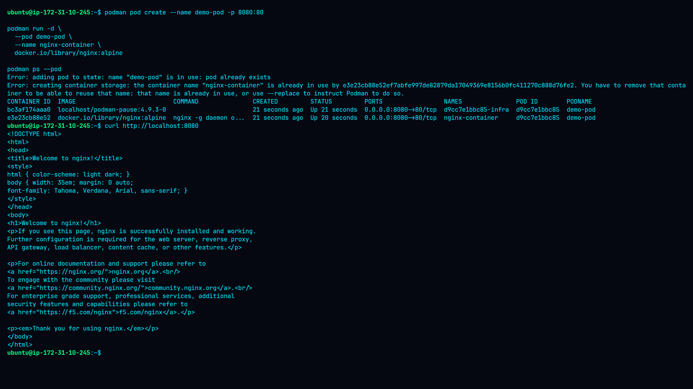
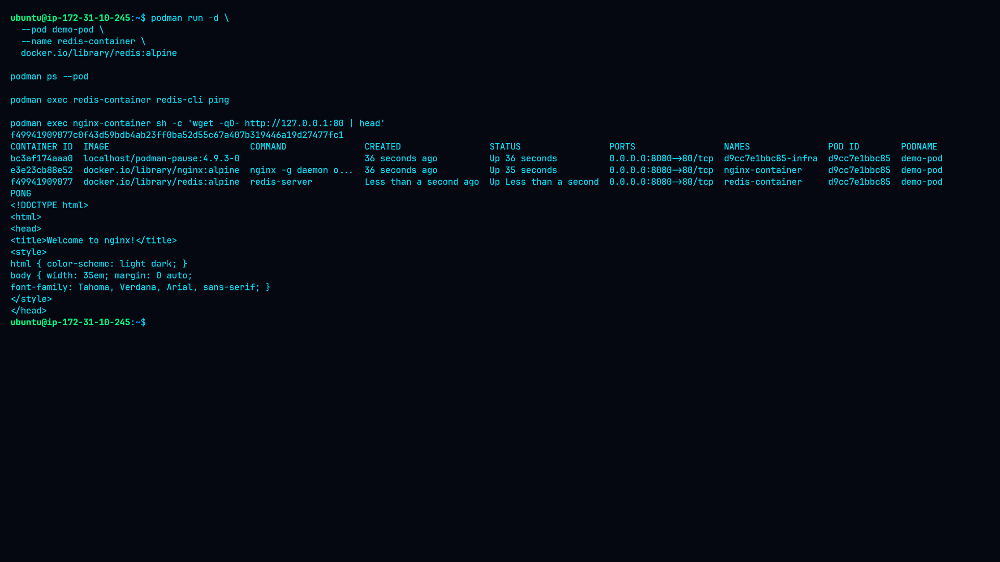
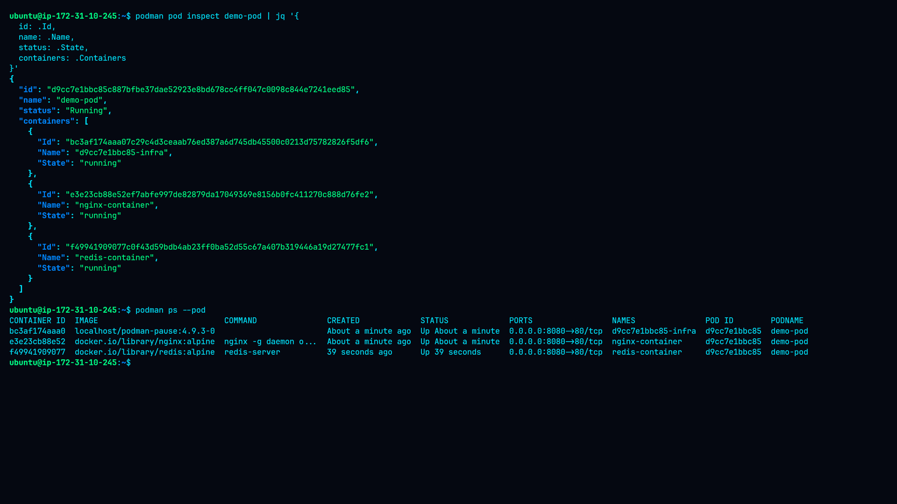
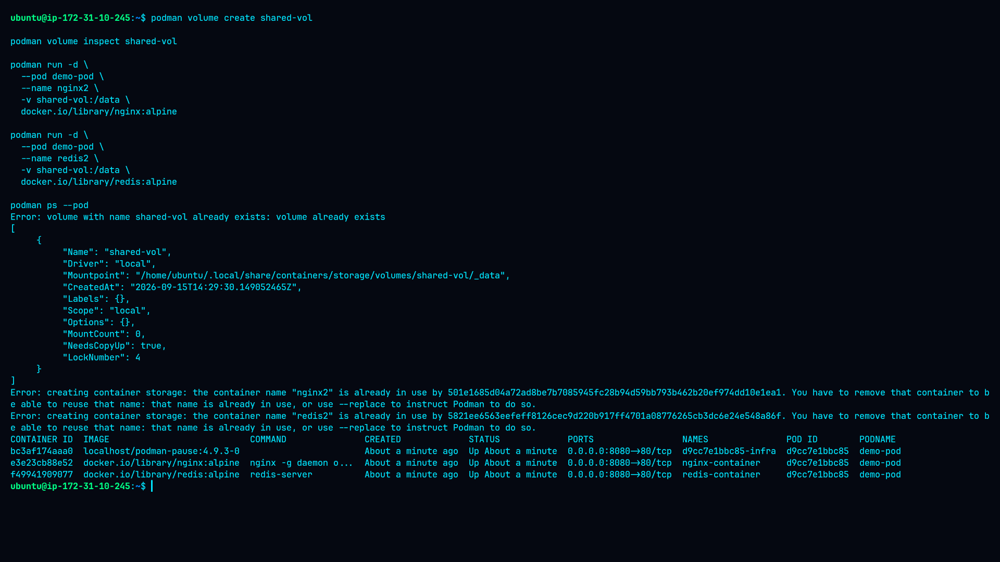
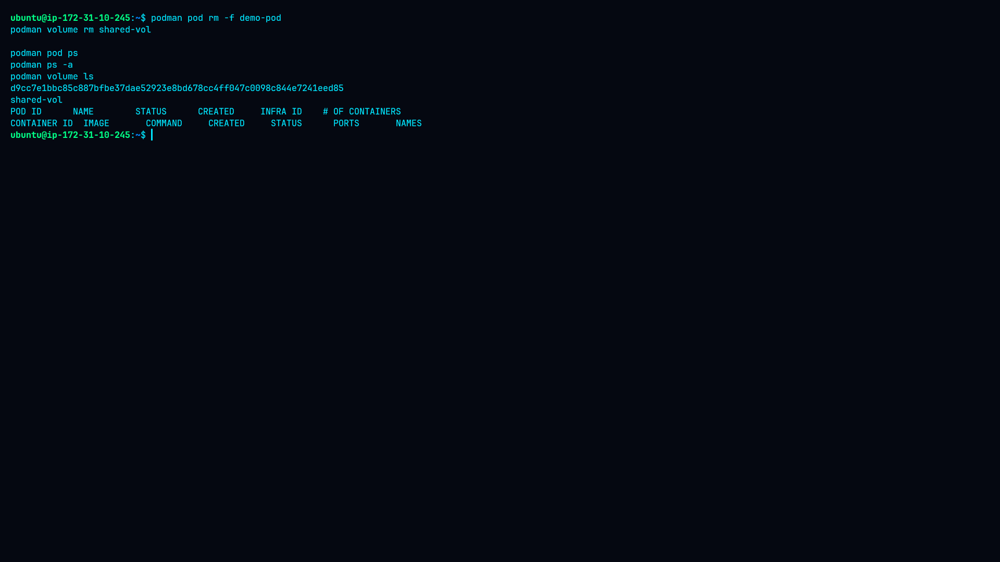

# 🐳 Lab 4 — Creating and Managing Pods with Podman


## 📌 Overview

This lab demonstrates how to create and manage pods using Podman. It covers pod creation, running multiple containers inside a pod, port mapping, shared networking, shared volumes, troubleshooting, and cleanup.

The Nginx and Redis containers were successfully deployed inside `demo-pod`. Nginx was verified through port `8080`, Redis returned `PONG`, and Nginx responded successfully through the pod network.

A shared volume was created and inspected, then mounted into two additional containers. Those additional containers did not remain running, so the final cross-container file-sharing test could not be completed. This is documented as an actual observed finding rather than an assumed success, along with the troubleshooting steps taken.

## 🎯 Objectives

- Understand Podman pods and how they group containers
- Create and manage a pod
- Run multiple containers inside one pod
- Verify shared networking between containers in a pod
- Configure host-to-pod port mapping
- Create and inspect a shared volume
- Troubleshoot container-state issues
- Perform proper cleanup of pods, containers, and volumes

## 🖥️ Environment

| Component | Details |
|---|---|
| Platform | AWS EC2 |
| OS | Ubuntu Linux |
| Podman | 4.9.3 |
| Execution Mode | Rootless |
| OCI Runtime | runc |
| Network Backend | netavark |
| Pod | `demo-pod` |
| Nginx image | `docker.io/library/nginx:alpine` |
| Redis image | `docker.io/library/redis:alpine` |

## 🔧 Implementation Summary

1. **Verify Podman** — confirmed version, rootless mode, OCI runtime, and network backend.
2. **Pull images** — pulled `nginx:alpine` and `redis:alpine` from Docker Hub.
3. **Create pod** — created `demo-pod` with host port `8080` mapped to container port `80`.
4. **Start Nginx** — deployed Nginx into the pod and confirmed it served traffic on `http://localhost:8080`.
5. **Start Redis** — deployed Redis into the same pod and confirmed `redis-cli ping` returned `PONG`.
6. **Verify pod networking** — confirmed Nginx was reachable over `127.0.0.1` from inside another container in the pod, proving the shared network namespace.
7. **Create shared volume** — created and inspected `shared-vol`.
8. **Mount volume in new containers** — started `nginx2` and `redis2` with `shared-vol` mounted at `/data`; both containers did not stay running, so the file-sharing test could not be completed.
9. **Cleanup** — removed the pod and volume, and confirmed no resources remained.

Full step-by-step commands are in [`command.md`](./command.md). Detailed findings are in [`findings.md`](./findings.md). The testing approach is described in [`methodology.md`](./methodology.md). Recommended fixes are in [`remediation.md`](./remediation.md).

## 🔎 Key Findings

- Podman was operating in **rootless mode**.
- `demo-pod` was successfully created.
- Nginx successfully served traffic through port `8080`.
- Redis successfully returned `PONG`.
- Containers inside the pod shared the pod network namespace.
- A named volume was successfully created and inspected.
- The additional volume-mounted containers (`nginx2`, `redis2`) did **not** remain running.
- The pod entered a **Degraded** state because of the failed additional containers.
- Cleanup successfully removed the pod and volume, with no leftover resources.

## 📸 Evidence / Screenshots

All screenshots are stored in the [`screenshots/`](./screenshots) directory. Each one corresponds to a stage of the lab described above.

| # | Filename | What it shows |
|---|---|---|
| 1 | `01-podman-environment.png` | Output of `podman --version` and `podman info`, confirming Podman 4.9.3 running in rootless mode with the `runc` OCI runtime and `netavark` network backend. |
| 2 | `02-pod-and-nginx.png` | Creation of `demo-pod` with the `8080:80` port mapping, the running Nginx container (`podman ps --pod`), and the successful `curl http://localhost:8080` response showing the Nginx welcome page. |
| 3 | `03-redis-network.png` | The Redis container running inside `demo-pod`, the successful `PONG` response from `redis-cli ping`, and the `wget` test from inside the Nginx container confirming both containers share the pod's network namespace. |
| 4 | `04-pod-inspection.png` | Formatted `podman pod inspect demo-pod` output (piped through `jq`), showing the pod ID, name, status, and member containers. |
| 5 | `05-shared-volume-finding.png` | Creation and inspection of `shared-vol`, the `nginx2`/`redis2` containers after they failed to stay running, and the resulting `container state improper` error when attempting the file-sharing test. |
| 6 | `06-cleanup.png` | Final cleanup commands (`podman pod rm -f`, `podman volume rm`) and verification (`podman pod ps`, `podman ps -a`, `podman volume ls`) confirming no lab resources remained. |

> **Note:** Screenshot files should be placed in the `screenshots/` directory using the exact filenames above so the table renders correctly on GitHub.

### 1. Environment Verification


### 2. Pod Creation & Nginx


### 3. Redis & Shared Networking


### 4. Pod Inspection


### 5. Shared Volume Finding


### 6. Cleanup


## 🧹 Cleanup

```bash
podman pod rm -f demo-pod
podman volume rm shared-vol
podman pod ps
podman ps -a
podman volume ls
```

Final verification showed no remaining pod, container, or `shared-vol` resource.

## 🛡️ Security Considerations

- Use trusted and preferably pinned container images in production.
- Avoid privileged containers unless explicitly required.
- Expose only required host ports.
- Use read-only volume mounts where write access is unnecessary.
- Monitor pod and container health.
- Investigate exited containers before considering a deployment successful.

See [`remediation.md`](./remediation.md) for detailed recommendations.

## 📚 Related Documentation

- [Command Reference](./command.md)
- [Findings](./findings.md)
- [Methodology](./methodology.md)
- [Remediation](./remediation.md)

## ✅ Conclusion

This lab provided practical experience with Podman pods, multi-container deployment, networking, volume management, troubleshooting, and cleanup. The successful Nginx and Redis tests confirmed core pod functionality, while the failed shared-volume container startup provided a real troubleshooting scenario.
