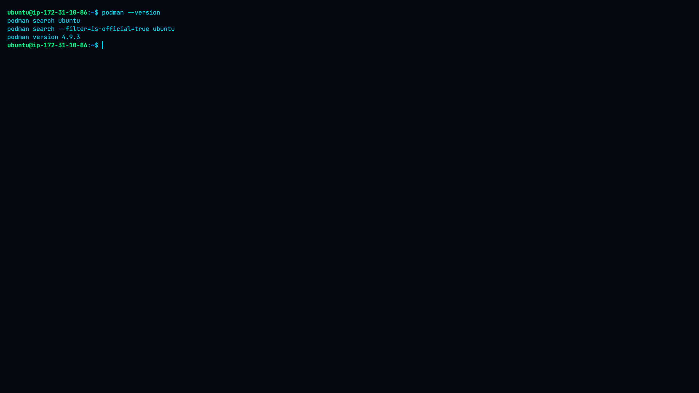
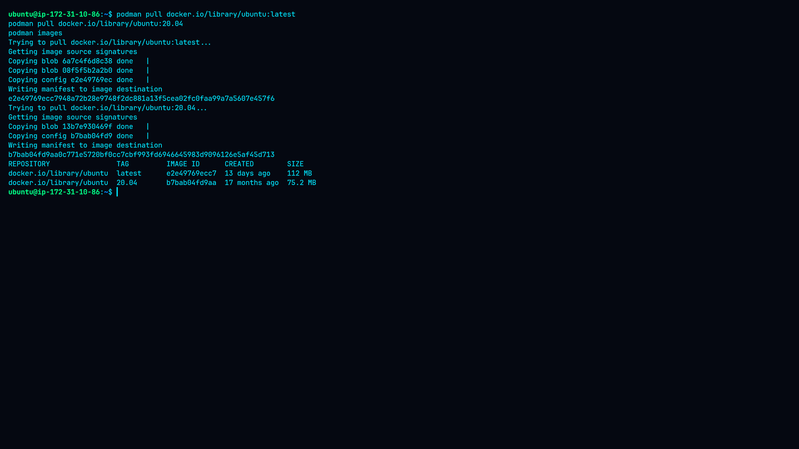
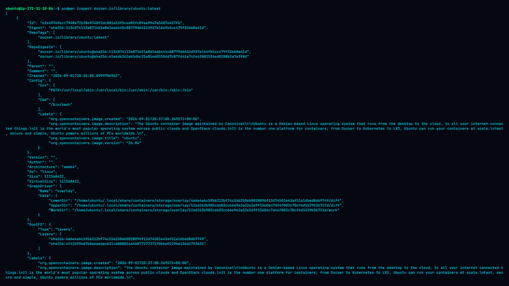
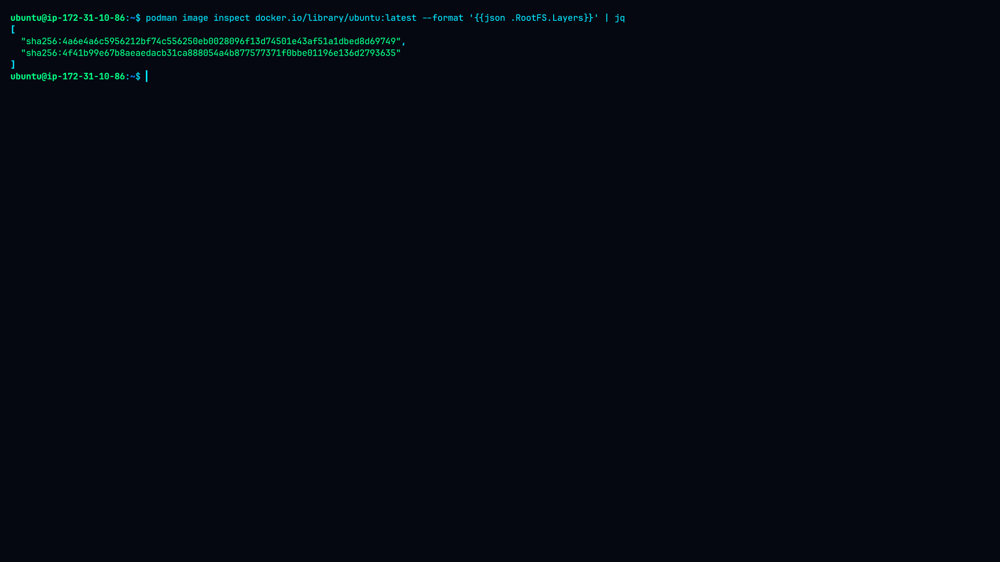
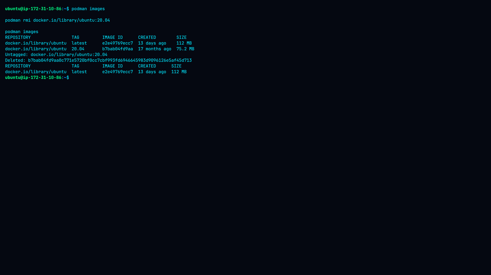
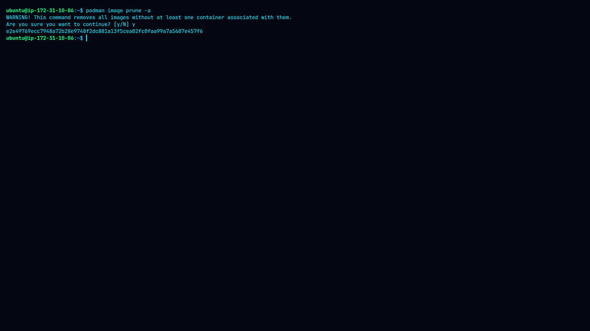

# Lab 05 — Managing Container Images

Container image lifecycle management using **Podman** on Linux: searching, pulling,
listing, inspecting, analysing layers, removing and pruning images.

---

## Objectives

- Search for container images on Docker Hub
- Pull container images to the local system
- List locally stored images and compare tags
- Inspect image metadata (ID, digest, OS, architecture, environment, labels)
- Inspect the filesystem layers that make up an image
- Remove a single image and prune unused images
- Understand the full image lifecycle and its security implications

---

## Environment

| Component | Details |
|---|---|
| OS | Linux / Ubuntu |
| Container engine | Podman 4.9.3 |
| Registry | Docker Hub |
| Repository | `docker.io/library/ubuntu` |
| Architecture | amd64 |
| Storage driver | overlay |
| Mode | Rootless |

---

## Lab Structure

```
05-Managing-Container-Images/
├── README.md
├── methodology.md
├── command.md
├── findings.md
├── remediation.md
└── screenshots/
    ├── 01-search-images.png
    ├── 02-pulled-images.png
    ├── 03-image-metadata.png
    ├── 04-image-layers.png
    ├── 05-remove-image.png
    └── 06-image-cleanup.png
```

---

## Workflow

### 1. Search for Images

```bash
podman --version
podman search ubuntu
podman search --filter=is-official=true ubuntu
```

The general search returned Ubuntu images from Docker Hub. The official-image filter
produced no visible output in this environment.



**Screenshot 01 — Search Images.**
Records the Podman version (4.9.3) and the two search commands. The unfiltered
`podman search ubuntu` returns a table of matching repositories from the configured
registries — name, description and (where available) stars and official status.
The second command adds `--filter=is-official=true`; in this environment it returned
an empty result set, which is a behaviour worth noting rather than assuming: filter
support varies between Podman versions and between the search backends exposed by
different registries. The screenshot is therefore evidence of both what worked and
what did not.

---

### 2. Pull Ubuntu Images

```bash
podman pull docker.io/library/ubuntu:latest
podman pull docker.io/library/ubuntu:20.04
podman images
```

| Image | Size |
|---|---|
| `ubuntu:latest` | ~112 MB |
| `ubuntu:20.04` | ~75.2 MB |



**Screenshot 02 — Pulled Images.**
Shows the pull output for both tags — blob download progress, the manifest write and
the resulting image ID — followed by `podman images`. The listing proves that two
different tags from the *same* repository coexist locally as separate images, each
with its own ID, creation date and size. The size difference (112 MB vs 75.2 MB)
illustrates that a newer release is not automatically a smaller one; image size is a
property of the layers that were built, not of the tag name.

---

### 3. Inspect Image Metadata

```bash
podman inspect docker.io/library/ubuntu:latest
podman inspect --format "{{.Config.Env}}" docker.io/library/ubuntu:latest
```

Key values observed:

| Property | Value |
|---|---|
| Image ID | `e2e49769ecc7948a72b28e9748f2dc881a13f5cea02fc0faa99a7a5607e457f6` |
| Digest | `sha256:513c074113a871b51a8d16ab445c88779d6452d937a164fb5cc479f32668a41d` |
| Architecture | amd64 |
| OS | linux |
| Command | `/bin/bash` |
| Size | ~112 MB |
| Graph driver | overlay |
| Ubuntu version label | 26.04 |
| Env | `PATH=/usr/local/sbin:/usr/local/bin:/usr/sbin:/usr/bin:/sbin:/bin` |



**Screenshot 03 — Image Metadata.**
Captures the JSON returned by `podman inspect` and the targeted `--format` query.
This is the identity evidence for the image: the **ID** is the local content hash,
while the **digest** is the registry-side, immutable reference — the value you would
pin in production instead of the mutable `latest` tag. The screenshot also shows the
`Config` block (default command `/bin/bash`, the `PATH` environment variable) and the
`Labels` block, where the Ubuntu release is declared as 26.04. The `--format` variant
demonstrates extracting a single field with a Go template rather than reading the full
document.

---

### 4. Inspect Image Layers

```bash
podman image inspect docker.io/library/ubuntu:latest \
  --format '{{json .RootFS.Layers}}' | jq
```

```json
[
  "sha256:4a6e4a6c5956212bf74c556250eb0028096f13d74501e43af51a1dbed8d69749",
  "sha256:4f41b99e67b8aeaedacb31ca888054a4b877577371f0bbe01196e136d2793635"
]
```



**Screenshot 04 — Image Layers.**
Shows the two RootFS layer digests, piped through `jq` for readability. This is the
core structural lesson of the lab: an image is not one flat filesystem blob but an
ordered stack of read-only layers, union-mounted at runtime by the overlay driver.
Each digest identifies one layer's content, which is why layers can be shared and
cached between images and why pulling a second Ubuntu tag often downloads far less
than its full size. It also has a security consequence — deleting a file in a later
layer does not remove it from the earlier layer, so secrets baked into a layer stay
recoverable.

---

### 5. Remove a Single Image

```bash
podman rmi docker.io/library/ubuntu:20.04
podman images
```



**Screenshot 05 — Remove Image.**
Documents targeted deletion. `podman rmi` prints the untagged reference and the
deleted image ID, and the follow-up `podman images` confirms that only
`ubuntu:latest` remains. This demonstrates that removal operates on a specific image,
not the whole repository, and that Podman will refuse to delete an image still in use
by a container unless forced — a safety behaviour worth relying on rather than
bypassing with `-f`.

---

### 6. Clean Up Unused Images

```bash
podman image prune -a
podman images
podman image ls
```



**Screenshot 06 — Image Cleanup.**
Shows the interactive confirmation prompt for `prune -a`, the ID of the removed image,
and the two final listings returning an empty table. `-a` widens the scope from
dangling (untagged) images to *all* images not referenced by a container, which is why
the confirmation prompt exists. The empty result closes the lifecycle loop and proves
the local image store was returned to its initial state.

---

## Key Findings

| Area | Result |
|---|---|
| Image search | Successful |
| Official-image filtered search | No visible output |
| `ubuntu:latest` pull | Successful |
| `ubuntu:20.04` pull | Successful |
| Metadata inspection | Successful |
| Environment extraction | Successful |
| Layer inspection | Successful (2 layers) |
| Individual image removal | Successful |
| Image pruning | Successful |
| Final image store | Empty |

---

## Security & Operational Notes

- **Use trusted registries** and fully qualified image names (`docker.io/library/ubuntu:latest`)
  so resolution is explicit rather than dependent on local registry search order.
- **Do not rely blindly on `latest`** — it is a moving pointer, not a version. Pin a
  release tag or, better, a digest for reproducible deployments.
- **Scan before deploying.** Trivy, Grype or Clair will surface vulnerable packages
  inside the image that metadata inspection alone will not reveal.
- **Remove unused images.** Stale images consume disk and keep outdated software on
  the host.
- **Verify identity by ID/digest**, not by tag.

---

## Lab Result

```
Search → Pull → List → Inspect Metadata → Inspect Layers → Remove → Prune → Empty Store
```

**Status: Completed successfully.**
