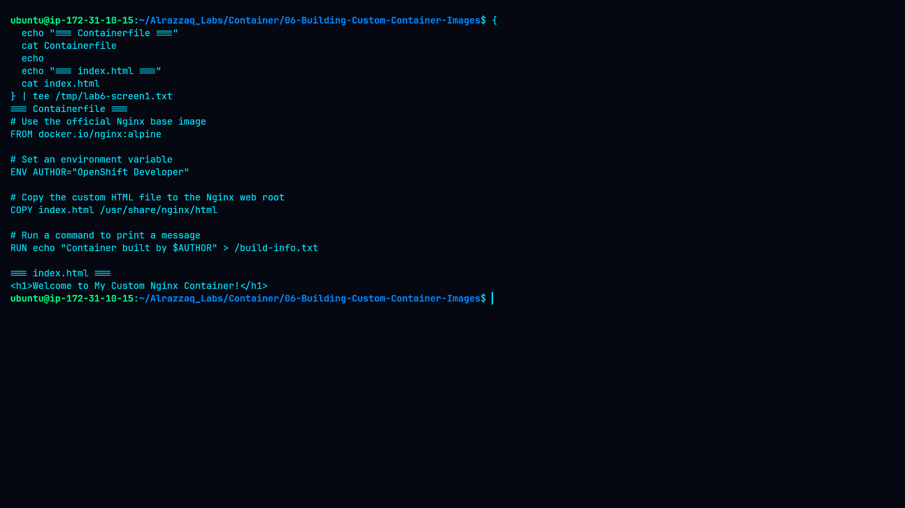
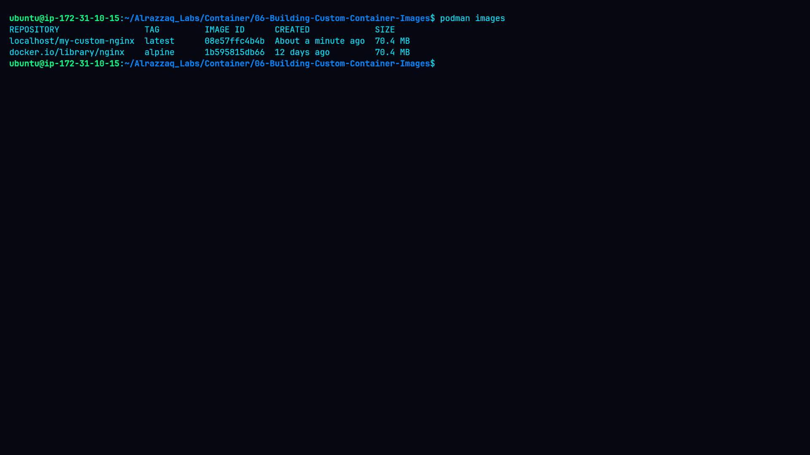
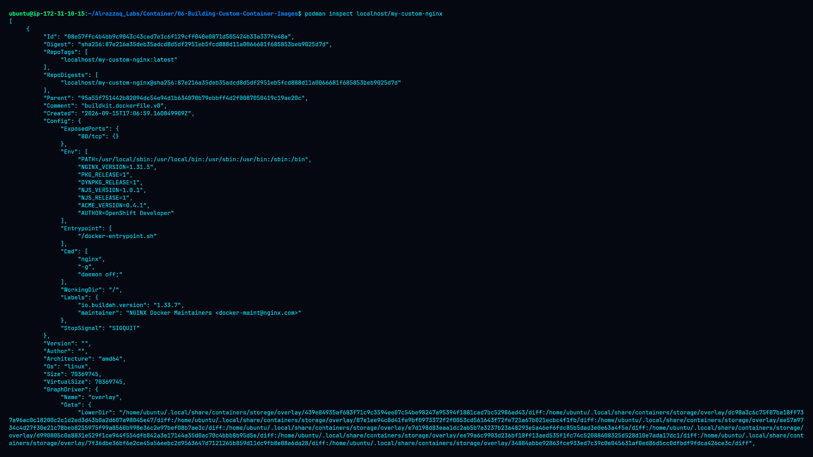
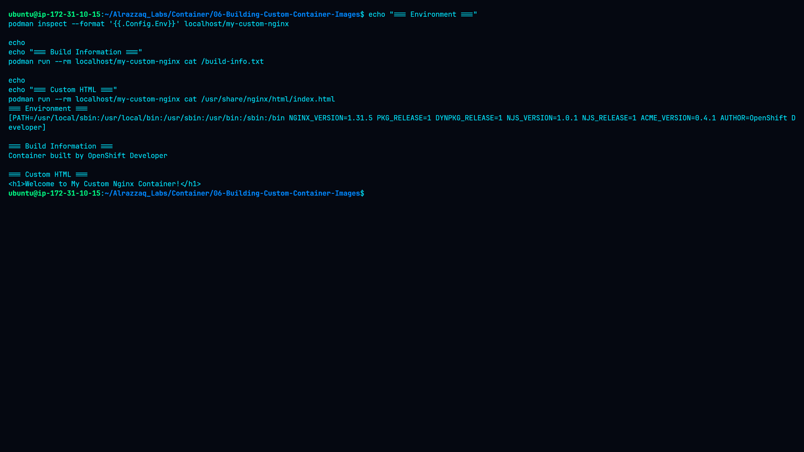
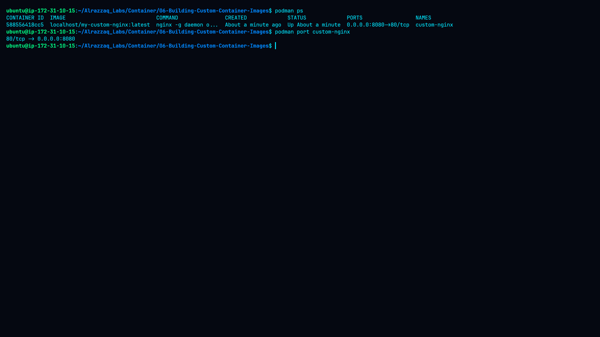
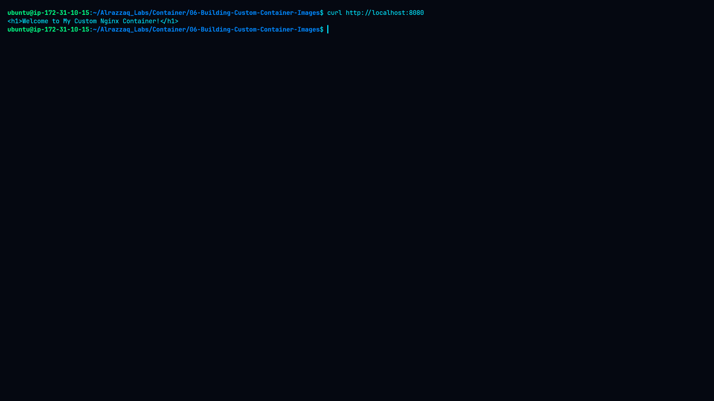

# Lab 6 — Building Custom Container Images


## Overview

This lab demonstrates how to build a custom container image using **Podman** and a **Containerfile**.

The custom image uses Nginx Alpine as its base image and adds a custom HTML page, an environment variable, and a build-time information file.

The complete workflow covered:

* Creating a custom `index.html`
* Creating a `Containerfile`
* Using `FROM`, `ENV`, `COPY`, and `RUN`
* Building a custom container image
* Inspecting the image
* Verifying image contents
* Running the Nginx container
* Publishing container port `80` on host port `8080`
* Testing the web application
* Reviewing Nginx container logs

---

## Objectives

* Understand the purpose of a Containerfile.
* Understand `FROM`, `ENV`, `COPY`, and `RUN`.
* Build and tag a custom container image with Podman.
* Run the custom image as a container.
* Verify the containerized Nginx service.
* Inspect image metadata and application content.
* Collect practical evidence through screenshots.

---

## Environment

| Component        | Details                            |
| ---------------- | ---------------------------------- |
| Platform         | AWS EC2                            |
| Operating System | Ubuntu Linux                       |
| Container Engine | Podman                             |
| Base Image       | `docker.io/nginx:alpine`           |
| Application      | Nginx                              |
| Container Port   | `80/tcp`                           |
| Host Port        | `8080`                             |
| Image            | `localhost/my-custom-nginx:latest` |
| Architecture     | `amd64`                            |

---

## Project Structure

```text
06-Building-Custom-Container-Images/
├── Containerfile
├── index.html
├── README.md
├── command.md
├── methodology.md
├── findings.md
├── remediation.md
└── screenshots/
    ├── 01-containerfile-and-html.png
    ├── 02-build-image.png
    ├── 03-image-inspection.png
    ├── 04-image-content-verification.png
    ├── 05-running-container.png
    ├── 06-web-test.png
    └── 07-container-logs.png
```

---

# 1. Create the Project

The lab directory was created on the AWS EC2 instance.

### Command

```bash
mkdir -p ~/Alrazzaq_Labs/Container/06-Building-Custom-Container-Images
cd ~/Alrazzaq_Labs/Container/06-Building-Custom-Container-Images
```

---

# 2. Create the Custom HTML Page

The custom HTML page was created for the Nginx web server.

### Command

```bash
echo '<h1>Welcome to My Custom Nginx Container!</h1>' > index.html
```

Verify:

```bash
cat index.html
```

### Screenshot — Containerfile and HTML



**Explanation:**
This screenshot shows the actual `Containerfile` and `index.html` used in the lab. The HTML file contains the custom message that will later be served by Nginx.

---

# 3. Create the Containerfile

The Containerfile defines how the custom image is constructed.

### Containerfile

```dockerfile
# Use the official Nginx base image
FROM docker.io/nginx:alpine

# Set an environment variable
ENV AUTHOR="OpenShift Developer"

# Copy the custom HTML file to the Nginx web root
COPY index.html /usr/share/nginx/html

# Run a command to print a message
RUN echo "Container built by $AUTHOR" > /build-info.txt
```

### Instructions Used

| Instruction | Purpose                                           |
| ----------- | ------------------------------------------------- |
| `FROM`      | Selects the Nginx Alpine base image               |
| `ENV`       | Defines the `AUTHOR` environment variable         |
| `COPY`      | Copies the custom HTML file into Nginx's web root |
| `RUN`       | Executes a command during image construction      |

The first screenshot provides direct evidence of the Containerfile used during the lab.

---

# 4. Build the Custom Image

The custom image was built using Podman.

### Command

```bash
podman build -t my-custom-nginx .
```

### Verify

```bash
podman images
```

### Screenshot — Built Image



**Explanation:**
This screenshot shows the successfully built custom image. The image appears as:

```text
localhost/my-custom-nginx:latest
```

The verified image ID was:

```text
08e57ffc4b4b
```

The image was successfully created from the Nginx Alpine base image.

---

# 5. Inspect the Custom Image

The image metadata was inspected using Podman.

### Command

```bash
podman inspect localhost/my-custom-nginx
```

### Screenshot — Image Inspection



**Explanation:**
This screenshot contains the detailed image metadata returned by Podman.

The inspection confirmed important properties including:

* Image ID
* Repository tag
* Nginx base image
* `AUTHOR=OpenShift Developer`
* Exposed port `80/tcp`
* Linux `amd64` architecture
* Image layers
* Entrypoint
* Nginx command
* Build history

The image inspection also confirmed that the `ENV`, `COPY`, and `RUN` instructions were incorporated into the resulting image.

---

# 6. Verify Image Contents

The image was tested directly to verify that the build-time file and copied HTML were present.

### Verify Environment

```bash
podman inspect --format '{{.Config.Env}}' localhost/my-custom-nginx
```

The custom variable was present:

```text
AUTHOR=OpenShift Developer
```

### Verify Build-Time File

```bash
podman run --rm localhost/my-custom-nginx cat /build-info.txt
```

Output:

```text
Container built by OpenShift Developer
```

### Verify Custom HTML

```bash
podman run --rm localhost/my-custom-nginx cat /usr/share/nginx/html/index.html
```

Output:

```html
<h1>Welcome to My Custom Nginx Container!</h1>
```

### Screenshot — Image Content Verification



**Explanation:**
This screenshot verifies that the image contains the content created during the build process.

It demonstrates:

* The `AUTHOR` environment variable exists.
* `/build-info.txt` was successfully created by `RUN`.
* `index.html` was successfully copied into the Nginx web root using `COPY`.

This provides direct evidence that the Containerfile instructions worked as intended.

---

# 7. Run the Custom Container

The custom image was deployed as a running container.

### Command

```bash
podman run -d --name custom-nginx -p 8080:80 localhost/my-custom-nginx
```

The mapping publishes:

```text
Host:      8080
Container: 80
```

---

# 8. Verify the Running Container

### Command

```bash
podman ps
```

### Verify Port Mapping

```bash
podman port custom-nginx
```

Actual port mapping:

```text
80/tcp -> 0.0.0.0:8080
```

### Screenshot — Running Container



**Explanation:**
This screenshot demonstrates that the `custom-nginx` container is running successfully.

It also verifies that the Nginx container port `80` is published through host port `8080`.

---

# 9. Test the Nginx Web Application

The running Nginx service was tested locally from the EC2 instance.

### Command

```bash
curl http://localhost:8080
```

### Actual Response

```html
<h1>Welcome to My Custom Nginx Container!</h1>
```

### Screenshot — Web Test



**Explanation:**
This screenshot provides application-level verification.

The successful response confirms that:

1. The container is running.
2. Nginx started successfully.
3. Port `8080` is forwarding to container port `80`.
4. Nginx is serving the custom `index.html`.
5. The custom image is functioning correctly.

---

# 10. Review Container Logs

The Nginx container logs were reviewed to verify application startup and HTTP activity.

### Command

```bash
podman logs custom-nginx
```

The logs showed successful Nginx initialization and the HTTP request.

The important access-log entry was:

```text
"GET / HTTP/1.1" 200 47 "-" "curl/8.5.0" "-"
```

### Screenshot — Container Logs


**Explanation:**
This screenshot shows the Nginx startup messages and HTTP access log.

The `200` HTTP status confirms that the request for `/` was successfully processed by Nginx.

The logs also confirmed:

* Nginx version `1.31.5`
* Nginx worker processes started
* Configuration completed successfully
* HTTP request received
* Successful `200` response

---

# 11. Troubleshooting Commands

If the container fails to start or the application is unavailable, the following commands can be used.

### List All Containers

```bash
podman ps -a
```

### View Logs

```bash
podman logs custom-nginx
```

### Inspect Container

```bash
podman inspect custom-nginx
```

### Check Port Mapping

```bash
podman port custom-nginx
```

### Test the Application

```bash
curl http://localhost:8080
```

---

# 12. Lab Evidence Summary

| Evidence             | Screenshot                          | Purpose                                               |
| -------------------- | ----------------------------------- | ----------------------------------------------------- |
| Containerfile + HTML | `01-containerfile-and-html.png`     | Shows image definition and custom application content |
| Image Build          | `02-build-image.png`                | Confirms successful custom image creation             |
| Image Inspection     | `03-image-inspection.png`           | Shows image metadata and configuration                |
| Content Verification | `04-image-content-verification.png` | Confirms `ENV`, `RUN`, and `COPY` results             |
| Running Container    | `05-running-container.png`          | Confirms container and port mapping                   |
| Web Test             | `06-web-test.png`                   | Confirms Nginx serves custom HTML                     |
| Container Logs       | `07-container-logs.png`             | Confirms Nginx startup and HTTP `200` response        |

---

# 13. Results

The lab was successfully completed.

The following were verified:

* [x] Custom `index.html` created.
* [x] Containerfile created.
* [x] Nginx Alpine used as the base image.
* [x] `ENV` instruction verified.
* [x] `COPY` instruction verified.
* [x] `RUN` instruction verified.
* [x] Custom image successfully built.
* [x] Image metadata inspected.
* [x] Build-time file verified.
* [x] Custom HTML verified inside the image.
* [x] Container successfully started.
* [x] Port `8080` mapped to container port `80`.
* [x] Nginx web service successfully tested.
* [x] HTTP `200` response verified in logs.
* [x] Seven screenshots captured as lab evidence.

---

# 14. Security Considerations

Although this lab focuses on container image construction, production deployments should additionally consider:

* Using trusted and regularly updated base images.
* Scanning images for vulnerabilities.
* Avoiding secrets inside Containerfiles.
* Running containers with minimum privileges.
* Dropping unnecessary Linux capabilities.
* Restricting exposed network ports.
* Using immutable image references where appropriate.
* Centralizing and monitoring container logs.
* Maintaining an image update and patching process.

---

# Conclusion

This lab demonstrated the complete process of creating a custom Nginx container image using Podman.

The workflow covered:

```text
Containerfile
     ↓
Build Image
     ↓
Inspect Image
     ↓
Verify Image Contents
     ↓
Run Container
     ↓
Publish Port
     ↓
Test Web Application
     ↓
Review Logs
```

The final result was a functioning custom Nginx container serving:

```html
<h1>Welcome to My Custom Nginx Container!</h1>
```

All practical objectives were completed successfully and supported by actual terminal screenshots captured during the lab.
