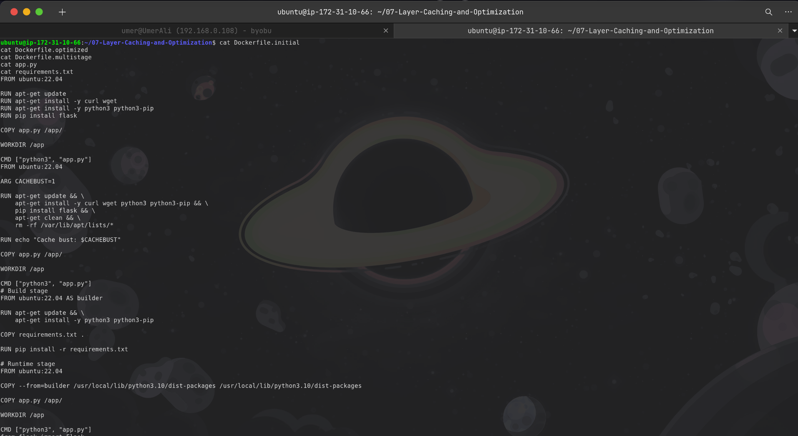
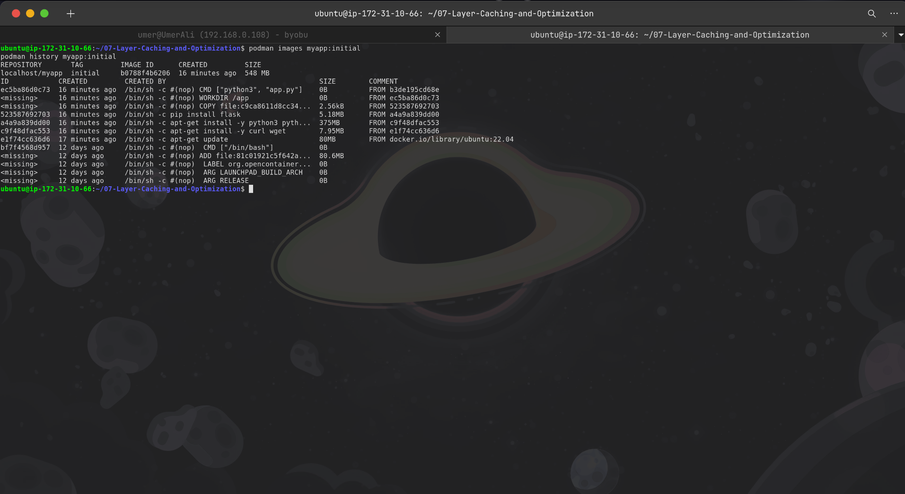
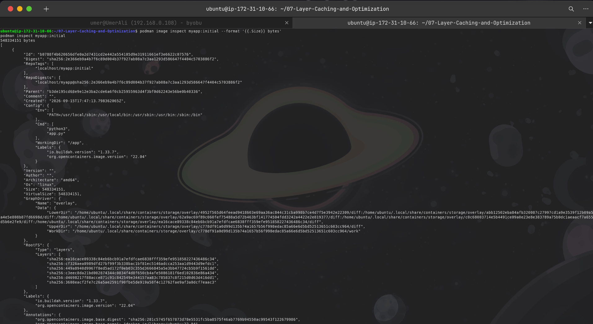
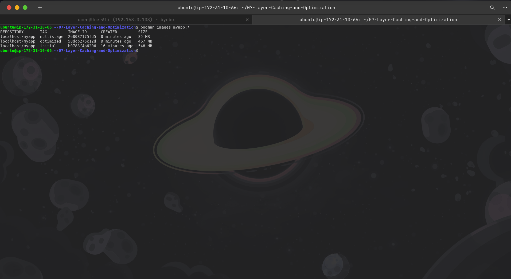
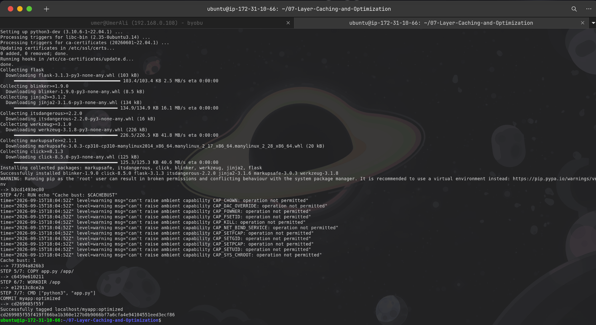
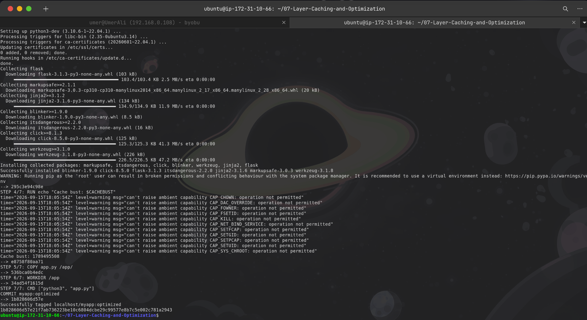
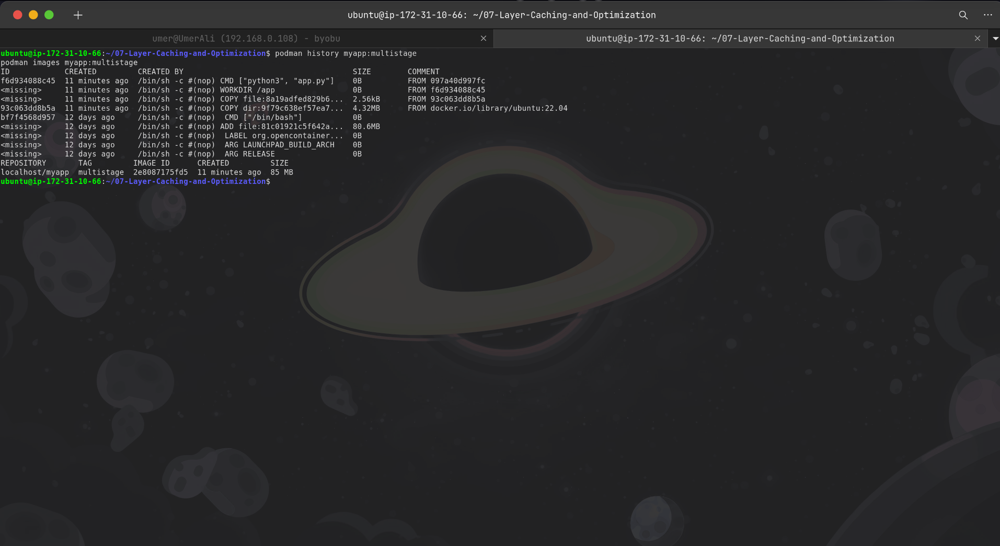
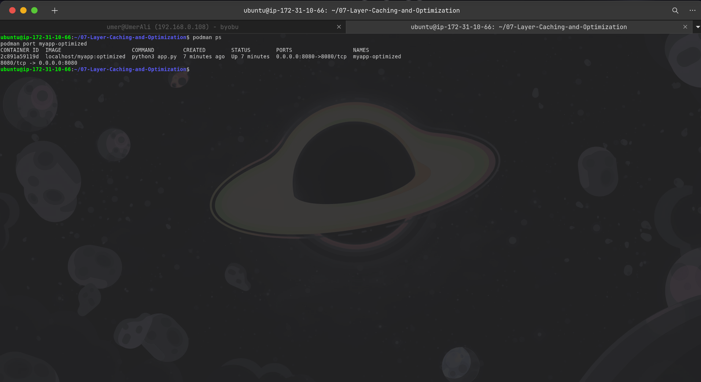
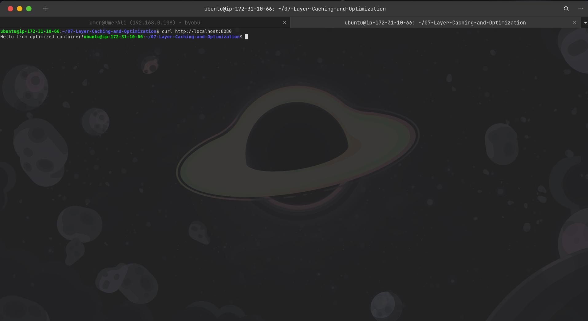
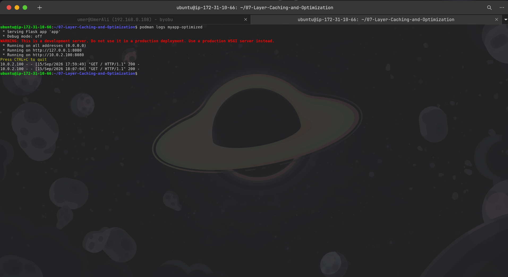

# Lab 7 — Layer Caching and Optimization

## Overview

This lab demonstrates Docker/Podman image layer caching, layer optimization, cache invalidation, image inspection, and multi-stage builds.

The practical work was performed using **Podman** on an Ubuntu 22.04-based container environment.

The lab compares three image-building approaches:

* `myapp:initial` — baseline Dockerfile with separate package installation layers
* `myapp:optimized` — consolidated package installation and cleanup
* `myapp:multistage` — multi-stage build separating build dependencies from the runtime image

---

## Objectives

* Understand how container image layers are created.
* Analyze image layer sizes.
* Understand Podman layer caching.
* Optimize Dockerfile layer structure.
* Demonstrate cache invalidation using a build argument.
* Inspect image history and metadata.
* Build a multi-stage container image.
* Compare final image sizes.
* Verify the optimized application at runtime.

---

## Environment

| Component        | Details      |
| ---------------- | ------------ |
| Platform         | AWS EC2      |
| Operating System | Ubuntu       |
| Container Engine | Podman       |
| Base Image       | Ubuntu 22.04 |
| Application      | Python Flask |
| Application Port | 8080         |
| Architecture     | amd64        |

---

## Project Structure

```text
07-Layer-Caching-and-Optimization/
├── Dockerfile.initial
├── Dockerfile.optimized
├── Dockerfile.multistage
├── app.py
├── requirements.txt
├── screenshots/
│   ├── 01-dockerfiles-and-app.png
│   ├── 02-initial-image-and-history.png
│   ├── 03-initial-image-inspection.png
│   ├── 04-image-size-comparison.png
│   ├── 05-layer-cache-build.png
│   ├── 06-cache-busting.png
│   ├── 07-multistage-build.png
│   ├── 08-running-container.png
│   ├── 09-application-test.png
│   └── 10-container-logs.png
├── README.md
├── command.md
├── methodology.md
├── findings.md
└── remediation.md
```

---

# 1. Application

The Flask application exposes a simple HTTP endpoint on port 8080.

```python
from flask import Flask

app = Flask(__name__)

@app.route('/')
def hello():
    return "Hello from optimized container!"

if __name__ == '__main__':
    app.run(host='0.0.0.0', port=8080)
```

---

# 2. Initial Dockerfile

The initial Dockerfile intentionally uses multiple `RUN` instructions.

```dockerfile
FROM ubuntu:22.04

RUN apt-get update
RUN apt-get install -y curl wget
RUN apt-get install -y python3 python3-pip
RUN pip install flask

COPY app.py /app/

WORKDIR /app

CMD ["python3", "app.py"]
```

This creates multiple filesystem layers.

---

# 3. Optimized Dockerfile

The optimized Dockerfile consolidates package installation and removes unnecessary APT metadata.

```dockerfile
FROM ubuntu:22.04

ARG CACHEBUST=1

RUN apt-get update && \
    apt-get install -y curl wget python3 python3-pip && \
    pip install flask && \
    apt-get clean && \
    rm -rf /var/lib/apt/lists/*

RUN echo "Cache bust: $CACHEBUST"

COPY app.py /app/

WORKDIR /app

CMD ["python3", "app.py"]
```

The cache-busting argument was added later during the cache invalidation task.

---

# 4. Multi-Stage Dockerfile

The multi-stage build uses a builder stage for installing Python dependencies and a smaller runtime stage.

```dockerfile
# Build stage
FROM ubuntu:22.04 AS builder

RUN apt-get update && \
    apt-get install -y python3 python3-pip

COPY requirements.txt .

RUN pip install -r requirements.txt

# Runtime stage
FROM ubuntu:22.04

COPY --from=builder /usr/local/lib/python3.10/dist-packages /usr/local/lib/python3.10/dist-packages

COPY app.py /app/

WORKDIR /app

CMD ["python3", "app.py"]
```

`requirements.txt` contains:

```text
Flask
```

---

# 5. Evidence

## Screenshot 1 — Dockerfiles and Application



This screenshot documents the Dockerfiles, Flask application, and dependency file used during the lab.

It establishes the configuration used for the initial, optimized, and multi-stage builds.

---

## Screenshot 2 — Initial Image and Layer History



This screenshot shows the baseline `myapp:initial` image and its layer history.

The initial image was approximately **548 MB**.

The history demonstrates that separate `RUN` instructions created separate layers for:

* `apt-get update`
* `curl` and `wget`
* Python and pip
* Flask installation

The largest individual layer was the Python installation layer at approximately **375 MB**.

---

## Screenshot 3 — Initial Image Inspection



This screenshot documents detailed metadata for `myapp:initial`.

The measured image size was:

```text
548334151 bytes
```

The image used an overlay filesystem and contained multiple root filesystem layers.

---

## Screenshot 4 — Image Size Comparison



This screenshot provides the direct comparison between the three images:

```text
myapp:initial       548 MB
myapp:optimized     467 MB
myapp:multistage     85 MB
```

The optimized image reduced the size by approximately **81 MB**, while the multi-stage image was dramatically smaller than the baseline.

---

## Screenshot 5 — Layer Cache Build



This screenshot documents the rebuild process and demonstrates Podman's layer caching behavior.

Previously built layers were reused when their inputs had not changed.

This improves build efficiency by avoiding unnecessary execution of unchanged instructions.

---

## Screenshot 6 — Cache Busting



This screenshot documents the cache invalidation technique using:

```dockerfile
ARG CACHEBUST=1
```

The image was rebuilt with a changing timestamp:

```bash
podman build \
  -t myapp:optimized \
  --build-arg CACHEBUST=$(date +%s) \
  -f Dockerfile.optimized .
```

The changing build argument causes the cache-busting instruction and subsequent dependent layers to be rebuilt.

---

## Screenshot 7 — Multi-Stage Build



This screenshot documents the multi-stage image and its layer history.

The resulting image size was approximately:

```text
85 MB
```

The runtime image contains the Ubuntu base, required Python packages, Flask dependencies, and application files without retaining the builder-stage package installation layers.

---

## Screenshot 8 — Running Container



This screenshot verifies that the optimized image was successfully deployed as:

```text
myapp-optimized
```

The container was running with:

```text
0.0.0.0:8080 -> 8080/tcp
```

This confirms that the container port was correctly published to the host.

---

## Screenshot 9 — Application Test



The application was tested with:

```bash
curl http://localhost:8080
```

The actual response was:

```text
Hello from optimized container!
```

This confirms that the Flask application was reachable from the host through the published port.

---

## Screenshot 10 — Container Logs



The container logs confirm that Flask started successfully and listened on:

```text
0.0.0.0:8080
```

The HTTP request generated:

```text
"GET / HTTP/1.1" 200
```

The HTTP `200` response confirms successful application delivery.

---

# 6. Final Image Comparison

| Image              |       Size | Purpose                         |
| ------------------ | ---------: | ------------------------------- |
| `myapp:initial`    | **548 MB** | Baseline                        |
| `myapp:optimized`  | **467 MB** | Consolidated and cleaned layers |
| `myapp:multistage` |  **85 MB** | Multi-stage runtime image       |

### Optimization Results

Initial image:

```text
548 MB
```

Optimized image:

```text
467 MB
```

Approximate reduction:

```text
81 MB
≈ 14.9%
```

Multi-stage image:

```text
85 MB
```

Compared with the initial image, the multi-stage image is approximately **84% smaller**.

---

# 7. Key Findings

1. Multiple `RUN` instructions create additional filesystem layers.
2. Combining related package operations reduces unnecessary layers.
3. Cleaning `/var/lib/apt/lists/` removes APT package metadata from the final layer.
4. Docker/Podman caching can significantly reduce rebuild time.
5. Changing application files after dependency installation allows dependency layers to remain reusable.
6. Cache-busting arguments can intentionally invalidate cached instructions.
7. Multi-stage builds can significantly reduce final image size.
8. Image history provides useful visibility into layer creation and size.
9. Runtime verification is necessary after image optimization.
10. The optimized application successfully served HTTP traffic on port 8080.

---

# 8. Security and Operational Considerations

* Use minimal runtime images where practical.
* Remove unnecessary package caches and temporary files.
* Avoid installing development tools in production runtime images.
* Pin application dependencies for reproducible builds.
* Use a production WSGI server instead of Flask's development server for production deployments.
* Regularly scan container images for vulnerabilities.
* Keep base images updated.
* Avoid embedding secrets inside Dockerfiles or image layers.

---

# 9. Conclusion

This lab demonstrated practical container image optimization using Podman.

The baseline image was approximately **548 MB**. Consolidating installation steps and cleaning package metadata reduced the image to approximately **467 MB**.

The multi-stage approach reduced the final image further to approximately **85 MB**, demonstrating the effectiveness of separating build dependencies from the runtime environment.

Layer history, cache behavior, cache invalidation, image inspection, and runtime testing were all verified using actual Podman commands and container output.

**Lab Status: COMPLETED ✅**
