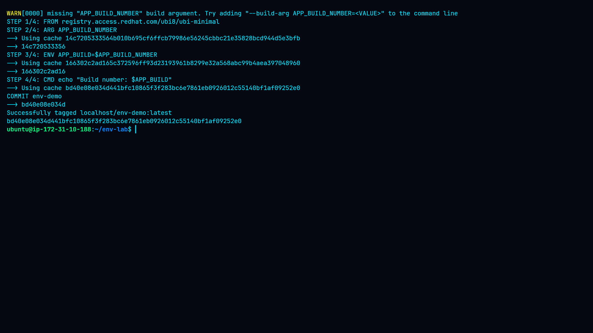
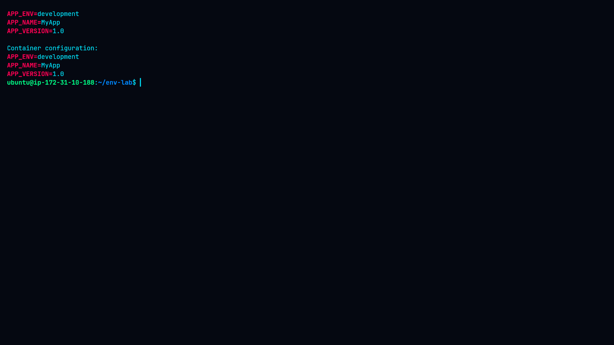
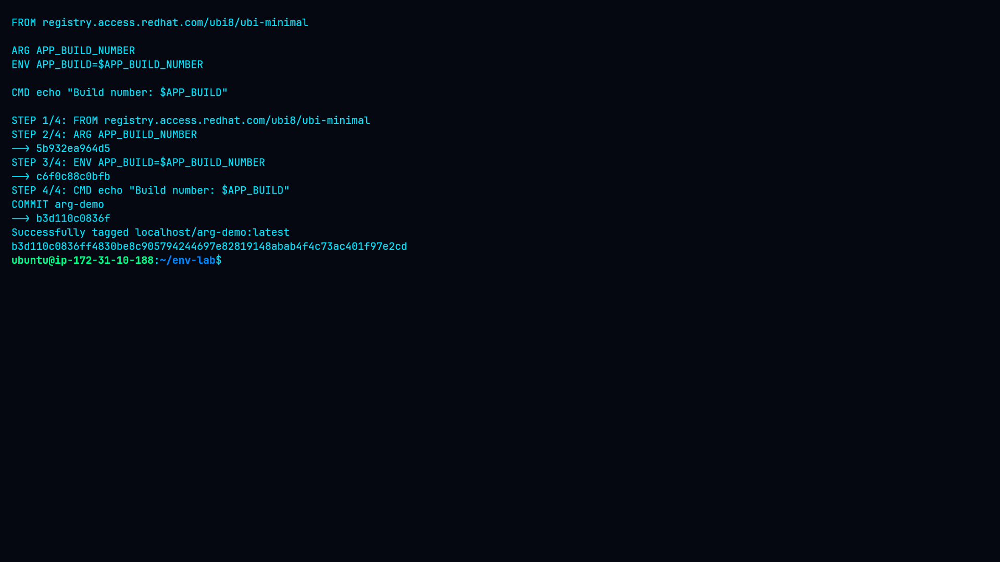

# Lab 8: Environment Variables in Images

## Overview

This lab demonstrates how environment variables and build-time arguments can be used to configure containerized applications with Podman.

The lab covers:

* Defining environment variables with `ENV`
* Overriding variables at runtime with `-e`
* Loading variables from an environment file
* Inspecting environment variables inside a running container
* Using `ARG` for build-time configuration
* Passing build arguments with `--build-arg`

## Objectives

By completing this lab, the following container configuration concepts were practiced:

* Use `ENV` and `ARG` in a Containerfile
* Define persistent environment variables in an image
* Override environment variables at runtime
* Use environment files for container configuration
* Inspect environment variables in running containers
* Use build-time arguments to create configurable images

## Environment

| Component         | Details                                       |
| ----------------- | --------------------------------------------- |
| Container Engine  | Podman                                        |
| Base Image        | `registry.access.redhat.com/ubi8/ubi-minimal` |
| Host OS           | Ubuntu Linux                                  |
| Architecture      | x86_64 / amd64                                |
| Application Image | `env-demo`                                    |
| ARG Image         | `arg-demo`                                    |

## Project Structure

```text
08-Environment-Variables-in-Images/
├── Containerfile
├── app.env
├── README.md
├── command.md
├── methodology.md
├── findings.md
├── remediation.md
└── screenshots/
    ├── 01-containerfile-env.png
    ├── 02-env-build.png
    ├── 03-default-env.png
    ├── 04-runtime-env-override.png
    ├── 05-env-file-override.png
    ├── 06-environment-inspection.png
    ├── 07-arg-build.png
    └── 08-arg-runtime.png
```

---

# Task 1: Define Environment Variables

## Containerfile

The initial image uses the `ENV` instruction to define application configuration:

```dockerfile
FROM registry.access.redhat.com/ubi8/ubi-minimal

ENV APP_NAME="MyApp" \
    APP_VERSION="1.0" \
    APP_ENV="development"

CMD echo "Running $APP_NAME v$APP_VERSION in $APP_ENV mode"
```

The variables become part of the image configuration and are available when the container starts.

## Screenshot 1 — Containerfile


The screenshot shows the Containerfile containing the `ENV` configuration for `APP_NAME`, `APP_VERSION`, and `APP_ENV`.

## Build

The image was built using:

```bash
podman build -t env-demo .
```

## Screenshot 2 — Image Build



This screenshot provides evidence that the `env-demo` image was successfully built with Podman.

## Default Configuration

The image was executed without overriding any variables:

```bash
podman run --rm env-demo
```

Output:

```text
Running MyApp v1.0 in development mode
```

## Screenshot 3 — Default Environment


The container used the values defined by the `ENV` instruction in the image.

---

# Task 2: Override Environment Variables

## Runtime Override

Environment variables can be changed when starting a container using the `-e` option:

```bash
podman run --rm \
  -e APP_ENV="production" \
  -e APP_VERSION="2.0" \
  env-demo
```

The container therefore uses the runtime values instead of the corresponding image defaults.

## Screenshot 4 — Runtime Override


The screenshot demonstrates that `APP_VERSION` and `APP_ENV` can be overridden without rebuilding the image.

## Environment File

An environment file was created with:

```text
APP_NAME=ProductionApp
APP_VERSION=3.0
APP_ENV=staging
```

The file can be supplied to Podman with:

```bash
podman run --rm --env-file=app.env env-demo
```

## Screenshot 5 — Environment File


The screenshot demonstrates configuration through an external environment file.

---

# Task 3: Inspect Environment Variables

A long-running container was used so that its environment could be inspected with `podman exec`.

The container was started with:

```bash
podman run -d \
  --name env-container \
  env-demo \
  sh -c 'env; sleep 300'
```

The variables were then inspected using:

```bash
podman exec env-container env
```

The relevant variables can also be filtered with:

```bash
podman exec env-container env | grep -E '^(APP_NAME|APP_VERSION|APP_ENV)='
```

Podman configuration can additionally be inspected using:

```bash
podman inspect env-container \
  --format '{{range .Config.Env}}{{println .}}{{end}}'
```

## Screenshot 6 — Environment Inspection



This screenshot demonstrates that the environment variables defined in the image are available inside the running container.

---

# Task 4: Build-Time ARG

The Containerfile was then modified to demonstrate a build-time argument:

```dockerfile
FROM registry.access.redhat.com/ubi8/ubi-minimal

ARG APP_BUILD_NUMBER
ENV APP_BUILD=$APP_BUILD_NUMBER

CMD echo "Build number: $APP_BUILD"
```

The image was built with:

```bash
podman build --no-cache \
  --build-arg APP_BUILD_NUMBER=42 \
  -t arg-demo .
```

The `ARG` value is supplied during the image build and is then assigned to an `ENV` variable.

## Screenshot 7 — ARG Build



This screenshot shows the image being built with `APP_BUILD_NUMBER=42`.

## Runtime Verification

The resulting image was executed with:

```bash
podman run --rm arg-demo
```

The build-time value was exposed through the environment variable:

```text
Build number: 42
```

## Screenshot 8 — ARG Runtime


This screenshot verifies that the build argument was successfully passed into the resulting image configuration.

---

# ENV vs ARG

| Feature                  | `ENV`                     | `ARG`                        |
| ------------------------ | ------------------------- | ---------------------------- |
| Available during build   | Yes                       | Yes                          |
| Available at runtime     | Yes                       | No, unless assigned to `ENV` |
| Runtime override         | Yes                       | No                           |
| Build-time configuration | Limited                   | Yes                          |
| Typical use              | Application configuration | Build parameters             |

## Key Findings

1. `ENV` provides environment variables that are available to containers created from the image.
2. Runtime values supplied with `-e` can override image defaults.
3. `--env-file` provides a convenient way to supply multiple variables.
4. `podman exec` can be used to inspect variables inside a running container.
5. `ARG` provides build-time parameters.
6. An `ARG` can be transferred into an `ENV` variable when the value needs to remain available at runtime.
7. Environment variables provide a flexible way to separate application configuration from the image itself.

## Security Considerations

Environment variables should not automatically be treated as secure storage.

Sensitive values such as:

* Passwords
* API keys
* Access tokens
* Private credentials
* Encryption keys

should preferably be managed through appropriate secret-management mechanisms rather than being embedded directly into container images.

For OpenShift and Kubernetes environments, Secrets and ConfigMaps can be used for application configuration and sensitive values.

## Conclusion

This lab demonstrated practical environment-variable management with Podman.

The exercises showed how `ENV` defines runtime configuration, how `-e` and `--env-file` override image defaults, how environment variables can be inspected inside running containers, and how `ARG` can be used for build-time configuration.

**Lab Status: COMPLETED**
