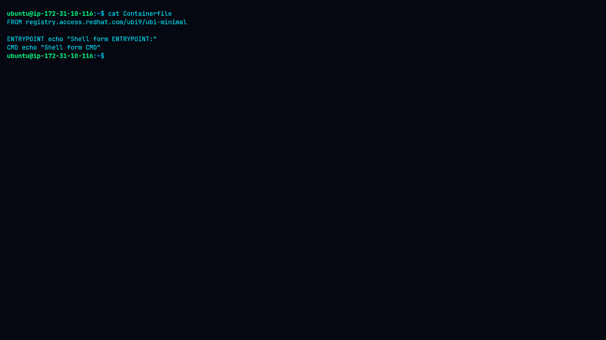
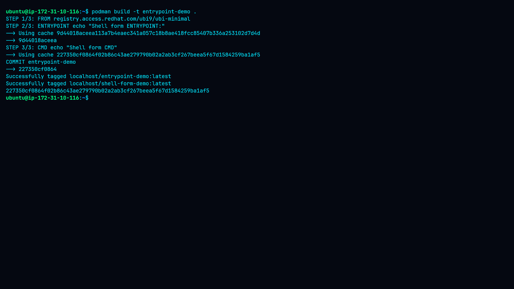
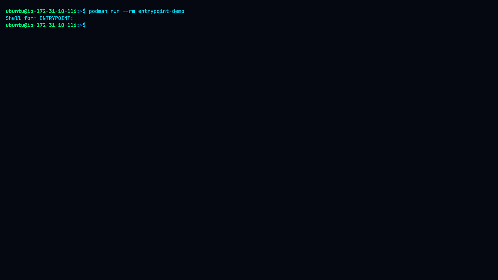
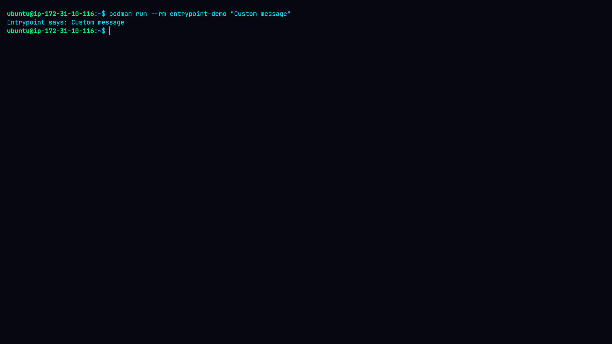
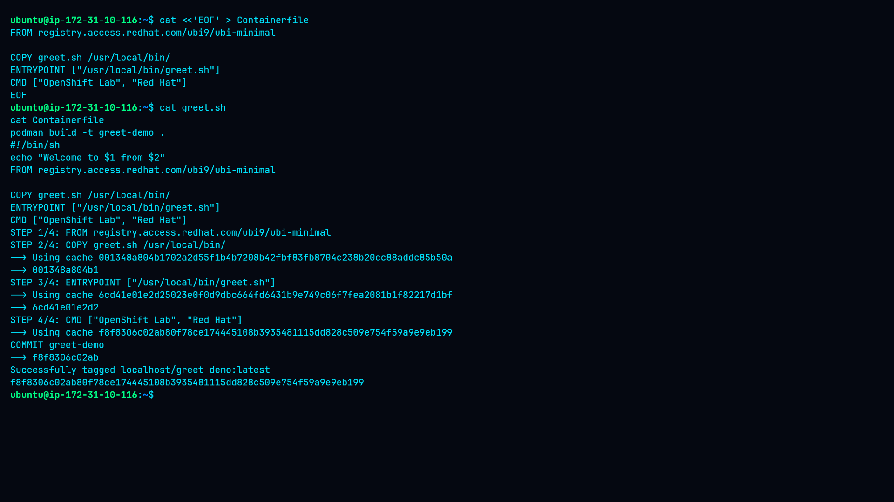
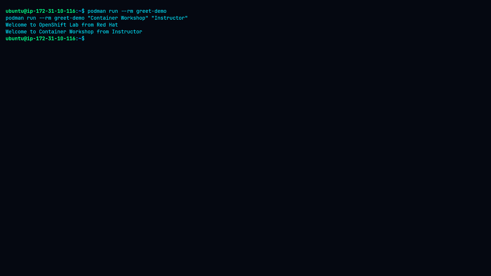
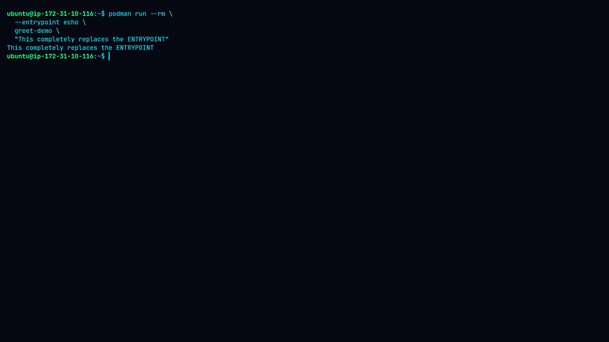
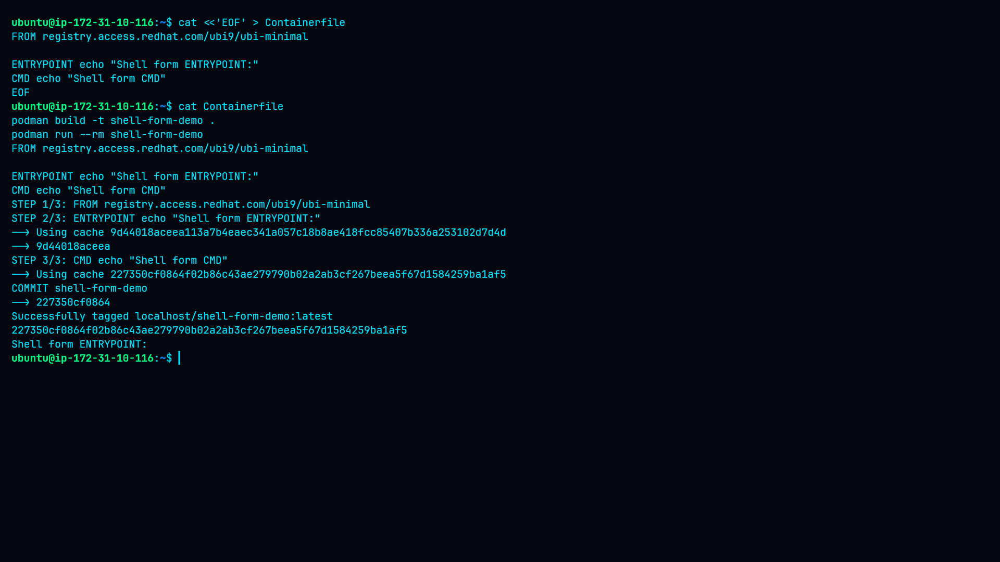

# Lab 9: Using ENTRYPOINT and CMD in Containerfiles

## Overview

This lab demonstrates how `ENTRYPOINT` and `CMD` control container startup behavior in Podman.

The lab covers:

* Difference between `ENTRYPOINT` and `CMD`
* Exec-form `ENTRYPOINT` and `CMD`
* Overriding `CMD` at runtime
* Using a script as an `ENTRYPOINT`
* Overriding `ENTRYPOINT` with `--entrypoint`
* Shell-form `ENTRYPOINT` and `CMD`
* Practical verification of container startup behavior

---

## Objectives

By completing this lab, the following concepts were practiced:

1. Configure `ENTRYPOINT` and `CMD` in a Containerfile.
2. Build and run containers using Podman.
3. Override `CMD` arguments at runtime.
4. Use an executable script as an `ENTRYPOINT`.
5. Completely replace an image's `ENTRYPOINT`.
6. Understand the behavior of shell-form `ENTRYPOINT` and `CMD`.

---

## Environment

| Component        | Details                                       |
| ---------------- | --------------------------------------------- |
| Operating System | Ubuntu                                        |
| Container Engine | Podman                                        |
| Base Image       | `registry.access.redhat.com/ubi9/ubi-minimal` |
| Architecture     | Linux                                         |
| Lab Location     | `Container/09-Using-ENTRYPOINT-and-CMD`       |

---

## Project Structure

```text
09-Using-ENTRYPOINT-and-CMD/
├── Containerfile
├── greet.sh
├── README.md
├── command.md
├── methodology.md
├── findings.md
├── remediation.md
└── screenshots/
    ├── 01-containerfile-entrypoint-cmd.png
    ├── 02-entrypoint-build.png
    ├── 03-default-entrypoint-cmd.png
    ├── 04-cmd-runtime-override.png
    ├── 05-greet-script-and-build.png
    ├── 06-greet-default-and-override.png
    ├── 07-entrypoint-runtime-override.png
    └── 08-shell-form.png
```

---

# Task 1: Basic ENTRYPOINT and CMD

The first Containerfile used the exec form of both `ENTRYPOINT` and `CMD`.

```dockerfile
FROM registry.access.redhat.com/ubi9/ubi-minimal

ENTRYPOINT ["echo", "Entrypoint says:"]
CMD ["Default CMD message"]
```

### Containerfile



The `ENTRYPOINT` defines the main executable, while `CMD` provides default arguments for that executable.

---

## Building the Image

The image was built with:

```bash
podman build -t entrypoint-demo .
```



The build completed successfully and produced the local image:

```text
localhost/entrypoint-demo:latest
```

---

## Running with the Default CMD

The container was started without additional arguments:

```bash
podman run --rm entrypoint-demo
```

Actual output:

```text
Entrypoint says: Default CMD message
```



This demonstrates that the `CMD` value is passed to the configured `ENTRYPOINT`.

---

# Task 2: Override CMD at Runtime

The default `CMD` can be replaced by providing an argument when starting the container.

```bash
podman run --rm entrypoint-demo "Custom message"
```

Actual output:

```text
Entrypoint says: Custom message
```



The `ENTRYPOINT` remains unchanged, while the default `CMD` argument is replaced.

### Behavior

```text
ENTRYPOINT → echo "Entrypoint says:"
CMD        → "Default CMD message"

Runtime override:
CMD        → "Custom message"
```

Therefore:

```text
Entrypoint says: Custom message
```

---

# Task 3: Script-Based ENTRYPOINT

A shell script was created to demonstrate how an executable script can be used as the container's `ENTRYPOINT`.

### greet.sh

```sh
#!/bin/sh
echo "Welcome to $1 from $2"
```

The script was made executable:

```bash
chmod +x greet.sh
```

The Containerfile was configured as:

```dockerfile
FROM registry.access.redhat.com/ubi9/ubi-minimal

COPY greet.sh /usr/local/bin/
ENTRYPOINT ["/usr/local/bin/greet.sh"]
CMD ["OpenShift Lab", "Red Hat"]
```

The image was then built:

```bash
podman build -t greet-demo .
```



---

## Running the Script ENTRYPOINT

The container was tested with runtime arguments:

```bash
podman run --rm greet-demo "Container Workshop" "Instructor"
```

Actual output:

```text
Welcome to Container Workshop from Instructor
```

The default configuration was also tested:

```bash
podman run --rm greet-demo
```

with the configured default arguments:

```text
OpenShift Lab
Red Hat
```



The script receives the values as positional arguments:

```text
$1 → first argument
$2 → second argument
```

---

# Task 4: Override ENTRYPOINT

Podman allows the configured `ENTRYPOINT` to be replaced at runtime using `--entrypoint`.

Command used:

```bash
podman run --rm \
  --entrypoint echo \
  greet-demo \
  "This completely replaces the ENTRYPOINT"
```

Actual output:

```text
This completely replaces the ENTRYPOINT
```



Unlike the previous test, the original `greet.sh` script was not executed. The `echo` command became the container's new entrypoint.

---

# Task 5: Shell-Form ENTRYPOINT and CMD

The final test used shell-form syntax:

```dockerfile
FROM registry.access.redhat.com/ubi9/ubi-minimal

ENTRYPOINT echo "Shell form ENTRYPOINT:"
CMD echo "Shell form CMD"
```

The image was built with:

```bash
podman build -t shell-form-demo .
```

The container was then started:

```bash
podman run --rm shell-form-demo
```

Actual observed output:

```text
Shell form ENTRYPOINT:
```



This behavior demonstrates an important difference between shell-form and exec-form instructions.

---

# ENTRYPOINT vs CMD

| Feature           | ENTRYPOINT                  | CMD                                           |
| ----------------- | --------------------------- | --------------------------------------------- |
| Primary purpose   | Defines the main executable | Provides default arguments or command         |
| Runtime override  | Requires `--entrypoint`     | Can normally be replaced by runtime arguments |
| Common use        | Fixed application/process   | Default parameters                            |
| Example           | `ENTRYPOINT ["python"]`     | `CMD ["app.py"]`                              |
| Can work together | Yes                         | Yes                                           |

For example:

```dockerfile
ENTRYPOINT ["echo", "Message:"]
CMD ["Hello"]
```

produces:

```text
Message: Hello
```

Providing another argument:

```bash
podman run image "World"
```

produces:

```text
Message: World
```

---

# Exec Form vs Shell Form

## Exec Form

```dockerfile
ENTRYPOINT ["echo", "Hello"]
```

Exec form uses JSON-array syntax and directly defines the executable and its arguments.

## Shell Form

```dockerfile
ENTRYPOINT echo "Hello"
```

Shell form uses shell command syntax and is processed through the shell.

Understanding this difference is important when designing container startup commands, especially when command arguments, environment variables, signal handling, and process behavior matter.

---

# Key Findings

### Finding 1 — CMD can be overridden easily

The default `CMD` was replaced at runtime:

```text
Entrypoint says: Default CMD message
```

became:

```text
Entrypoint says: Custom message
```

### Finding 2 — ENTRYPOINT provides the main execution behavior

The configured `ENTRYPOINT` remained active when only the CMD was overridden.

### Finding 3 — ENTRYPOINT can be completely replaced

Using:

```bash
--entrypoint echo
```

replaced the original script-based entrypoint.

### Finding 4 — Scripts can be used as ENTRYPOINTs

The `greet.sh` script successfully received runtime arguments and generated the expected greeting.

### Finding 5 — Shell form behaves differently

The shell-form test produced:

```text
Shell form ENTRYPOINT:
```

rather than the same argument-combination behavior demonstrated with the exec-form configuration.

---

# Security and Operational Considerations

Container startup configuration should be designed carefully.

Important considerations include:

* Avoid unnecessary shell interpretation when exec form is sufficient.
* Use explicit executable paths for predictable behavior.
* Avoid placing sensitive information directly into `CMD` or `ENTRYPOINT`.
* Validate runtime arguments when they are passed to scripts.
* Use a non-root user where practical.
* Keep container startup commands simple and predictable.
* Understand signal-handling behavior when choosing between shell and exec forms.

---

# Practical Applications

Understanding `ENTRYPOINT` and `CMD is useful when:

* Building production container images
* Packaging Python, Node.js, Go, or Java applications
* Creating CI/CD containers
* Designing security testing environments
* Building DevOps automation containers
* Creating reusable container images with configurable runtime arguments

---

# Conclusion

This lab demonstrated practical container startup configuration using Podman.

The exercises showed how:

* `ENTRYPOINT` defines the primary container process.
* `CMD` provides default arguments or behavior.
* Runtime arguments can override `CMD`.
* `--entrypoint` can replace the configured `ENTRYPOINT`.
* Executable scripts can be used as entrypoints.
* Shell-form and exec-form instructions behave differently.

The lab provides a practical foundation for designing predictable and reusable container images.
