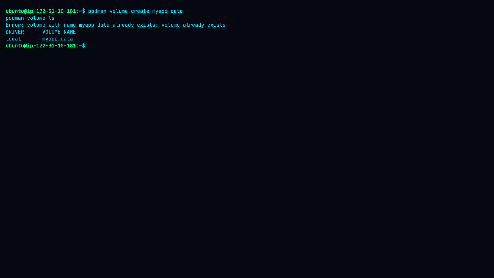
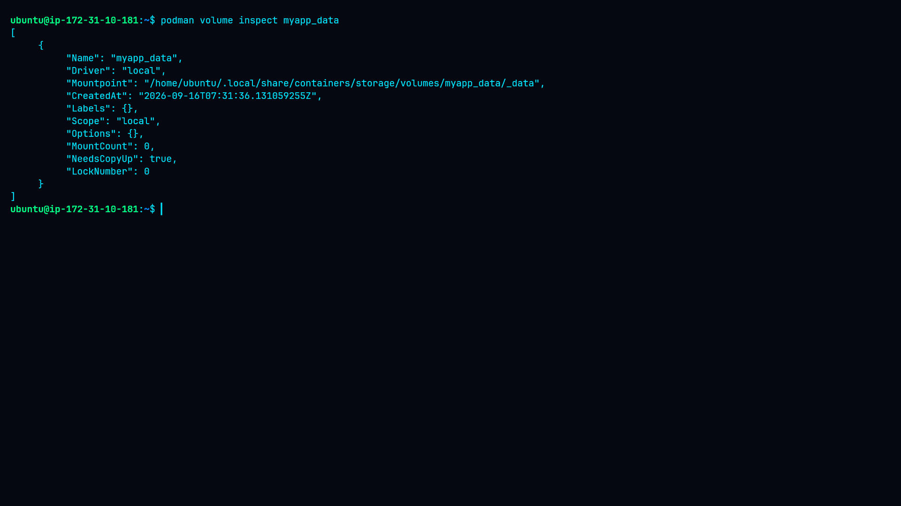
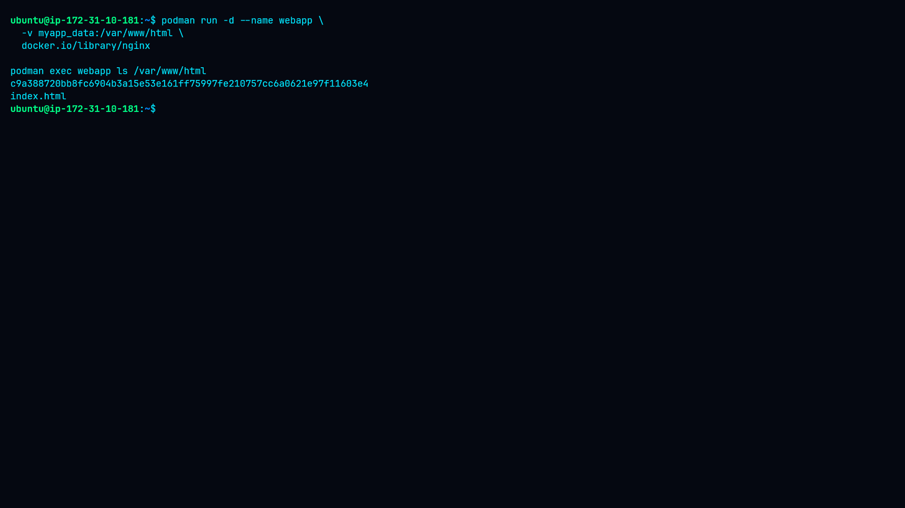
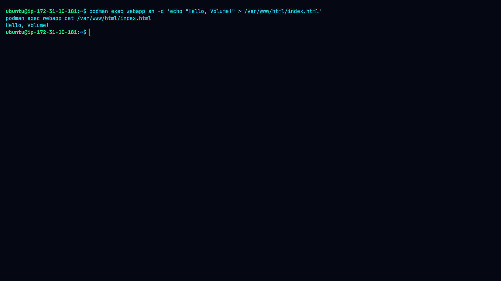
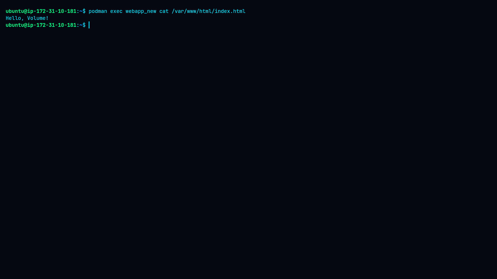
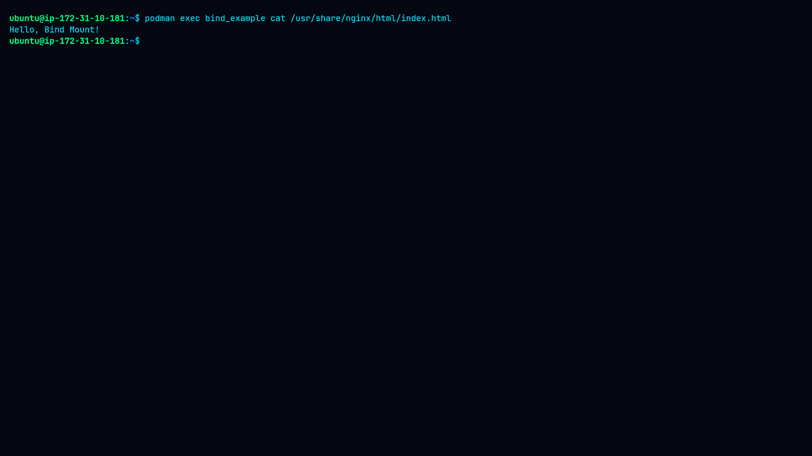
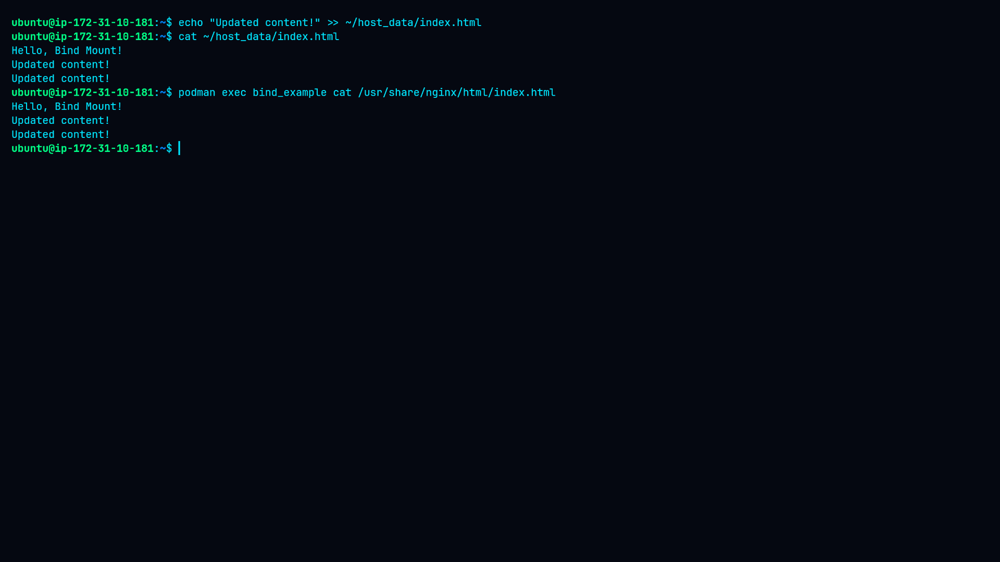

# Lab 10: Persisting Data with Volumes

## Overview

This lab demonstrates how persistent storage can be configured and used with Podman containers. The lab covers named volumes and bind mounts, including creating storage, mounting it into containers, writing data, recreating containers, and verifying that data persists or updates as expected.

## Objectives

* Create and manage named Podman volumes.
* Mount a named volume into an Nginx container.
* Verify data persistence after container recreation.
* Configure a bind mount using a host directory.
* Verify that changes made on the host are immediately visible inside the container.

## Environment

* OS: Linux
* Container Engine: Podman
* Container Image: `docker.io/library/nginx`
* Storage Types:

  * Named volume
  * Bind mount

## Lab Structure

```text
10-Persisting-Data-with-Volumes/
├── README.md
├── command.md
├── methodology.md
├── findings.md
├── remediation.md
└── screenshots/
    ├── 01-volume-create-and-list.png
    ├── 02-volume-inspect.png
    ├── 03-volume-mounted-container.png
    ├── 04-volume-data-persistence.png
    ├── 05-container-recreated-volume-data.png
    ├── 06-bind-mount-setup.png
    ├── 07-bind-mount-container-data.png
    └── 08-bind-mount-live-update.png
```

## 1. Creating a Named Volume

A named volume called `myapp_data` was created and verified using Podman's volume management commands.



The volume was then inspected to review its configuration and storage information.



## 2. Mounting the Named Volume

The `myapp_data` volume was mounted at `/var/www/html` inside an Nginx container named `webapp`.



The mounted directory was checked from inside the container.

## 3. Writing Data to the Named Volume

A test file was created inside the mounted volume:

```text
Hello, Volume!
```

The file was then read from inside the container to verify that the data was successfully written.



## 4. Verifying Persistence

The original container was removed and a new Nginx container named `webapp_new` was created using the same `myapp_data` volume.

The previously created `index.html` file was still available:

```text
Hello, Volume!
```

This demonstrates that the data belongs to the volume rather than the original container.



## 5. Configuring a Bind Mount

A host directory was created at:

```text
~/host_data
```

An `index.html` file containing:

```text
Hello, Bind Mount!
```

was created on the host.

The directory was mounted into an Nginx container using:

```bash
-v ~/host_data:/usr/share/nginx/html:Z
```



The file was then read from inside the container.


## 6. Testing Live Updates

The host file was modified by appending:

```text
Updated content!
```

The updated file was checked both on the host and inside the running container.



Because the directory is bind-mounted, the container immediately reflects changes made to the host file.

## Key Concepts

### Named Volume

A named volume is managed by Podman and exists independently of an individual container.

```text
Container → Named Volume → Persistent Data
```

Removing the container does not remove the volume or its contents.

### Bind Mount

A bind mount directly maps a host directory into a container.

```text
Host Directory → Container Directory
```

Changes made to the host directory are visible inside the container.

## Conclusion

This lab demonstrated two important Podman storage mechanisms:

* **Named volumes** provide container-independent persistent storage.
* **Bind mounts** provide direct access to host filesystem data.

The experiments confirmed that named-volume data remains available after container recreation, while bind-mounted files can be updated directly from the host and observed from inside the container.
