# Lab 11: Running Stateful Containers

## Overview

This lab demonstrates how to run stateful database workloads using Podman containers with persistent host storage.

The lab implements persistent storage with both **MySQL** and **PostgreSQL**, creates database records, removes the containers, recreates them using the same storage, and verifies that the database data survives the container lifecycle.

## Objectives

* Understand stateful containers and persistent storage.
* Run MySQL with persistent storage.
* Run PostgreSQL with persistent storage.
* Create and store database records.
* Remove and recreate database containers.
* Verify that database data survives container recreation.
* Inspect persistent database data stored on the host.

## Environment

* Operating System: Linux
* Container Engine: Podman
* MySQL Image: `docker.io/library/mysql:8.0`
* PostgreSQL Image: `docker.io/library/postgres:13`
* Storage: Host bind mounts
* Network Ports:

  * MySQL: `3306`
  * PostgreSQL: `5432`

## Lab Structure

```text
11-Running-Stateful-Containers/
├── README.md
├── command.md
├── methodology.md
├── findings.md
├── remediation.md
└── screenshots/
    ├── 01-podman-and-lab-setup.png
    ├── 02-mysql-data-directory.png
    ├── 03-mysql-container-running.png
    ├── 04-mysql-container-logs.png
    ├── 05-mysql-database-and-data.png
    ├── 06-mysql-container-removed.png
    ├── 07-mysql-container-recreated.png
    ├── 08-mysql-persistent-data.png
    ├── 09-postgresql-data-directory.png
    ├── 10-postgresql-container-running.png
    ├── 11-postgresql-logs.png
    ├── 12-postgresql-data.png
    ├── 13-postgresql-container-removed.png
    ├── 14-postgresql-container-recreated.png
    ├── 15-postgresql-persistent-data.png
    └── 16-persistent-storage-on-host.png
```

---

## 1. Lab Setup

The Podman installation and working directory were verified before starting the database containers.


A dedicated storage directory was created for MySQL:

```text
mysql-data/
```


---

## 2. MySQL Stateful Container

A MySQL 8.0 container was launched with a host directory mounted to:

```text
/var/lib/mysql
```

The container was configured with a database named `testdb` and a database user named `testuser`.

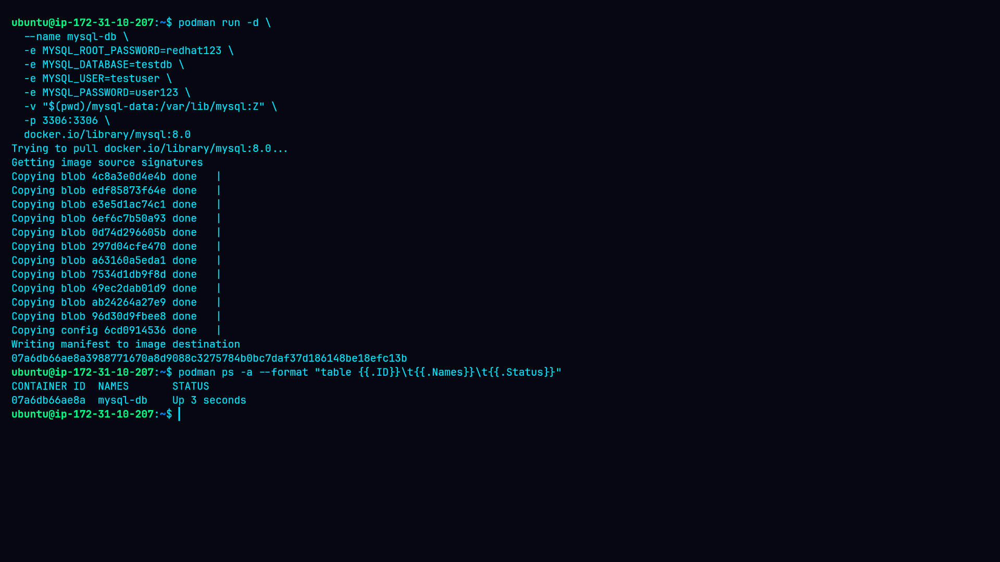

The container logs were checked to verify MySQL initialization and startup.

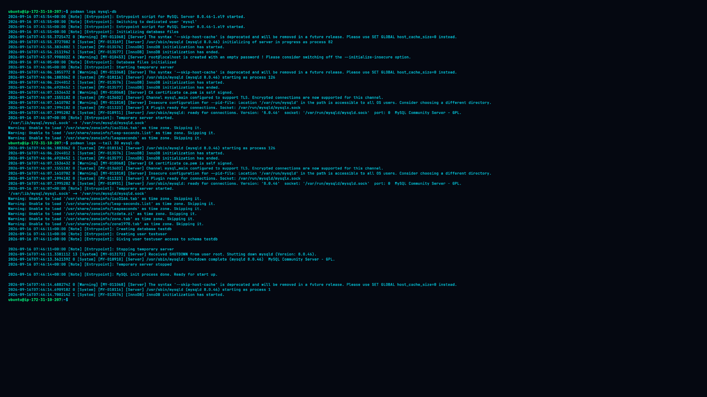

---

## 3. Creating MySQL Data

A table named `lab_data` was created inside `testdb`.

A test record was inserted:

```text
Persistent test data
```

The table was queried to verify that the record was stored successfully.

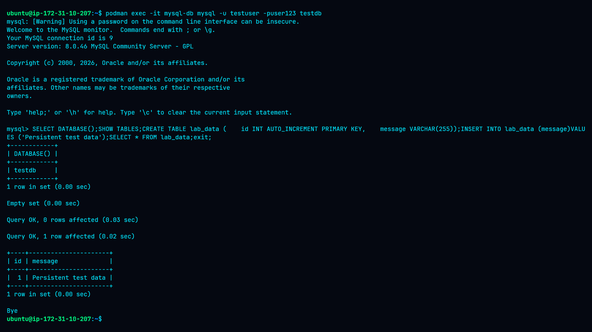

---

## 4. Removing the MySQL Container

The MySQL container was stopped and removed.

The database storage directory was intentionally preserved.

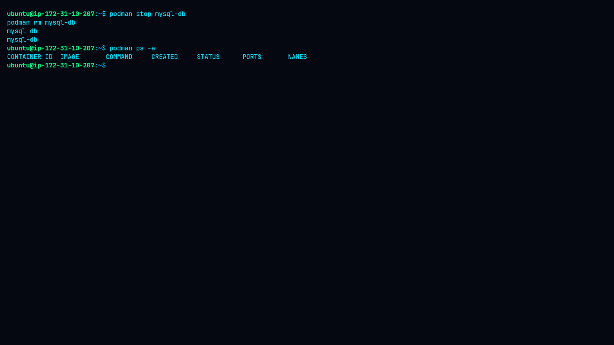

This demonstrates the difference between the container lifecycle and the lifecycle of persistent application data.

---

## 5. Recreating MySQL

A new MySQL container was created using the same `mysql-data` storage directory.

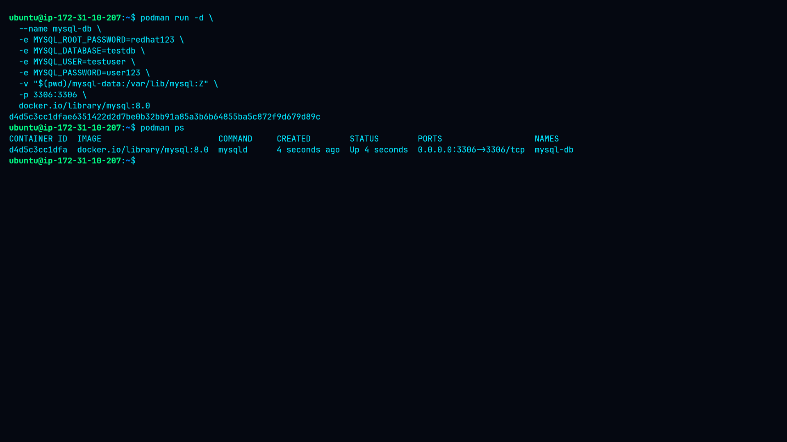

The database was queried after recreation.

The previously created `lab_data` table and test record remained available.

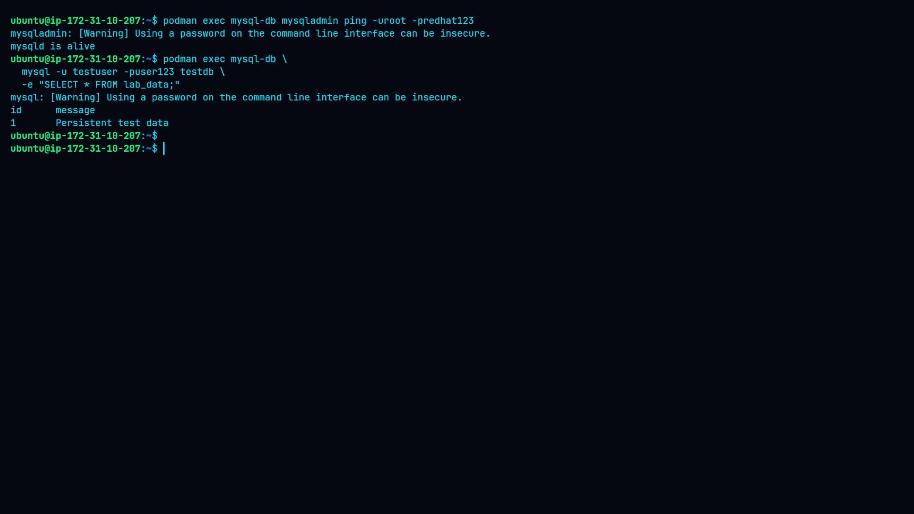

This confirms that the database data was persisted outside the original container.

---

# 6. PostgreSQL Stateful Container

A separate host directory was created for PostgreSQL:

```text
pg-data/
```


A PostgreSQL 13 container was then started with the host directory mounted to:

```text
/var/lib/postgresql/data
```

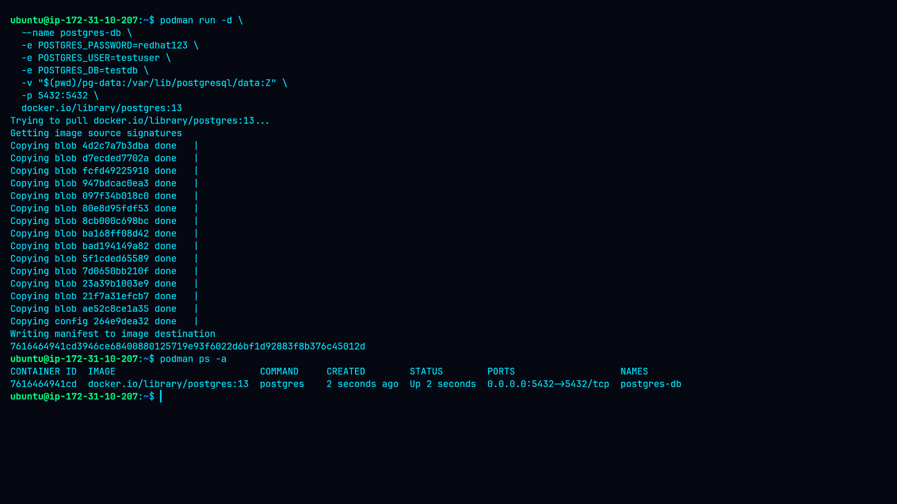

PostgreSQL startup logs were reviewed to verify initialization.

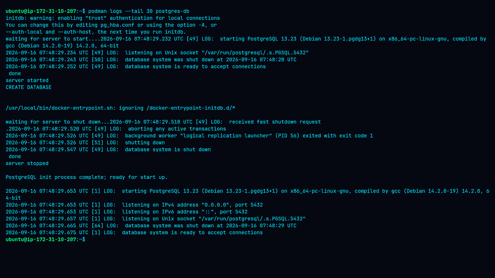

---

## 7. Creating PostgreSQL Data

A `lab_data` table was created in the PostgreSQL `testdb` database.

The following test data was inserted:

```text
Postgres persistent data
```

The table was queried to verify the stored record.

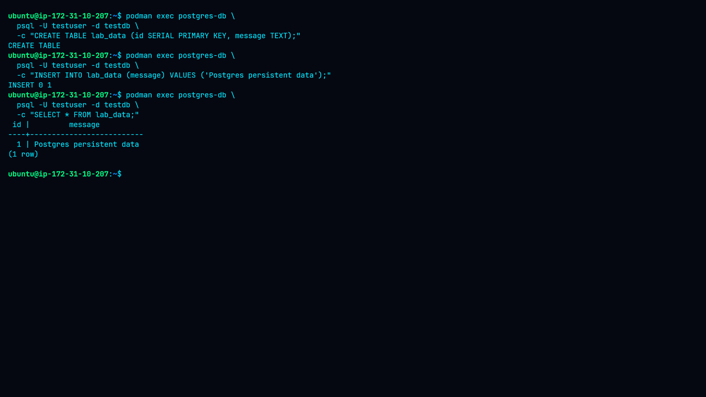

---

## 8. PostgreSQL Persistence Test

The PostgreSQL container was stopped and removed while the `pg-data` directory was preserved.


A new PostgreSQL container was then created using the same persistent storage.

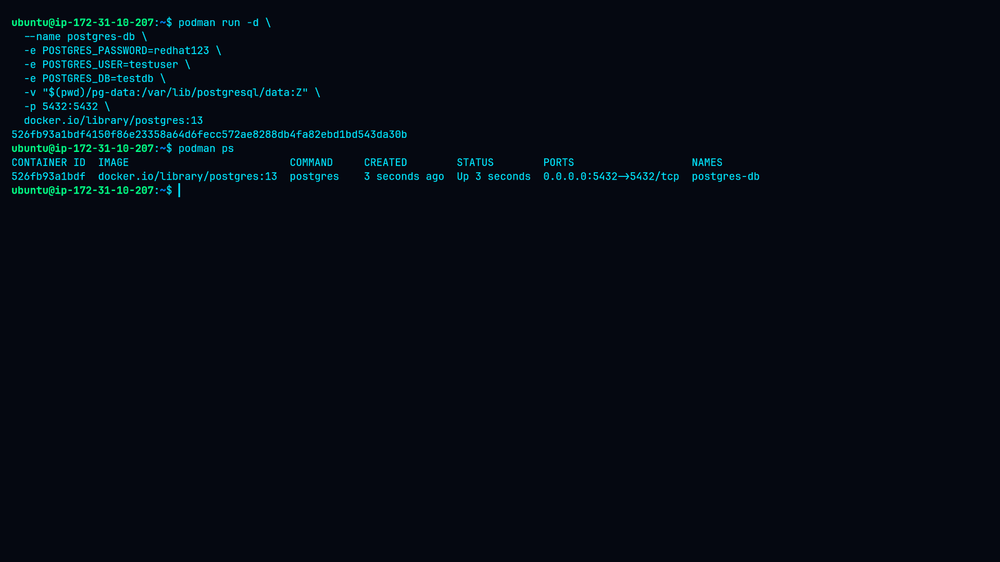

The database was queried again.

The previously created table and record remained available.

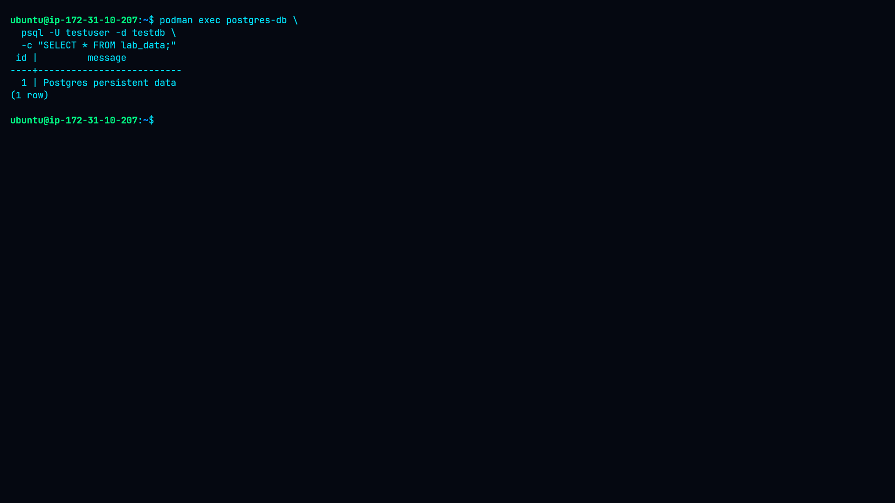

---

## 9. Host Storage Verification

The database storage directories were inspected from the host.

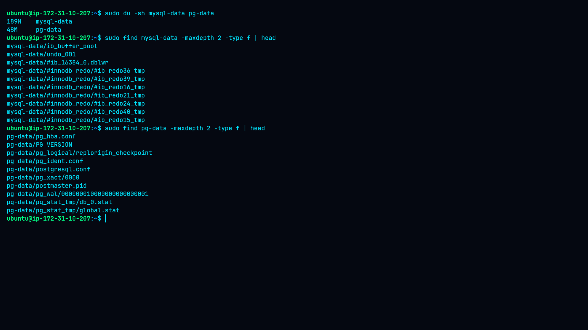

The presence of database files outside the container filesystem demonstrates that the database state is stored independently from the individual container.

---

## Key Concept

A stateful container separates the **application process** from its **persistent data**.

```text
Container
   │
   ├── MySQL/PostgreSQL process
   │
   └── Mounted Storage
          │
          └── Persistent Database Data
```

When the container is removed, the mounted storage remains available and can be attached to a replacement container.

## MySQL Storage

```text
Host: mysql-data/
        │
        ▼
Container: /var/lib/mysql
```

## PostgreSQL Storage

```text
Host: pg-data/
        │
        ▼
Container: /var/lib/postgresql/data
```

## Conclusion

This lab successfully demonstrated stateful database containers using Podman.

The practical exercises showed that:

* MySQL can run with persistent host storage.
* PostgreSQL can run with persistent host storage.
* Database records survive container removal.
* A replacement container can reuse existing database storage.
* Persistent storage must be managed separately from the container lifecycle.

Stateful container design is essential when containerized applications need to preserve data across container replacement, upgrades, or restarts.
