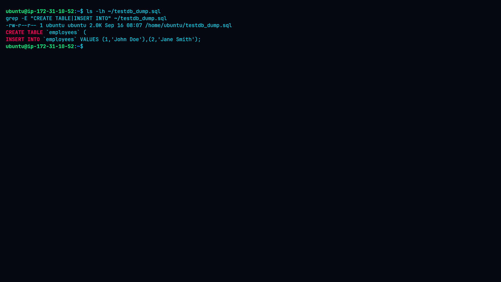
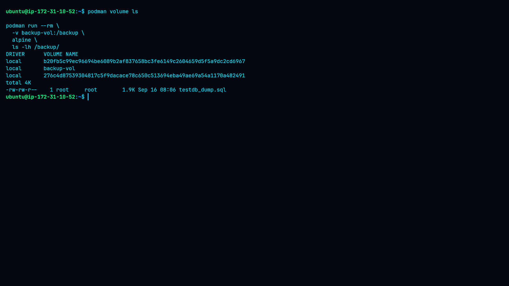
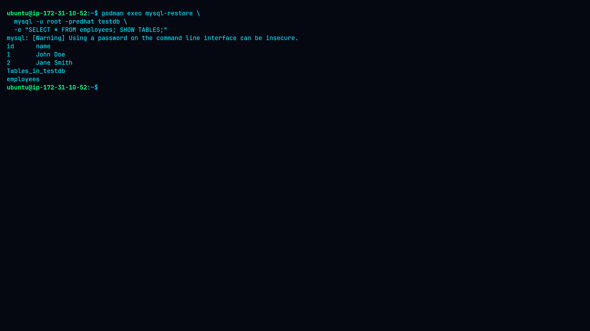
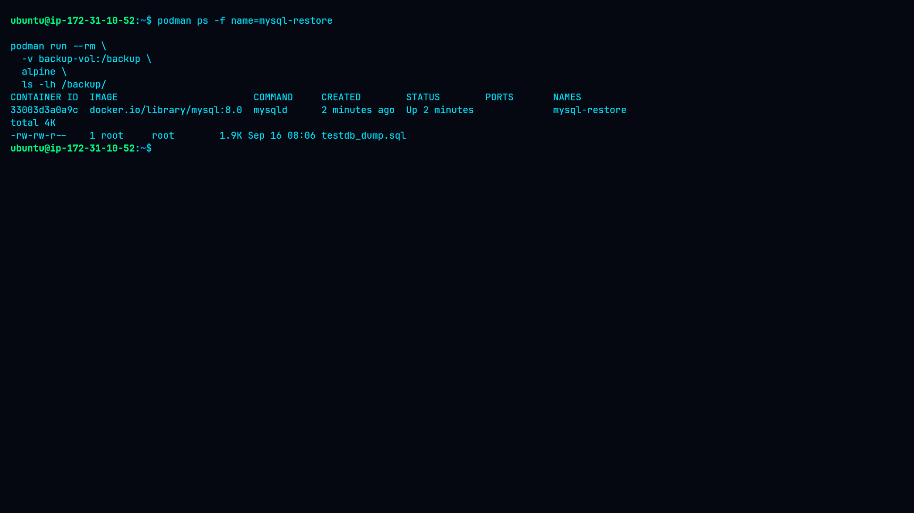

# Lab 12: Backup and Restore Data

## Overview

This lab demonstrates a complete database backup and restoration workflow using **Podman** and **MySQL 8.0**.

The practical workflow covered:

* Running a MySQL container
* Creating a sample database and table
* Creating a database dump with `mysqldump`
* Storing the dump in a Podman named volume
* Removing the original MySQL container
* Creating a new MySQL container
* Restoring the database from the backup
* Verifying the restored data
* Verifying that the backup remained available

## Objectives

* Implement a backup strategy for a containerized database.
* Create database dumps from a running MySQL container.
* Store backups using a persistent Podman named volume.
* Restore database contents into a new container.
* Verify database and data integrity after restoration.

## Environment

| Component          | Details           |
| ------------------ | ----------------- |
| Host OS            | Ubuntu            |
| Container Runtime  | Podman            |
| Database           | MySQL 8.0         |
| MySQL Version      | 8.0.46            |
| Database           | `testdb`          |
| Table              | `employees`       |
| Backup File        | `testdb_dump.sql` |
| Backup Volume      | `backup-vol`      |
| Original Container | `mysql-db`        |
| Restore Container  | `mysql-restore`   |

---

## Lab Workflow

```text
MySQL Container
      │
      ▼
Create Database & Data
      │
      ▼
mysqldump
      │
      ▼
testdb_dump.sql
      │
      ▼
Podman Named Volume
      │
      ▼
Remove Original Container
      │
      ▼
Create mysql-restore
      │
      ▼
Restore Database
      │
      ▼
Verify Restored Data
      │
      ▼
Verify Backup
```

---

# 1. MySQL Container and Original Data

A MySQL 8.0 container was deployed using Podman with the `testdb` database.

The MySQL server successfully initialized and reported:

```text
mysqld is alive
```

The `employees` table contained:

| ID | Name       |
| -: | ---------- |
|  1 | John Doe   |
|  2 | Jane Smith |

### Screenshot


**Evidence:** Confirms the MySQL container and the database records used as the original dataset before backup.

---

# 2. Database Dump

The database was backed up using `mysqldump`:

```bash
podman exec mysql-db \
  mysqldump -u root -predhat testdb > testdb_dump.sql
```

The resulting `testdb_dump.sql` file was approximately **2.0 KB**.

The dump was inspected and confirmed to contain the table definition and inserted records:

```text
CREATE TABLE `employees` (
INSERT INTO `employees` VALUES (1,'John Doe'),(2,'Jane Smith');
```

### Screenshot



**Evidence:** Confirms that the SQL database backup was successfully generated and contains the expected database structure and data.

---

# 3. Persistent Backup Volume

A Podman named volume named `backup-vol` was created.

The database dump was copied into the volume and verified:

```text
backup-vol
└── testdb_dump.sql
```

### Screenshot



**Evidence:** Confirms that the SQL backup was stored in persistent Podman volume storage.

---

# 4. Database Restoration

After the backup was verified, the original `mysql-db` container was removed.

A new MySQL container named `mysql-restore` was created.

The backup was retrieved from `backup-vol` and imported into the new MySQL container.

The restore operation completed successfully without database errors.

The restored `employees` table was then queried.

### Screenshot



**Evidence:** Confirms that the database table and original records were successfully restored into the replacement MySQL container.

The restored data was:

```text
id    name
1     John Doe
2     Jane Smith
```

The `employees` table was also confirmed to exist in `testdb`.

---

# 5. Final Backup and Container Verification

The final verification confirmed that:

* `mysql-restore` was running.
* The restored database was available.
* The backup volume still contained `testdb_dump.sql`.

### Screenshot



**Evidence:** Confirms the final state of the restored database container and persistent backup storage.

---

# Screenshots / Evidence

The complete practical workflow is documented through the following five screenshots:

|  # | Screenshot                  | Evidence                                   |
| -: | --------------------------- | ------------------------------------------ |
| 01 | `01-mysql-and-data.png`     | MySQL container and original database data |
| 02 | `02-database-dump.png`      | Generated SQL database dump                |
| 03 | `03-backup-volume.png`      | Backup stored in Podman named volume       |
| 04 | `04-restored-data.png`      | Successfully restored database and records |
| 05 | `05-final-verification.png` | Final container and backup verification    |

## Screenshot Gallery

### 01 — MySQL and Original Data


### 02 — Database Dump


### 03 — Backup Volume


### 04 — Restored Data


### 05 — Final Verification


---

# Findings

## Finding 1 — Database Initialization

MySQL 8.0.46 initialized successfully and became ready for connections.

## Finding 2 — Backup Creation

The `testdb` database was successfully exported to `testdb_dump.sql`.

## Finding 3 — Persistent Backup

The SQL dump was successfully stored in the `backup-vol` named volume.

## Finding 4 — Successful Recovery

The backup was restored into a newly created MySQL container.

The restored records matched the original dataset:

```text
1    John Doe
2    Jane Smith
```

## Finding 5 — Backup Availability

The backup remained available in `backup-vol` after the original MySQL container was removed.

---

# Security Considerations

The lab used passwords directly in command-line arguments for demonstration purposes.

In production environments, database credentials should be handled using secure secret-management mechanisms.

Recommended controls include:

* Podman secrets or equivalent secret management
* Encryption of database backups
* Restricted backup access
* Off-host backup storage
* Backup retention policies
* Regular restore testing
* Monitoring and alerting
* Least-privilege database accounts

---

# Conclusion

This lab successfully demonstrated a complete **MySQL database backup and restoration workflow using Podman**.

The database was exported using `mysqldump`, stored in a persistent named volume, and successfully restored into a newly created MySQL container.

The restored `employees` table contained the expected records, confirming successful data recovery.

```text
Backup
  ↓
Persistent Storage
  ↓
Container Replacement
  ↓
Database Restore
  ↓
Data Verification
```
