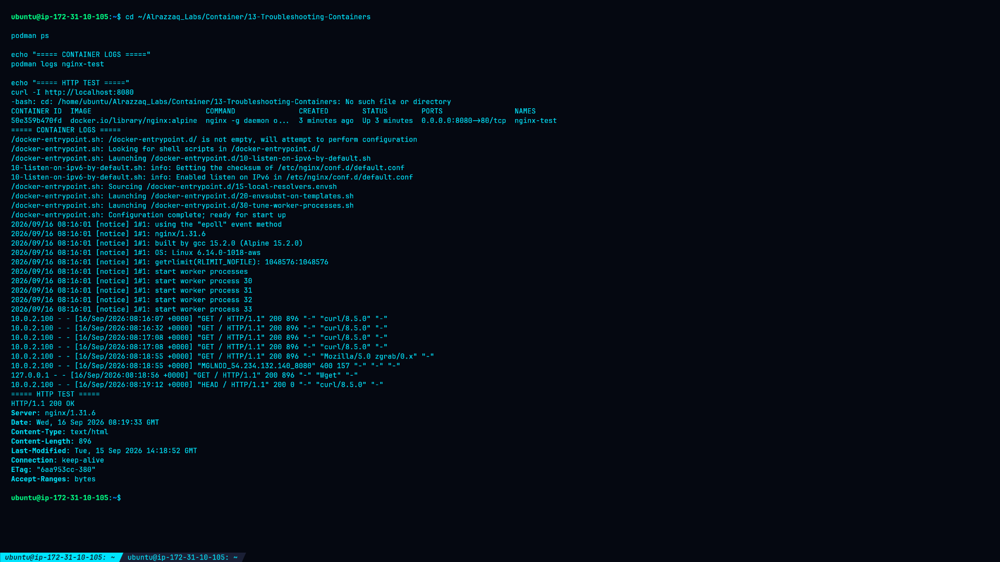
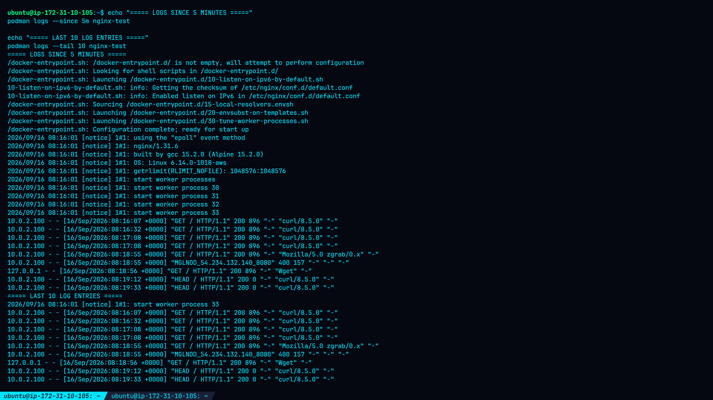
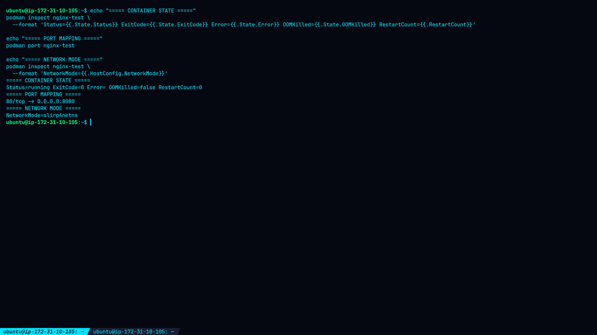
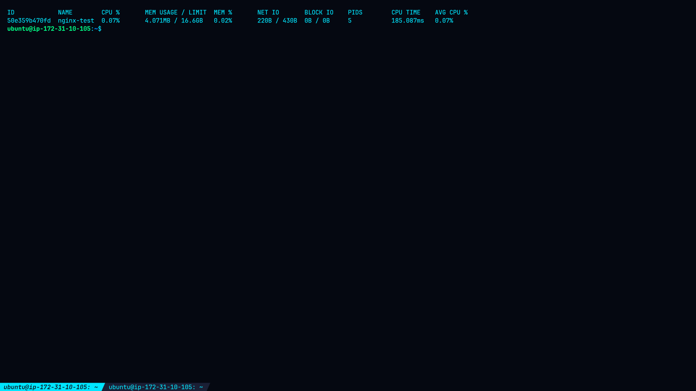
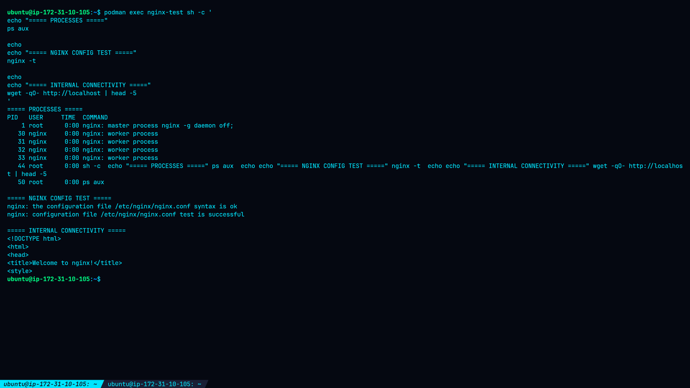

# Lab 13: Troubleshooting Containers

## Overview

This lab demonstrates practical troubleshooting techniques for containers using Podman. An Nginx Alpine container was deployed and investigated using container logs, inspection commands, resource statistics, and interactive debugging with `podman exec`.

## Objectives

* Diagnose container failures using logs and inspection commands.
* View and filter container logs.
* Inspect container runtime state.
* Monitor container resource usage.
* Use `podman exec` to debug inside a running container.
* Validate Nginx configuration and connectivity.

## Environment

| Component        | Details                          |
| ---------------- | -------------------------------- |
| Container Engine | Podman                           |
| Container Image  | `docker.io/library/nginx:alpine` |
| Nginx Version    | 1.31.6                           |
| Container Name   | `nginx-test`                     |
| Container ID     | `50e359b470fd`                   |
| Host Port        | `8080`                           |
| Container Port   | `80`                             |
| Network Mode     | `slirp4netns`                    |
| OCI Runtime      | `runc`                           |
| Container Status | Running                          |

---

## Lab Setup

The Nginx container was created using:

```bash
podman run -d \
  --name nginx-test \
  -p 8080:80 \
  docker.io/library/nginx:alpine
```

The container was verified with:

```bash
podman ps
```

The Nginx service was then tested from the host:

```bash
curl http://localhost:8080
```

The default Nginx welcome page was returned successfully.

---

# Task 1: Container Logs

## Basic Logs

Container logs were viewed using:

```bash
podman logs nginx-test
```

The logs showed successful Nginx initialization, worker-process startup, and HTTP access requests.

Example observed request:

```text
10.0.2.100 - - [16/Sep/2026:08:17:08 +0000] "GET / HTTP/1.1" 200 896 "-" "curl/8.5.0" "-"
```

The `200` status confirmed that the HTTP request was successfully served.

## Filtered Logs

Logs were filtered by time and number of entries:

```bash
podman logs --since 5m nginx-test
podman logs --tail 10 nginx-test
```

### Screenshot 1 — Container and Logs



**What this shows:**
The running `nginx-test` container, its logs, and successful HTTP connectivity through port `8080`.

### Screenshot 2 — Filtered Logs



**What this shows:**
Recent Nginx log entries filtered using `--since 5m` and `--tail 10`.

---

# Task 2: Inspect Container State

The container was inspected using:

```bash
podman inspect nginx-test
```

The actual runtime state showed:

```text
Status=running
ExitCode=0
Error=
OOMKilled=false
RestartCount=0
```

The container was using the following port mapping:

```text
0.0.0.0:8080 -> 80/tcp
```

Podman was using rootless `slirp4netns` networking. The inspected `IPAddress` field was empty, which is consistent with the networking configuration observed during the lab.

### Screenshot 3 — Container Inspection



**What this shows:**
The container's runtime status, exit code, error state, OOM status, restart count, port mapping, and network mode.

---

# Task 2.2: Resource Usage

Container resource consumption was checked using:

```bash
podman stats --no-stream nginx-test
```

Observed values included:

```text
CPU:       0.09%
Memory:    4.067 MB / 16.6 GB
Memory %:  0.02%
PIDs:      5
```

### Screenshot 4 — Container Statistics



**What this shows:**
The container's CPU, memory, network I/O, block I/O, and process count.

---

# Task 3: Debugging with `podman exec`

An interactive shell was opened inside the running container:

```bash
podman exec -it nginx-test /bin/sh
```

## Process Inspection

Running processes were examined using:

```bash
ps aux
```

The output showed:

* Nginx master process.
* Four Nginx worker processes.
* Interactive troubleshooting shell.
* `ps` process.

## Nginx Configuration

The Nginx configuration was inspected with:

```bash
cat /etc/nginx/nginx.conf
```

The configuration contained the Nginx worker, logging, HTTP, and included configuration settings.

## Configuration Validation

The Nginx configuration was tested with:

```bash
nginx -t
```

Actual result:

```text
nginx: the configuration file /etc/nginx/nginx.conf syntax is ok
nginx: configuration file /etc/nginx/nginx.conf test is successful
```

## Internal Connectivity

Nginx was tested from inside the container:

```bash
wget -qO- http://localhost
```

The default Nginx welcome page was successfully returned.

### Screenshot 5 — Interactive Debugging



**What this shows:**
Process inspection, Nginx configuration validation, and internal HTTP connectivity from inside the container.

---

# Host Connectivity Verification

After exiting the container, the service was tested from the host:

```bash
curl -I http://localhost:8080
```

Actual response:

```text
HTTP/1.1 200 OK
Server: nginx/1.31.6
Content-Type: text/html
Content-Length: 896
Connection: keep-alive
```

This confirmed successful host-to-container connectivity.

---

# Findings

The troubleshooting investigation confirmed that the Nginx container was functioning correctly.

Key findings:

1. Nginx initialized successfully.
2. Nginx worker processes were running.
3. HTTP requests returned status `200`.
4. Container exit code was `0`.
5. No container runtime error was reported.
6. The container was not OOM-killed.
7. Resource consumption was low.
8. Nginx configuration syntax was valid.
9. Nginx responded successfully from inside the container.
10. Nginx responded successfully through the published host port.

---

# Troubleshooting Workflow

```text
Container Status
       ↓
Application Logs
       ↓
Runtime Inspection
       ↓
Resource Usage
       ↓
Process Inspection
       ↓
Configuration Validation
       ↓
Internal Connectivity
       ↓
External Connectivity
```

This workflow helps isolate whether a problem originates from the container runtime, application process, configuration, resources, networking, or service availability.

---

# Security Considerations

Recommended container troubleshooting and security practices include:

* Run containers with the minimum required privileges.
* Avoid unnecessary Linux capabilities.
* Avoid exposing unnecessary ports.
* Keep container images updated.
* Monitor application and container logs.
* Apply CPU and memory limits where appropriate.
* Validate application configuration before deployment.
* Avoid storing secrets directly inside container images.
* Remove unused containers and images.
* Investigate unexpected processes or network connections.

---

# Screenshot Gallery

| Screenshot                  | Description                                                                |
| --------------------------- | -------------------------------------------------------------------------- |
| `01-container-and-logs.png` | Running Nginx container, logs, and HTTP verification                       |
| `02-filtered-logs.png`      | Logs filtered by time and number of entries                                |
| `03-container-inspect.png`  | Container runtime state and network information                            |
| `04-container-stats.png`    | CPU, memory, network, block I/O, and process statistics                    |
| `05-exec-debugging.png`     | Process inspection, Nginx configuration testing, and internal connectivity |

### All Lab Screenshots

#### 01 — Container and Logs


#### 02 — Filtered Logs


#### 03 — Container Inspection


#### 04 — Container Statistics


#### 05 — Exec Debugging


---

# Conclusion

This lab demonstrated a practical container troubleshooting workflow using Podman.

The investigation progressed from basic container status and logs to detailed runtime inspection, resource monitoring, interactive process inspection, configuration validation, and network testing.

The Nginx container was successfully inspected and verified from both inside and outside the container.

---

# Cleanup

When the lab is complete:

```bash
podman stop nginx-test
podman rm nginx-test
```

---

# Lab Completion Checklist

* [x] Viewed container logs.
* [x] Filtered container logs.
* [x] Inspected container state.
* [x] Checked resource usage.
* [x] Entered the container using `podman exec`.
* [x] Inspected running processes.
* [x] Reviewed Nginx configuration.
* [x] Tested Nginx configuration syntax.
* [x] Tested internal container connectivity.
* [x] Verified host-to-container HTTP connectivity.
* [x] Captured five troubleshooting screenshots.

