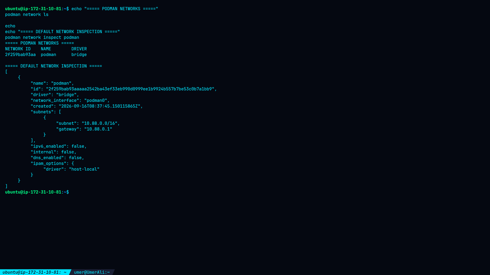
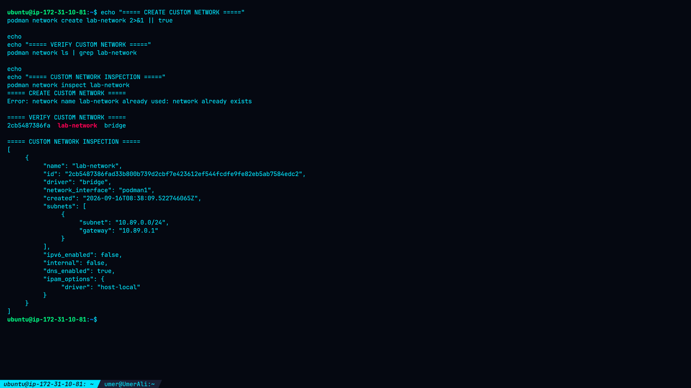
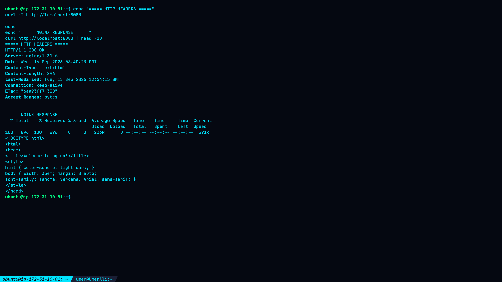
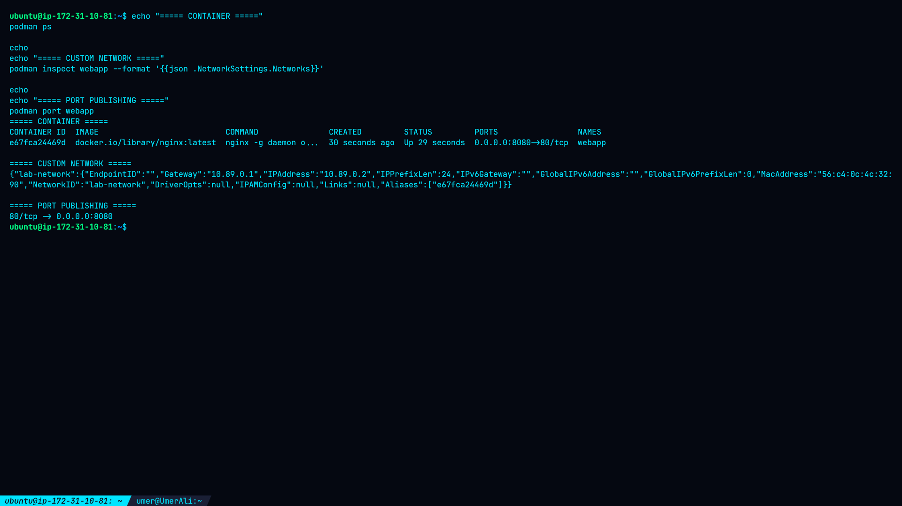

# Lab 14: Networking in Containers

## Overview

This lab demonstrates container networking fundamentals using Podman. The lab covers the default Podman bridge network, creation and inspection of a custom bridge network, port publishing, and attaching an Nginx container to the custom network.

All results documented in this lab were obtained from the practical execution on an Ubuntu-based AWS environment using Podman.

---

## Objectives

* Understand container networking fundamentals in Podman.
* Inspect the default Podman network.
* Create and inspect a custom bridge network.
* Run a container with published ports.
* Verify host-to-container connectivity.
* Attach a container to a custom network.
* Inspect the container's assigned IP address and gateway.

---

## Environment

| Component                | Details                          |
| ------------------------ | -------------------------------- |
| Operating System         | Ubuntu                           |
| Container Engine         | Podman                           |
| Container Image          | `docker.io/library/nginx:latest` |
| Nginx Version            | 1.31.6                           |
| Container Name           | `webapp`                         |
| Container Port           | `80`                             |
| Host Port                | `8080`                           |
| Default Network          | `podman`                         |
| Custom Network           | `lab-network`                    |
| Custom Network Driver    | `bridge`                         |
| Custom Network Interface | `podman1`                        |
| Custom Subnet            | `10.89.0.0/24`                   |
| Custom Gateway           | `10.89.0.1`                      |
| Final Container IP       | `10.89.0.3`                      |

---

# Task 1: List Podman Networks

## 1.1 Check Available Networks

The available Podman networks were listed using:

```bash
podman network ls
```

Actual result:

```text
NETWORK ID    NAME        DRIVER
2f259bab93aa  podman      bridge
```

The default `podman` network uses the `bridge` driver.

### Screenshot 1 — Default Podman Network



**What this shows:**
The available Podman network and the detailed configuration of the default `podman` bridge network.

---

## 1.2 Inspect the Default Network

The default network was inspected using:

```bash
podman network inspect podman
```

Actual configuration:

```text
Network:       podman
Interface:     podman0
Driver:        bridge
Subnet:        10.88.0.0/16
Gateway:       10.88.0.1
IPv6:          disabled
Internal:      false
DNS:           disabled
IPAM:          host-local
```

The `podman0` interface provides the bridge networking interface for the default network.

---

# Task 2: Inspect Network Settings

## 2.1 Create a Custom Network

A custom bridge network was created:

```bash
podman network create lab-network
```

The command returned:

```text
lab-network
```

The network was then verified:

```bash
podman network ls | grep lab-network
```

Actual result:

```text
2cb5487386fa  lab-network  bridge
```

---

## 2.2 Inspect the Custom Network

The custom network was inspected with:

```bash
podman network inspect lab-network
```

Actual configuration:

```text
Network:       lab-network
Network ID:    2cb5487386fa...
Interface:     podman1
Driver:        bridge
Subnet:        10.89.0.0/24
Gateway:       10.89.0.1
IPv6:          disabled
Internal:      false
DNS:           enabled
IPAM:          host-local
```

The custom network used a separate subnet and bridge interface from the default Podman network.

### Screenshot 2 — Custom Network



**What this shows:**
The custom `lab-network`, its bridge driver, subnet, gateway, interface, and DNS configuration.

---

# Task 3: Run Containers with Port Publishing

## 3.1 Run Nginx with Port Mapping

The Nginx container was launched with host port `8080` mapped to container port `80`:

```bash
podman run -d \
  --name webapp \
  -p 8080:80 \
  docker.io/library/nginx
```

The container was verified using:

```bash
podman ps
```

Actual result:

```text
CONTAINER ID  IMAGE                           STATUS       PORTS
dba932882576  docker.io/library/nginx:latest  Up           0.0.0.0:8080->80/tcp
```

The port mapping makes the Nginx service available through port `8080` on the host.

### Screenshot 3 — Port Publishing


**What this shows:**
The running `webapp` container and its published `8080:80` port mapping.

---

## 3.2 Verify Port Accessibility

Host connectivity was tested using:

```bash
curl -I http://localhost:8080
```

Actual response:

```text
HTTP/1.1 200 OK
Server: nginx/1.31.6
Content-Type: text/html
Content-Length: 896
Connection: keep-alive
```

The Nginx welcome page was also retrieved successfully:

```bash
curl http://localhost:8080 | head -10
```

The response contained:

```html
<!DOCTYPE html>
<html>
<head>
<title>Welcome to nginx!</title>
```

### Screenshot 4 — Port Accessibility



**What this shows:**
Successful HTTP connectivity to Nginx through the published host port `8080`.

---

## 3.3 Attach Container to Custom Network

The original container was stopped and removed:

```bash
podman stop webapp
podman rm webapp
```

A new Nginx container was then launched on the custom network:

```bash
podman run -d \
  --name webapp \
  -p 8080:80 \
  --network lab-network \
  docker.io/library/nginx
```

The network assignment was inspected using:

```bash
podman inspect webapp --format '{{json .NetworkSettings.Networks}}'
```

Actual final configuration:

```text
Network:       lab-network
Container IP:  10.89.0.3
Gateway:       10.89.0.1
Prefix:        /24
MAC Address:   82:78:eb:88:b0:0b
Network ID:    lab-network
```

The published port remained:

```text
80/tcp -> 0.0.0.0:8080
```

### Screenshot 5 — Custom Network Assignment



**What this shows:**
The final `webapp` container attached to `lab-network`, including its assigned IP address, gateway, and published port.

---

# Final Connectivity Verification

After attaching the container to `lab-network`, host connectivity was tested again:

```bash
curl -I http://localhost:8080
```

Actual result:

```text
HTTP/1.1 200 OK
Server: nginx/1.31.6
Content-Type: text/html
Content-Length: 896
Connection: keep-alive
```

The Nginx response body was also successfully returned.

This confirmed that changing the container's network did not prevent access through the published host port.

---

# Network Architecture

```text
                     Ubuntu Host
                         |
                    Port 8080
                         |
                         v
              +-------------------+
              |   webapp (Nginx)  |
              |    Port 80        |
              |    IP: 10.89.0.3  |
              +---------+---------+
                        |
                  lab-network
                   bridge/podman1
                        |
                 10.89.0.0/24
                        |
                  Gateway
                 10.89.0.1
```

---

# Findings

The practical investigation confirmed:

1. Podman provides a default `podman` bridge network.
2. The default network uses subnet `10.88.0.0/16`.
3. A separate custom bridge network named `lab-network` was successfully created.
4. `lab-network` uses subnet `10.89.0.0/24`.
5. The custom network uses `podman1` as its bridge interface.
6. DNS was enabled on `lab-network`.
7. Nginx was successfully published on host port `8080`.
8. Nginx returned HTTP status `200 OK`.
9. The final Nginx container received IP address `10.89.0.3`.
10. Host connectivity remained functional after attaching the container to the custom network.

---

# Security Considerations

Container networking should be configured according to the application's actual communication requirements.

Recommended practices include:

* Avoid publishing unnecessary container ports.
* Use dedicated networks to isolate application components.
* Review exposed ports regularly.
* Use internal networks when external access is not required.
* Monitor container network connections.
* Restrict host firewall access where appropriate.
* Avoid exposing administrative services directly to untrusted networks.
* Use explicit network configurations for multi-container applications.
* Document subnet and port assignments for troubleshooting.

---

# Troubleshooting Notes

If a published container port is inaccessible, check:

```bash
podman ps
```

Then inspect the port mapping:

```bash
podman port webapp
```

Inspect the network:

```bash
podman network inspect lab-network
```

Inspect the container's network assignment:

```bash
podman inspect webapp --format '{{json .NetworkSettings.Networks}}'
```

Finally test the service:

```bash
curl -I http://localhost:8080
```

---

# Screenshot Gallery

| Screenshot                  | Description                              |
| --------------------------- | ---------------------------------------- |
| `01-default-network.png`    | Default Podman network and inspection    |
| `02-custom-network.png`     | Custom `lab-network` configuration       |
| `03-port-publishing.png`    | Nginx container and published port       |
| `04-port-accessibility.png` | Successful HTTP access through port 8080 |
| `05-custom-network.png`     | Nginx attached to custom network         |

### 01 — Default Network


### 02 — Custom Network


### 03 — Port Publishing


### 04 — Port Accessibility


### 05 — Custom Network Assignment


---

# Conclusion

This lab demonstrated practical Podman networking by inspecting the default bridge network, creating an isolated custom network, publishing a container port, and attaching an Nginx container to the custom network.

The final configuration successfully provided Nginx access through:

```text
Host:       localhost:8080
Container:  10.89.0.3:80
Network:    lab-network
Gateway:    10.89.0.1
```

The HTTP service returned `200 OK`, confirming successful connectivity.

---

# Cleanup

When the lab is complete:

```bash
podman stop webapp
podman rm webapp
podman network rm lab-network
```

---

# Lab Completion Checklist

* [x] Listed Podman networks.
* [x] Inspected the default `podman` network.
* [x] Created `lab-network`.
* [x] Inspected the custom network.
* [x] Ran an Nginx container.
* [x] Published port `8080:80`.
* [x] Verified host-to-container connectivity.
* [x] Attached Nginx to `lab-network`.
* [x] Verified container IP and gateway.
* [x] Re-tested HTTP connectivity.
* [x] Captured five lab screenshots.
