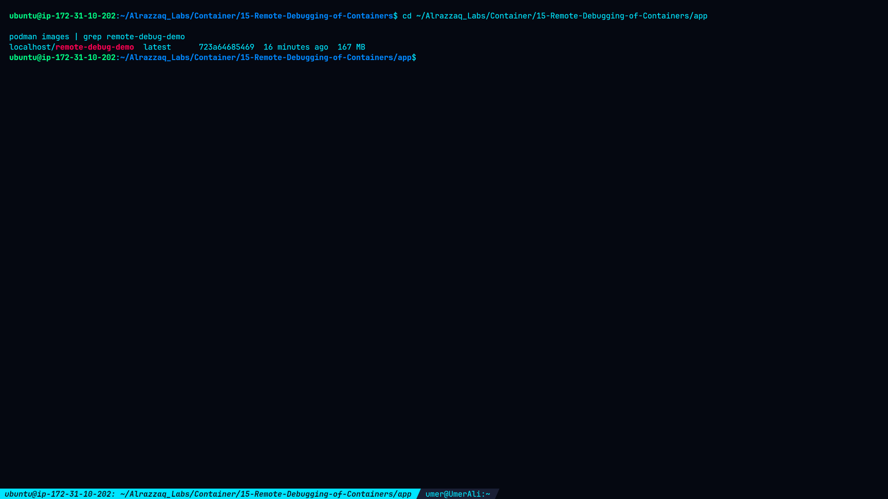
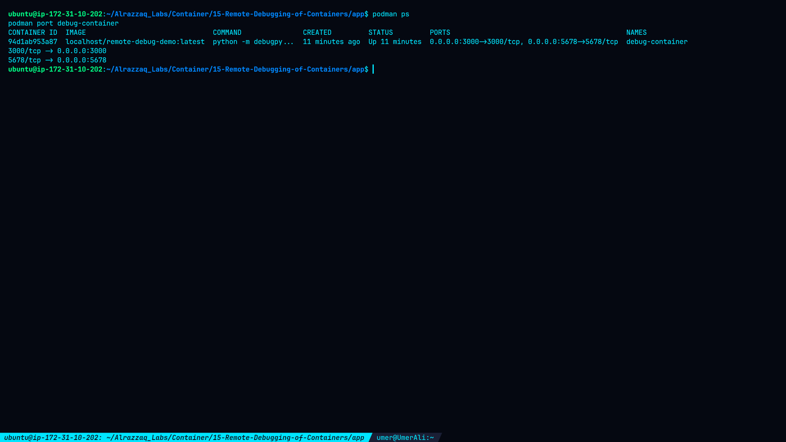
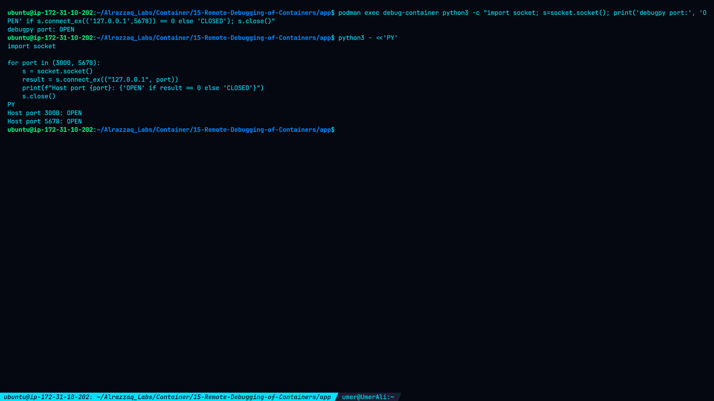
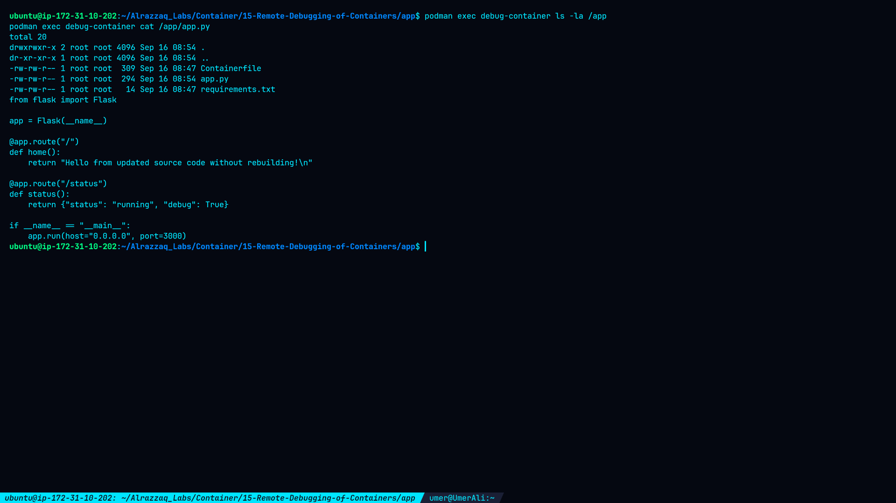
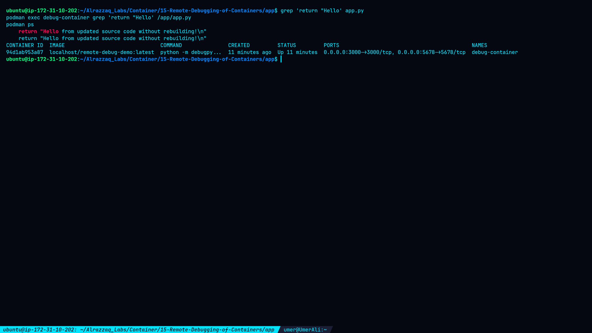
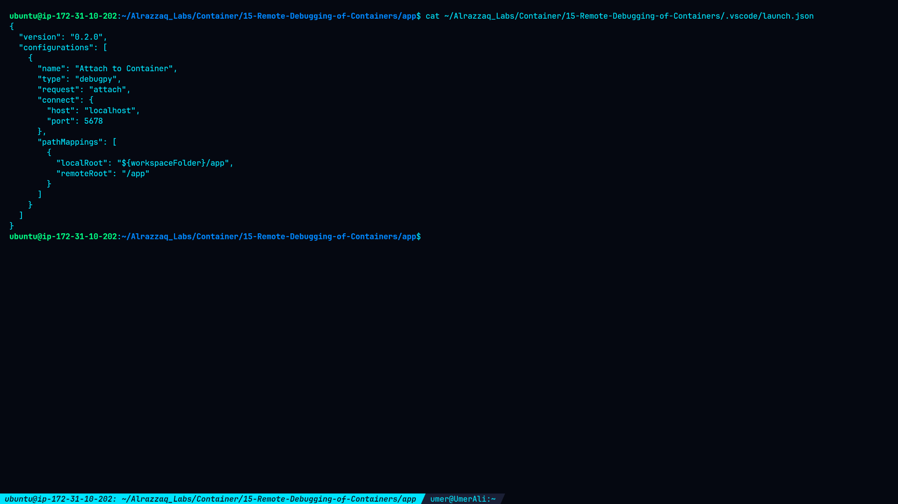

# Lab 15 — Remote Debugging of Containers

## Overview

This lab demonstrates remote debugging of a Python Flask application running inside a Podman container.

The application uses **debugpy** to expose a remote debugging endpoint on port `5678`, while the Flask application listens on port `3000`.

The lab also demonstrates bind mounting the application source code into the container so that source-code changes are immediately visible inside the running container without rebuilding the image.

## Objectives

* Build a containerized Python Flask application.
* Enable Python remote debugging with `debugpy`.
* Expose application and debugging ports.
* Verify the debugpy listener.
* Mount application source code into the container.
* Demonstrate live source-code updates without rebuilding the image.
* Prepare a VS Code `debugpy` attach configuration.
* Verify container networking and debugging configuration.

## Lab Environment

| Component        | Configuration                        |
| ---------------- | ------------------------------------ |
| Container Engine | Podman                               |
| Base Image       | `python:3.12-slim`                   |
| Application      | Python Flask                         |
| Debugger         | debugpy                              |
| Application Port | `3000`                               |
| Debug Port       | `5678`                               |
| Container Name   | `debug-container`                    |
| Image            | `localhost/remote-debug-demo:latest` |
| Source Mount     | Host `app/` → `/app`                 |

## Directory Structure

```text
15-Remote-Debugging-of-Containers/
├── README.md
├── command.md
├── methodology.md
├── findings.md
├── remediation.md
├── .vscode/
│   └── launch.json
├── app/
│   ├── Containerfile
│   ├── app.py
│   └── requirements.txt
└── screenshots/
    ├── 01-debug-app-and-build.png
    ├── 02-debug-container-and-ports.png
    ├── 03-source-code-mount.png
    ├── 04-debug-port-verification.png
    ├── 05-live-source-update.png
    └── 06-debugger-configuration.png
```

---

## Application

The Flask application provides two endpoints:

```text
/
```

and:

```text
/status
```

The final live source-code update changed the response to:

```python
return "Hello from updated source code without rebuilding!\n"
```

---

## Containerfile

```dockerfile
FROM python:3.12-slim

WORKDIR /app

COPY requirements.txt .

RUN pip install --no-cache-dir -r requirements.txt

COPY app.py .

EXPOSE 3000
EXPOSE 5678

CMD ["python", "-m", "debugpy", "--listen", "0.0.0.0:5678", "--wait-for-client", "-m", "flask", "--app", "app.py", "run", "--host=0.0.0.0", "--port=3000"]
```

---

## Debugging Architecture

```text
                    Host / EC2
                         │
             ┌───────────┴───────────┐
             │                       │
        Port 3000               Port 5678
             │                       │
             ▼                       ▼
      Flask Application           debugpy
             │                       │
             └───────────┬───────────┘
                         │
                  debug-container
                         │
                         ▼
                    /app source
                         ▲
                         │
                    Bind Mount
                         │
                         ▼
                  Host app directory
```

---

# Task 1 — Build the Image

The remote debugging image was built using:

```bash
podman build -t remote-debug-demo .
```

The resulting image was:

```text
localhost/remote-debug-demo:latest
```

### Screenshot



---

# Task 2 — Run the Debugging Container

The container was started with both application and debugger ports published:

```bash
podman run -d \
  --name debug-container \
  -p 3000:3000 \
  -p 5678:5678 \
  remote-debug-demo
```

Final container:

```text
94d1ab953a87
```

Published ports:

```text
3000/tcp -> 0.0.0.0:3000
5678/tcp -> 0.0.0.0:5678
```

### Screenshot



---

# Task 3 — Debugger Verification

The debugpy listener was verified from inside the container:

```text
debugpy port: OPEN
```

The host-side test confirmed:

```text
Host port 3000: OPEN
Host port 5678: OPEN
```

### Screenshot



---

# Task 4 — Source Code Bind Mount

The application directory was mounted into `/app`:

```bash
-v "$(pwd):/app:Z"
```

The container confirmed that the source files were available:

```text
Containerfile
app.py
requirements.txt
```

The mounted application source was then read directly from the running container.

### Screenshot



---

# Task 5 — Live Source-Code Update

The application source was modified on the host without rebuilding the image:

```bash
sed -i 's/Hello from live-mounted debugging container!/Hello from updated source code without rebuilding!/' app.py
```

The updated source was immediately visible inside the running container:

```text
return "Hello from updated source code without rebuilding!\n"
```

The container remained running during the modification.

This demonstrates that changes made to the mounted source directory are reflected inside the container without rebuilding the image.

### Screenshot



---

# Task 6 — Debugger Configuration

A VS Code `debugpy` attach configuration was prepared:

```json
{
  "version": "0.2.0",
  "configurations": [
    {
      "name": "Attach to Container",
      "type": "debugpy",
      "request": "attach",
      "connect": {
        "host": "localhost",
        "port": 5678
      },
      "pathMappings": [
        {
          "localRoot": "${workspaceFolder}/app",
          "remoteRoot": "/app"
        }
      ]
    }
  ]
}
```

The configuration connects to:

```text
localhost:5678
```

and maps:

```text
Local:  app/
Remote: /app/
```

### Screenshot



> **Note:** VS Code was not installed in the lab environment, so an actual VS Code debugger attachment or breakpoint was not performed. The configuration was prepared and the debugpy listener was independently verified on port `5678`.

---

# Verification Summary

| Test                                     | Result        |
| ---------------------------------------- | ------------- |
| Container image built                    | ✅ Passed      |
| Container running                        | ✅ Passed      |
| Flask port `3000` published              | ✅ Passed      |
| debugpy port `5678` published            | ✅ Passed      |
| debugpy listener verified                | ✅ Passed      |
| Source bind mount verified               | ✅ Passed      |
| Live source update verified              | ✅ Passed      |
| Image rebuild required for source update | ❌ No          |
| VS Code configuration created            | ✅ Passed      |
| Actual VS Code debugger attachment       | Not performed |

---

# Key Findings

### Debugging Port

```text
5678/tcp -> 0.0.0.0:5678
```

The debugpy listener was confirmed as open.

### Application Port

```text
3000/tcp -> 0.0.0.0:3000
```

The application port was successfully published.

### Source Mount

```text
Host app/
    ↓
Container /app
```

The source files were accessible inside the running container.

### Live Update

The following source modification was reflected immediately inside the container:

```text
Hello from updated source code without rebuilding!
```

No image rebuild or container recreation was required.

---

# Security Considerations

The debug port should not normally be exposed publicly because a debugging interface can provide significant control over the application process.

For remote development, access should preferably be restricted through:

* SSH tunneling
* Private networking
* Firewall rules
* Cloud security groups
* Trusted development networks

For example:

```bash
ssh -L 5678:localhost:5678 ubuntu@<EC2-PUBLIC-IP>
```

This tunnel should be created from the developer's local computer, not from the EC2 instance back to itself.

---

# Screenshots Gallery

All screenshots collected during the lab:

### 01 — Debug Application Build


### 02 — Debug Container and Ports


### 03 — Source Code Mount


### 04 — Debug Port Verification


### 05 — Live Source Update


### 06 — Debugger Configuration


---

# Conclusion

This lab demonstrated the core mechanics of remote debugging for a containerized Python application using Podman and debugpy.

The container successfully exposed a debugging interface on port `5678`, while application source code was bind mounted into `/app`.

Live source-code modifications were successfully synchronized into the running container without rebuilding the image.

A VS Code `debugpy` attach configuration was also prepared for future IDE-based debugging.
