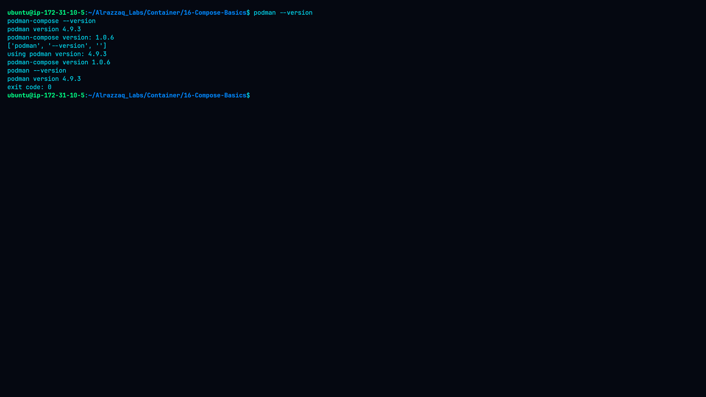
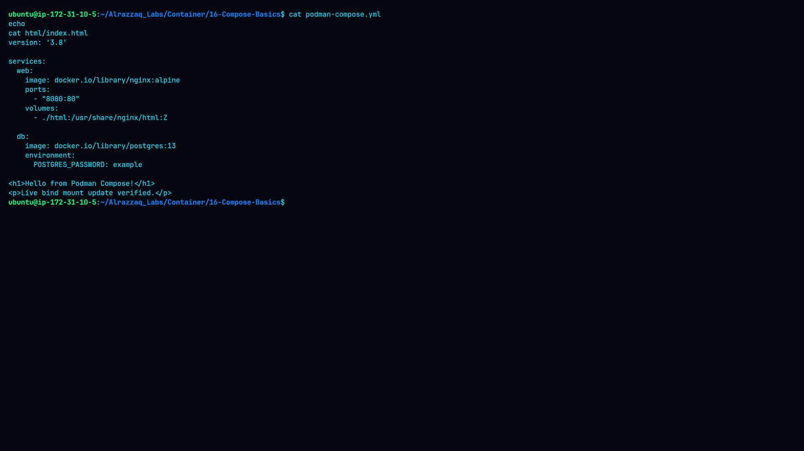
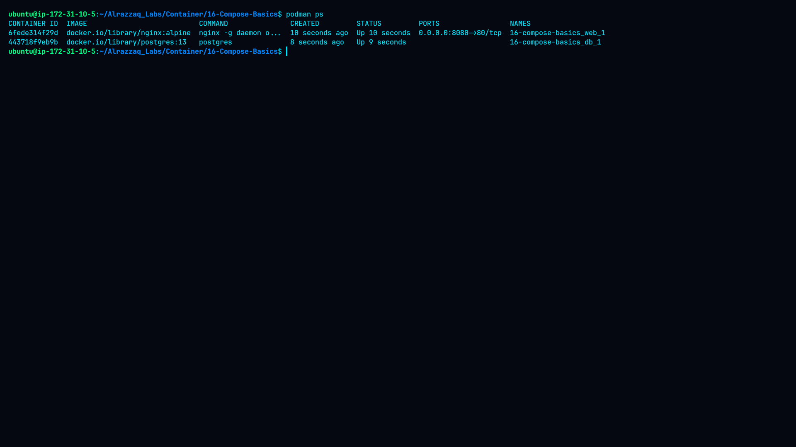
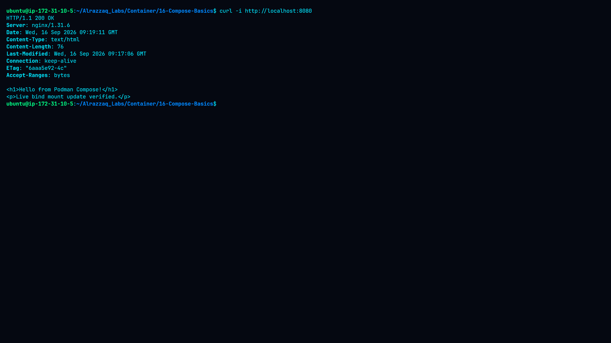
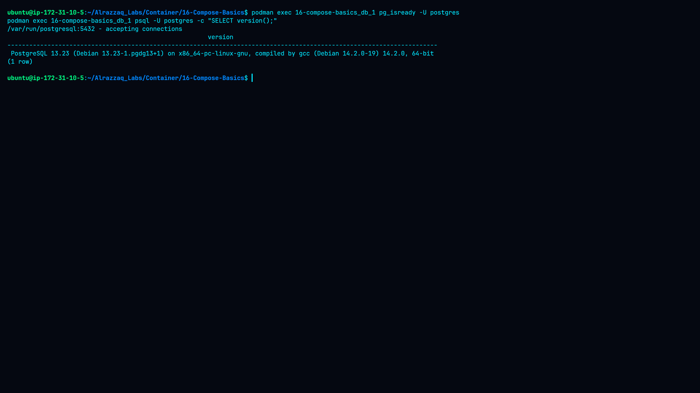
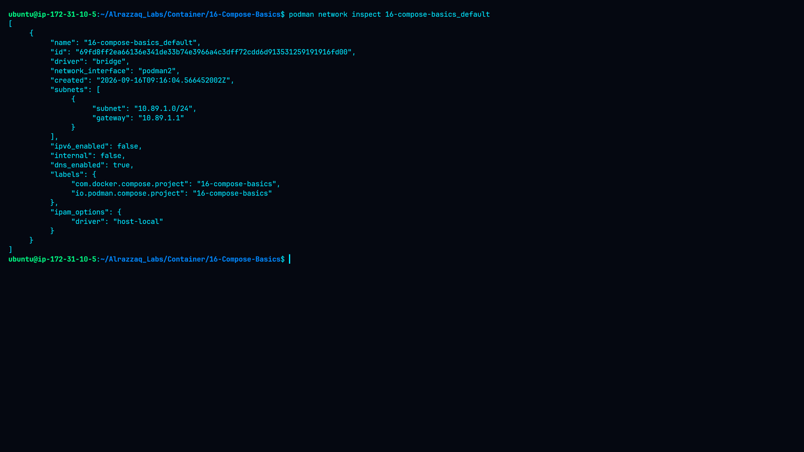
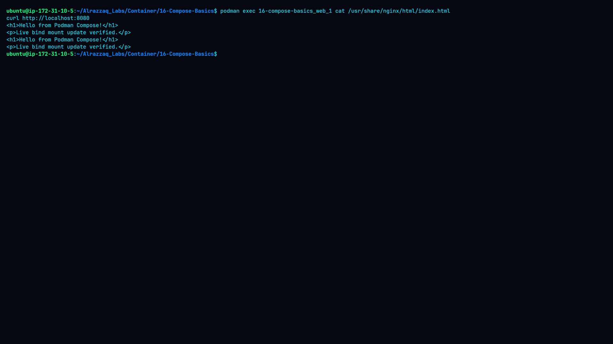

# 🐙 Lab 16 — Compose Basics


## 📌 Overview

This lab demonstrates how to define and manage a multi-container application with **Podman Compose**. The application consists of:

- An **Nginx** web service
- A **PostgreSQL** database service
- A Compose-managed bridge network
- A bind mount for the Nginx web content
- A published HTTP port (`8080`)

The lab was completed on Ubuntu using Podman and `podman-compose`.

## 🎯 Objectives

- Define multiple services in a `podman-compose.yml` file
- Configure service images, ports, environment variables, and volumes
- Start and stop a multi-container application
- Verify the Nginx and PostgreSQL services
- Verify the Compose-created network
- Verify a live bind-mount update

## 🖥️ Environment

| Component | Version / Value |
|---|---|
| Podman | 4.9.3 |
| podman-compose | 1.0.6 |
| Nginx | 1.31.6 |
| PostgreSQL | 13.23 |
| Web container | `16-compose-basics_web_1` |
| Database container | `16-compose-basics_db_1` |
| Web port mapping | `0.0.0.0:8080 -> 80/tcp` |
| Compose network | `16-compose-basics_default` |
| Network subnet | `10.89.1.0/24` |
| Network gateway | `10.89.1.1` |

## 📁 Project Structure

```text
16-Compose-Basics/
├── README.md
├── command.md
├── methodology.md
├── findings.md
├── remediation.md
├── podman-compose.yml
├── html/
│   └── index.html
└── screenshots/
    ├── 01-podman-compose-version.png
    ├── 02-compose-file.png
    ├── 03-compose-up.png
    ├── 04-running-services.png
    ├── 05-web-service-test.png
    ├── 06-postgresql-test.png
    ├── 07-compose-network.png
    ├── 08-bind-mount-verification.png
    └── 09-compose-cleanup.png
```

## ⚙️ Compose Configuration

```yaml
version: '3.8'

services:
  web:
    image: docker.io/library/nginx:alpine
    ports:
      - "8080:80"
    volumes:
      - ./html:/usr/share/nginx/html:Z

  db:
    image: docker.io/library/postgres:13
    environment:
      POSTGRES_PASSWORD: example
```

- The `web` service publishes host port `8080` to container port `80`.
- The `./html` directory is bind-mounted into `/usr/share/nginx/html`, allowing host-side changes to be reflected inside the running container without a rebuild.
- The `db` service uses `POSTGRES_PASSWORD=example` for this lab only — this is **not** a production-safe credential-management approach (see [`remediation.md`](./remediation.md)).

## 🚀 Deployment

```bash
cd ~/Alrazzaq_Labs/Container/16-Compose-Basics
podman-compose up -d
```

The application created two containers:

```
16-compose-basics_web_1
16-compose-basics_db_1
```

## ✅ Web Service Verification

```bash
podman port 16-compose-basics_web_1
curl -i http://localhost:8080
```

The port mapping was confirmed as `80/tcp -> 0.0.0.0:8080`, and Nginx returned `HTTP/1.1 200 OK` with:

```
<h1>Hello from Podman Compose!</h1>
```

## ✅ PostgreSQL Verification

```bash
podman exec 16-compose-basics_db_1 pg_isready -U postgres
```

Result:

```
/var/run/postgresql:5432 - accepting connections
```

Version check:

```bash
podman exec 16-compose-basics_db_1 psql -U postgres -c "SELECT version();"
```

The running database reported **PostgreSQL 13.23**.

## 🌐 Compose Network

Podman Compose automatically created:

```
16-compose-basics_default
```

Verified network properties:

| Property | Value |
|---|---|
| Driver | bridge |
| Subnet | `10.89.1.0/24` |
| Gateway | `10.89.1.1` |
| DNS enabled | yes |

## 🔄 Bind-Mount Verification

The host HTML file was updated to:

```html
<h1>Hello from Podman Compose!</h1>
<p>Live bind mount update verified.</p>
```

Without rebuilding the image, the updated content became visible immediately through the running Nginx service:

```bash
curl http://localhost:8080
```

Result matched the updated file exactly, and the same content was also confirmed from inside the container.

## 📸 Evidence / Screenshots

All screenshots are stored in [`screenshots/`](./screenshots). Each one corresponds to a stage of the workflow described above.

### 1. Podman and Podman Compose Versions


Confirms the installed versions used throughout the lab: **Podman 4.9.3** and **podman-compose 1.0.6**, establishing the baseline environment before deployment.

### 2. Compose File and HTML Content


Shows the contents of `podman-compose.yml` and `html/index.html` prior to deployment, confirming the service definitions, port mapping, volume mount, and initial web page content.

### 3. Compose Application Startup


Captures the output of `podman-compose up -d`, showing both the `web` and `db` containers being created and started successfully.

### 4. Running Services


Output of `podman ps`, confirming both `16-compose-basics_web_1` and `16-compose-basics_db_1` are running, along with the published port mapping for the web service.

### 5. Web Service Test


Result of `curl -i http://localhost:8080`, showing the `HTTP/1.1 200 OK` response and the initial Nginx page content served through the Compose network and port mapping.

### 6. PostgreSQL Test


Shows `pg_isready` confirming the database is accepting connections, along with the `SELECT version();` query output confirming PostgreSQL 13.23 is running inside the container.

### 7. Compose Network


Output of `podman network inspect 16-compose-basics_default`, showing the bridge driver, subnet `10.89.1.0/24`, gateway `10.89.1.1`, and DNS configuration created automatically by Compose.

### 8. Bind-Mount Verification


Demonstrates the live-update test: the host `html/index.html` file was edited while the container was running, and the change was immediately visible via `curl` without rebuilding or restarting the container.

### 9. Compose Cleanup


Shows `podman-compose down` removing both containers, followed by `podman ps -a` confirming no containers remained. It also reflects the observed behavior that the Compose network was **not** automatically removed in this environment.

> **Note:** Screenshot files should be placed in the `screenshots/` directory using the exact filenames above so the images render correctly on GitHub.

## 🧹 Cleanup

```bash
podman-compose down
podman ps -a
```

The Compose containers were removed, and `podman ps -a` showed no remaining containers.

In this environment, the Compose network remained after `podman-compose down`. The existing networks included:

```
16-compose-basics_default
podman
ubuntu_default
```

Therefore, this lab does **not** claim that `podman-compose down` removed the network — see [`remediation.md`](./remediation.md) for manual cleanup steps.

## 🔎 Key Findings

- Podman Compose successfully managed both services.
- Nginx was reachable through the published port `8080`.
- PostgreSQL accepted connections and reported the correct version.
- Podman Compose created a dedicated bridge network automatically.
- The bind mount allowed live HTML changes without rebuilding the image.
- Cleanup removed the Compose containers, while the network remained in this environment.

## 🛡️ Security Considerations

- Do not store real database passwords directly in Compose files.
- Use secrets or a secure environment-variable mechanism in production.
- Avoid exposing database ports publicly unless required.
- Keep container images updated and use controlled/pinned image versions.
- Publish only the ports actually required by the application.

See [`remediation.md`](./remediation.md) for full recommendations.

## 📚 Related Documentation

- [Command Reference](./command.md)
- [Findings](./findings.md)
- [Methodology](./methodology.md)
- [Remediation](./remediation.md)

## ✅ Conclusion

The Compose-based application was successfully deployed with Nginx and PostgreSQL. Both services were verified, the Compose network was inspected, and a live bind-mount update was confirmed without rebuilding the container image.
