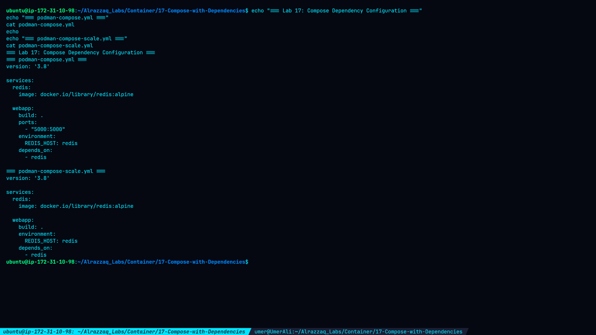
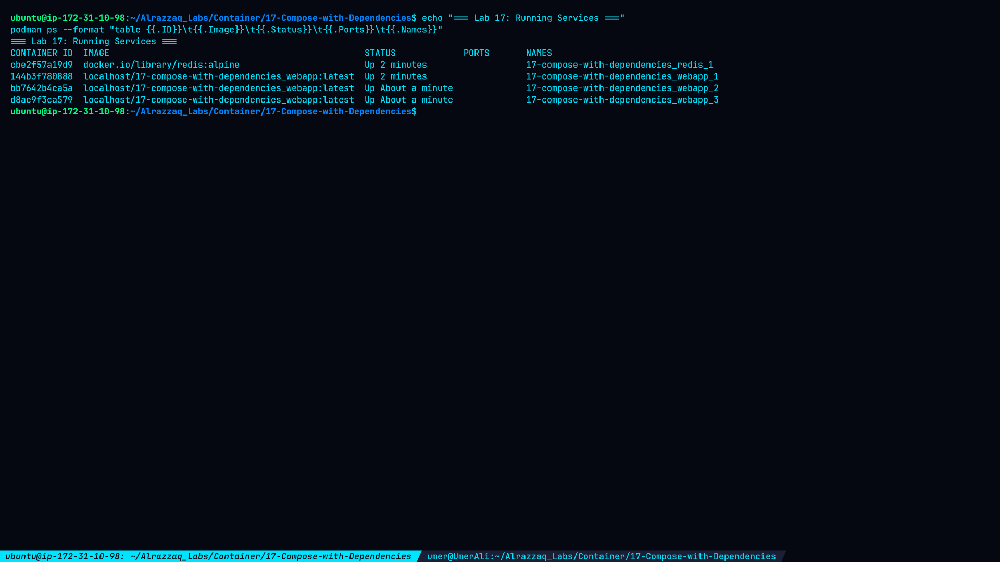
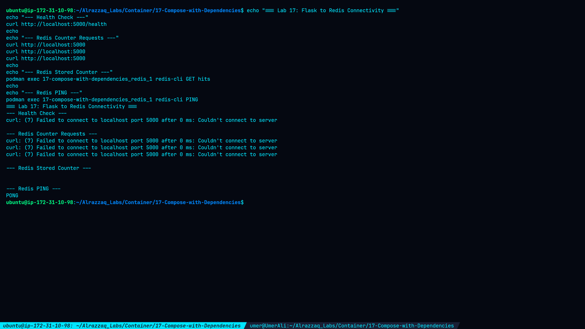
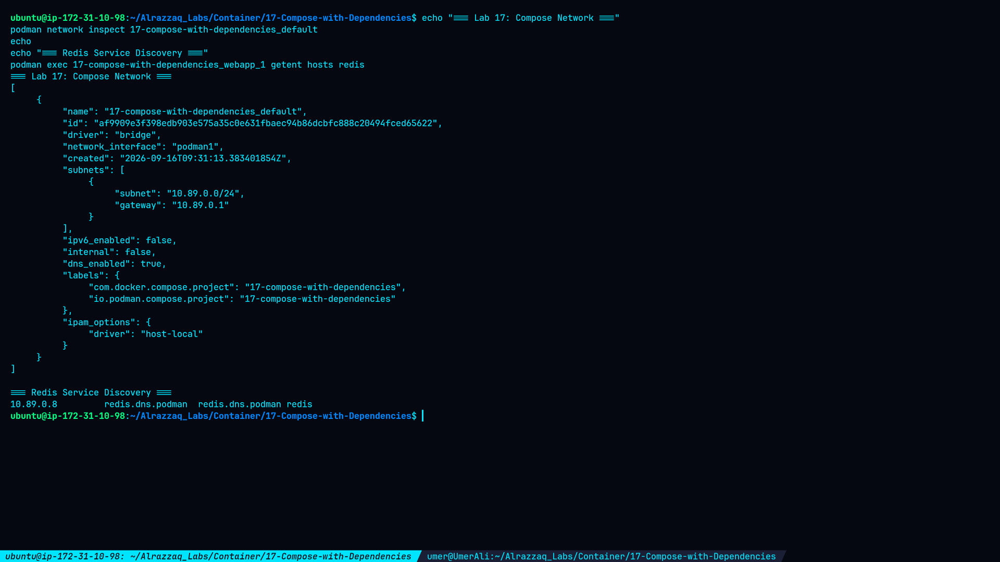

# Lab 17 — Compose with Dependencies

## Overview

This lab demonstrates how to manage service dependencies, container networking, service discovery, application-to-database connectivity, and multiple application replicas using Podman Compose and Podman.

The lab uses:

* **Redis** as the backend data store
* **Flask** as the web application
* `depends_on` for service dependency management
* A Podman Compose bridge network for service communication
* Three Flask webapp replicas for scaling
* Redis as a shared backend for all replicas

---

## Objectives

* Use `depends_on` to define service dependencies.
* Start Redis and Flask services together.
* Verify Flask-to-Redis connectivity.
* Use Compose service discovery through the `redis` hostname.
* Inspect the Compose network.
* Scale the Flask web application to three containers.
* Verify that all replicas can communicate with Redis.

---

## Environment

| Component        | Version / Configuration                |
| ---------------- | -------------------------------------- |
| Operating System | Ubuntu                                 |
| Podman           | 4.9.3                                  |
| Podman Compose   | 1.0.6                                  |
| Application      | Python Flask                           |
| Database         | Redis Alpine                           |
| Compose Network  | `17-compose-with-dependencies_default` |
| Network Subnet   | `10.89.0.0/24`                         |
| Application Port | `5000`                                 |
| Redis Port       | `6379`                                 |

---

# 1. Project Structure

The lab directory is:

```text
~/Alrazzaq_Labs/Container/17-Compose-with-Dependencies
```

Final structure:

```text
17-Compose-with-Dependencies/
├── Containerfile
├── requirements.txt
├── app/
│   └── app.py
├── podman-compose.yml
├── podman-compose-task3.yml
├── podman-compose-scale.yml
└── screenshots/
    ├── 01-compose-dependencies-config.png
    ├── 02-running-services.png
    ├── 03-flask-redis-functionality.png
    ├── 04-network-and-service-discovery.png
    └── 05-scaled-replicas-connectivity.png
```

---

# 2. Compose Dependency Configuration

The primary Compose configuration defines Redis and Flask.

```yaml
version: '3.8'

services:
  redis:
    image: docker.io/library/redis:alpine

  webapp:
    build: .
    ports:
      - "5000:5000"
    environment:
      REDIS_HOST: redis
    depends_on:
      - redis
```

The important dependency configuration is:

```yaml
depends_on:
  - redis
```

This establishes Redis as a dependency of the Flask web application.

### Evidence



---

# 3. Flask Application

The Flask application connects to Redis using the Compose service name:

```python
redis_host = os.environ.get("REDIS_HOST", "redis")
redis_client = redis.Redis(
    host=redis_host,
    port=6379,
    decode_responses=True
)
```

The application provides two endpoints.

### Root endpoint

```text
/
```

Each request increments the Redis `hits` counter.

### Health endpoint

```text
/health
```

The endpoint verifies that Flask can communicate with Redis.

---

# 4. Starting the Services

The application was successfully started with Podman Compose.

The final running services included:

```text
17-compose-with-dependencies_redis_1
17-compose-with-dependencies_webapp_1
```

The Flask application was exposed through:

```text
0.0.0.0:5000 -> 5000/tcp
```

The Flask logs confirmed:

```text
* Running on all addresses (0.0.0.0)
* Running on http://127.0.0.1:5000
* Running on http://10.89.0.7:5000
```

### Evidence



---

# 5. Flask and Redis Connectivity

The Flask health endpoint returned:

```text
Redis connection OK
```

The application was then accessed three times.

The responses were:

```text
Hello World! This page has been viewed 1 times.
Hello World! This page has been viewed 2 times.
Hello World! This page has been viewed 3 times.
```

The Redis database was queried directly:

```bash
podman exec 17-compose-with-dependencies_redis_1 redis-cli GET hits
```

Result:

```text
3
```

Redis was also tested directly:

```bash
podman exec 17-compose-with-dependencies_redis_1 redis-cli PING
```

Result:

```text
PONG
```

This confirmed that the Flask application was successfully storing and retrieving data from Redis.

### Evidence



---

# 6. Compose Network

Podman created the following Compose network:

```text
17-compose-with-dependencies_default
```

Network configuration:

```text
Driver:       bridge
Interface:    podman1
Subnet:       10.89.0.0/24
Gateway:      10.89.0.1
IPv6:         disabled
Internal:     false
DNS:          enabled
```

The network was inspected with:

```bash
podman network inspect 17-compose-with-dependencies_default
```

### Evidence



---

# 7. Service Discovery

The Flask container successfully resolved the Redis service using the hostname:

```text
redis
```

Command:

```bash
podman exec 17-compose-with-dependencies_webapp_1 getent hosts redis
```

Actual resolution:

```text
10.89.0.6 redis.dns.podman redis.dns.podman redis
```

This demonstrates that containers on the Compose network can communicate using the service name instead of a hard-coded IP address.

---

# 8. Scaling the Web Application

The Flask application was scaled to three independent containers.

The final replicas were:

```text
17-compose-with-dependencies_webapp_1
17-compose-with-dependencies_webapp_2
17-compose-with-dependencies_webapp_3
```

Container identifiers verified through their hostnames were:

```text
webapp_1 → 144b3f780888
webapp_2 → bb7642b4ca5a
webapp_3 → d8ae9f3ca579
```

Three separate container instances were therefore running simultaneously.

### Evidence


---

# 9. Replica Connectivity to Redis

Each webapp replica was individually tested against Redis.

Results:

```text
17-compose-with-dependencies_webapp_1
True

17-compose-with-dependencies_webapp_2
True

17-compose-with-dependencies_webapp_3
True
```

The `True` response from all three replicas confirms that every application instance could successfully establish a Redis connection.

---

# 10. Dependency Relationship

The final architecture can be represented as:

```text
                    Compose Network
                 10.89.0.0/24
                       │
          ┌────────────┴────────────┐
          │                         │
       Redis                    Flask Webapp
      :6379                         :5000
          │                         │
          │          ┌──────────────┼──────────────┐
          │          │              │              │
          │       webapp_1       webapp_2       webapp_3
          │          │              │              │
          └──────────┴──────────────┴──────────────┘
```

Redis acts as the shared backend for all Flask replicas.

---

# 11. Key Findings

1. `depends_on` successfully defined Redis as a dependency of the Flask application.
2. Flask successfully connected to Redis using the Compose service name `redis`.
3. Podman Compose created a dedicated bridge network with DNS enabled.
4. Redis service discovery worked through the hostname `redis`.
5. Redis correctly maintained the shared `hits` counter.
6. Three independent Flask webapp containers were successfully running.
7. All three replicas successfully connected to the same Redis service.
8. The application and backend services communicated through the Compose network without requiring hard-coded container IP addresses.

---

# 12. Troubleshooting During the Lab

During the lab, the Flask image build initially failed because `requirements.txt` was missing.

The build error was:

```text
COPY requirements.txt .
Error: ... requirements.txt: no such file or directory
```

The issue was corrected by creating:

```text
requirements.txt
```

with:

```text
flask
redis
```

A second issue was identified in the initial `Containerfile`, where the application was located at:

```text
app/app.py
```

but the Containerfile attempted:

```dockerfile
COPY app.py .
```

This was corrected to:

```dockerfile
COPY app/app.py .
```

After these corrections, the image built successfully and the Flask service started normally.

The initial scaling attempt with `podman-compose --scale` also stopped during container recreation. The existing webapp container was removed and the scaling objective was then completed using three Podman containers attached to the same Compose network.

---

# 13. Security and Operational Considerations

For production environments:

* Use a production WSGI server such as Gunicorn instead of Flask's development server.
* Do not expose Redis directly to untrusted networks.
* Use authentication and appropriate access controls for Redis.
* Store credentials using secrets rather than plaintext environment variables.
* Apply resource limits to application containers.
* Use health checks for service availability.
* Monitor container logs and resource usage.
* Keep base images updated.
* Use image scanning before deployment.
* Restrict unnecessary network exposure.

---

# 14. Evidence Gallery

## Compose Dependency Configuration


## Running Services


## Flask and Redis Functionality


## Network and Service Discovery


## Scaled Replicas and Redis Connectivity


---

# 15. Conclusion

This lab demonstrated service dependency management and multi-container application deployment using Podman Compose.

The completed environment successfully demonstrated:

```text
Compose dependency management
        ↓
Redis service
        ↓
Flask application
        ↓
Compose DNS/service discovery
        ↓
Shared Redis state
        ↓
Three Flask replicas
        ↓
Successful Redis connectivity from all replicas
```

The lab confirms practical understanding of container orchestration concepts including dependencies, networking, service discovery, shared backend services, and application scaling.
