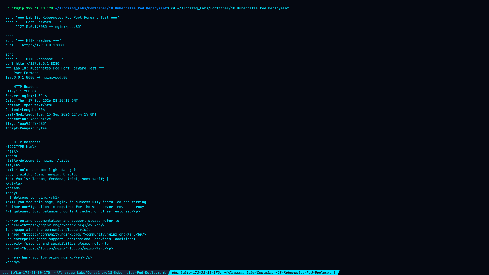
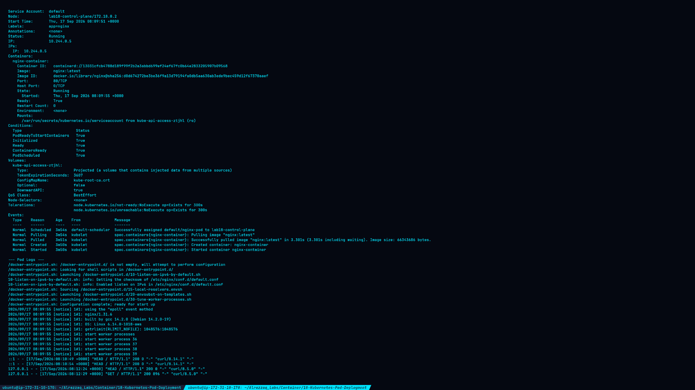
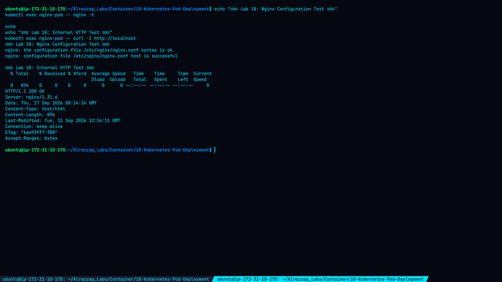
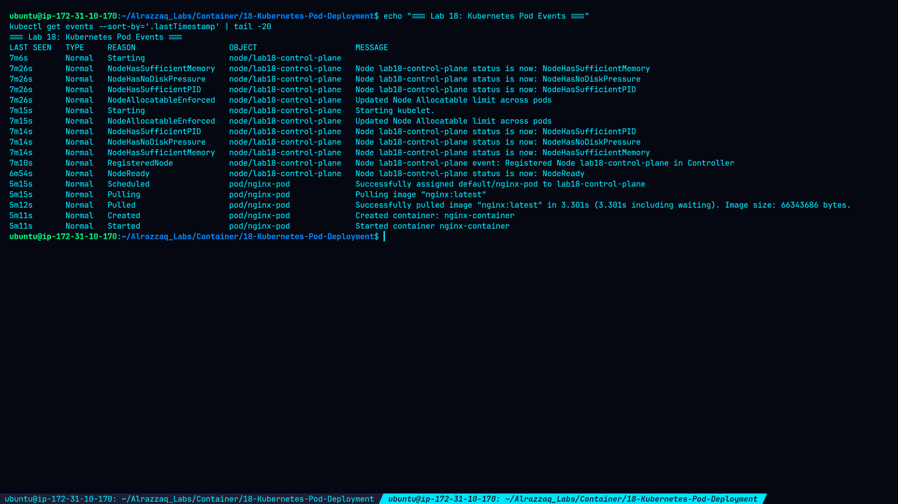

# Lab 18 — Kubernetes Pod Deployment

## Overview

This lab demonstrates the deployment and basic troubleshooting of a Kubernetes Pod using a YAML manifest. A local Kubernetes cluster was created with Kind, and an Nginx Pod was deployed using `kubectl`.

The lab covers:

* Kubernetes Pod YAML structure
* Pod deployment with `kubectl apply`
* Pod status and detailed inspection
* Kubernetes events
* Container logs
* Nginx configuration validation
* Internal HTTP testing
* Port forwarding and external HTTP testing

## Environment

| Component          | Version / Details     |
| ------------------ | --------------------- |
| Operating System   | Ubuntu                |
| Kubernetes CLI     | kubectl v1.36.2       |
| Kubernetes Cluster | Kind                  |
| Kind               | v0.30.0               |
| Kubernetes Version | v1.34.0               |
| Cluster Name       | `lab18`               |
| Kubernetes Context | `kind-lab18`          |
| Node               | `lab18-control-plane` |
| Container Runtime  | containerd            |
| Application        | Nginx 1.31.6          |

## Lab Directory

```text
~/Alrazzaq_Labs/Container/18-Kubernetes-Pod-Deployment/
```

## 1. Kubernetes Cluster Verification

The Kubernetes client was verified before starting the lab:

```bash
kubectl version --client
```

The installed client version was:

```text
Client Version: v1.36.2
Kustomize Version: v5.8.1
```

The Kind cluster was then created and verified:

```bash
kubectl cluster-info
kubectl get nodes
kubectl config current-context
```

The Kubernetes control plane was running at `https://127.0.0.1:40479`.

The cluster node was:

```text
lab18-control-plane   Ready   control-plane
```

The active context was:

```text
kind-lab18
```

## 2. Pod Manifest

The Pod was defined in `simple-pod.yaml`:

```yaml
apiVersion: v1
kind: Pod
metadata:
  name: nginx-pod
  labels:
    app: nginx
spec:
  containers:
  - name: nginx-container
    image: nginx:latest
    ports:
    - containerPort: 80
```

The manifest was validated with:

```bash
kubectl apply --dry-run=client -f simple-pod.yaml
```

Validation returned:

```text
pod/nginx-pod created (dry run)
```

## 3. Pod Deployment

The Pod was deployed using:

```bash
kubectl apply -f simple-pod.yaml
```

Result:

```text
pod/nginx-pod created
```

The Pod was verified with:

```bash
kubectl get pods -o wide
```

Actual result:

```text
NAME        READY   STATUS    RESTARTS   AGE   IP           NODE
nginx-pod   1/1     Running   0          6s    10.244.0.5   lab18-control-plane
```

The Pod successfully reached the `Running` state with one ready container and zero restarts.

## 4. Pod Inspection

Detailed Pod information was obtained using:

```bash
kubectl get pod nginx-pod -o yaml
kubectl describe pod nginx-pod
```

Important observed values included:

```text
Pod Name:       nginx-pod
Namespace:      default
Pod IP:         10.244.0.5
Node:           lab18-control-plane
Container:      nginx-container
Image:          nginx:latest
Image ID:       docker.io/library/nginx@sha256:d0d674272be3be36f9a13d79194fa0db5aa630ab3ede9bec459d12f67370aaef
Container ID:   containerd://13031cfcb4788d189f99f2b2a3abbd699ef24ef67fc0b64e2833205907b09568
Phase:          Running
Ready:          true
Restart Count:  0
```

## 5. Kubernetes Events

Pod lifecycle events were inspected with:

```bash
kubectl get events --sort-by='.lastTimestamp'
```

The important events showed the normal Kubernetes deployment sequence:

```text
Scheduled
Pulling
Pulled
Created
Started
```

The Nginx image was successfully pulled with an image size reported by Kubernetes of `66343686 bytes`.

The container was then created and started successfully.

## 6. Nginx Logs

The container logs were retrieved with:

```bash
kubectl logs nginx-pod
```

The logs confirmed successful Nginx initialization and startup.

The running Nginx version was:

```text
nginx/1.31.6
```

The logs also recorded a successful HTTP request:

```text
"HEAD / HTTP/1.1" 200
```

## 7. Nginx Configuration Verification

The Nginx configuration was tested from inside the Pod:

```bash
kubectl exec nginx-pod -- nginx -t
```

Result:

```text
nginx: the configuration file /etc/nginx/nginx.conf syntax is ok
nginx: configuration file /etc/nginx/nginx.conf test is successful
```

## 8. Internal HTTP Test

Nginx was tested from inside the container:

```bash
kubectl exec nginx-pod -- curl -I http://localhost
```

Actual response:

```text
HTTP/1.1 200 OK
Server: nginx/1.31.6
Content-Type: text/html
Content-Length: 896
Connection: keep-alive
```

This confirmed that Nginx was serving HTTP traffic correctly inside the Pod.

## 9. Port Forwarding

The Pod port was forwarded to the local host with:

```bash
kubectl port-forward pod/nginx-pod 8080:80
```

The forwarded service was tested with:

```bash
curl -I http://127.0.0.1:8080
```

The actual response was:

```text
HTTP/1.1 200 OK
Server: nginx/1.31.6
Content-Type: text/html
Content-Length: 896
```

A full HTTP request returned the standard Nginx welcome page.

This verified connectivity from the local host through the Kubernetes port-forward to the Nginx container.

## 10. Troubleshooting Observation

An additional port-forward attempt was made while port `8080` was already occupied by an existing port-forward process.

Kubernetes returned:

```text
Unable to listen on port 8080
bind: address already in use
```

The issue was caused by the local port already being in use, not by the Pod or Nginx service.

The existing port-forward process was terminated before continuing.

## Screenshots

### Screenshot 1 — Pod Deployment and Status


### Screenshot 2 — Pod Port Forward and HTTP Test



### Screenshot 3 — Pod Inspection and Logs



### Screenshot 4 — Nginx Container Verification



### Screenshot 5 — Pod Events



## Conclusion

The Kubernetes Pod deployment was successfully completed using a Kind-based Kubernetes cluster.

The lab demonstrated the complete basic Pod workflow:

1. Created and validated a Kubernetes Pod manifest.
2. Deployed an Nginx Pod with `kubectl apply`.
3. Verified the Pod reached `Running` state.
4. Inspected Pod configuration and runtime information.
5. Reviewed Kubernetes scheduling and container lifecycle events.
6. Inspected Nginx container logs.
7. Validated the Nginx configuration.
8. Tested HTTP connectivity inside the Pod.
9. Used Kubernetes port forwarding to access Nginx from the host.

The final Pod was running successfully with `1/1` ready container and `0` restarts.
