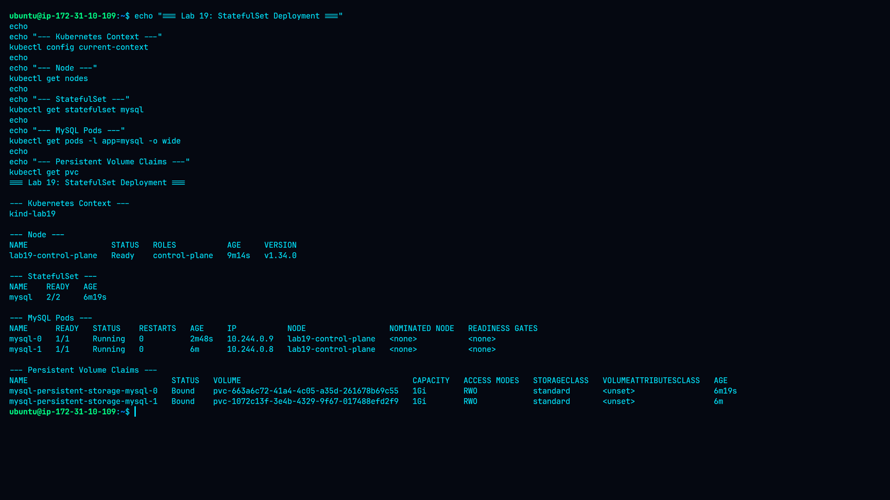
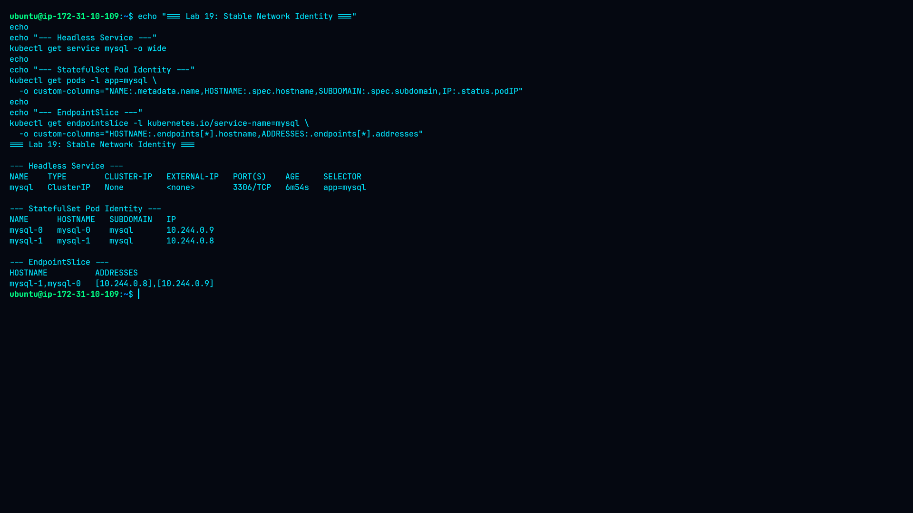
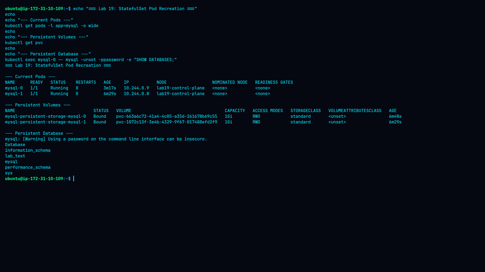
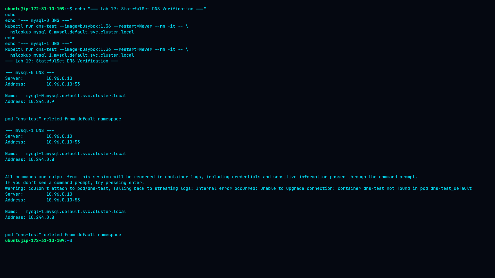

# Lab 19 — Deploying StatefulSets

## Overview

This lab demonstrates how to deploy and verify a Kubernetes `StatefulSet` for a stateful MySQL workload.

The lab focuses on:

* StatefulSet deployment
* Stable Pod identity
* Persistent storage using PVCs
* Headless Services
* StatefulSet DNS
* Pod recreation
* Data persistence after Pod deletion

## Environment

| Component           | Version / Value         |
| ------------------- | ----------------------- |
| Kubernetes          | v1.34.0                 |
| kubectl             | v1.36.2                 |
| Kind                | v0.30.0                 |
| Docker              | 29.6.0                  |
| Kind Cluster        | `lab19`                 |
| Kubernetes Context  | `kind-lab19`            |
| Node                | `lab19-control-plane`   |
| StorageClass        | `standard`              |
| Storage Provisioner | `rancher.io/local-path` |
| Database            | MySQL 8.0.46            |
| StatefulSet         | `mysql`                 |
| Replicas            | 2                       |

## Architecture

```text
                 ┌─────────────────────────┐
                 │   Headless Service      │
                 │         mysql           │
                 │    ClusterIP: None      │
                 └────────────┬────────────┘
                              │
                 ┌────────────┴────────────┐
                 │                         │
          ┌──────▼──────┐           ┌──────▼──────┐
          │   mysql-0   │           │   mysql-1   │
          │ MySQL 8.0.46│           │ MySQL 8.0.46│
          │   1Gi PVC   │           │   1Gi PVC   │
          └──────┬──────┘           └──────┬──────┘
                 │                         │
          mysql-0 PVC               mysql-1 PVC
```

## StatefulSet Configuration

The StatefulSet uses:

* 2 MySQL replicas
* A headless Service named `mysql`
* MySQL container port `3306`
* `volumeClaimTemplates`
* 1Gi persistent storage per replica
* `ReadWriteOnce` access mode
* `standard` StorageClass

The StatefulSet automatically creates:

```text
mysql-0
mysql-1
```

and corresponding PVCs:

```text
mysql-persistent-storage-mysql-0
mysql-persistent-storage-mysql-1
```

## Deployment Results

The StatefulSet deployed successfully.

Final Pod state:

```text
mysql-0   1/1   Running
mysql-1   1/1   Running
```

Both PersistentVolumeClaims were successfully bound:

```text
mysql-persistent-storage-mysql-0   Bound   1Gi   RWO   standard
mysql-persistent-storage-mysql-1   Bound   1Gi   RWO   standard
```

## Stable Pod Identity

The StatefulSet provided stable identities:

```text
mysql-0
mysql-1
```

The Pods used the `mysql` subdomain associated with the headless Service.

The Pod IP of `mysql-0` changed after it was deleted and recreated, while its StatefulSet identity remained `mysql-0`.

This demonstrates the difference between:

* Stable StatefulSet identity
* Ephemeral Pod IP addresses

## Persistent Storage Verification

MySQL version verified:

```text
8.0.46
```

A test database named:

```text
lab_test
```

was created on `mysql-0`.

The `mysql-0` Pod was then deleted.

The StatefulSet automatically recreated `mysql-0`.

After recreation, the `lab_test` database was still present.

This confirmed that the database data was stored on the PersistentVolume rather than only inside the deleted container.

## DNS Verification

The headless Service successfully provided StatefulSet DNS records.

Verified FQDNs:

```text
mysql-0.mysql.default.svc.cluster.local
mysql-1.mysql.default.svc.cluster.local
```

They resolved to the current Pod IP addresses:

```text
mysql-0.mysql.default.svc.cluster.local -> 10.244.0.9
mysql-1.mysql.default.svc.cluster.local -> 10.244.0.8
```

The fully qualified DNS names were used for the final verification.

## Evidence

### StatefulSet, Pods and PVCs



### Headless Service and Stable Identity



### MySQL Persistence


### Pod Recreation and Persistence



### StatefulSet DNS



## Key Findings

1. StatefulSet successfully deployed two MySQL replicas.
2. Each replica received its own PersistentVolumeClaim.
3. PVCs remained bound to their respective StatefulSet identities.
4. Pod names remained stable after Pod recreation.
5. Pod IP addresses were not permanent.
6. The headless Service provided stable DNS-based discovery.
7. MySQL data persisted after deleting and recreating `mysql-0`.
8. Fully qualified StatefulSet DNS names resolved successfully.

## Conclusion

The lab successfully demonstrated the core characteristics of Kubernetes StatefulSets: stable identity, persistent storage, ordered StatefulSet-managed Pods, and DNS-based service discovery.

The persistence test confirmed that application data survived Pod deletion because the database used persistent storage provided through `volumeClaimTemplates`.
