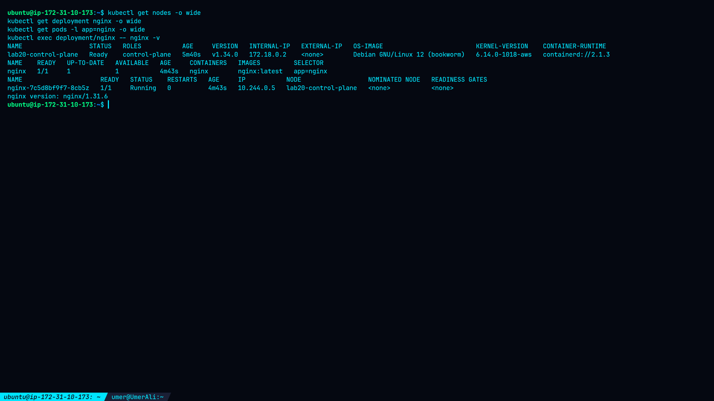
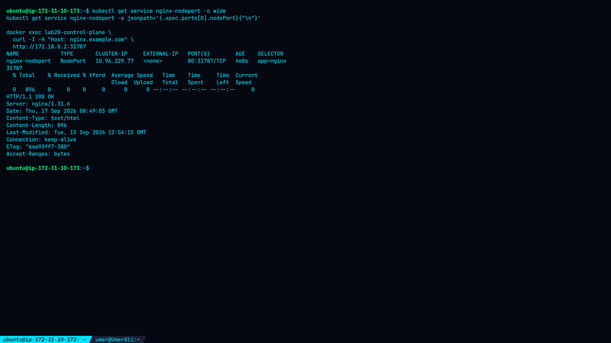
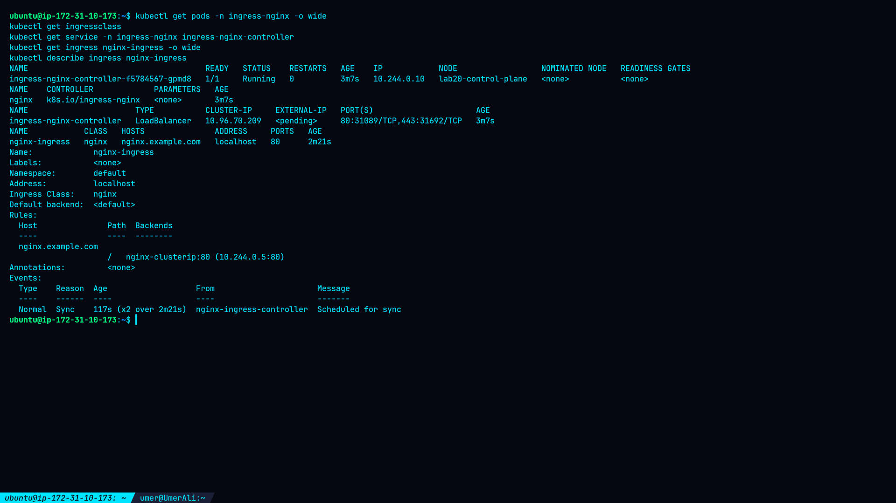

# Lab 20 — Service and Ingress Setup

## Overview

This lab demonstrates how Kubernetes Services and Ingress provide different methods for exposing an application.

The lab uses an Nginx Deployment running on a single-node Kind Kubernetes cluster and demonstrates:

* ClusterIP for internal application access
* NodePort for node-level service exposure
* Ingress-NGINX for HTTP host-based routing
* Functional validation using `curl`
* Verification of Kubernetes service endpoints and ingress routing

The Kubernetes implementation was used for this lab rather than the OpenShift Route implementation.

---

## Objectives

* Deploy an Nginx application to Kubernetes.
* Expose the application internally using a ClusterIP Service.
* Expose the application through a NodePort Service.
* Install and configure the Ingress-NGINX controller.
* Create an Ingress resource using a hostname.
* Validate application accessibility through each exposure method.
* Document the resulting configuration and security considerations.

---

## Environment

| Component               | Actual Result         |
| ----------------------- | --------------------- |
| Host                    | `ip-172-31-10-173`    |
| Kubernetes distribution | Kind                  |
| Kind version            | `v0.30.0`             |
| Kubernetes version      | `v1.34.0`             |
| kubectl version         | `v1.36.2`             |
| Node                    | `lab20-control-plane` |
| Node status             | Ready                 |
| Node internal IP        | `172.18.0.2`          |
| Container runtime       | `containerd://2.1.3`  |
| OS inside Kind node     | Debian GNU/Linux 12   |
| Application             | Nginx                 |
| Nginx version           | `1.31.6`              |

---

## Architecture

```text
                         Kubernetes Cluster
                                |
                    lab20-control-plane
                         172.18.0.2
                                |
                         Nginx Deployment
                                |
                     nginx-7c5d8bf9f7-8cb5z
                         10.244.0.5:80
                         /           \
                        /             \
               ClusterIP             NodePort
            10.96.210.14            31787
                    |                    |
                    |                    |
                    +---------+----------+
                              |
                         Nginx Application

                         Ingress Layer
                              |
                    Ingress-NGINX Controller
                       10.244.0.10
                              |
                       nginx.example.com
                              |
                       nginx-clusterip:80
                              |
                         Nginx Application
```

---

## 1. Nginx Deployment

The application was deployed using:

```bash
kubectl create deployment nginx --image=nginx:latest
kubectl rollout status deployment/nginx
```

The deployment reached:

```text
READY   UP-TO-DATE   AVAILABLE
1/1     1            1
```

The running pod was:

```text
nginx-7c5d8bf9f7-8cb5z
```

with IP:

```text
10.244.0.5
```

Nginx version:

```text
nginx version: nginx/1.31.6
```

---

## 2. ClusterIP Service

The deployment was exposed internally through a ClusterIP Service:

```text
Service:     nginx-clusterip
Type:        ClusterIP
ClusterIP:   10.96.210.14
Port:        80/TCP
Endpoint:    10.244.0.5:80
```

The service selector was:

```text
app=nginx
```

An internal test from a temporary curl container returned:

```text
HTTP/1.1 200 OK
Server: nginx/1.31.6
```

The Nginx response body was also successfully retrieved.

---

## 3. NodePort Service

A NodePort Service was created:

```text
Service:     nginx-nodeport
Type:        NodePort
ClusterIP:   10.96.229.77
Service:     80/TCP
NodePort:    31787
Endpoint:    10.244.0.5:80
```

The NodePort was tested through the Kind control-plane node:

```text
172.18.0.2:31787
```

The test returned:

```text
HTTP/1.1 200 OK
```

The Nginx welcome page was successfully returned.

---

## 4. Ingress-NGINX

The Ingress-NGINX controller was installed using the Kind-compatible deployment manifest.

The controller reached:

```text
READY   STATUS
1/1     Running
```

Actual controller pod:

```text
ingress-nginx-controller-f5784567-gpmd8
```

Pod IP:

```text
10.244.0.10
```

The available IngressClass was:

```text
nginx
```

The controller Service exposed:

```text
HTTP:   31089
HTTPS:  31692
```

The controller Service had:

```text
ClusterIP: 10.96.70.209
External-IP: <pending>
```

The pending external IP is expected in this Kind-based environment because a cloud LoadBalancer implementation is not being used.

---

## 5. Ingress Resource

The following hostname-based Ingress was configured:

```text
Host:       nginx.example.com
Path:       /
IngressClass: nginx
Backend:    nginx-clusterip:80
```

The Kubernetes Ingress reported:

```text
Address: localhost
```

The controller successfully synchronized the resource.

---

## 6. Ingress Validation

The Ingress was tested through the Ingress-NGINX HTTP NodePort:

```text
127.0.0.1:31089
```

with the required HTTP Host header:

```text
Host: nginx.example.com
```

The result was:

```text
HTTP/1.1 200 OK
Content-Type: text/html
Content-Length: 896
```

The response body contained:

```html
<title>Welcome to nginx!</title>
```

This confirmed that the request was successfully routed through the Ingress controller to the ClusterIP Service and then to the Nginx pod.

---

## 7. Validation Summary

| Exposure Method | Address                       | Result   |
| --------------- | ----------------------------- | -------- |
| ClusterIP       | `10.96.210.14:80`             | HTTP 200 |
| NodePort        | `172.18.0.2:31787`            | HTTP 200 |
| Ingress         | `nginx.example.com` → `31089` | HTTP 200 |

---

## 8. Evidence

### Cluster and Nginx Deployment



### ClusterIP Service and Test


### NodePort Service and Test



### Ingress Controller and Resource



### Ingress HTTP Test


---

## 9. Key Findings

* The Nginx Deployment successfully ran with one available replica.
* The ClusterIP Service successfully provided internal access.
* The NodePort Service successfully exposed Nginx through port `31787`.
* The Ingress-NGINX controller successfully started.
* The `nginx` IngressClass was available.
* The `nginx-ingress` resource successfully synchronized.
* Host-based routing using `nginx.example.com` successfully reached the Nginx application.
* All three tested exposure paths returned HTTP `200 OK`.

---

## 10. Kubernetes Networking Concepts Demonstrated

### ClusterIP

ClusterIP provides an internal virtual IP for communication between workloads inside the Kubernetes cluster.

### NodePort

NodePort exposes a Service through a port on the Kubernetes node.

### Ingress

Ingress provides HTTP/HTTPS routing based on hostnames and paths and can route requests to Kubernetes Services.

### Ingress Controller

The Ingress resource itself does not process HTTP traffic. The Ingress-NGINX controller watches the Ingress resource and performs the actual routing.

---

## Conclusion

This lab successfully demonstrated three Kubernetes application exposure mechanisms: ClusterIP, NodePort, and Ingress.

The Nginx application was successfully reached through internal service discovery, NodePort access, and hostname-based Ingress routing. Each tested path returned HTTP `200 OK`, confirming successful service exposure and request routing.
