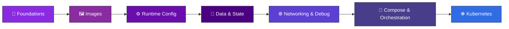

<div align="center">


<br/>


<br/>


</div>

<p align="center">
  <a href="#-about-this-repository">About</a> •
  <a href="#-prerequisites">Prerequisites</a> •
  <a href="#-quick-start">Quick Start</a> •
  <a href="#️-learning-path">Learning Path</a> •
  <a href="#-lab-index">Lab Index</a> •
  <a href="#-progress-overview">Progress</a> •
  <a href="#️-tech-stack">Tech Stack</a> •
  <a href="#-repository-structure">Structure</a> •
  <a href="#-faq">FAQ</a> •
  <a href="#-contributing">Contributing</a> •
  <a href="#-license">License</a>
</p>

---

## 📖 About This Repository

Welcome to the **Podman Mastery Labs** — a hands-on, progressively structured series of labs that take you from *"what is a container?"* all the way to debugging, networking, orchestrating multi-container apps with Compose, and deploying to Kubernetes.

Every lab lives in its own folder, has its own `README.md`, and builds directly on the skills from the one before it. No fluff — just practical exercises you run yourself.

**Why this repo?**

- 🎯 **Progressive difficulty** — each lab builds on the last, so you never hit a concept you weren't prepared for.
- 🧪 **Hands-on only** — every lab is something you *run*, not just read. Break it, debug it, learn from it.
- 🧭 **Self-contained labs** — jump into any module once you've covered the fundamentals; each folder has everything it needs.
- ☸️ **Real-world path** — goes beyond `podman run` into volumes, networking, Compose, and a full path to Kubernetes.

<div align="center">

</div>

---

## ✅ Prerequisites

| Requirement | Notes |
|---|---|
| **Podman** ≥ 4.0 | [Install guide](https://podman.io/docs/installation) — Linux, macOS (via machine), or WSL2 on Windows |
| **Basic Linux/CLI comfort** | You should be able to navigate directories and edit text files |
| **Git** | To clone this repo and track your progress |
| **`podman-compose`** or **Docker Compose v2** | Needed from Module 6 onward |
| **A Kubernetes cluster** (`kind`, `minikube`, or `k3d`) | Only needed for Module 7 (Labs 18–20) |

> No prior container experience required for Module 1 — that's exactly what it's there to teach.

---

## 🚀 Quick Start

```bash
# Clone the repository
git clone https://github.com/<your-username>/<your-repo>.git
cd <your-repo>

# Jump into Lab 1
cd 01-Introduction-to-Containers
cat README.md
```

> 💡 **Tip:** Work through the labs in order — each one assumes you've completed the previous.

### 📂 How each lab is structured

Every lab folder follows the same pattern so you always know what to expect:

```text
NN-Lab-Name/
├── README.md        # Objectives, step-by-step instructions, and explanations
├── Containerfile     # (where relevant) the image definition used in the lab
└── solutions/        # Reference answers — try it yourself first!
```

---

## 🗺️ Learning Path

<div align="center">



</div>

---

## 📚 Lab Index

<details open>
<summary><b>🧱 Module 1 — Foundations</b></summary>
<br/>

| # | Lab | Description | Status |
|---|-----|-------------|:------:|
| 01 | [Introduction to Containers](./01-Introduction-to-Containers) | Container fundamentals & core concepts | ✅ |
| 02 | [Exploring Podman CLI](./02-Exploring-Podman-CLI) | Getting comfortable with the `podman` command | ✅ |
| 03 | [Running Containers with Podman](./03-Running-Containers-with-Podman) | Launching and managing your first containers | ✅ |
| 04 | [Creating and Managing Pods](./04-Creating-and-Managing-Pods) | Group containers into Podman pods | ✅ |

</details>

<details open>
<summary><b>🖼️ Module 2 — Images</b></summary>
<br/>

| # | Lab | Description | Status |
|---|-----|-------------|:------:|
| 05 | [Managing Container Images](./05-Managing-Container-Images) | Pulling, tagging, and inspecting images | ✅ |
| 06 | [Building Custom Container Images](./06-Building-Custom-Container-Images) | Writing Containerfiles from scratch | ✅ |
| 07 | [Layer Caching and Optimization](./07-Layer-Caching-and-Optimization) | Faster, leaner image builds | ✅ |

</details>

<details open>
<summary><b>⚙️ Module 3 — Runtime Configuration</b></summary>
<br/>

| # | Lab | Description | Status |
|---|-----|-------------|:------:|
| 08 | [Environment Variables in Images](./08-Environment-Variables-in-Images) | Configuring containers at runtime | ✅ |
| 09 | [Using ENTRYPOINT and CMD](./09-Using-ENTRYPOINT-and-CMD) | Controlling container startup behavior | ✅ |

</details>

<details open>
<summary><b>💾 Module 4 — Data & State</b></summary>
<br/>

| # | Lab | Description | Status |
|---|-----|-------------|:------:|
| 10 | [Persisting Data with Volumes](./10-Persisting-Data-with-Volumes) | Keeping data alive beyond the container | ✅ |
| 11 | [Running Stateful Containers](./11-Running-Stateful-Containers) | Databases & stateful workloads | ✅ |
| 12 | [Backup and Restore Data](./12-Backup-and-Restore-Data) | Protecting your persistent volumes | ✅ |

</details>

<details open>
<summary><b>🌐 Module 5 — Networking & Debugging</b></summary>
<br/>

| # | Lab | Description | Status |
|---|-----|-------------|:------:|
| 13 | [Troubleshooting Containers](./13-Troubleshooting-Containers) | Diagnosing common container issues | ✅ |
| 14 | [Networking in Containers](./14-Networking-in-Containers) | Container-to-container communication | ✅ |
| 15 | [Remote Debugging of Containers](./15-Remote-Debugging-of-Containers) | Attaching debuggers to running containers | ✅ |

</details>

<details open>
<summary><b>🧩 Module 6 — Compose & Orchestration</b></summary>
<br/>

| # | Lab | Description | Status |
|---|-----|-------------|:------:|
| 16 | [Compose Basics](./16-Compose-Basics) | Defining multi-container apps declaratively | ✅ |
| 17 | [Compose with Dependencies](./17-Compose-with-Dependencies) | Managing service dependencies & startup order | ✅ |

</details>

<details open>
<summary><b>☸️ Module 7 — Kubernetes Integration</b></summary>
<br/>

| # | Lab | Description | Status |
|---|-----|-------------|:------:|
| 18 | [Kubernetes Pod Deployment](./18-Kubernetes-Pod-Deployment) | Generating and deploying Kubernetes manifests from Podman pods | ✅ |
| 19 | [Deploying StatefulSets](./19-Deploying-StatefulSets) | Running stateful workloads on Kubernetes | ✅ |
| 20 | [Service and Ingress Setup](./20-Service-and-Ingress-Setup) | Exposing workloads with Services and Ingress | ✅ |

</details>

---

## 📊 Progress Overview

<div align="center">

)

</div>

| Category | Labs | Progress |
|----------|:----:|----------|
| 🧱 Foundations | 4 | ████████████████████ 100% |
| 🖼️ Images | 3 | ████████████████████ 100% |
| ⚙️ Runtime Config | 2 | ████████████████████ 100% |
| 💾 Data & State | 3 | ████████████████████ 100% |
| 🌐 Networking & Debug | 3 | ████████████████████ 100% |
| 🧩 Compose | 2 | ████████████████████ 100% |
| ☸️ Kubernetes | 3 | ████████████████████ 100% |

---

## 🛠️ Tech Stack

<div align="center">


</div>

---

## 📁 Repository Structure

```text
.
├── 01-Introduction-to-Containers/
├── 02-Exploring-Podman-CLI/
├── 03-Running-Containers-with-Podman/
├── 04-Creating-and-Managing-Pods/
├── 05-Managing-Container-Images/
├── 06-Building-Custom-Container-Images/
├── 07-Layer-Caching-and-Optimization/
├── 08-Environment-Variables-in-Images/
├── 09-Using-ENTRYPOINT-and-CMD/
├── 10-Persisting-Data-with-Volumes/
├── 11-Running-Stateful-Containers/
├── 12-Backup-and-Restore-Data/
├── 13-Troubleshooting-Containers/
├── 14-Networking-in-Containers/
├── 15-Remote-Debugging-of-Containers/
├── 16-Compose-Basics/
├── 17-Compose-with-Dependencies/
├── 18-Kubernetes-Pod-Deployment/
├── 19-Deploying-StatefulSets/
├── 20-Service-and-Ingress-Setup/
└── README.md
```

---

## ❓ FAQ

<details>
<summary><b>Do I need Docker installed too?</b></summary>
<br/>
No. Every lab uses <code>podman</code> and, from Module 6 onward, <code>podman-compose</code>. If you only have Docker, most commands are drop-in compatible — just swap <code>podman</code> for <code>docker</code> — but this isn't tested against the Docker daemon.
</details>

<details>
<summary><b>Can I skip ahead to a specific module?</b></summary>
<br/>
You can, but it's not recommended. Later labs assume the environment and concepts set up in earlier ones (e.g., Module 4 assumes you're comfortable building images from Module 2). If you skip ahead, at least skim the READMEs of the labs you missed.
</details>

<details>
<summary><b>My container won't start — where do I look first?</b></summary>
<br/>
Head to <a href="./13-Troubleshooting-Containers">Lab 13 — Troubleshooting Containers</a>. It covers the standard diagnostic flow: <code>podman logs</code>, <code>podman inspect</code>, exit codes, and common Containerfile mistakes.
</details>

<details>
<summary><b>Do the Kubernetes labs require a cloud account?</b></summary>
<br/>
No — Labs 18–20 are designed to run against a local cluster (<code>kind</code>, <code>minikube</code>, or <code>k3d</code>). No cloud provider or billing is required.
</details>

<details>
<summary><b>I found a bug in a lab. What do I do?</b></summary>
<br/>
Please open an issue with the lab number, the command you ran, and the output you got. Pull requests fixing the issue directly are even more welcome — see <a href="#-contributing">Contributing</a> below.
</details>

---

## 🤝 Contributing

Contributions, fixes, and new lab ideas are welcome — this project grows with community input.

| Type | How to contribute |
|---|---|
| 🐛 **Bug fix** | Open a PR against the affected lab's folder |
| ✍️ **Typo / doc improvement** | PRs welcome, no issue needed |
| 🧪 **New lab idea** | Open an issue first to discuss scope before building it out |
| 💬 **Question** | Use GitHub Discussions or open an issue tagged `question` |

**Steps:**

1. Fork the repo
2. Create a feature branch (`git checkout -b lab/21-new-topic`)
3. Commit your changes with clear, descriptive messages
4. Make sure any new lab follows the [standard structure](#-how-each-lab-is-structured)
5. Open a Pull Request describing what you added or fixed

---

## ⭐ Star History

<div align="center">

[](https://star-history.com/#<your-username>/<your-repo>&Date)

</div>

---

## 📄 License

Distributed under the **MIT License**. See `LICENSE` for more information.

---

<div align="center">

### ⭐ If this helped you learn Podman, consider starring the repo!


</div>
