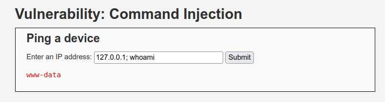
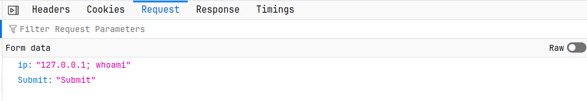
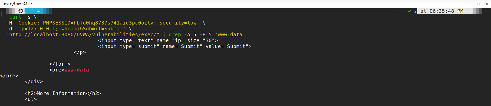

# Findings – DVWA Command Injection

## 1. Finding Summary

| Field               | Details                       |
| ------------------- | ----------------------------- |
| Finding             | OS Command Injection          |
| Severity            | High                          |
| Target              | DVWA                          |
| Endpoint            | `/DVWA/vulnerabilities/exec/` |
| Parameter           | `ip`                          |
| Security Level      | Low                           |
| Status              | Confirmed                     |
| Testing Environment | Controlled Local Lab          |

---

## 2. Vulnerability Description

The DVWA Command Injection functionality accepts user-controlled input through the `ip` parameter and passes that input to an operating system command without sufficient input validation.

This allows an attacker to manipulate the parameter and append an additional operating system command.

---

## 3. Attack Payload

The following controlled payload was used:

```text
127.0.0.1; whoami
```

The semicolon was used to separate the original input from the additional command.

---

## 4. Evidence

The injected command successfully executed and returned:

```text
www-data
```

This confirms that the application executed an attacker-controlled operating system command.

### Screenshot Evidence







---

## 5. Technical Impact

Successful exploitation of Command Injection can allow an attacker to execute commands with the privileges of the web application.

Potential consequences include:

* Unauthorized OS command execution
* Sensitive file access
* File modification or deletion
* System reconnaissance
* Access to application/server information
* Potential privilege escalation
* Further compromise of the affected host

In this lab, the command executed with the privileges of:

```text
www-data
```

---

## 6. Root Cause

The primary root cause is insufficient validation and unsafe handling of user-controlled input.

The application treats the `ip` parameter as trusted input and incorporates it into an operating system command.

No effective control prevented the command separator from being interpreted by the shell.

---

## 7. Risk Assessment

**Severity: High**

The vulnerability is considered high risk because successful exploitation can provide direct operating system command execution.

The overall impact depends on the privileges available to the web server process and the security controls protecting the underlying system.

---

## 8. Recommended Remediation

The application should:

1. Avoid executing operating system commands whenever possible.
2. Use safe native application functions instead of shell commands.
3. Validate the `ip` parameter using strict allowlist validation.
4. Accept only valid IP addresses.
5. Prevent user input from being interpreted as shell syntax.
6. Apply least-privilege permissions to the web server account.
7. Monitor application and system logs for suspicious command execution.
8. Use additional isolation and security controls to limit the impact of exploitation.

---

## 9. Validation Result

| Test                     | Result     |
| ------------------------ | ---------- |
| Normal IP input          | Accepted   |
| Command separator tested | Accepted   |
| `whoami` executed        | Yes        |
| Command output           | `www-data` |
| Vulnerability            | Confirmed  |

---

## 10. Conclusion

The DVWA Command Injection vulnerability was successfully identified and validated in a controlled local environment.

The test demonstrated that attacker-controlled input could be used to execute an additional operating system command, resulting in the output:

```text
www-data
```

This confirms the presence of an OS Command Injection vulnerability and highlights the importance of strict input validation, safe command handling, and least-privilege security controls.
