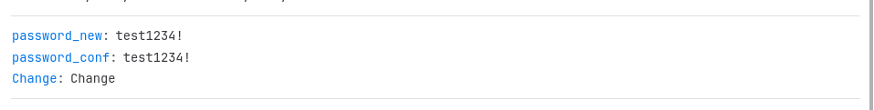
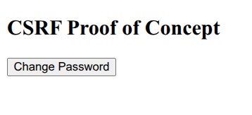

# DVWA – Cross-Site Request Forgery (CSRF)

## 1. Overview

This lab demonstrates a **Cross-Site Request Forgery (CSRF)** vulnerability in Damn Vulnerable Web Application (DVWA).

CSRF occurs when an attacker can cause an authenticated user's browser to perform an unwanted action on a web application because the application does not sufficiently verify that the request was intentionally initiated by the user.

In this lab, the vulnerable functionality allows an authenticated user to change their password through the CSRF page.

---

## 2. Lab Information

| Category            | Details                                |
| ------------------- | -------------------------------------- |
| Application         | Damn Vulnerable Web Application (DVWA) |
| Vulnerability       | Cross-Site Request Forgery (CSRF)      |
| Security Level      | Low                                    |
| Target              | `http://localhost:8080/DVWA/`          |
| Vulnerable Endpoint | `/DVWA/vulnerabilities/csrf/`          |
| HTTP Method         | GET                                    |
| Environment         | Localhost / Isolated Lab               |

---

## 3. Objective

The objectives of this lab were to:

* Identify the CSRF vulnerability.
* Analyze the password-change request.
* Observe the parameters transmitted to the server.
* Understand how an authenticated session can be abused.
* Capture network evidence.
* Document the security impact.
* Identify appropriate remediation techniques.

---

## 4. Vulnerable Functionality

The vulnerable page provides a password-change form containing:

```text
New password
Confirm password
Change
```

The request observed during testing contained:

```text
password_new=test1234!
password_conf=test1234!
Change=Change
```

The application processed the request while the authenticated DVWA session was active.

---

## 5. Testing Process

The testing workflow was:

```text
Open DVWA
    ↓
Set Security Level to Low
    ↓
Open CSRF module
    ↓
Enter controlled test password
    ↓
Submit password-change form
    ↓
Open Browser Developer Tools
    ↓
Inspect Network request
    ↓
Analyze request parameters
    ↓
Document vulnerability
```

---

## 6. Request Analysis

The captured request used:

```text
GET /DVWA/vulnerabilities/csrf/
```

with parameters:

```text
password_new=test1234!
password_conf=test1234!
Change=Change
```

The request also contained the authenticated session cookie.

This is important because the server uses the existing authenticated session to associate the request with the logged-in user.

---

## 7. Evidence

### Evidence 1 – Captured CSRF Request

The following screenshot shows the password-change request captured through the browser Network panel.



**Observed evidence:**

* CSRF endpoint
* GET request
* Password parameters
* Authenticated session
* HTTP response
* Security level

---

### Evidence 2 – CSRF Proof of Concept

The following screenshot documents the controlled proof-of-concept used during testing.



**Observed evidence:**

* Password-change parameters
* Target endpoint
* Request structure
* Controlled CSRF testing

---

## 8. Vulnerability Analysis

The application performs a sensitive account operation using a GET request.

The request does not contain an unpredictable CSRF token such as:

```text
csrf_token=<random-value>
```

A secure implementation should require a CSRF token and validate it on the server before processing the password change.

---

## 9. Attack Scenario

A typical CSRF attack can be represented as:

```text
Attacker
   ↓
Crafted Request
   ↓
Victim's Browser
   ↓
Existing Authentication Session
   ↓
DVWA Server
   ↓
Password Change
```

The attacker attempts to abuse the victim's existing authenticated session rather than directly obtaining the victim's password.

---

## 10. Security Impact

Potential impact includes:

### Account Modification

An attacker may attempt to cause an authenticated user to change their password without their knowledge.

### Account Lockout

The legitimate user could potentially lose access to their account if the password is changed.

### Unauthorized Actions

The same weakness could affect other sensitive account-management functions if similar protections are missing.

Potentially affected functionality could include:

* Password changes
* Email changes
* Security settings
* Account preferences
* Other state-changing operations

---

## 11. Root Cause

The primary causes are:

1. Lack of a strong CSRF token.
2. Use of GET for a state-changing operation.
3. Insufficient verification of request origin.
4. Reliance on the authenticated session alone.

---

## 12. Recommended Remediation

The application should:

* Implement unpredictable CSRF tokens.
* Validate CSRF tokens server-side.
* Use POST for password-changing operations.
* Configure appropriate SameSite cookie protections.
* Validate Origin/Referer headers as defense-in-depth.
* Require re-authentication for highly sensitive operations.
* Monitor unusual password-change activity.

---

## 13. Secure Request Design

Instead of:

```text
GET /change-password?password_new=...
```

use:

```text
POST /change-password
```

with:

```text
password_new=<password>
password_conf=<password>
csrf_token=<random-token>
```

The server should verify the CSRF token before modifying the account.

---

## 14. Verification After Remediation

After applying the fixes, the following tests should be performed:

| Test                              | Expected Result  |
| --------------------------------- | ---------------- |
| Valid CSRF token                  | Request accepted |
| Missing CSRF token                | Request rejected |
| Invalid CSRF token                | Request rejected |
| Expired CSRF token                | Request rejected |
| Unauthorized cross-origin request | Request rejected |

---

## 15. Lessons Learned

This lab demonstrated that:

* Authentication does not automatically prevent CSRF.
* CSRF abuses an already authenticated browser session.
* State-changing actions should not use GET.
* CSRF tokens provide important protection.
* Server-side validation is essential.
* Sensitive account operations require stronger security controls.

---

## 16. Conclusion

The DVWA CSRF lab demonstrated a weakness in the password-change functionality where a sensitive state-changing request could be processed without a strong CSRF protection mechanism.

The primary remediation is to implement **CSRF tokens, use POST for state-changing operations, validate requests server-side, configure secure cookies, and apply additional authentication controls for sensitive actions**.

This lab provided practical experience in identifying, analyzing, documenting, and remediating a CSRF vulnerability in a controlled web-application environment.
