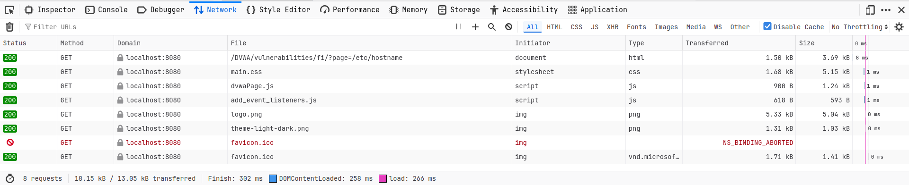
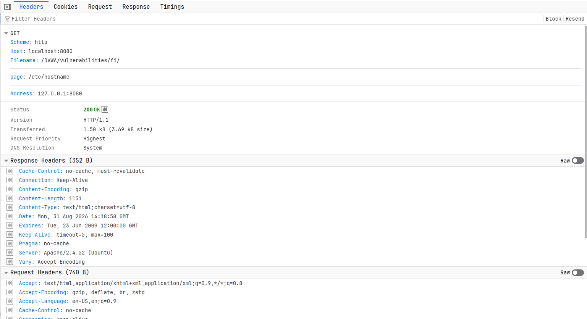

# Findings – DVWA Local File Inclusion (LFI)

## 1. Finding Overview

| Field               | Details                     |
| ------------------- | --------------------------- |
| Finding ID          | DVWA-LFI-001                |
| Vulnerability       | Local File Inclusion (LFI)  |
| Target              | DVWA                        |
| Endpoint            | `/DVWA/vulnerabilities/fi/` |
| Parameter           | `page`                      |
| HTTP Method         | GET                         |
| Security Level      | Low                         |
| Status              | Confirmed                   |
| Primary Impact      | Local File Disclosure       |
| Testing Environment | Local / Isolated Lab        |

---

## 2. Vulnerability Description

The DVWA File Inclusion functionality allows user-controlled input to influence which file is processed by the application.

The vulnerable parameter identified during testing was:

```text
page
```

The normal application request used:

```text
page=file1.php
```

During controlled testing, the parameter was changed to:

```text
page=/etc/hostname
```

The application processed the supplied local path and returned a successful response.

This behavior confirms that the application does not sufficiently restrict the `page` parameter to approved application resources.

---

## 3. Affected Endpoint

```text
GET /DVWA/vulnerabilities/fi/
```

Affected parameter:

```text
page
```

Normal request:

```text
GET /DVWA/vulnerabilities/fi/?page=file1.php
```

Controlled LFI request:

```text
GET /DVWA/vulnerabilities/fi/?page=/etc/hostname
```

---

## 4. Proof of Concept

The following controlled test was performed:

```text
page=/etc/hostname
```

The resulting request returned:

```text
HTTP/1.1 200 OK
```

The local file was processed by the application.

This demonstrates that the user-controlled `page` parameter can influence local file selection.

---

## 5. Evidence

### Evidence 1 – LFI Result

The first screenshot documents the application result after supplying the local file path.



**Observation:**

The application processed the supplied local file path and displayed the resulting content.

---

### Evidence 2 – Network Request

The second screenshot documents the request captured using Firefox Developer Tools.



**Observed request:**

```text
GET /DVWA/vulnerabilities/fi/?page=/etc/hostname
```

**Response:**

```text
HTTP/1.1 200 OK
```

This provides network-level evidence supporting the finding.

---

## 6. Technical Evidence

### Baseline

The normal request was:

```text
GET /DVWA/vulnerabilities/fi/?page=file1.php
```

The application returned the expected File Inclusion page.

### Test

The `page` parameter was changed to:

```text
/etc/hostname
```

The application returned:

```text
HTTP/1.1 200 OK
```

The resulting behavior demonstrated local file inclusion.

---

## 7. Root Cause

The primary root cause is insufficient validation and restriction of user-controlled file input.

Conceptually, the vulnerable flow is:

```text
User Input
    ↓
page Parameter
    ↓
File Path
    ↓
Server-Side File Inclusion
```

The application should not allow arbitrary filesystem paths to control server-side file inclusion.

---

## 8. Security Impact

The demonstrated impact is:

### Local File Disclosure

An attacker may potentially access files that are readable by the web application process.

Depending on the server configuration and filesystem permissions, this could expose:

* Application configuration
* Source files
* Environment information
* Credentials or secrets
* System configuration
* Other sensitive local data

The actual impact depends on the privileges of the web application and the files accessible to it.

---

## 9. Potential Attack Chaining

LFI can sometimes become more serious when combined with other vulnerabilities or unsafe configurations.

Potential escalation paths can include:

```text
LFI
 ↓
Sensitive File Disclosure
 ↓
Credential / Configuration Discovery
 ↓
Additional Vulnerability
 ↓
Greater System Impact
```

However, no additional escalation was performed as part of this lab.

The demonstrated finding is limited to local file inclusion and file disclosure.

---

## 10. Severity

### Suggested Severity: Medium

The vulnerability is assessed as **Medium** for this lab because user-controlled input can be used to request a local file.

Severity in a real production environment should be determined based on:

* Accessible files
* Application privileges
* Sensitive information present on the host
* Server configuration
* Possibility of chaining with other vulnerabilities
* Business impact

---

## 11. CWE Classification

The vulnerability is commonly associated with:

```text
CWE-98 – Improper Control of Filename for Include/Require Statement in PHP Program
```

The exact classification may vary depending on the implementation and root cause.

---

## 12. Detection Indicators

Security teams should monitor requests containing suspicious file-related parameters.

Potential indicators include:

```text
page=/etc/hostname
page=/etc/...
page=../../...
page=../...
```

Additional indicators may include:

* Directory traversal patterns
* Encoded traversal attempts
* Requests for system files
* Requests for application configuration files
* Repeated attempts against the same parameter
* Unusual file paths in HTTP logs

These indicators can be monitored through web server logs, application logs, WAF telemetry, endpoint monitoring, and SIEM platforms.

---

## 13. Recommended Remediation

The primary remediation should be to prevent arbitrary user input from determining filesystem paths.

Recommended controls:

1. Implement strict allowlisting.
2. Map user selections to predefined files.
3. Avoid dynamic file inclusion where possible.
4. Validate input server-side.
5. Prevent directory traversal.
6. Canonicalize paths when necessary.
7. Restrict filesystem permissions.
8. Apply least privilege.
9. Keep sensitive files outside accessible locations.
10. Implement security monitoring.

---

## 14. Secure Design

Instead of:

```text
page=<arbitrary-user-input>
```

use a predefined mapping:

```text
home  → file1.php
about → file2.php
help  → help.php
```

The application should verify that the requested resource belongs to the approved set before loading it.

Secure flow:

```text
User Input
    ↓
Allowlist Validation
    ↓
Approved Resource?
   /          \
 YES           NO
  ↓             ↓
Load          Reject
Known File    Request
```

---

## 15. Verification Requirements

After remediation, the application should be retested.

### Valid Input

```text
page=file1.php
```

Expected:

```text
Approved file loads successfully.
```

### Unauthorized Local File

```text
page=/etc/hostname
```

Expected:

```text
Request rejected.
```

### Traversal Attempt

```text
page=../../some-file
```

Expected:

```text
Request rejected.
```

The application should never return unauthorized local file contents.

---

## 16. Finding Status

```text
Status: Confirmed
```

The vulnerability was successfully demonstrated in the controlled DVWA environment.

---

## 17. Evidence Summary

| Evidence   | File                            | Purpose                                         |
| ---------- | ------------------------------- | ----------------------------------------------- |
| Evidence 1 | `screenshots/01-lfi-result.png` | Demonstrates LFI application result             |
| Evidence 2 | `screenshots/02-lfi-proof.png`  | Demonstrates HTTP request and `200 OK` response |

---

## 18. Analyst Conclusion

The DVWA File Inclusion functionality was found to be vulnerable to Local File Inclusion.

The `page` parameter accepted a local filesystem path:

```text
/etc/hostname
```

and the application processed the requested file with an HTTP `200 OK` response.

The finding demonstrates a local file disclosure condition caused by insufficient restriction of user-controlled file input.

The recommended remediation is to eliminate arbitrary file selection, use strict allowlisting, implement server-side validation, prevent path traversal, and apply least-privilege filesystem permissions.

---

## 19. Final Finding

```text
┌──────────────────────────────────────┐
│ DVWA-LFI-001                         │
│                                      │
│ Vulnerability: Local File Inclusion  │
│ Parameter: page                      │
│ Method: GET                          │
│ Severity: Medium                     │
│ Status: Confirmed                    │
│ Impact: Local File Disclosure        │
│                                      │
│ Remediation:                         │
│ Strict allowlisting +               │
│ secure file handling                 │
└──────────────────────────────────────┘
```
