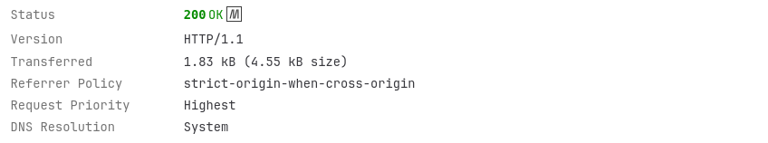
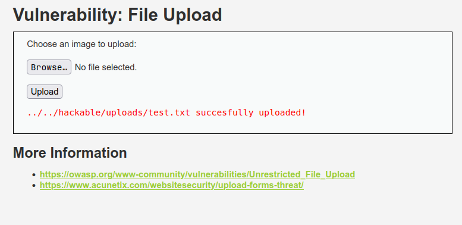

# DVWA #05 – File Upload

## 1. Overview

This lab demonstrates an **Unrestricted File Upload** vulnerability in Damn Vulnerable Web Application (DVWA).

The vulnerability occurs when an application accepts uploaded files without properly validating their type, extension, content, or intended purpose.

In this controlled lab, the DVWA File Upload functionality successfully accepted:

```text
test.txt
```

and later:

```text
test.html
```

even though the interface indicates that an image should be uploaded.

This demonstrates that the application does not sufficiently restrict uploaded file types at the configured **Low** security level.

---

## 2. Lab Information

| Field          | Details                         |
| -------------- | ------------------------------- |
| Lab            | DVWA #05 – File Upload          |
| Application    | Damn Vulnerable Web Application |
| Vulnerability  | Unrestricted File Upload        |
| Target         | `localhost:8080`                |
| Endpoint       | `/DVWA/vulnerabilities/upload/` |
| HTTP Method    | POST                            |
| Security Level | Low                             |
| Status         | Confirmed                       |
| Testing Type   | Controlled Local Lab            |

---

## 3. Objective

The objective of this lab was to:

* Understand how file upload functionality works.
* Identify the upload endpoint.
* Establish normal upload behavior.
* Test whether non-image files are accepted.
* Observe the HTTP upload request.
* Capture evidence.
* Assess the security impact.
* Document appropriate remediation.

---

## 4. Target Application

The vulnerable functionality was accessed through:

```text
http://localhost:8080/DVWA/vulnerabilities/upload/
```

The page displayed:

```text
Choose an image to upload:
```

This indicates that the intended functionality is image uploading.

---

## 5. Testing Environment

Testing was performed against a deliberately vulnerable DVWA instance running locally.

```text
Environment:
Local / Isolated Lab

Host:
localhost

Address:
127.0.0.1:8080

Security Level:
Low
```

No external or unauthorized systems were targeted.

---

## 6. Baseline Test

A harmless text file was created and uploaded to establish baseline behavior.

The uploaded file was:

```text
test.txt
```

The application returned:

```text
../../hackable/uploads/test.txt successfully uploaded!
```

This demonstrated that the application accepted a non-image file.

---

## 7. Network Evidence

Firefox Developer Tools → Network was used to inspect the upload request.

The request contained:

```text
Method:
POST

Endpoint:
/DVWA/vulnerabilities/upload/

Host:
localhost:8080

Status:
200 OK

Content-Type:
multipart/form-data
```

The request used a multipart form submission, which is the standard mechanism for browser-based file uploads.

### Network Evidence



---

## 8. Arbitrary File-Type Test

A second harmless file was used to test whether the application enforced its expected image-only restriction.

The file used was:

```text
test.html
```

The application returned:

```text
../../hackable/uploads/test.html successfully uploaded!
```

This demonstrated that the upload functionality accepted an HTML file despite the interface requesting an image.

### Arbitrary File Upload Evidence


---

## 9. Upload Result Evidence

The initial successful upload was also documented.

### Evidence



The successful upload message confirmed that the uploaded file was stored under:

```text
../../hackable/uploads/
```

---

## 10. Vulnerability Confirmation

The vulnerability was considered confirmed because the application accepted a file type that was outside the intended image-only functionality.

The test sequence was:

```text
Image Upload Functionality
          ↓
Upload test.txt
          ↓
Upload Successful
          ↓
Upload test.html
          ↓
Upload Successful
          ↓
File-Type Restriction Insufficient
```

---

## 11. Technical Observation

The application appears to rely on insufficient file validation.

The expected behavior would be:

```text
Uploaded File
      ↓
Validate Extension
      ↓
Validate MIME Type
      ↓
Validate File Content
      ↓
Allow Only Approved Image
```

The observed behavior was effectively:

```text
Uploaded File
      ↓
Insufficient Validation
      ↓
File Accepted
      ↓
Stored on Server
```

---

## 12. Evidence Summary

| Evidence   | Screenshot                     | Purpose                                         |
| ---------- | ------------------------------ | ----------------------------------------------- |
| Evidence 1 | `01-file-upload-result.png`    | Demonstrates successful file upload             |
| Evidence 2 | `02-upload-network.png`        | Shows POST upload request and HTTP 200 response |
| Evidence 3 | `03-arbitrary-file-upload.png` | Demonstrates acceptance of `test.html`          |

---

## 13. Impact

An unrestricted file upload vulnerability can become serious when uploaded files can be executed, interpreted, or accessed in a dangerous context.

Potential impact may include:

* Upload of unauthorized file types.
* Storage of malicious content.
* Stored client-side attacks.
* Defacement.
* Malware hosting.
* Server-side code execution if executable files are accepted and executed.
* Compromise of application resources.

The exact impact depends on:

* File validation mechanisms.
* Web server configuration.
* Upload directory permissions.
* Whether uploaded files are executable.
* MIME-type handling.
* Application architecture.

### Impact Demonstrated in This Lab

The demonstrated impact was:

```text
Arbitrary / unintended file type accepted
```

No server-side code execution was performed.

---

## 14. Root Cause

The root cause is insufficient validation of uploaded files.

A secure application should not rely only on:

```text
Filename extension
```

or:

```text
Client-side file selection
```

Instead, the server should validate the uploaded file using multiple security controls.

---

## 15. Security Risks

If unrestricted uploads are deployed in a real production environment, attackers may attempt to upload:

```text
Malicious Files
      ↓
Application Upload Directory
      ↓
Publicly Accessible File
      ↓
Potential Exploitation
```

The risk increases significantly if the upload directory allows script execution.

---

## 16. Recommended Security Controls

Recommended controls include:

1. Allowlist permitted file extensions.
2. Validate MIME type server-side.
3. Validate actual file content/signature.
4. Rename uploaded files.
5. Generate random server-side filenames.
6. Store uploads outside the web root where possible.
7. Disable script execution in upload directories.
8. Apply filesystem least privilege.
9. Enforce file size limits.
10. Reject suspicious filenames.
11. Store files with safe permissions.
12. Log upload activity.
13. Monitor suspicious upload behavior.

---

## 17. Secure Upload Architecture

A secure file-upload process should follow:

```text
User Upload
     ↓
Authentication / Authorization
     ↓
File Size Validation
     ↓
Filename Validation
     ↓
Extension Allowlist
     ↓
MIME Validation
     ↓
File Signature / Content Validation
     ↓
Generate Safe Filename
     ↓
Store Outside Web Root
     ↓
Disable Execution
     ↓
Log Upload
```

This provides defense in depth.

---

## 18. Expected Secure Behavior

An approved image:

```text
photo.jpg
    ↓
Validation
    ↓
Approved
    ↓
Stored Safely
```

An unauthorized file:

```text
test.html
    ↓
Validation
    ↓
Rejected
```

The application should never rely solely on the filename extension.

---

## 19. Security Testing Result

| Test                      | Result       |
| ------------------------- | ------------ |
| Upload `test.txt`         | Accepted     |
| Upload `test.html`        | Accepted     |
| Network request inspected | Confirmed    |
| HTTP response             | `200 OK`     |
| File-type restriction     | Insufficient |
| Vulnerability             | Confirmed    |

---

## 20. Conclusion

The DVWA File Upload functionality was found to accept unintended file types.

A harmless `test.txt` file was successfully uploaded, followed by a `test.html` file.

The application returned successful upload messages for both files, demonstrating insufficient file-type restrictions at the configured **Low** security level.

The primary remediation is to implement strict server-side validation using allowlisted extensions, MIME/content validation, safe server-generated filenames, secure storage, and disabled execution within upload directories.

---

## 21. Evidence Files

The lab evidence is stored under:

```text
screenshots/
```

Files:

```text
01-file-upload-result.png
02-upload-network.png
03-arbitrary-file-upload.png
```

---

## 22. Lab Structure

```text
05-File-Upload/
├── README.md
├── methodology.md
├── commands.md
├── findings.md
├── remediation.md
└── screenshots/
    ├── 01-file-upload-result.png
    ├── 02-upload-network.png
    └── 03-arbitrary-file-upload.png
```

---

## 23. Ethical Testing Statement

This vulnerability assessment was performed exclusively against a deliberately vulnerable DVWA application running in a controlled local environment.

The testing was conducted for cybersecurity education, vulnerability assessment practice, and portfolio documentation.

No unauthorized external systems were targeted.
	
