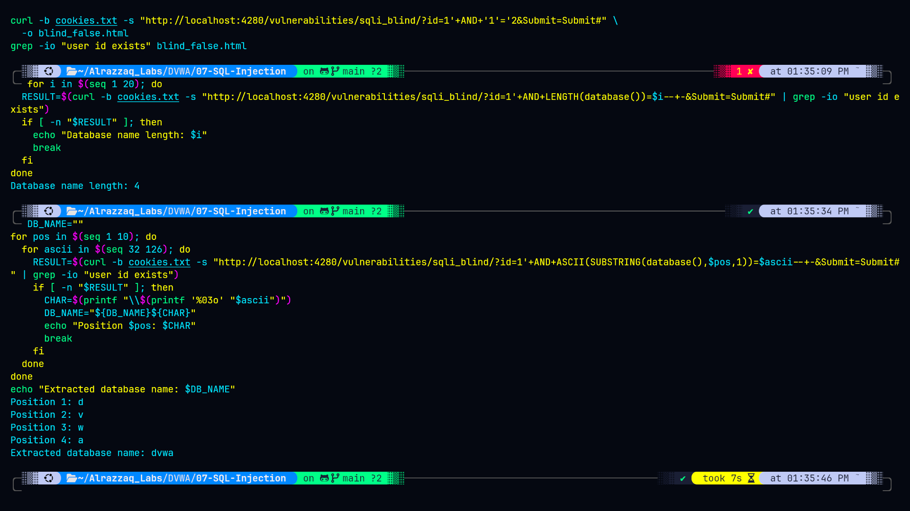
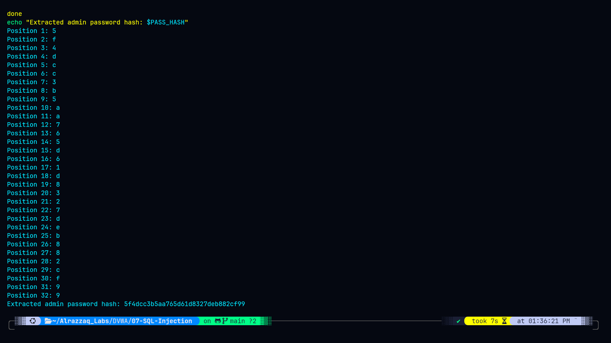

# Lab 08: SQL Injection (Blind)

## Overview
This lab demonstrates **boolean-based blind SQL Injection** against DVWA's "SQL Injection (Blind)" module. Unlike the standard SQL Injection lab (07), this endpoint never echoes query results back to the user — it only reveals a binary "User ID exists in the database" / no-message signal. Data was extracted entirely through inference: asking the database a series of true/false questions and reconstructing values one character at a time from the pattern of responses.

## Environment
- **Target:** DVWA (Damn Vulnerable Web Application) v1.10 *Development*
- **Deployment:** Docker (`vulnerables/web-dvwa`), mapped to `http://localhost:4280`
- **Backend DB:** MariaDB `10.1.26-MariaDB-0+deb9u1`
- **Security Level:** Low
- **Endpoint:** `/vulnerabilities/sqli_blind/?id=`

## Objective
Confirm the boolean-blind injection point, then use it to extract the database name and the `admin` account's password hash without ever seeing query output directly — purely from true/false response patterns.

## Summary of Impact
The same critical data exposed in Lab 07 (regular SQL Injection) — database name and admin credentials — was independently re-derived here using only inference-based extraction, with zero direct data echo from the application. This proves the vulnerability is exploitable even when an application appears to leak nothing, which is a common (and mistaken) assumption that blind endpoints are "safer." Extraction was slower (dozens of requests per character) but equally complete.

## Cross-validation with Lab 07
| Value | Lab 07 (UNION-based) | Lab 08 (Blind, this lab) | Match |
|---|---|---|---|
| Database name | `dvwa` | `dvwa` | ✅ |
| Admin password hash | `5f4dcc3b5aa765d61d8327deb882cf99` | `5f4dcc3b5aa765d61d8327deb882cf99` | ✅ |

## Evidence

### Automated database name extraction
Boolean-blind extraction script running against `database()`, resolving to `dvwa` one character at a time via ASCII/SUBSTRING comparisons:

### Automated admin password hash extraction
Same technique applied to the `users` table, extracting the full 32-character MD5 hash purely from true/false response signals — no data ever directly echoed by the application:

## Files
| File | Description |
|---|---|
| `commands.md` | Exact commands and extraction scripts run |
| `methodology.md` | Step-by-step approach and reasoning |
| `findings.md` | Vulnerability details, evidence, and severity |
| `remediation.md` | Recommended fixes |
| `screenshots/` | Visual evidence |

## References
- [OWASP: Blind SQL Injection](https://owasp.org/www-community/attacks/Blind_SQL_Injection)
- [PortSwigger: Blind SQL Injection](https://portswigger.net/web-security/sql-injection/blind)
- [CWE-89: SQL Injection](https://cwe.mitre.org/data/definitions/89.html)
