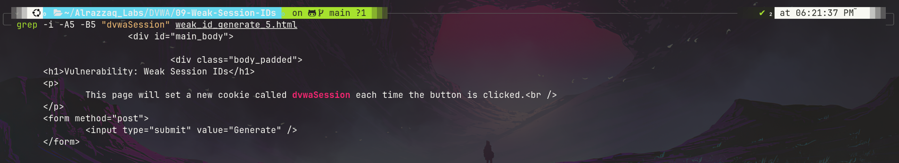
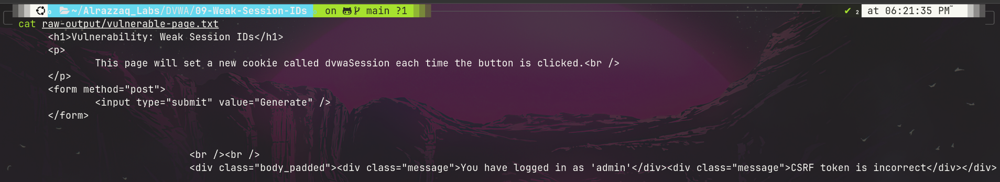
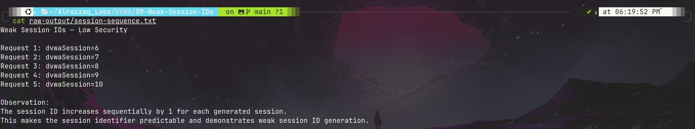
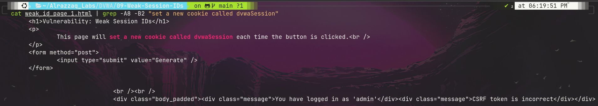

# 📖 Lab 09: Weak Session IDs

> This lab demonstrates the Weak Session IDs vulnerability in Damn Vulnerable Web Application (DVWA). The lab focuses on identifying predictable session identifiers by generating multiple `dvwaSession` values and analyzing their sequence.

---

## 🎯 Objectives

By completing this lab, you will be able to:

- Understand session IDs
- Understand the importance of unpredictable session identifiers
- Identify weak session ID generation
- Inspect cookies using cURL
- Generate multiple session identifiers
- Analyze session ID patterns
- Understand the security impact of predictable session IDs
- Identify appropriate remediation techniques

---

## 📚 Prerequisites

- DVWA installed locally
- Basic Linux terminal knowledge
- Basic understanding of HTTP requests
- Basic understanding of cookies and sessions
- cURL installed

---

# 📂 Lab Structure

```text
09-Weak-Session-IDs/
├── README.md
├── commands.md
├── findings.md
├── lessons-learned.md
├── methodology.md
├── remediation.md
├── raw-output/
│   ├── session-sequence.txt
│   └── vulnerable-page.txt
└── screenshots/
    ├── 01-weak-session-ids-page.png
    ├── 02-sequential-session-ids.png
    ├── 03-vulnerable-page-evidence.png
    └── 04-generated-session-evidence.png
```

---

# 🛠 Technologies Used

| Technology | Purpose |
|------------|---------|
| DVWA | Vulnerable Web Application |
| cURL | HTTP request testing |
| Linux Terminal | Testing and analysis |
| Cookies | Session tracking |
| Git | Version Control |

---

# 📖 Background

Session IDs are identifiers used by web applications to maintain user sessions.

A secure session identifier should be:

- Random
- Unpredictable
- Sufficiently long
- Generated using a cryptographically secure mechanism

If session IDs are predictable, an attacker may be able to determine or enumerate valid session identifiers.

This can increase the risk of session-related attacks such as session hijacking.

---

# 🧪 Lab Tasks

## ✅ Task 1 — Access DVWA

The local DVWA instance was accessed at:

```text
http://localhost:4280
```

The DVWA security level was configured as:

```text
Low
```

---

## ✅ Task 2 — Open Weak Session IDs

The Weak Session IDs vulnerability page was accessed using:

```bash
curl -b cookies.txt -c cookies.txt -s \
  http://localhost:4280/vulnerabilities/weak_id/ \
  -o weak_id_page_1.html
```

The page confirmed that clicking **Generate** creates a new cookie called:

```text
dvwaSession
```

---

## ✅ Task 3 — Generate Multiple Session IDs

Five session IDs were generated using repeated POST requests:

```bash
for i in 1 2 3 4 5; do
  curl -b cookies.txt -c cookies.txt -s \
    -X POST http://localhost:4280/vulnerabilities/weak_id/ \
    -d "Generate=Generate" \
    -o weak_id_generate_$i.html

  value=$(awk '$6=="dvwaSession"{print $7}' cookies.txt)
  echo "Request $i: dvwaSession=$value"
done
```

---

# 📊 Observed Results

The following session identifiers were observed:

```text
Request 1: dvwaSession=6
Request 2: dvwaSession=7
Request 3: dvwaSession=8
Request 4: dvwaSession=9
Request 5: dvwaSession=10
```

### Pattern

```text
6 → 7 → 8 → 9 → 10
```

Each generated session identifier increased by exactly `1`.

---

# 🔎 Finding

## Predictable Session ID Generation

**Severity:** Medium

The DVWA Low-security implementation generates `dvwaSession` values using a predictable sequential pattern.

The observed sequence:

```text
6 → 7 → 8 → 9 → 10
```

demonstrates that the session identifier is predictable.

Secure applications should use cryptographically secure random session identifiers instead of sequential values.

---

# 💥 Security Impact

Predictable session identifiers can increase the risk of:

- Session enumeration
- Session hijacking
- Unauthorized access
- Session-management attacks

The actual impact depends on the application's authentication and session-validation mechanisms.

---

# 🔬 Root Cause

The vulnerable implementation uses a predictable sequential mechanism to generate the `dvwaSession` value.

Instead of generating a cryptographically random identifier, the application produces values that follow an obvious sequence.

---

# 📸 Evidence

## Evidence 1 — Weak Session IDs Page



The DVWA Weak Session IDs page shows the **Generate** functionality used to create a new session identifier.

---

## Evidence 2 — Sequential Session IDs



The terminal output demonstrates the predictable sequence:

```text
6 → 7 → 8 → 9 → 10
```

---

## Evidence 3 — Vulnerable Page Evidence



The extracted page content confirms that the application generates a new `dvwaSession` cookie.

---

## Evidence 4 — Generated Session Evidence



The generated response contains evidence of the `dvwaSession` cookie.

---

# 📁 Raw Evidence

The raw evidence collected during testing is stored in:

```text
raw-output/
├── session-sequence.txt
└── vulnerable-page.txt
```

### Session Sequence

```text
Request 1: dvwaSession=6
Request 2: dvwaSession=7
Request 3: dvwaSession=8
Request 4: dvwaSession=9
Request 5: dvwaSession=10
```

---

# 🔐 Remediation

To prevent weak session identifiers:

1. Use a cryptographically secure random number generator.
2. Generate session IDs with sufficient entropy.
3. Never use sequential counters for session IDs.
4. Avoid predictable timestamps or user-related values.
5. Regenerate session IDs after successful authentication.
6. Invalidate old sessions when appropriate.
7. Use secure cookie attributes such as:
   - `Secure`
   - `HttpOnly`
   - `SameSite`
8. Implement appropriate session expiration and server-side invalidation.

---

# ✅ Verification

After remediation, generated session IDs should not follow an obvious sequence such as:

```text
6 → 7 → 8 → 9 → 10
```

Instead, session identifiers should be random and computationally unpredictable.

---

# 💡 Best Practices

- Never use predictable values for session IDs.
- Use cryptographically secure random generation.
- Protect session cookies with appropriate security attributes.
- Regenerate sessions after authentication.
- Expire inactive sessions.
- Invalidate sessions after logout.
- Never expose active session cookies in public repositories.

---

# 📈 Skills Gained

After completing this lab, you can:

- ✔ Understand session management
- ✔ Inspect HTTP cookies
- ✔ Use cURL for web testing
- ✔ Generate multiple session identifiers
- ✔ Identify predictable session patterns
- ✔ Analyze web application behavior
- ✔ Document security findings
- ✔ Recommend session-management remediation

---

# 🌍 Real-World Applications

Session security is important in:

- 🌐 Web applications
- 🔐 Authentication systems
- 🏦 Banking applications
- 🛒 E-commerce platforms
- ☁️ Cloud dashboards
- 🖥️ Administrative portals
- 🔑 Identity management systems
- 🛡️ Security testing

---

# 🔐 Cybersecurity Relevance

Weak session IDs are important during web application security assessments.

Security professionals test session management to identify:

- Predictable session tokens
- Session fixation
- Session hijacking risks
- Cookie security issues
- Authentication weaknesses
- Session expiration problems

Understanding session security is important for penetration testers, SOC analysts, vulnerability assessors, and application security professionals.

---

# ⚠️ Security Note

This vulnerability was tested against a locally hosted DVWA instance in an isolated lab environment.

Do not commit active session cookies such as:

```text
PHPSESSID
dvwaSession
```

to a public repository.

Before committing the project:

```bash
rm cookies.txt
```

---

# 🎓 Conclusion

This lab successfully demonstrated the Weak Session IDs vulnerability in DVWA.

Five session identifiers were generated and analyzed:

```text
6 → 7 → 8 → 9 → 10
```

The sequential pattern confirms that the session identifiers are predictable at the selected security level.

This demonstrates why production applications must use cryptographically secure and unpredictable session identifiers.

---

## 👨‍💻 Author

**Umer Ali**

Cybersecurity | Linux | Python | Cloud Security

---

**⭐ Continue exploring the remaining DVWA labs to strengthen practical web application security skills.**
