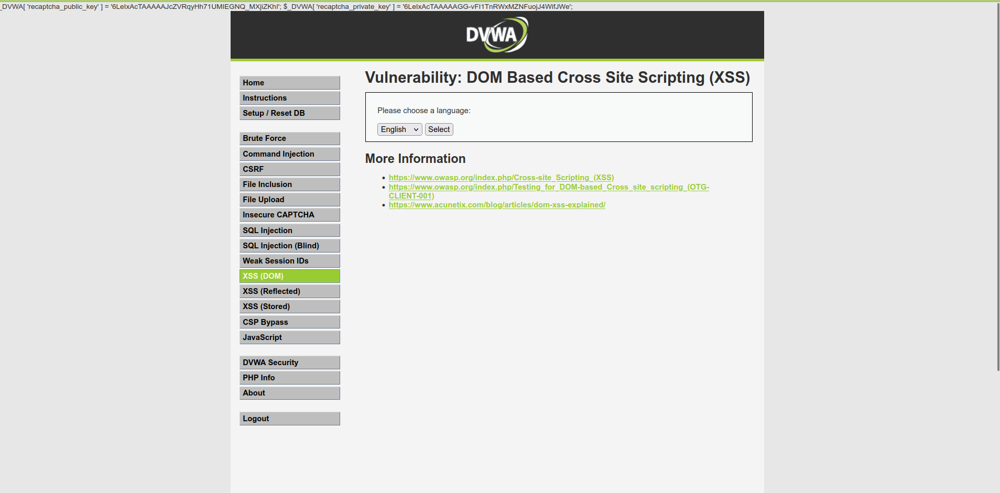
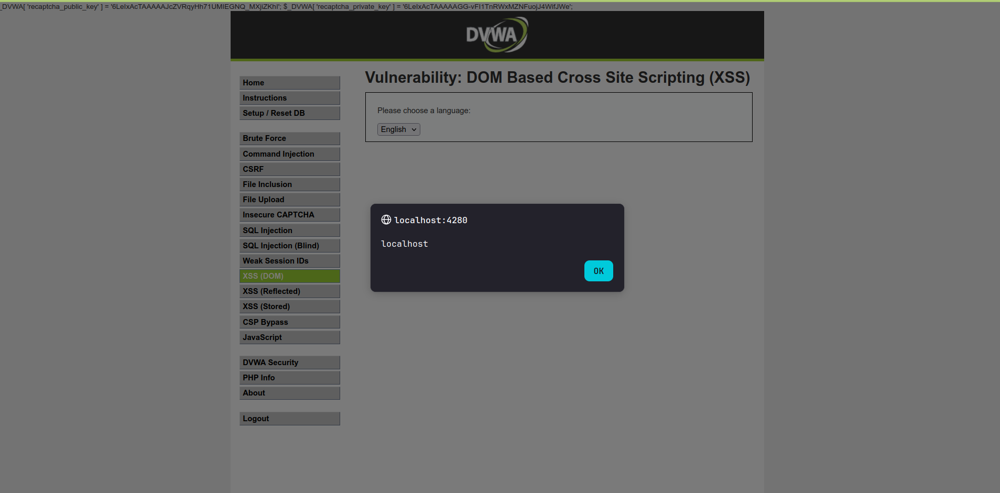
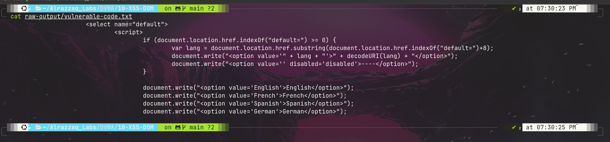

# Lab 10: XSS (DOM)

## Overview
This lab demonstrates a **DOM-based Cross-Site Scripting (XSS)** vulnerability in DVWA's "XSS (DOM)" module. Unlike reflected or stored XSS, this vulnerability never involves the server echoing attacker input back into the HTML response — the entire injection happens client-side, inside the browser's own JavaScript, which reads the URL and writes attacker-controlled content directly into the page via `document.write()`.

## Environment
- **Target:** DVWA (Damn Vulnerable Web Application) v1.10 *Development*
- **Deployment:** Docker (`vulnerables/web-dvwa`), mapped to `http://localhost:4280`
- **Security Level:** Low
- **Endpoint:** `/vulnerabilities/xss_d/?default=`

## Objective
Demonstrate that the client-side JavaScript powering the language-selection dropdown reads directly from `document.location.href` and writes it into the DOM unsanitized, allowing arbitrary JavaScript execution in the victim's browser.

## Payload
```
http://localhost:4280/vulnerabilities/xss_d/?default=<script>alert(document.domain)</script>
```

## Summary of Impact
An attacker can craft a malicious link that, when clicked by a logged-in victim, executes arbitrary JavaScript in the victim's browser session — with no server-side involvement in the injection at all. This enables session hijacking, credential theft (via fake login overlays), or any other client-side attack payload, delivered entirely through a URL that looks like it points to the legitimate site.

## Evidence

### The vulnerable page (baseline)


### Payload execution — alert box confirms the injection
The `document.domain` value (`localhost`) is displayed in a JavaScript alert box, proving arbitrary script execution:


### Vulnerable client-side source code
The page's own script reads `document.location.href` and writes it unescaped via `document.write()`:


## Files
| File | Description |
|---|---|
| `commands.md` | Exact commands run, including source inspection and payload delivery |
| `methodology.md` | Step-by-step approach and reasoning |
| `findings.md` | Vulnerability details, evidence, and severity |
| `remediation.md` | Recommended fixes |
| `screenshots/` | Visual evidence (embedded above) |

## References
- [OWASP: Cross-site Scripting (XSS)](https://owasp.org/www-community/attacks/xss/)
- [OWASP: Testing for DOM-based XSS (OTG-CLIENT-001)](https://owasp.org/www-project-web-security-testing-guide/)
- [Acunetix: DOM XSS Explained](https://www.acunetix.com/blog/articles/dom-xss-explained/)
