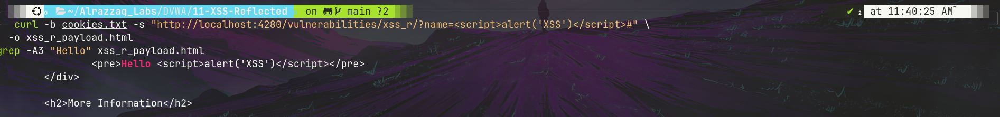
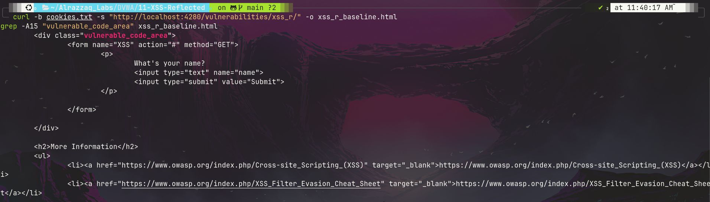
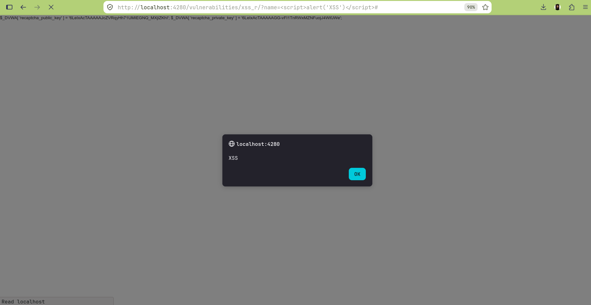

# Lab 11: XSS (Reflected)

## Overview
This lab demonstrates a classic **Reflected Cross-Site Scripting (XSS)** vulnerability in DVWA's "XSS (Reflected)" module. Unlike DOM-based XSS (Lab 10), where the injection happens entirely client-side, this vulnerability involves the **server** taking the `name` GET parameter and echoing it directly back into the HTML response with zero sanitization or encoding.

## Environment
- **Target:** DVWA (Damn Vulnerable Web Application) v1.10 *Development*
- **Deployment:** Docker (`vulnerables/web-dvwa`), mapped to `http://localhost:4280`
- **Security Level:** Low
- **Endpoint:** `/vulnerabilities/xss_r/?name=`

## Objective
Demonstrate that user input submitted via the `name` parameter is reflected unescaped into the server's HTML response, allowing arbitrary JavaScript execution in the browser of anyone who follows a crafted link.

## Payload
```
http://localhost:4280/vulnerabilities/xss_r/?name=<script>alert('XSS')</script>#
```

## Summary of Impact
Unlike Lab 10 (DOM XSS), this vulnerability is confirmable via `curl` alone — the raw `<script>` tag appears directly in the server's HTTP response body, no browser JavaScript execution required to prove the flaw exists. Any attacker who can convince a logged-in user to click a malicious link can execute arbitrary JavaScript in that user's session, enabling cookie theft, session hijacking, or in-page phishing.

## Reflected XSS vs. DOM XSS — key distinction
| | Lab 10: DOM XSS | Lab 11: Reflected XSS (this lab) |
|---|---|---|
| Where injection happens | Entirely client-side (browser JS) | Server-side (response generation) |
| Visible via `curl`? | No — server response identical regardless of payload | **Yes** — payload appears literally in HTML response |
| Root cause | Unsafe client-side sink (`document.write()`) | Unsafe server-side output (no HTML encoding on echo) |
| Fix approach | Safe DOM APIs (`textContent`, `createElement`) | Server-side output encoding (`htmlspecialchars()` or equivalent) |

## Evidence

### Server-side confirmation — payload reflected raw in HTTP response
```html
<pre>Hello <script>alert('XSS')</script></pre>
```


### Baseline page source (for comparison)


### Payload execution in browser — alert box confirms


## Files
| File | Description |
|---|---|
| `commands.md` | Exact commands run |
| `methodology.md` | Step-by-step approach and reasoning |
| `findings.md` | Vulnerability details, evidence, and severity |
| `remediation.md` | Recommended fixes |
| `screenshots/` | Visual evidence (embedded above) |

## References
- [OWASP: Cross-site Scripting (XSS)](https://owasp.org/www-community/attacks/xss/)
- [OWASP: XSS Filter Evasion Cheat Sheet](https://owasp.org/www-community/xss-filter-evasion-cheatsheet)
