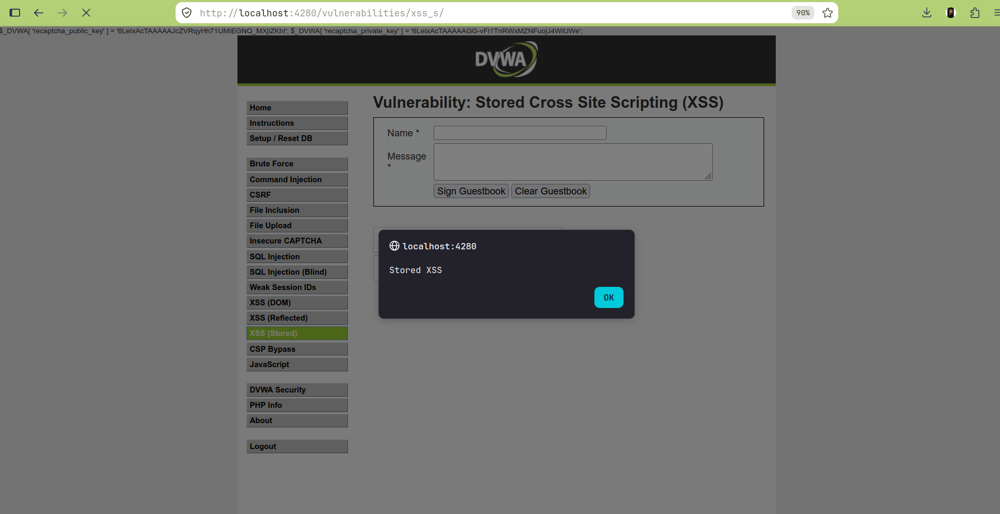
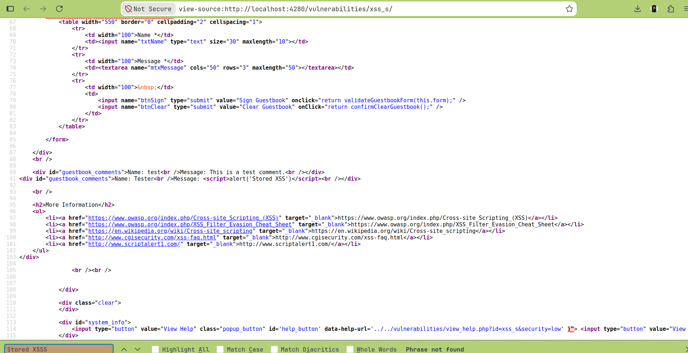

# Lab 12: XSS (Stored)

## Overview
This lab demonstrates **Stored (Persistent) Cross-Site Scripting** in DVWA's guestbook module — the most impactful XSS variant, since the malicious payload is saved server-side and automatically executes for **every visitor** who views the page, with no crafted link or social engineering required per victim.

## Environment
- **Target:** DVWA (Damn Vulnerable Web Application) v1.10 *Development*
- **Deployment:** Docker (`vulnerables/web-dvwa`), mapped to `http://localhost:4280`
- **Security Level:** Low
- **Endpoint:** `/vulnerabilities/xss_s/` (POST: `txtName`, `mtxMessage`)

## Objective
Demonstrate that guestbook submissions are stored and rendered back without sanitization, and confirm the payload persists and executes across entirely separate, unrelated login sessions.

## Payload
Submitted via the guestbook form:
- **Name:** `Tester`
- **Message:** ``

## Summary of Impact
Once submitted, the payload became a permanent part of the page — confirmed by loading it in a **brand-new authenticated session** that never submitted anything, which still triggered the alert automatically on page load. This is the defining danger of stored XSS: a single successful injection compromises every subsequent visitor indefinitely, until the malicious data is found and removed.

## Reflected vs. DOM vs. Stored — full picture
| | DOM (Lab 10) | Reflected (Lab 11) | Stored (this lab) |
|---|---|---|---|
| Where injection happens | Client-side JS | Server response generation (per-request) | Server-side database, replayed on every load |
| Requires victim to click a crafted link? | Yes | Yes | **No** — just visit the page normally |
| Persists after one request? | No | No | **Yes — indefinitely** |
| Blast radius | One victim per link click | One victim per link click | **Every visitor**, automatically |

## Evidence

### Payload execution — fires automatically, from a fresh, unrelated session

### Raw page source — payload permanently embedded in the guestbook

## Files
| File | Description |
|---|---|
| `commands.md` | Exact commands run, including cross-session persistence verification |
| `methodology.md` | Step-by-step approach and reasoning |
| `findings.md` | Vulnerability details, evidence, and severity |
| `remediation.md` | Recommended fixes |
| `screenshots/` | Visual evidence (embedded above) |

## References
- [OWASP: Cross-site Scripting (XSS)](https://owasp.org/www-community/attacks/xss/)
- [OWASP: XSS Filter Evasion Cheat Sheet](https://owasp.org/www-community/xss-filter-evasion-cheatsheet)
