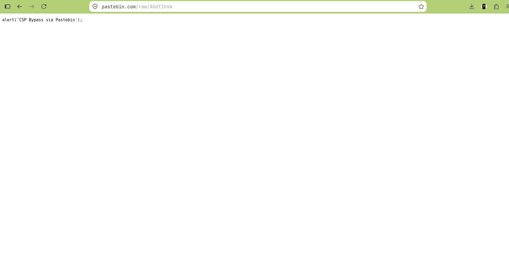
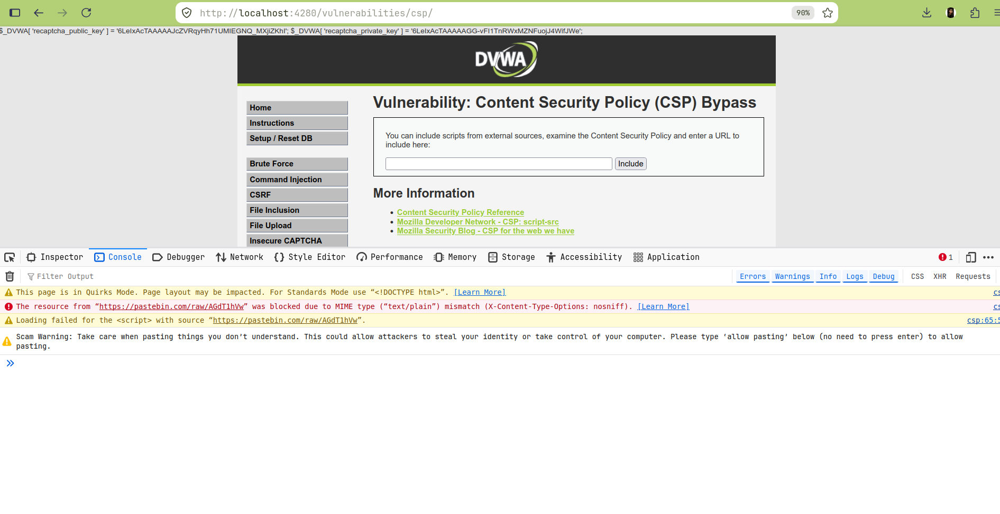

# Lab 13: Content Security Policy (CSP) Bypass

## Overview
This lab examines DVWA's Content Security Policy configuration for the "CSP Bypass" module. The application allows users to specify a URL to load as an external `<script>` source, while a `Content-Security-Policy: script-src` header restricts which domains scripts may be loaded from. The intended vulnerability is a misconfigured CSP that whitelists an attacker-writable third-party domain (`pastebin.com`), which should in principle allow arbitrary attacker-controlled JavaScript to execute despite CSP being present.

## Environment
- **Target:** DVWA (Damn Vulnerable Web Application) v1.10 *Development*
- **Deployment:** Docker (`vulnerables/web-dvwa`), mapped to `http://localhost:4280`
- **Security Level:** Low
- **Endpoint:** `/vulnerabilities/csp/` (POST parameter: `include`)

## Observed CSP Header
```
Content-Security-Policy: script-src 'self' https://pastebin.com example.com code.jquery.com https://ssl.google-analytics.com;
```

## Objective
Determine whether the whitelisted `pastebin.com` entry can be exploited to execute arbitrary attacker-controlled JavaScript, bypassing the intent of the CSP.

## Result: Partial finding — CSP misconfiguration confirmed, exploitation blocked by a separate browser control
The CSP misconfiguration itself is real and confirmed: `pastebin.com` is an attacker-writable domain with no legitimate reason to be trusted as a script source for this application. A malicious script was successfully hosted there and the application's `include` parameter successfully embedded it as a `<script src="...">` tag, which the CSP permitted to load (confirmed: no CSP violation was logged for this request).

However, in this test, the script **did not execute**, because Pastebin serves raw paste content with `Content-Type: text/plain` and `X-Content-Type-Options: nosniff`. Modern browsers refuse to execute `<script>` resources whose MIME type doesn't match an executable script type when `nosniff` is present — this is a separate, independent browser security control (MIME-type sniffing protection), not the CSP itself, and it happened to block this specific exploitation path.

**This is still a valid, reportable finding.** The CSP is genuinely misconfigured and represents real risk — a different attacker-writable whitelisted source that serves content with a correct `Content-Type: application/javascript` (or no `nosniff` header) would very likely bypass the CSP successfully. The finding and remediation reflect this nuance rather than overstating or understating the result.

## Evidence

### Malicious script hosted on the whitelisted domain


### Browser console — CSP allowed the connection; MIME-type protection blocked execution
```
The resource from "https://pastebin.com/raw/AGdT1hVw" was blocked due to
MIME type ("text/plain") mismatch (X-Content-Type-Options: nosniff).
```


## Files
| File | Description |
|---|---|
| `commands.md` | Exact commands run |
| `methodology.md` | Step-by-step approach and reasoning |
| `findings.md` | Vulnerability details, evidence, and severity |
| `remediation.md` | Recommended fixes |
| `screenshots/` | Visual evidence (embedded above) |

## References
- [Content Security Policy Reference](https://content-security-policy.com/)
- [MDN: CSP script-src](https://developer.mozilla.org/en-US/docs/Web/HTTP/CSP)
- [MDN: X-Content-Type-Options](https://developer.mozilla.org/en-US/docs/Web/HTTP/Headers/X-Content-Type-Options)
