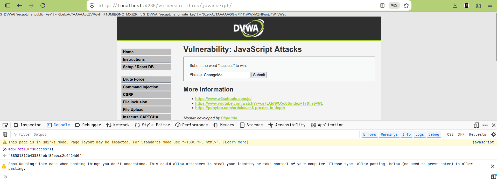

# Lab 14: JavaScript Attacks

## Overview
This lab demonstrates that **client-side-only validation logic can always be reverse-engineered and bypassed**, since anything running in the browser is fully visible and readable by the end user. DVWA's "JavaScript" module requires submitting the word `success` along with a matching `token`, where the token is computed entirely in client-side JavaScript. By reading the obfuscated source and reimplementing its logic independently, the correct token was computed and submitted directly via `curl` — without ever executing the page's actual JavaScript in a browser.

## Environment
- **Target:** DVWA (Damn Vulnerable Web Application) v1.10 *Development*
- **Deployment:** Docker (`vulnerables/web-dvwa`), mapped to `http://localhost:4280`
- **Security Level:** Low
- **Endpoint:** `/vulnerabilities/javascript/` (POST: `phrase`, `token`, `send`)

## Objective
Submit the required phrase (`success`) along with a forged, independently-computed token — proving the client-side token generation provides no real security, since the entire algorithm is exposed in the page source and trivially reimplementable outside the browser.

## Discovered Token Logic
```javascript
function generate_token() {
    var phrase = document.getElementById("phrase").value;
    document.getElementById("token").value = md5(rot13(phrase));
}
```
**Token = `MD5(ROT13(phrase))`**

## Summary of Impact
The entire "protection" mechanism is client-side JavaScript that any user can read (View Source), understand, and reimplement. This lab demonstrates the general principle that client-side validation must never be treated as a security control — it can only be relied upon for UX purposes, since a motivated party can always bypass it by talking to the server directly, as this lab did via `curl`.

## Evidence

### Independently computed token, verified against the page's own logic
Computed offline via Python: `MD5(ROT13("success"))` = `38581812b435834ebf84ebcc2c6424d6`

Cross-verified live in the browser console, running the page's own `md5()`/`rot13()` functions directly:


### Successful bypass — submitted via curl, no JavaScript execution
```bash
curl -b cookies.txt -s "http://localhost:4280/vulnerabilities/javascript/" \
  -d "phrase=success&token=38581812b435834ebf84ebcc2c6424d6&send=Submit"
```
**Server response:** `"Well done"` — confirming successful bypass with a purely server-side, script-free request.

## Files
| File | Description |
|---|---|
| `commands.md` | Exact commands run, including token computation |
| `methodology.md` | Step-by-step approach and reasoning |
| `findings.md` | Vulnerability details, evidence, and severity |
| `remediation.md` | Recommended fixes |
| `screenshots/` | Visual evidence (embedded above) |

## References
- [OWASP: Client-Side Enforcement of Server-Side Security](https://owasp.org/www-community/vulnerabilities/Client-Side_Enforcement_of_Server-Side_Security)
- [W3Schools: JavaScript](https://www.w3schools.com/js/)
