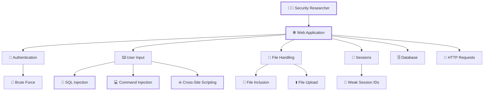

# ⚔️ DVWA — Web Application Security Arsenal

<p align="center">
  
</p>

<p align="center">
  
  
  
  
</p>

<p align="center">
  <b>🔴 ATTACK</b> ───────►
  <b>🟡 ANALYZE</b> ───────►
  <b>🟢 DEFEND</b>
</p>

---

## 🖥️ SYSTEM STATUS

```text
╔══════════════════════════════════════════════════════════════╗
║                 🛡️  DVWA SECURITY OPERATIONS                ║
╠══════════════════════════════════════════════════════════════╣
║                                                              ║
║  SYSTEM             : DVWA                                   ║
║  ENVIRONMENT        : Isolated Security Lab                  ║
║  PLATFORM           : Linux + Docker                         ║
║  PURPOSE            : Authorized Security Testing            ║
║                                                              ║
║  RECON               ████████████████████░░  90%             ║
║  EXPLOITATION        █████████████████░░░░  80%             ║
║  ANALYSIS            ██████████████████░░░  85%             ║
║  REMEDIATION         ███████████████░░░░░  75%             ║
║                                                              ║
║  STATUS              : 🟢 ONLINE                             ║
║  SECURITY MODE       : 🔐 AUTHORIZED LAB                     ║
╚══════════════════════════════════════════════════════════════╝
```

---

# 🧠 WHAT IS THIS?

**DVWA — Damn Vulnerable Web Application** is an intentionally vulnerable web application designed for security testing and learning.

This repository documents my practical journey through web application vulnerabilities.

But this isn't just:

```text
❌ Run Payload
❌ Get Flag
❌ Take Screenshot
❌ Done
```

Instead:

```text
        🔎 RECON
           │
           ▼
      🎯 IDENTIFY
           │
           ▼
       ⚔️ EXPLOIT
           │
           ▼
       💥 ANALYZE
           │
           ▼
       📊 ASSESS
           │
           ▼
       🛡️ REMEDIATE
           │
           ▼
       🔄 RETEST
           │
           ▼
       ✅ SECURE
```

---

# 🌐 ATTACK SURFACE



---

# ⚔️ LAB OPERATIONS

## 🔴 OFFENSIVE SECURITY

| Lab                     | Attack Surface | Technique               | Status |
| ----------------------- | -------------- | ----------------------- | :----: |
| 🔐 Brute Force          | Login          | Credential Testing      |   🟢   |
| 💻 Command Injection    | Input          | OS Command Execution    |   🟢   |
| 🔄 CSRF                 | Forms          | Request Forgery         |   🟢   |
| 📂 File Inclusion       | Parameters     | LFI / RFI               |   🟢   |
| 📁 File Upload          | Upload         | Malicious File Testing  |   🟢   |
| 🧩 CAPTCHA              | Authentication | Validation Bypass       |   🟡   |
| 💉 SQL Injection        | Database       | SQL Manipulation        |   🟡   |
| 🕵️ Blind SQL Injection | Database       | Blind Enumeration       |   🟡   |
| ☣️ Reflected XSS        | Input          | Script Injection        |   🟡   |
| 💾 Stored XSS           | Database       | Persistent Injection    |   🟡   |
| 🌐 DOM XSS              | Browser        | Client-Side Injection   |   🟡   |
| 🍪 Weak Session IDs     | Session        | Session Analysis        |   🟡   |
| 🔑 Authorization        | Access Control | Privilege Testing       |   🟡   |
| 🛡️ CSP Bypass          | Browser        | Security Control Bypass |   🟡   |

---

# 📊 VULNERABILITY RADAR

```text
                         WEB SECURITY
                              │
          ┌───────────────────┼───────────────────┐
          │                   │                   │
       🔐 AUTH             💉 INPUT            📁 FILE
          │                   │                   │
      Brute Force        SQL Injection       File Upload
      CAPTCHA            Command Injection   File Inclusion
      Sessions           XSS
          │                   │                   │
          └───────────────────┼───────────────────┘
                              │
                        🌐 CLIENT SIDE
                              │
                    ┌─────────┴─────────┐
                    │                   │
                 DOM XSS             CSRF
                    │                   │
                    └─────────┬─────────┘
                              │
                         🛡️ DEFENSE
```

---

# 🧪 MY LAB WORKFLOW

### `01` 🔎 RECONNAISSANCE

```bash
Identify → Enumerate → Understand
```

Discover:

* Application functionality
* Parameters
* Endpoints
* Technologies
* Authentication mechanisms
* Input points

---

### `02` 🎯 VULNERABILITY DISCOVERY

```bash
Input → Observe → Manipulate → Validate
```

Look for:

```text
SQL Injection
XSS
Command Injection
File Inclusion
File Upload
CSRF
Authentication Weaknesses
Authorization Issues
Session Weaknesses
```

---

### `03` ⚔️ CONTROLLED EXPLOITATION

```text
Normal Request
      ↓
Modified Request
      ↓
Application Response
      ↓
Vulnerability Confirmed
```

All testing is performed inside an **isolated and authorized laboratory environment**.

---

### `04` 📸 EVIDENCE COLLECTION

Each lab contains visual evidence such as:

```text
🖥️ Application
      ↓
🌐 Request
      ↓
📨 Response
      ↓
⚔️ Payload
      ↓
💥 Impact
      ↓
🛡️ Fix
```

---

### `05` 🛡️ REMEDIATION

The goal isn't simply to exploit.

The final question is:

> **How would we prevent this attack in a real application?**

---

# 📂 REPOSITORY ARCHITECTURE

```text
DVWA/
│
├── 📁 01-Brute-Force/
│   ├── 📄 README.md
│   ├── 📄 commands.md
│   ├── 📄 findings.md
│   ├── 📄 methodology.md
│   ├── 📄 remediation.md
│   ├── 📄 lessons-learned.md
│   └── 📸 screenshots/
│
├── 📁 02-Command-Injection/
│   └── ...
│
├── 📁 03-CSRF/
│   └── ...
│
├── 📁 04-File-Inclusion/
│   └── ...
│
├── 📁 05-File-Upload/
│   └── ...
│
├── 📁 06-CAPTCHA/
│   └── ...
│
├── 📁 07-SQL-Injection/
│   └── ...
│
├── 📁 08-Blind-SQL-Injection/
│   └── ...
│
└── 📄 README.md
```

---

# 🛠️ SECURITY TOOLKIT

<p align="center">


</p>

<p align="center">


</p>

---

# 🧩 EACH LAB CONTAINS

```text
┌─────────────────────────────────────────┐
│             🔬 LAB REPORT               │
├─────────────────────────────────────────┤
│                                         │
│  🎯 Objective                           │
│  🔎 Methodology                         │
│  🛠️ Commands                            │
│  ⚔️ Exploitation                        │
│  📸 Screenshots                         │
│  💥 Impact                              │
│  📊 Findings                            │
│  🛡️ Remediation                        │
│  📚 Lessons Learned                    │
│                                         │
└─────────────────────────────────────────┘
```

---

# 📸 VISUAL EVIDENCE

<p align="center">


</p>

Screenshots are organized inside each individual lab.

Example:

```text
05-File-Upload/
│
└── screenshots/
    ├── 01-dvwa-upload-page.png
    ├── 02-upload-request.png
    ├── 03-successful-upload.png
    └── 04-impact.png
```

---

# 📈 SECURITY MATURITY

```text
RECONNAISSANCE
████████████████████████████████████████ 100%

VULNERABILITY DISCOVERY
████████████████████████████████████░░░░  90%

EXPLOITATION
████████████████████████████████░░░░░░░░  80%

ANALYSIS
██████████████████████████████████░░░░░░  85%

REMEDIATION
██████████████████████████████░░░░░░░░░░  75%

DOCUMENTATION
██████████████████████████████████████░░  95%
```

---

# 🧠 SKILLS DEVELOPED

```text
                 CYBERSECURITY
                      │
        ┌─────────────┼─────────────┐
        │             │             │
     OFFENSIVE     ANALYSIS      DEFENSIVE
        │             │             │
     Recon         HTTP           Hardening
     Exploit       Logs           Validation
     Payloads      Evidence       Monitoring
     Enumeration   Impact         Remediation
        │             │             │
        └─────────────┼─────────────┘
                      │
                SECURITY MINDSET
```

---

# 🏆 END GOAL

This project is part of my journey toward becoming a stronger **Cybersecurity / SOC / Security Operations professional** with practical understanding of how web vulnerabilities are:

```text
        DISCOVERED
            ↓
        EXPLOITED
            ↓
        ANALYZED
            ↓
        DETECTED
            ↓
        REMEDIATED
            ↓
        VERIFIED
```

---

# ⚠️ ETHICAL USE

> ⚠️ **Educational & Authorized Security Testing Only**

DVWA is intentionally vulnerable.

All testing documented in this repository is intended for:

* 🧪 Local labs
* 🎓 Education
* 🔬 Security research
* 🛡️ Defensive learning
* ✅ Authorized environments

**Never test systems you do not own or have explicit permission to assess.**

---

# 🟢 CURRENT MISSION

```text
╔══════════════════════════════════════════════╗
║                                              ║
║       🛡️  DVWA SECURITY LAB                 ║
║                                              ║
║       [███████████████████░░░]  IN PROGRESS  ║
║                                              ║
║       🔎 Recon        [✓]                    ║
║       ⚔️ Exploit      [✓]                    ║
║       📊 Analyze      [✓]                    ║
║       📸 Document     [✓]                    ║
║       🛡️ Remediate    [→]                    ║
║                                              ║
║              SYSTEM: ACTIVE                 ║
║              MODE: LEARNING                 ║
║                                              ║
╚══════════════════════════════════════════════╝
```

---

<p align="center">


</p>

<p align="center">
  <b>🔐 Security is not just about finding vulnerabilities — it's about understanding them.</b>
</p>
