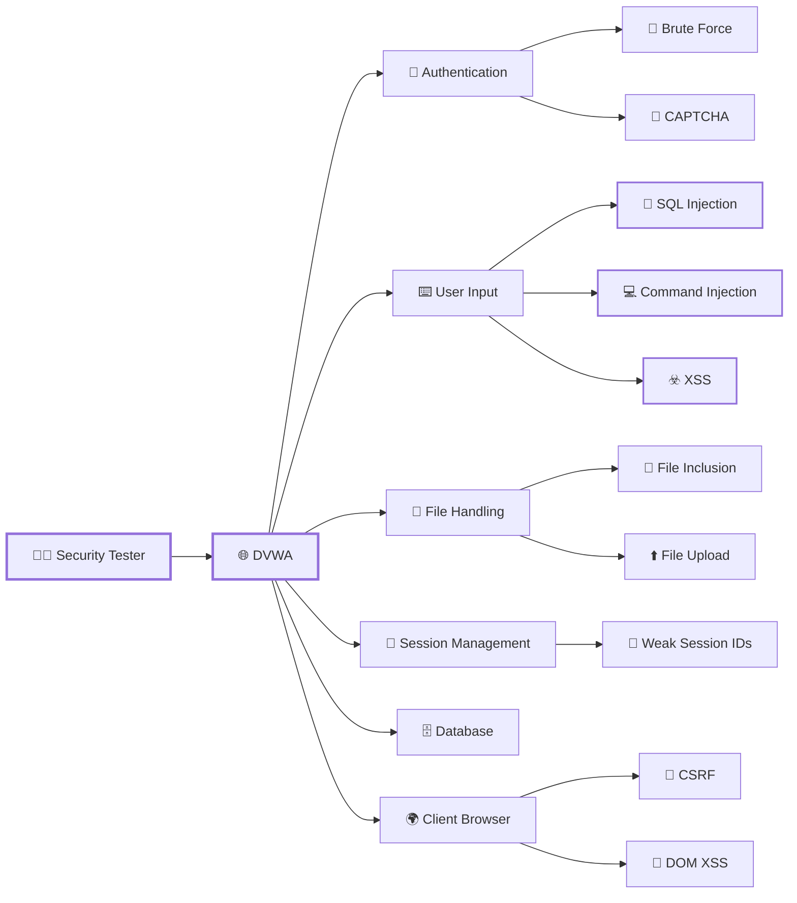
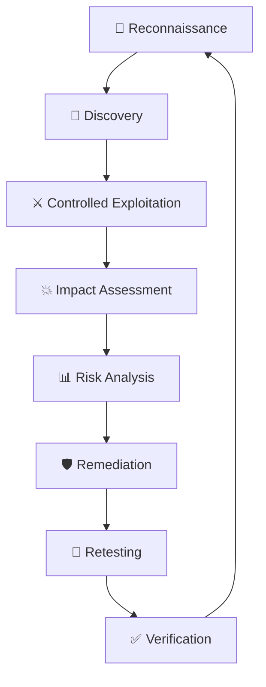
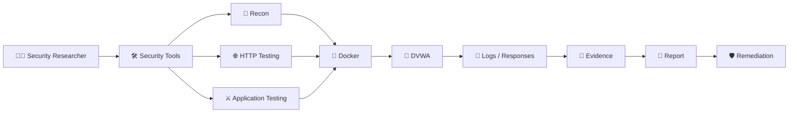

# 🛡️ DVWA — Advanced Web Application Security Labs

<p align="center">
  
</p>

<p align="center">
  
  
  
  
</p>

<p align="center">

**🔎 Reconnaissance → ⚔️ Exploitation → 💥 Impact → 📊 Analysis → 🛡️ Remediation**

</p>

---

## ⚡ SECURITY LAB // SYSTEM ONLINE

<p align="center">


</p>

```text
┌──────────────────────────────────────────────────────────────────────┐
│                    🛡️ DVWA SECURITY LAB                             │
├──────────────────────────────────────────────────────────────────────┤
│                                                                      │
│  TARGET       : Damn Vulnerable Web Application                     │
│  ENVIRONMENT  : Isolated Local Laboratory                           │
│  PLATFORM     : Linux + Docker                                      │
│  PURPOSE      : Authorized Security Testing                         │
│                                                                      │
│  RECON        : ████████████████████  100%                          │
│  TESTING      : ███████████████████░   95%                          │
│  ANALYSIS     : ██████████████████░░   90%                          │
│  DOCUMENTING  : ████████████████████  100%                          │
│  REMEDIATION  : ███████████████░░░░░   75%                          │
│                                                                      │
│  STATUS       : 🟢 ACTIVE                                            │
│  SECURITY     : 🔐 AUTHORIZED LAB                                    │
└──────────────────────────────────────────────────────────────────────┘
```

---

# 🎯 PROJECT MISSION

This repository documents a hands-on journey through **web application security testing using DVWA**.

The objective is to understand vulnerabilities from both the **attacker and defender perspective**.

```text
                     WEB APPLICATION
                            │
                            ▼
                     🔎 RECON
                            │
                            ▼
                  🎯 FIND VULNERABILITY
                            │
                            ▼
                     ⚔️ TEST / EXPLOIT
                            │
                            ▼
                       💥 IMPACT
                            │
                            ▼
                     📊 INVESTIGATE
                            │
                            ▼
                    🛡️ REMEDIATE
                            │
                            ▼
                       🔄 RETEST
                            │
                            ▼
                       ✅ SECURE
```

---

# 🖥️ ATTACK SIMULATION

<p align="center">


</p>

### Attack Flow

```text
┌───────────────┐
│ 👨‍💻 TESTER    │
└───────┬───────┘
        │
        │ HTTP REQUEST
        ▼
┌───────────────────┐
│ 🌐 DVWA WEB APP   │
└─────────┬─────────┘
          │
     ┌────┼───────────────┐
     │    │               │
     ▼    ▼               ▼
   💉 SQL  ☣️ XSS       💻 CMD
   INJECT  ATTACK      INJECTION
     │    │               │
     └────┼───────────────┘
          │
          ▼
      💥 IMPACT
          │
          ▼
      🔎 ANALYSIS
          │
          ▼
      🛡️ DEFENSE
```

> **Note:** The visual above represents the security-testing workflow conceptually. All practical testing is performed only against the intentionally vulnerable local DVWA environment.

---

# 🌐 ATTACK SURFACE MAP



---

# ⚔️ Vulnerability Matrix

| ID | Vulnerability | Attack Surface | Category | Status |
| :-: | ----------------------- | -------------- | ---------------- | :----: |
| 01 | 🔨 Brute Force | Login | Authentication | 🟢 |
| 02 | 💻 Command Injection | User Input | Injection | 🟢 |
| 03 | 🔄 CSRF | Forms | Client-Side | 🟢 |
| 04 | 📂 File Inclusion | Parameters | File Handling | 🟢 |
| 05 | ⬆️ File Upload | Upload | File Handling | 🟢 |
| 06 | 🧩 CAPTCHA | Authentication | Validation | 🟢 |
| 07 | 💉 SQL Injection | Database | Injection | 🟢 |
| 08 | 🕵️ Blind SQL Injection | Database | Injection | 🟢 |
| 09 | ☣️ Reflected XSS | Input | XSS | 🟢 |
| 10 | 💾 Stored XSS | Input/Database | XSS | 🟢 |
| 11 | 🧠 DOM XSS | Browser | XSS | 🟢 |
| 12 | 🍪 Weak Session IDs | Session | Session Security | 🟢 |
| 13 | 🔑 Authorization Bypass | Access Control | Authorization | 🟢 |
| 14 | 🛡️ CSP Bypass | Browser | Security Headers | 🟢 |
| 15 | 📜 JavaScript | Client-Side | Client Security | 🟢 |

### Legend

- 🟢 **Complete / Verified**
- 🟡 **In Progress**
- 🔴 **Not Started / Incomplete**

> 🟢 **15/15 Labs Complete — 100%**

---

# 💉 INJECTION ATTACKS

```text
                    INJECTION
                       │
        ┌──────────────┼──────────────┐
        │              │              │
        ▼              ▼              ▼
    💉 SQLi          💻 CMDi        ☣️ XSS
        │              │              │
        ▼              ▼              ▼
    Database        Operating       Browser
    Manipulation    System          Execution
        │              │              │
        └──────────────┼──────────────┘
                       ▼
                  💥 IMPACT
```

### Security Questions

For every injection vulnerability:

* What input is vulnerable?
* How does the application process it?
* What makes the input dangerous?
* What is the potential impact?
* How can it be detected?
* How should it be remediated?

---

# 📁 FILE ATTACKS

```text
                 FILE HANDLING
                      │
             ┌────────┴────────┐
             │                 │
             ▼                 ▼
       📂 FILE INCLUSION   ⬆️ FILE UPLOAD
             │                 │
             ▼                 ▼
       Local/Remote        Malicious
       Resource Abuse      File Handling
             │                 │
             └────────┬────────┘
                      ▼
                  💥 IMPACT
```

---

# 🔐 AUTHENTICATION & SESSION SECURITY

```text
       👤 USER
         │
         ▼
   🔐 LOGIN SYSTEM
         │
    ┌────┴────┐
    │         │
    ▼         ▼
 🔨 Brute    🧩 CAPTCHA
  Force       Bypass
    │         │
    └────┬────┘
         ▼
    🍪 SESSION
         │
         ▼
 🎫 Weak Session IDs
```

---

# ☣️ CROSS-SITE SCRIPTING

```text
              USER INPUT
                  │
                  ▼
           ┌──────────────┐
           │ WEB SERVER   │
           └──────┬───────┘
                  │
         ┌────────┼────────┐
         │        │        │
         ▼        ▼        ▼
      Reflected Stored     DOM
         XSS       XSS      XSS
         │         │        │
         └─────────┼────────┘
                   ▼
              🌐 BROWSER
                   │
                   ▼
                💥 IMPACT
```

---

# 🧪 STANDARD TESTING METHODOLOGY

Every lab follows a repeatable methodology.

## `01` 🔎 RECONNAISSANCE

Identify:

* Application functionality
* Parameters
* Endpoints
* Input fields
* Authentication mechanisms
* Technologies
* Attack surface

---

## `02` 🎯 IDENTIFICATION

Understand normal application behavior before testing.

```text
NORMAL REQUEST
      ↓
OBSERVE RESPONSE
      ↓
MODIFY INPUT
      ↓
COMPARE RESPONSE
      ↓
IDENTIFY ANOMALY
```

---

## `03` ⚔️ CONTROLLED TESTING

Perform security testing against the intentionally vulnerable DVWA instance.

```text
HTTP REQUEST
     │
     ▼
MODIFIED INPUT
     │
     ▼
APPLICATION
     │
     ▼
HTTP RESPONSE
     │
     ▼
VULNERABILITY VALIDATION
```

---

## `04` 📸 EVIDENCE

Every important finding is documented with visual evidence.

```text
🖥️ DVWA Interface
       ↓
🌐 HTTP Request
       ↓
📨 HTTP Response
       ↓
⚔️ Test Result
       ↓
💥 Demonstrated Impact
```

---

## `05` 📊 ANALYSIS

Each finding is analyzed for:

* Root cause
* Attack vector
* Exploitability
* Security impact
* Confidentiality impact
* Integrity impact
* Availability impact

---

## `06` 🛡️ REMEDIATION

The lab doesn't end after exploitation.

The objective is to understand how the vulnerability can be prevented through:

* Input validation
* Output encoding
* Parameterized queries
* Authentication controls
* Authorization checks
* Secure file handling
* Security headers
* Session hardening
* Secure configuration

---

## `07` 🔄 RETEST

```text
VULNERABILITY
      ↓
REMEDIATION
      ↓
RETEST
      ↓
VULNERABILITY BLOCKED
      ↓
✅ VERIFIED
```

---

# 📂 REPOSITORY STRUCTURE

```text
DVWA/
│
├── 📁 01-Brute-Force/
│   ├── README.md
│   ├── commands.md
│   ├── methodology.md
│   ├── findings.md
│   ├── remediation.md
│   ├── lessons-learned.md
│   └── 📸 screenshots/
│
├── 📁 02-Command-Injection/
│   └── ...
│
├── 📁 03-CSRF/
│   └── ...
│
├── 📁 04-File-Inclusion/
│   └── ...
│
├── 📁 05-File-Upload/
│   └── ...
│
├── 📁 06-CAPTCHA/
│   └── ...
│
├── 📁 07-SQL-Injection/
│   └── ...
│
├── 📁 08-Blind-SQL-Injection/
│   └── ...
│
├── 📁 09-XSS-DOM/
│   └── ...
│
├── 📁 10-XSS-Reflected/
│   └── ...
│
├── 📁 11-XSS-Stored/
│   └── ...
│
└── 📄 README.md
```

---

# 📸 LAB EVIDENCE

Each completed lab contains screenshots documenting the testing process.

### Example

```text
05-File-Upload/
│
└── screenshots/
    │
    ├── 01-dvwa-upload-interface.png
    ├── 02-upload-request.png
    ├── 03-upload-response.png
    ├── 04-successful-test.png
    └── 05-impact.png
```

---

# 🧰 SECURITY TOOLKIT

<p align="center">


</p>

| Tool           | Purpose                         |
| -------------- | ------------------------------- |
| 🐧 Linux       | Security laboratory             |
| 🐳 Docker      | DVWA deployment                 |
| 🔎 Nmap        | Network reconnaissance          |
| 🌐 cURL        | HTTP testing                    |
| 🦈 Wireshark   | Traffic analysis                |
| 🕷️ Burp Suite | Web security testing            |
| 🛡️ OWASP ZAP  | Web application testing         |
| 🐍 Python      | Automation & security scripting |
| 🔧 Git         | Version control                 |

---

# 📊 SECURITY TESTING DASHBOARD

```text
╔══════════════════════════════════════════════════════╗
║                 SECURITY METRICS                     ║
╠══════════════════════════════════════════════════════╣
║                                                      ║
║  🔎 Reconnaissance      ████████████████████  100%   ║
║  🎯 Discovery           ███████████████████░   95%   ║
║  ⚔️ Exploitation        █████████████████░░░   85%   ║
║  📊 Analysis            ██████████████████░░   90%   ║
║  📸 Documentation       ████████████████████  100%   ║
║  🛡️ Remediation         ███████████████░░░░░   75%   ║
║                                                      ║
╚══════════════════════════════════════════════════════╝
```

---

# 🧠 ATTACKER VS DEFENDER

| 🔴 Attacker Perspective | 🟢 Defender Perspective |
| ----------------------- | ----------------------- |
| Find attack surface     | Reduce attack surface   |
| Identify weak input     | Validate input          |
| Manipulate requests     | Monitor requests        |
| Exploit vulnerability   | Block exploitation      |
| Demonstrate impact      | Reduce impact           |
| Maintain access         | Enforce authorization   |
| Abuse sessions          | Secure sessions         |
| Exfiltrate data         | Protect sensitive data  |

---

# 🔬 VULNERABILITY LIFECYCLE



---

# 🏗️ LAB ARCHITECTURE



---

# 📚 KNOWLEDGE AREAS

```text
WEB APPLICATION SECURITY
│
├── 🔐 Authentication
│   ├── Brute Force
│   └── CAPTCHA
│
├── 🔑 Authorization
│   └── Access Control
│
├── 💉 Injection
│   ├── SQL Injection
│   ├── Blind SQL Injection
│   └── Command Injection
│
├── ☣️ XSS
│   ├── Reflected
│   ├── Stored
│   └── DOM
│
├── 📁 File Security
│   ├── File Upload
│   └── File Inclusion
│
├── 🍪 Session Security
│   └── Weak Session IDs
│
└── 🌐 Client Security
    ├── CSRF
    ├── CSP
    └── JavaScript Security
```

---

# 🏆 SKILLS DEMONSTRATED

### 🔴 Offensive Security

* Web reconnaissance
* Vulnerability discovery
* HTTP manipulation
* Injection testing
* XSS testing
* Authentication testing
* File handling testing
* Session testing
* Access-control testing

### 🟡 Security Analysis

* Request/response analysis
* Attack-surface mapping
* Root-cause analysis
* Impact assessment
* Evidence collection
* Security documentation

### 🟢 Defensive Security

* Input validation
* Output encoding
* Secure authentication
* Access-control enforcement
* Secure file handling
* Session hardening
* Security headers
* Vulnerability remediation

---

# 📋 LAB REPORT FORMAT

Every lab follows a professional security-report structure:

```text
┌───────────────────────────────────────┐
│             🔬 LAB REPORT             │
├───────────────────────────────────────┤
│ 🎯 Objective                          │
│ 🔎 Reconnaissance                     │
│ 🧪 Methodology                        │
│ ⚔️ Testing / Exploitation             │
│ 📸 Evidence                           │
│ 💥 Impact                             │
│ 📊 Findings                           │
│ 🛡️ Remediation                       │
│ 🔄 Retesting                          │
│ 📚 Lessons Learned                    │
└───────────────────────────────────────┘
```

---

# 🎓 LEARNING OUTCOMES

By completing these labs, I am building practical understanding of:

* How vulnerable web applications behave
* How attackers identify weaknesses
* How HTTP requests can be manipulated
* How common web vulnerabilities work
* How vulnerabilities affect confidentiality, integrity and availability
* How to collect security evidence
* How to write professional vulnerability reports
* How vulnerabilities can be detected and mitigated

---

# 🚀 FUTURE EXPANSION

```text
DVWA
 │
 ├──► OWASP Top 10
 │
 ├──► Burp Suite
 │
 ├──► OWASP ZAP
 │
 ├──► API Security
 │
 ├──► Web Enumeration
 │
 ├──► Vulnerability Assessment
 │
 ├──► Security Automation
 │
 └──► SOC Detection & Response
```

The long-term goal is to connect **offensive testing with defensive monitoring**, allowing vulnerabilities and attack behavior to be understood from both perspectives.

---

# ⚠️ ETHICAL & LEGAL DISCLAIMER

> **This project is for educational and authorized security testing only.**

DVWA is intentionally vulnerable and should be deployed in an isolated laboratory environment.

The techniques documented here must **never** be used against systems, applications, accounts, or networks without explicit authorization.

```text
AUTHORIZED ENVIRONMENT
        ↓
      TEST
        ↓
     ANALYZE
        ↓
    DOCUMENT
        ↓
     DEFEND
```

---

# 🟢 MISSION STATUS

<p align="center">


</p>

```text
╔══════════════════════════════════════════════════════╗
║                                                      ║
║       🔐 DVWA SECURITY LABORATORY                   ║
║                                                      ║
║       STATUS : 🟢 ONLINE                            ║
║       MODE   : 🔬 RESEARCH                          ║
║       TARGET : 🎯 DVWA                              ║
║       ACCESS : 🔐 AUTHORIZED                        ║
║                                                      ║
║       ATTACK  →  ANALYZE  →  DEFEND                 ║
║                                                      ║
╚══════════════════════════════════════════════════════╝
```

---

<p align="center">


</p>

<p align="center">

### 🔐 Learn the Attack. Understand the Vulnerability. Build the Defense.

</p>

<p align="center">
  <sub>DVWA Security Labs • Web Application Security • Vulnerability Assessment • Security Research</sub>
</p>
