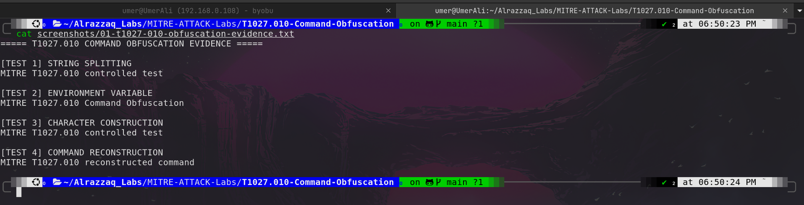
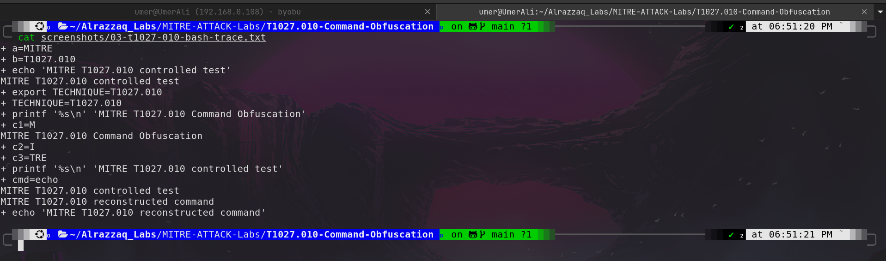
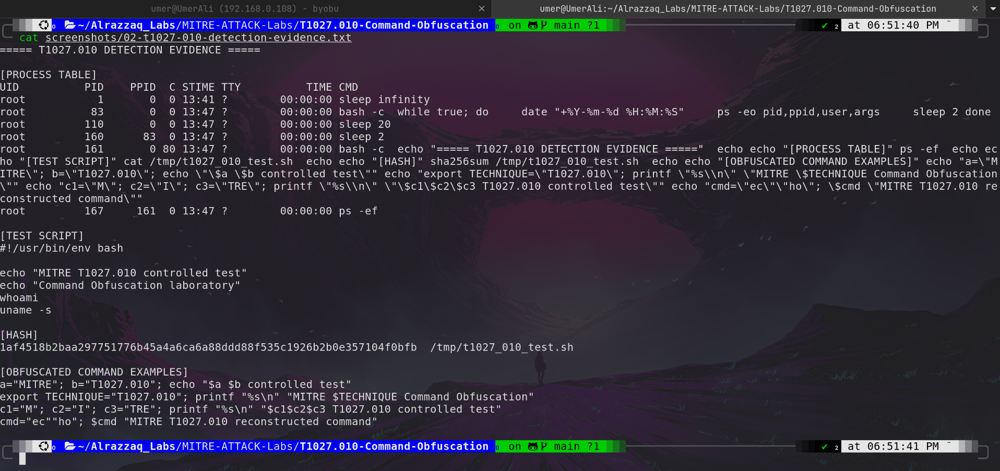
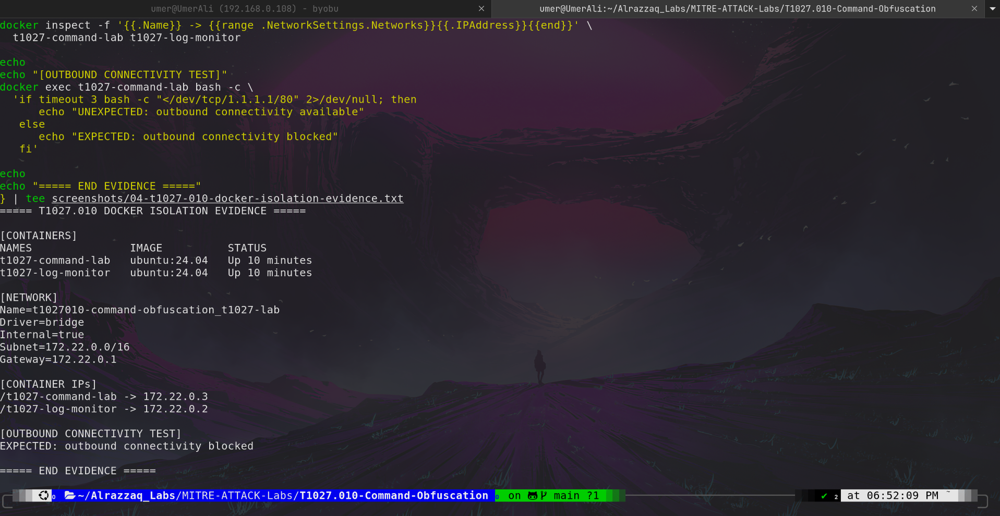

# MITRE ATT&CK T1027.010 — Command Obfuscation

## Overview

This lab demonstrates **MITRE ATT&CK T1027.010 — Command Obfuscation** in a controlled Docker-based Linux environment.

The objective is to understand how commands can be syntactically modified or reconstructed while preserving their intended behavior. The lab demonstrates several harmless command-obfuscation techniques and captures execution-trace and container-isolation evidence.

The entire exercise was performed inside an isolated Docker network with outbound connectivity disabled.

---

## Objectives

* Understand MITRE ATT&CK T1027.010 Command Obfuscation.
* Understand why attackers may obfuscate commands.
* Demonstrate string-splitting techniques.
* Demonstrate environment-variable substitution.
* Demonstrate character construction.
* Demonstrate command reconstruction.
* Observe Bash execution using `bash -x`.
* Capture process-level execution evidence.
* Verify Docker network isolation.
* Document defensive detection considerations.

---

## MITRE ATT&CK Mapping

| Field            | Value                                   |
| ---------------- | --------------------------------------- |
| Technique        | T1027.010                               |
| Name             | Command Obfuscation                     |
| Parent Technique | T1027 — Obfuscated Files or Information |
| Platform         | Linux                                   |
| Lab Type         | Controlled Defensive Security Lab       |
| Environment      | Docker / Ubuntu 24.04                   |
| Network          | Isolated Docker bridge network          |

---

## Prerequisites

* Ubuntu/Linux host
* Docker
* Docker Compose
* Basic Bash knowledge
* Basic understanding of MITRE ATT&CK
* Terminal access

---

## Lab Environment

### Host

* Ubuntu 24.04.4 LTS
* x86_64
* Docker Compose 5.x

### Containers

| Container           | Image          | Purpose                                   |
| ------------------- | -------------- | ----------------------------------------- |
| `t1027-command-lab` | `ubuntu:24.04` | Command execution and obfuscation testing |
| `t1027-log-monitor` | `ubuntu:24.04` | Monitoring/support container              |

### Docker Network

```text
Network: t1027010-command-obfuscation_t1027-lab
Driver: bridge
Internal: true
Subnet: 172.22.0.0/16
Gateway: 172.22.0.1
```

Container addresses:

```text
t1027-command-lab  -> 172.22.0.3
t1027-log-monitor  -> 172.22.0.2
```

The network was configured as an internal Docker network, and an outbound connectivity test confirmed that external connectivity was blocked.

---

## Directory Structure

```text
T1027.010-Command-Obfuscation/
├── docker-compose.yml
├── lab/
│   ├── 01-t1027-010-obfuscation-evidence.txt
│   ├── 02-t1027-010-detection-evidence.txt
│   ├── 03-t1027-010-bash-trace.txt
│   └── 04-t1027-010-docker-isolation-evidence.txt
└── screenshots/
    ├── 01-t1027-010-obfuscation-evidence.png
    ├── 02-t1027-010-bash-trace.png
    ├── 03-t1027-010-detection-evidence.png
    └── 04-t1027-010-docker-isolation.png
```

---

# Lab Tasks

## Task 1 — Build the Isolated Environment

The lab uses two Ubuntu containers connected through an internal Docker bridge network.

The network is configured with:

```yaml
internal: true
```

This prevents the containers from reaching external networks.

---

## Task 2 — Verify the Linux Environment

The command execution container was verified as Ubuntu 24.04.4 LTS running on an x86_64 Linux kernel.

The Bash executable was confirmed as:

```text
/usr/bin/bash
```

---

## Task 3 — Create a Harmless Test Script

A harmless Bash script was created for laboratory testing.

The script prints:

* Lab identification
* Current user
* Operating-system information

It does not download files, modify the host, establish persistence, or perform destructive actions.

---

## Task 4 — Demonstrate Command Obfuscation

Four controlled examples were executed.

### 4.1 String Splitting

The command was constructed using separate variables:

```bash
a="MITRE"
b="T1027.010"
echo "$a $b controlled test"
```

The resulting command produced:

```text
MITRE T1027.010 controlled test
```

### 4.2 Environment Variable Substitution

The technique identifier was stored inside an environment variable:

```bash
export TECHNIQUE="T1027.010"
printf "%s\n" "MITRE $TECHNIQUE Command Obfuscation"
```

### 4.3 Character Construction

A string was constructed from multiple variables:

```bash
c1="M"
c2="I"
c3="TRE"
printf "%s\n" "$c1$c2$c3 T1027.010 controlled test"
```

### 4.4 Command Reconstruction

The command name was reconstructed from string fragments:

```bash
cmd="ec""ho"
$cmd "MITRE T1027.010 reconstructed command"
```

Bash resolved the reconstructed value to:

```text
echo
```

---

# Evidence

## Evidence 1 — Obfuscation Techniques

The first screenshot documents the four controlled command-obfuscation examples and their successful output.



**Evidence file:** `lab/01-t1027-010-obfuscation-evidence.txt`

---

## Evidence 2 — Bash Execution Trace

Bash execution tracing was enabled with `bash -x`.

The trace demonstrates how Bash resolves the obfuscated syntax into effective values and commands.

For example:

```text
+ a=MITRE
+ b=T1027.010
+ echo 'MITRE T1027.010 controlled test'
```

and:

```text
+ cmd=echo
+ echo 'MITRE T1027.010 reconstructed command'
```



**Evidence file:** `lab/03-t1027-010-bash-trace.txt`

---

## Evidence 3 — Detection Evidence

The detection evidence captures the process table, test script, script hash, and controlled obfuscation examples.



**Evidence file:** `lab/02-t1027-010-detection-evidence.txt`

The test script SHA-256 recorded during the lab was:

```text
1af4518b2baa297751776b45a4a6ca6a88ddd88f535c1926b2b0e357104f0bfb
```

---

## Evidence 4 — Docker Isolation

The Docker isolation evidence confirms:

* Two isolated containers
* Internal Docker bridge network
* `Internal=true`
* `172.22.0.0/16` subnet
* Container IP addresses
* Blocked outbound connectivity



**Evidence file:** `lab/04-t1027-010-docker-isolation-evidence.txt`

---

# Detection Considerations

Command obfuscation can make static detection more difficult because the visible command syntax may not directly reveal the intended operation.

Defenders should consider:

* Bash process creation telemetry
* Parent-child process relationships
* Command-line arguments
* Environment-variable usage
* Shell execution traces
* Suspicious string construction
* Reconstructed command names
* Encoded or fragmented command tokens
* Repeated shell activity
* Correlation with other suspicious behavior

Detection should focus on **behavior and execution context**, rather than relying only on exact command strings.

---

# Defensive Detection Strategy

A SOC analyst could investigate:

```text
User
  |
  v
Shell Process
  |
  +--> Suspicious String Construction
  |
  +--> Command Reconstruction
  |
  +--> Unusual Child Process
  |
  v
SIEM / EDR
  |
  v
Correlation Rule
  |
  v
SOC Alert
```

Potential detection logic could correlate:

```text
Shell execution
+
unusual command-line construction
+
suspicious child process
+
unexpected execution context
```

This reduces dependence on exact command signatures.

---

# Security Relevance

Attackers may use command obfuscation to:

* Evade simple signature-based detections
* Hide recognizable command strings
* Bypass simplistic filtering
* Make command-line analysis harder
* Conceal the intent of shell activity

For defenders, this makes normalization and behavioral analysis important.

---

# MITRE ATT&CK Relevance

T1027.010 belongs to the broader:

**T1027 — Obfuscated Files or Information**

The sub-technique focuses specifically on obfuscating commands through techniques such as string manipulation, environment variables, symbols, and reconstructed command tokens.

---

# Real-World SOC Applications

This technique is relevant when investigating:

* Suspicious Bash activity
* Linux server compromise
* Web-shell activity
* Malware execution
* Initial access followed by command execution
* Post-exploitation activity
* Living-off-the-land behavior
* Attempts to bypass command-line filtering

---

# Best Practices

## For Defenders

* Collect Linux process telemetry.
* Monitor Bash and other shell interpreters.
* Normalize command-line data where possible.
* Correlate parent and child processes.
* Monitor unusual environment-variable usage.
* Investigate command reconstruction patterns.
* Combine command-line detections with user, host, and network context.

## For Lab Safety

* Use isolated containers.
* Disable unnecessary outbound connectivity.
* Use harmless test commands.
* Avoid downloading real malware.
* Avoid destructive commands.
* Keep test artifacts clearly identified.

---

# Skills Demonstrated

* MITRE ATT&CK mapping
* Linux Bash analysis
* Command-line security analysis
* Command obfuscation analysis
* Docker isolation
* Process inspection
* Bash execution tracing
* Evidence collection
* Security documentation
* SOC detection thinking

---

# Conclusion

This lab successfully demonstrated MITRE ATT&CK **T1027.010 — Command Obfuscation** using a controlled Linux Docker environment.

Multiple harmless obfuscation techniques were executed successfully, and Bash execution tracing demonstrated how the obfuscated syntax was resolved into effective commands.

The lab also verified that the testing environment was isolated from external network connectivity.

The exercise highlights why SOC teams should combine command-line telemetry, process relationships, normalization, and behavioral analysis when detecting potentially obfuscated shell activity.

---

## Author

**Umer Ali**

Cybersecurity / SOC Portfolio

GitHub: `ua4157489-code/Alrazzaq_Labs`
