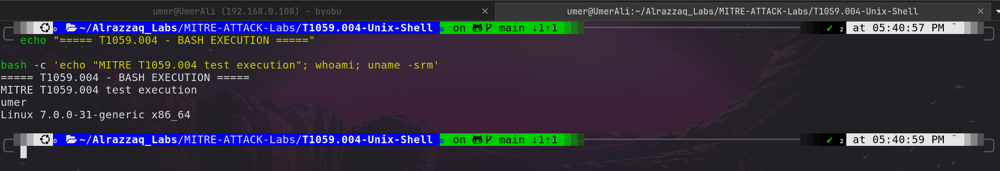
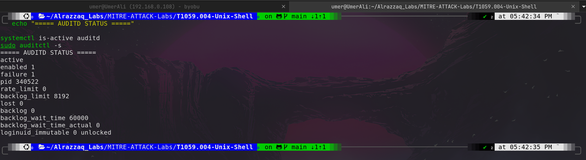
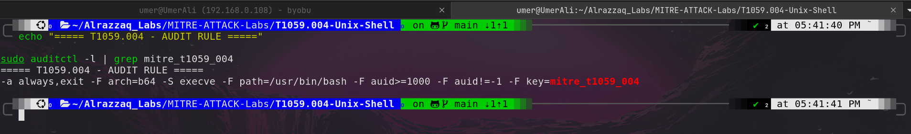
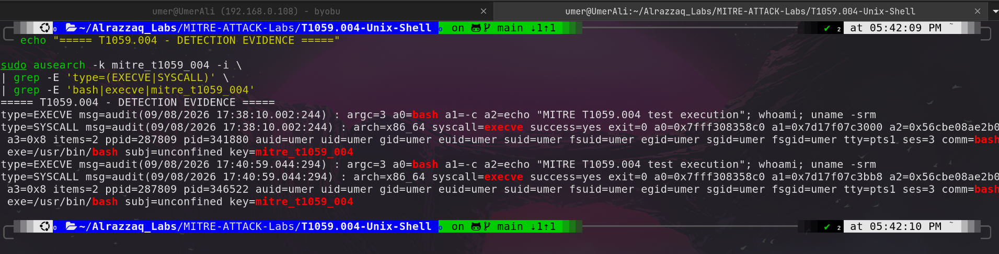

# MITRE ATT&CK T1059.004 – Unix Shell

## Overview

This lab demonstrates **MITRE ATT&CK Technique T1059.004 – Unix Shell** through a controlled Linux endpoint simulation.

The lab focuses on the use of **Bash as a Unix command interpreter** and demonstrates how SOC analysts can collect, detect, investigate, and document shell execution activity using Linux Audit (`auditd`).

The exercise follows a practical security-monitoring workflow:

```text
Command Execution
       ↓
Endpoint Telemetry
       ↓
Auditd Configuration
       ↓
Detection Rule
       ↓
Audit Event
       ↓
Investigation
       ↓
MITRE ATT&CK Mapping
       ↓
Security Analysis
       ↓
Remediation & Verification
```

During the lab, `auditd` was initially unable to start because the `/var/log/audit` directory was missing. The issue was diagnosed and corrected before detection testing continued.

---

# Objectives

By completing this lab, the following objectives were achieved:

* Understand MITRE ATT&CK T1059.004 – Unix Shell.
* Understand the role of Unix shells in command execution.
* Demonstrate Bash command execution on Linux.
* Identify the Bash executable path.
* Understand Linux process-execution telemetry.
* Install and validate Linux Audit components.
* Troubleshoot an `auditd` startup failure.
* Configure a dedicated audit rule for Bash execution.
* Monitor the `execve` syscall.
* Generate controlled Bash execution telemetry.
* Search audit events using `ausearch`.
* Analyze `EXECVE` and `SYSCALL` records.
* Identify process and user context.
* Map observed activity to MITRE ATT&CK.
* Document detection opportunities for a SOC environment.
* Practice security-focused troubleshooting and evidence collection.

---

# Prerequisites

The following prerequisites are recommended:

* Ubuntu/Linux operating system
* Bash shell
* `auditd`
* `auditctl`
* `ausearch`
* `augenrules`
* sudo/root privileges
* Basic Linux command-line knowledge
* Basic process and syscall knowledge
* Basic understanding of MITRE ATT&CK

---

# Lab Environment

| Component           | Details                           |
| ------------------- | --------------------------------- |
| Operating System    | Ubuntu 24.04.4 LTS                |
| Architecture        | x86_64                            |
| Command Interpreter | Bash                              |
| Bash Path           | `/usr/bin/bash`                   |
| Audit Framework     | Linux Audit (`auditd`)            |
| Audit Search Tool   | `ausearch`                        |
| Rule Management     | `auditctl` / `augenrules`         |
| MITRE Technique     | T1059.004                         |
| Technique Name      | Unix Shell                        |
| Lab Type            | Controlled Endpoint Detection Lab |

---

# MITRE ATT&CK Mapping

## T1059 – Command and Scripting Interpreter

MITRE ATT&CK technique **T1059** covers the use of command and scripting interpreters to execute commands, scripts, or other instructions.

This lab specifically focuses on:

### T1059.004 – Unix Shell

The technique applies to Unix shell interpreters such as:

* Bash
* sh
* zsh
* ksh
* dash

In this lab, **Bash** was selected as the command interpreter.

The controlled execution was:

```bash
bash -c 'echo "MITRE T1059.004 test execution"; whoami; uname -srm'
```

The execution was then monitored using Linux Audit telemetry.

---

# Folder Structure

```text
T1059.004-Unix-Shell/
│
├── README.md
├── commands.sh
├── notes.md
├── checklist.md
├── security_report.md
│
└── screenshots/
    ├── 01-t1059-004-bash-execution.png
    ├── 02-t1059-004-audit-rule.png
    ├── 03-t1059-004-detection-evidence.png
    ├── 04-auditd-status.png
    └── 05-t1059-004-audit-log.png
```

---

# Technologies and Tools

* Linux
* Ubuntu
* Bash
* Linux Audit
* auditd
* auditctl
* ausearch
* augenrules
* systemd
* MITRE ATT&CK
* Git
* GitHub

---

# Background

## What is a Unix Shell?

A Unix shell is a command-line interpreter that allows users and processes to interact with an operating system.

A shell can be used to:

* Execute programs
* Run commands
* Manage files
* Inspect processes
* Query system information
* Automate tasks
* Execute scripts

Bash is one of the most widely used Unix shells.

---

# Security Relevance of Unix Shells

Unix shells are commonly used by system administrators and developers, so shell execution is not inherently malicious.

However, after gaining access to a Linux system, an attacker may also use Bash to perform actions such as:

* System discovery
* User discovery
* Process discovery
* File discovery
* Network discovery
* Credential-related activity
* Privilege escalation
* Payload execution
* Persistence
* Lateral movement

Therefore, SOC analysts should not simply alert on every Bash process.

Instead, Bash execution should be investigated in context.

---

# Task 1 – Environment Verification

The first stage was to verify the Linux environment and Bash installation.

The Bash executable was identified using:

```bash
command -v bash
```

The result was:

```text
/usr/bin/bash
```

This path was later used in the audit rule.

Additional environment information was also verified:

```bash
whoami
uname -srm
pwd
```

---

# Task 2 – Bash Execution Simulation

A controlled Bash process was launched using:

```bash
bash -c 'echo "MITRE T1059.004 test execution"; whoami; uname -srm'
```

The command performed three simple actions:

1. Printed a lab-specific test message.
2. Identified the executing user.
3. Displayed Linux kernel and architecture information.

Example result:

```text
MITRE T1059.004 test execution
umer
Linux 7.0.0-31-generic x86_64
```

This demonstrated command execution through Bash without performing destructive or unauthorized activity.

---

# Screenshot 1 – Bash Execution



### Screenshot Explanation

This screenshot provides the initial execution evidence for the lab.

It demonstrates that:

* Bash was executed successfully.
* The command was executed using `bash -c`.
* The shell was able to execute multiple commands.
* The user context was available.
* Linux system information was successfully retrieved.

### Security Significance

From a SOC perspective, this represents the **execution stage** of the investigation.

At this point, the activity is not inherently malicious. The important objective is to determine whether the execution can be observed through endpoint telemetry.

---

# Task 3 – Auditd Telemetry Validation

Linux Audit was then checked to determine whether endpoint process execution could be monitored.

The initial status showed that `auditd` was not operational.

Further investigation revealed:

```text
Could not open dir /var/log/audit (No such file or directory)
The audit daemon is exiting.
```

The problem was therefore identified as a missing audit log directory.

---

# Task 4 – Auditd Troubleshooting and Remediation

The missing directory was created:

```bash
sudo mkdir -p /var/log/audit
```

Ownership was configured:

```bash
sudo chown root:adm /var/log/audit
```

Permissions were configured:

```bash
sudo chmod 0750 /var/log/audit
```

The audit daemon was then restarted:

```bash
sudo systemctl restart auditd
```

The resulting state showed:

```text
active
enabled 1
```

The kernel audit status also reported:

```text
lost 0
backlog 0
```

This confirmed that the telemetry pipeline was operational.

---

# Screenshot 2 – Auditd Status



### Screenshot Explanation

This screenshot documents the successful recovery of the Linux Audit subsystem.

The important evidence includes:

* `active` auditd service
* `enabled 1`
* Audit process ID
* `lost 0`
* Audit backlog information

### Security Significance

Security monitoring tools must be validated operationally.

Simply having `auditd` installed does not guarantee that security events are being collected.

This troubleshooting stage demonstrates an important SOC engineering lesson:

> **A detection rule is only useful when the telemetry source is actually working.**

---

# Task 5 – Create a T1059.004 Audit Rule

After restoring `auditd`, a dedicated audit rule was created to monitor Bash execution.

The rule was:

```text
-a always,exit -F arch=b64 -S execve -F path=/usr/bin/bash -F auid>=1000 -F auid!=-1 -k mitre_t1059_004
```

### Rule Components

| Component               | Purpose                                |
| ----------------------- | -------------------------------------- |
| `-a always,exit`        | Evaluate the rule when a syscall exits |
| `-F arch=b64`           | Monitor 64-bit syscall architecture    |
| `-S execve`             | Monitor process execution              |
| `-F path=/usr/bin/bash` | Focus on Bash executable               |
| `-F auid>=1000`         | Focus on normal user audit identities  |
| `-F auid!=-1`           | Exclude unset audit identity           |
| `-k mitre_t1059_004`    | Assign a searchable audit key          |

The rule was loaded with:

```bash
sudo augenrules --load
```

It was then verified:

```bash
sudo auditctl -l | grep mitre_t1059_004
```

The loaded rule was successfully displayed.

---

# Screenshot 3 – Audit Rule Verification



### Screenshot Explanation

This screenshot proves that the dedicated MITRE-specific audit rule was loaded into the Linux Audit framework.

The rule shows:

```text
execve
/usr/bin/bash
mitre_t1059_004
```

### Security Significance

This creates a direct telemetry path between:

```text
Bash execution
       ↓
execve syscall
       ↓
Linux Audit
       ↓
mitre_t1059_004
```

The audit key makes it easier for an analyst to search specifically for events generated by this detection rule.

---

# Task 6 – Generate Fresh Detection Telemetry

After the rule was loaded, Bash was executed again:

```bash
bash -c 'echo "MITRE T1059.004 test execution"; whoami; uname -srm'
```

The activity was intentionally simple and controlled.

The purpose was to generate a known-good event that could be correlated with the audit rule.

---

# Task 7 – Investigate Audit Events

The events were searched using:

```bash
sudo ausearch -k mitre_t1059_004 -i
```

The investigation produced both `EXECVE` and `SYSCALL` records.

The important `EXECVE` event showed:

```text
type=EXECVE
argc=3
a0=bash
a1=-c
a2=echo "MITRE T1059.004 test execution"; whoami; uname -srm
```

The associated syscall event showed:

```text
type=SYSCALL
syscall=execve
success=yes
comm=bash
exe=/usr/bin/bash
key=mitre_t1059_004
```

---

# Screenshot 4 – T1059.004 Detection Evidence



### Screenshot Explanation

This is the **primary detection evidence** for the lab.

The screenshot demonstrates that Linux Audit successfully captured the Bash execution.

Important fields include:

### `type=EXECVE`

This record provides information about the command that was executed.

For this event:

```text
a0=bash
a1=-c
```

This shows that Bash was invoked with the `-c` option to execute a supplied command string.

### `type=SYSCALL`

This record provides process execution context.

Important fields include:

```text
syscall=execve
success=yes
comm=bash
exe=/usr/bin/bash
```

### `key=mitre_t1059_004`

This identifies the audit rule that matched the event.

### Process Information

The event also provided:

```text
pid
ppid
```

This allows an analyst to investigate the process's parent-child relationship.

### User Information

The event contained user attribution such as:

```text
auid
uid
euid
```

This can help determine which account was associated with the activity.

### Terminal Information

The event also contained:

```text
tty
ses
```

which can help correlate process execution with an interactive session.

---

# Task 8 – Audit Log Verification

The audit log itself was verified using:

```bash
sudo ls -lh /var/log/audit/audit.log
```

The relevant events were then retrieved:

```bash
sudo ausearch -k mitre_t1059_004 -i
```

This confirmed that the telemetry was not merely displayed temporarily—the events were written to the Linux audit logging system.

---

# Screenshot 5 – Audit Log Verification


### Screenshot Explanation

This screenshot demonstrates the existence of the audit log and the presence of T1059.004-related events.

The evidence supports the following chain:

```text
Bash execution
      ↓
execve()
      ↓
audit rule match
      ↓
audit event
      ↓
audit.log
      ↓
ausearch investigation
```

### Security Significance

Persistent telemetry is essential for SOC investigations because analysts often need to investigate events after the original process has terminated.

---

# Detection Workflow

The complete detection workflow used in this lab was:

```text
1. Execute Bash
       ↓
2. auditd monitors execve
       ↓
3. /usr/bin/bash matches rule
       ↓
4. Event receives audit key
       ↓
5. Event written to audit log
       ↓
6. Analyst searches with ausearch
       ↓
7. EXECVE + SYSCALL records analyzed
       ↓
8. Activity mapped to T1059.004
```

---

# Investigation Findings

| Field             | Observed/Available Evidence |
| ----------------- | --------------------------- |
| MITRE Technique   | T1059.004                   |
| Technique Name    | Unix Shell                  |
| Interpreter       | Bash                        |
| Executable        | `/usr/bin/bash`             |
| Syscall           | `execve`                    |
| Execution Status  | `success=yes`               |
| Command Mode      | `bash -c`                   |
| Audit Key         | `mitre_t1059_004`           |
| PID               | Available                   |
| PPID              | Available                   |
| User Attribution  | Available                   |
| TTY               | Available                   |
| Session           | Available                   |
| Command Arguments | Available                   |

---

# Detection Analysis

The audit event provides enough context for a SOC analyst to begin an investigation.

A basic Bash execution alert should generally not be considered malicious by itself because Bash is a legitimate administrative tool.

More useful detection logic would correlate Bash execution with additional suspicious indicators.

For example:

```text
Unexpected Account
        +
Bash Execution
        +
Unusual Parent Process
        +
Suspicious Command
```

Another useful correlation could be:

```text
SSH Login
     +
Bash Execution
     +
Privilege Escalation
     +
Sensitive File Access
```

Additional telemetry sources could include:

* SSH authentication logs
* `auth.log`
* Process telemetry
* Network connections
* File activity
* EDR telemetry
* SIEM events
* Privilege escalation events

---

# Potential SOC Detection Scenarios

## Scenario 1 – Web Server Spawns Bash

```text
Web Server Process
       ↓
/usr/bin/bash
       ↓
Command Execution
```

This could deserve investigation because web applications normally should not unexpectedly spawn interactive shells.

---

## Scenario 2 – Service Account Executes Bash

```text
Service Account
       ↓
/usr/bin/bash
       ↓
System Commands
```

Unexpected shell activity from a service account can be suspicious.

---

## Scenario 3 – Bash Followed by Network Activity

```text
Bash
 ↓
Network Tool
 ↓
Outbound Connection
```

The combination could indicate post-compromise activity and should be investigated.

---

## Scenario 4 – Bash Followed by Privilege Escalation

```text
Bash
 ↓
sudo / privilege change
 ↓
Root-level activity
```

This combination can significantly increase the risk level.

---

# False Positive Considerations

Potential legitimate Bash activity includes:

* System administration
* DevOps automation
* Software installation
* Troubleshooting
* Scheduled scripts
* CI/CD pipelines
* Administrative maintenance

Therefore, detections should consider:

* User identity
* Host role
* Parent process
* Command line
* Time of execution
* Session origin
* Network activity
* Historical behavior

---

# Remediation and Hardening

Recommended defensive controls include:

1. Maintain Linux Audit logging.
2. Monitor command interpreter execution.
3. Forward audit events to a centralized SIEM.
4. Monitor Bash execution from unusual parent processes.
5. Monitor shell execution by service accounts.
6. Apply least privilege.
7. Restrict unnecessary administrative access.
8. Monitor SSH authentication.
9. Protect audit logs from unauthorized modification.
10. Regularly review audit rules.
11. Correlate process execution with network and authentication telemetry.
12. Investigate anomalous shell behavior rather than treating every Bash process as malicious.

---

# Troubleshooting Lessons

The lab demonstrated an important real-world troubleshooting scenario.

Initially:

```text
auditd installed
        ↓
auditd failed
        ↓
audit log directory missing
```

After remediation:

```text
Create /var/log/audit
        ↓
Restart auditd
        ↓
Audit enabled
        ↓
Audit rule loaded
        ↓
Bash execution detected
```

This shows that detection engineering includes both **security logic and infrastructure troubleshooting**.

---

# Security Best Practices

* Do not expose raw audit logs containing unnecessary personal information.
* Review screenshots before publishing them.
* Remove or redact usernames, IP addresses, hostnames, and sensitive paths where appropriate.
* Never commit passwords, API keys, tokens, or credential files.
* Keep security logs protected from unauthorized modification.
* Use centralized logging for production environments.
* Apply least privilege to administrative accounts.
* Regularly test detection rules.
* Monitor the health of telemetry sources.
* Document troubleshooting steps so detections can be reproduced.

---

# Evidence Collection

The following screenshots were captured during the lab.

## Evidence 01 – Bash Execution

```text
screenshots/01-t1059-004-bash-execution.png
```

Purpose:

> Demonstrates controlled Bash command execution before endpoint detection.


---

## Evidence 02 – Audit Rule

```text
screenshots/02-t1059-004-audit-rule.png
```

Purpose:

> Demonstrates that the T1059.004-specific audit rule was successfully loaded.


---

## Evidence 03 – Detection Evidence

```text
screenshots/03-t1059-004-detection-evidence.png
```

Purpose:

> Provides the primary endpoint telemetry proving Bash execution through `EXECVE` and `SYSCALL` audit records.


---

## Evidence 04 – Auditd Status

```text
screenshots/04-auditd-status.png
```

Purpose:

> Demonstrates that `auditd` was successfully restored and kernel auditing was enabled.


---

## Evidence 05 – Audit Log

```text
screenshots/05-t1059-004-audit-log.png
```

Purpose:

> Demonstrates that the generated T1059.004 telemetry was written to the Linux audit log and could be retrieved using `ausearch`.


---

# Evidence Summary

| Screenshot                            | Evidence       | Security Purpose                           |
| ------------------------------------- | -------------- | ------------------------------------------ |
| `01-t1059-004-bash-execution.png`     | Bash execution | Demonstrates the simulated activity        |
| `02-t1059-004-audit-rule.png`         | Audit rule     | Demonstrates detection configuration       |
| `03-t1059-004-detection-evidence.png` | EXECVE/SYSCALL | Primary detection evidence                 |
| `04-auditd-status.png`                | Auditd status  | Proves telemetry is operational            |
| `05-t1059-004-audit-log.png`          | Audit log      | Proves event persistence and investigation |

---

# Key Concepts Learned

## 1. Command and Scripting Interpreter

Attackers and administrators can use command interpreters to execute commands on systems.

## 2. Unix Shell

Unix shells provide command-line execution capabilities on Linux and Unix-like systems.

## 3. Bash

Bash is a common Unix shell and was the interpreter used in this lab.

## 4. Execve

`execve` is a Linux system call used to execute a program.

## 5. Auditd

`auditd` provides Linux security auditing and can record process execution and other security-relevant events.

## 6. EXECVE Event

The `EXECVE` record can provide command-line arguments associated with process execution.

## 7. SYSCALL Event

The `SYSCALL` record provides execution context such as process, user, terminal, and syscall information.

## 8. MITRE ATT&CK

MITRE ATT&CK provides a standardized framework for describing adversary tactics and techniques.

---

# Real-World Applications

The concepts demonstrated in this lab can be applied to:

* SOC monitoring
* SIEM detection engineering
* Linux endpoint monitoring
* Incident response
* Threat hunting
* Digital forensics
* EDR development
* Detection rule development
* MITRE ATT&CK mapping
* Security operations

---

# Skills Demonstrated

This lab demonstrates practical experience with:

* Linux command-line operations
* Bash
* Linux process execution
* Linux Audit
* `auditd`
* `auditctl`
* `ausearch`
* `augenrules`
* Syscall monitoring
* Endpoint telemetry
* Detection engineering
* Security troubleshooting
* SOC investigation
* MITRE ATT&CK mapping
* Security documentation
* Evidence collection

---

# Lab Outcome

**Status: Successfully Completed**

The lab successfully demonstrated:

* Controlled Unix shell execution
* Bash process execution
* Linux Audit troubleshooting
* Auditd recovery
* Audit rule configuration
* `execve` monitoring
* Audit event generation
* `EXECVE` investigation
* `SYSCALL` investigation
* Process and user attribution
* Persistent audit logging
* MITRE ATT&CK T1059.004 mapping

---

# Conclusion

This lab provided practical experience with **MITRE ATT&CK T1059.004 – Unix Shell** by combining controlled Bash execution with Linux endpoint telemetry.

The exercise went beyond simply executing a Bash command. It demonstrated the complete security workflow required to turn endpoint activity into useful detection evidence.

The lab began with a controlled Bash execution, followed by validation of the Linux Audit subsystem. When `auditd` failed because `/var/log/audit` was missing, the issue was diagnosed and remediated.

A dedicated audit rule was then created to monitor `/usr/bin/bash` through the `execve` syscall. After generating fresh Bash activity, the resulting `EXECVE` and `SYSCALL` records were investigated using `ausearch`.

The final evidence established the following relationship:

```text
Bash Command Execution
        ↓
/usr/bin/bash
        ↓
execve()
        ↓
auditd
        ↓
EXECVE + SYSCALL
        ↓
ausearch
        ↓
T1059.004 – Unix Shell
```

This demonstrates a reproducible **simulation → telemetry → detection → investigation → MITRE mapping** workflow suitable for SOC and cybersecurity portfolio development.

---

# Author

**Umer Ali**

Cybersecurity / SOC Portfolio

GitHub Repository:

`ua4157489-code/Alrazzaq_Labs`
