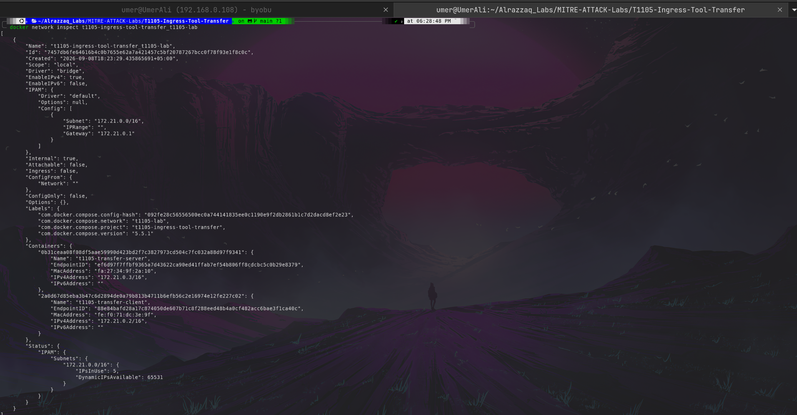
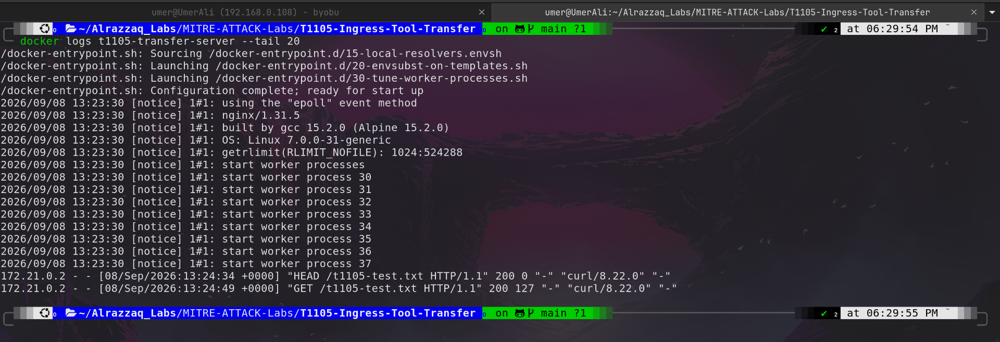
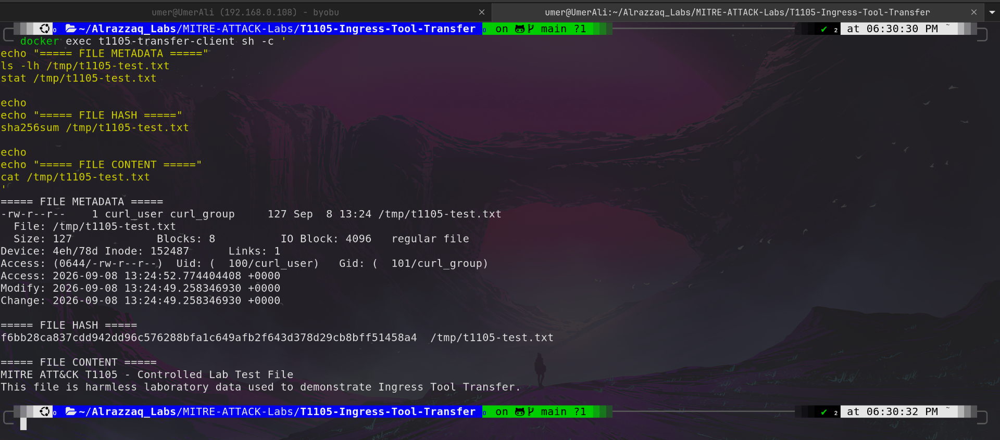
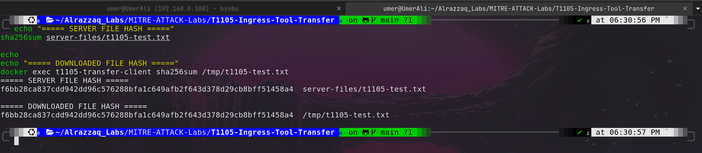

# MITRE ATT&CK T1105 — Ingress Tool Transfer


---

## 📌 Overview

This laboratory demonstrates **MITRE ATT&CK Technique T1105 — Ingress Tool Transfer** using a controlled and isolated Docker environment.

The exercise demonstrates how a file can be transferred into a destination environment using the Linux command-line utility `curl`. A harmless test file was hosted by an internal Nginx server and downloaded by a Docker-based client.

The complete behavioral chain demonstrated in this lab is:

```text
Network Connection
        ↓
HTTP Request
        ↓
File Transfer
        ↓
File Creation
        ↓
SHA-256 Integrity Verification
```

No malware, real payload, or unauthorized target was used.

---

# 🎯 Objectives

* Understand MITRE ATT&CK T1105 — Ingress Tool Transfer.
* Demonstrate controlled file transfer using `curl`.
* Build an isolated Docker-based security laboratory.
* Configure a transfer server and transfer client.
* Capture HTTP transfer evidence.
* Verify file creation on the destination.
* Analyze file metadata.
* Calculate and compare SHA-256 hashes.
* Understand telemetry useful for detecting T1105 behavior.
* Develop professional cybersecurity documentation.

---

# 🧪 Lab Environment

| Component          | Details                 |
| ------------------ | ----------------------- |
| Host OS            | Ubuntu Linux            |
| Architecture       | x86_64                  |
| Container Platform | Docker                  |
| Transfer Server    | Nginx Alpine            |
| Transfer Client    | curl                    |
| Network            | Docker Bridge           |
| Network Isolation  | Internal Docker Network |
| Protocol           | HTTP                    |
| MITRE Technique    | T1105                   |
| Test File          | `t1105-test.txt`        |

---

# 🏗️ Lab Architecture

```text
                         Ubuntu Host
                              │
                              │
                    Docker Internal Network
                              │
                       172.21.0.0/16
                              │
             ┌────────────────┴────────────────┐
             │                                 │
             ▼                                 ▼
   ┌────────────────────┐             ┌────────────────────┐
   │  Transfer Server   │             │  Transfer Client   │
   │                    │             │                    │
   │  Nginx Alpine      │◄────────────│  curl              │
   │  172.21.0.3        │    HTTP     │  172.21.0.2        │
   │                    │             │                    │
   │  t1105-test.txt    │             │  /tmp/              │
   │                    │             │  t1105-test.txt     │
   └────────────────────┘             └────────────────────┘
```

The containers communicate through an **internal Docker bridge network**, keeping the laboratory isolated from external network access.

---

# 📂 Project Structure

```text
T1105-Ingress-Tool-Transfer/
├── docker-compose.yml
├── screenshots/
│   ├── 01-t1105-network-evidence.png
│   ├── 01-t1105-network-evidence.txt
│   ├── 02-t1105-http-transfer-evidence.png
│   ├── 02-t1105-http-transfer-evidence.txt
│   ├── 03-t1105-file-creation-evidence.png
│   ├── 03-t1105-file-creation-evidence.txt
│   └── 04-t1105-integrity-verification.png
└── server-files/
    └── t1105-test.txt
```

---

# 🔬 Lab Tasks

## Task 1 — Deploy the Docker Environment

The laboratory environment was deployed using Docker Compose.

```bash
docker compose up -d
```

The container status was verified with:

```bash
docker compose ps
```

The environment successfully started the following containers:

* `t1105-transfer-server`
* `t1105-transfer-client`

---

## Task 2 — Verify the Isolated Docker Network

The Docker network was inspected using:

```bash
docker network inspect t1105-ingress-tool-transfer_t1105-lab
```

The network configuration confirmed:

* Bridge network
* Internal isolation enabled
* Subnet: `172.21.0.0/16`
* Transfer client: `172.21.0.2`
* Transfer server: `172.21.0.3`

### 📸 Evidence 01 — Isolated Docker Network



**Explanation:**
This screenshot provides visual evidence of the isolated Docker laboratory network. It shows that both the transfer client and transfer server are connected to the same Docker bridge network. The `Internal: true` configuration demonstrates that the network was intentionally isolated for safe laboratory testing.

---

## Task 3 — Verify the Controlled Test File

The harmless test file was stored on the transfer server and verified using:

```bash
docker exec t1105-transfer-server \
cat /usr/share/nginx/html/t1105-test.txt
```

The file contained:

```text
MITRE ATT&CK T1105 - Controlled Lab Test File
This file is harmless laboratory data used to demonstrate Ingress Tool Transfer.
```

This controlled file was used instead of any real executable or malicious payload.

---

## Task 4 — Test HTTP Connectivity

HTTP connectivity was tested from the transfer client:

```bash
docker exec t1105-transfer-client \
curl -I http://transfer-server/t1105-test.txt
```

The server returned:

```text
HTTP/1.1 200 OK
Content-Type: text/plain
Content-Length: 127
```

This confirmed that the client could communicate with the internal HTTP server.

---

## Task 5 — Perform the Ingress Tool Transfer

The controlled file was downloaded using `curl`:

```bash
docker exec t1105-transfer-client \
curl http://transfer-server/t1105-test.txt \
-o /tmp/t1105-test.txt
```

The transfer successfully downloaded **127 bytes**.

The destination file was then verified:

```bash
docker exec t1105-transfer-client \
cat /tmp/t1105-test.txt
```

The content matched the original server-side file.

---

## Task 6 — Analyze HTTP Transfer Evidence

The Nginx server logs were inspected using:

```bash
docker logs t1105-transfer-server --tail 20
```

The relevant entries were:

```text
172.21.0.2 - - [08/Sep/2026:13:24:34 +0000] "HEAD /t1105-test.txt HTTP/1.1" 200 0 "-" "curl/8.22.0" "-"
172.21.0.2 - - [08/Sep/2026:13:24:49 +0000] "GET /t1105-test.txt HTTP/1.1" 200 127 "-" "curl/8.22.0" "-"
```

### 📸 Evidence 02 — HTTP File Transfer



**Explanation:**
This screenshot provides server-side evidence of the transfer. The Nginx access log records a `GET` request from client IP `172.21.0.2` for `t1105-test.txt`. The HTTP response returned status `200`, and `127` bytes were transferred. The `curl/8.22.0` user agent also identifies the transfer utility used by the client.

This demonstrates the network-side behavior associated with the controlled T1105 exercise.

---

## Task 7 — Verify File Creation on the Destination

The downloaded file was inspected on the transfer client:

```bash
docker exec t1105-transfer-client sh -c '
echo "===== FILE METADATA ====="
ls -lh /tmp/t1105-test.txt
stat /tmp/t1105-test.txt

echo
echo "===== FILE HASH ====="
sha256sum /tmp/t1105-test.txt

echo
echo "===== FILE CONTENT ====="
cat /tmp/t1105-test.txt
'
```

The resulting file had:

```text
Path: /tmp/t1105-test.txt
Size: 127 bytes
Permissions: 0644
Owner: curl_user
Group: curl_group
```

### 📸 Evidence 03 — File Creation



**Explanation:**
This screenshot provides destination-side evidence that the transferred file was successfully created. The file metadata shows its location, size, permissions, ownership, and timestamps. The SHA-256 hash and file contents are also displayed, confirming that the downloaded object exists and contains the expected controlled laboratory data.

---

## Task 8 — Verify File Integrity

The original server-side file was hashed:

```bash
sha256sum server-files/t1105-test.txt
```

The downloaded client-side file was hashed:

```bash
docker exec t1105-transfer-client \
sha256sum /tmp/t1105-test.txt
```

Both files produced the following SHA-256 value:

```text
f6bb28ca837cdd942dd96c576288bfa1c649afb2f643d378d29cb8bff51458a4
```

### 📸 Evidence 04 — SHA-256 Integrity Verification



**Explanation:**
This screenshot compares the SHA-256 hashes of the original server-side file and the downloaded client-side file. Both hashes are identical, demonstrating that the transferred file matches the original controlled test file and that its contents were preserved during the transfer.

---

# 🕵️ Detection Perspective

A useful defensive approach for T1105 is to correlate network activity with subsequent file creation.

The laboratory demonstrated the following observable sequence:

```text
Client Network Activity
        ↓
HTTP GET Request
        ↓
Server Access Log
        ↓
127-Byte File Transfer
        ↓
File Created in /tmp
        ↓
File Hash Available
```

Potential telemetry for detecting this behavior includes:

* Network connections
* HTTP requests
* Process execution
* Command-line activity
* File creation events
* File paths
* File hashes
* User/account information
* Parent-child process relationships

A SIEM or EDR can correlate these events to identify potentially suspicious file-transfer behavior.

---

# 🛡️ Defensive Considerations

Organizations can reduce the risk associated with ingress tool transfer by:

* Monitoring network connections.
* Monitoring HTTP and HTTPS activity where appropriate.
* Monitoring command-line utilities such as `curl` and `wget`.
* Detecting unusual file creation in temporary directories.
* Correlating network connections with file creation.
* Restricting unnecessary outbound network access.
* Using application allowlisting where appropriate.
* Monitoring execution of newly downloaded files.
* Performing security analysis on suspicious downloaded objects.
* Centralizing endpoint and network telemetry in a SIEM.

---

# 🔑 Key Concepts

### Ingress Tool Transfer

The transfer of tools, files, or other resources into an environment that may be used by an adversary during an intrusion.

### Curl

A command-line utility used to transfer data over supported network protocols such as HTTP and HTTPS.

### File Creation

The creation of a new file after network activity can provide important endpoint telemetry for security monitoring.

### SHA-256

A cryptographic hash function that can be used to verify file integrity and compare file contents.

### Behavioral Correlation

Combining multiple events—such as network communication followed by file creation—can provide stronger detection than relying on one event alone.

---

# 🌍 Real-World Applications

Ingress Tool Transfer behavior can occur during multiple stages of an intrusion, including:

* Downloading additional tools after initial access.
* Transferring scripts to compromised hosts.
* Retrieving configuration files.
* Downloading follow-on payloads.
* Moving utilities into temporary directories.
* Transferring files between compromised systems.

The same mechanisms can also be used legitimately for software deployment, system administration, automation, and maintenance. Detection therefore requires contextual analysis.

---

# 🧠 Cybersecurity Relevance

T1105 is particularly relevant to SOC analysts because file transfer may be part of a larger attack chain.

A suspicious investigation could follow a sequence such as:

```text
Suspicious Process
       ↓
Network Connection
       ↓
File Download
       ↓
File Creation
       ↓
File Execution
       ↓
Persistence / Discovery / Lateral Movement
```

Correlating these activities can help analysts distinguish legitimate administrative activity from potentially malicious behavior.

---

# 📊 Lab Results

| Test                             | Result   |
| -------------------------------- | -------- |
| Docker environment deployed      | ✅ Passed |
| Internal Docker network verified | ✅ Passed |
| Client/server connectivity       | ✅ Passed |
| HTTP HEAD request                | ✅ Passed |
| HTTP GET request                 | ✅ Passed |
| File transferred                 | ✅ Passed |
| File created on client           | ✅ Passed |
| File content verified            | ✅ Passed |
| SHA-256 hash calculated          | ✅ Passed |
| SHA-256 integrity match          | ✅ Passed |
| T1105 behavior demonstrated      | ✅ Passed |

---

# 🎓 Skills Gained

* MITRE ATT&CK technique mapping
* Docker laboratory design
* Docker networking
* Linux command-line operations
* HTTP file-transfer analysis
* Nginx log analysis
* File metadata analysis
* SHA-256 integrity verification
* Security evidence collection
* Detection engineering concepts
* SOC investigation methodology
* Cybersecurity documentation

---

# ⚠️ Safety Notice

This laboratory was performed entirely in a controlled Docker environment using a harmless test file.

No malware, unauthorized system, or real-world target was involved.

The purpose of this exercise is educational: to understand T1105 behavior and develop defensive monitoring, investigation, and documentation skills.

---

# 🏁 Conclusion

This laboratory successfully demonstrated **MITRE ATT&CK T1105 — Ingress Tool Transfer** in an isolated Docker environment.

A harmless file was transferred from an internal Nginx server to a Docker client using `curl`. The HTTP request was recorded by the server, the file was successfully created on the destination, and SHA-256 verification confirmed that the transferred file matched the original.

The exercise demonstrates how security analysts can investigate file-transfer activity by correlating **network communication, HTTP logs, file creation, metadata, and cryptographic hashes**.

---

## 📚 MITRE ATT&CK

**Technique:** T1105 — Ingress Tool Transfer

**Framework:** MITRE ATT&CK

---

## 👨‍💻 Author

**Umer Ali**

Cybersecurity | Linux | SOC | SIEM | Docker

GitHub: `ua4157489-code`

---

⭐ **This laboratory is part of a practical MITRE ATT&CK cybersecurity portfolio.**
