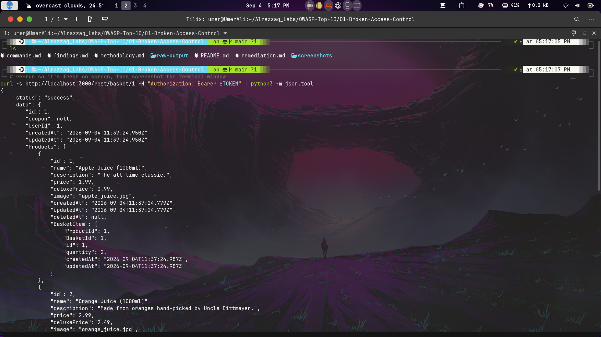
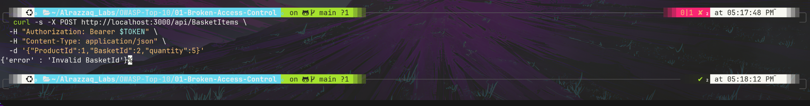

# OWASP A01:2021 — Broken Access Control

Lab target: [OWASP Juice Shop](https://owasp.org/www-project-juice-shop/) (local Docker instance, `127.0.0.1:3000`)

## Summary

Testing focused on Insecure Direct Object Reference (IDOR) vulnerabilities in the basket subsystem. A low-privilege authenticated user ("customer" role) was able to read other users' basket contents by simply incrementing the resource ID in the URL, despite having a valid token tied to their own account. A companion test on the write path showed the same resource type correctly enforces ownership on `POST`, highlighting inconsistent access control implementation across endpoints.

## Findings

| # | Title | Endpoint | Result |
|---|-------|----------|--------|
| 1 | Basket Read IDOR | `GET /rest/basket/:id` | **Vulnerable** — cross-user data disclosure |
| 2 | Basket Write Ownership Check | `POST /api/BasketItems` | Correctly enforced (negative control) |

Full details: [`findings.md`](./findings.md)

## Methodology

See [`methodology.md`](./methodology.md) for the full testing approach.

## Evidence

### Finding 1 — Cross-user basket data read via IDOR

### Finding 2 — Write-path ownership check correctly blocking cross-user write

Raw request/response evidence for every command run is saved in [`raw-output/`](./raw-output/).

## Remediation

See [`remediation.md`](./remediation.md) for fixes and general hardening recommendations.

## Commands

Full list of every command executed during this lab: [`commands.md`](./commands.md)
