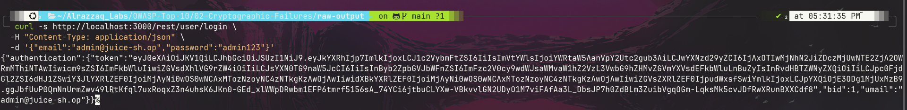
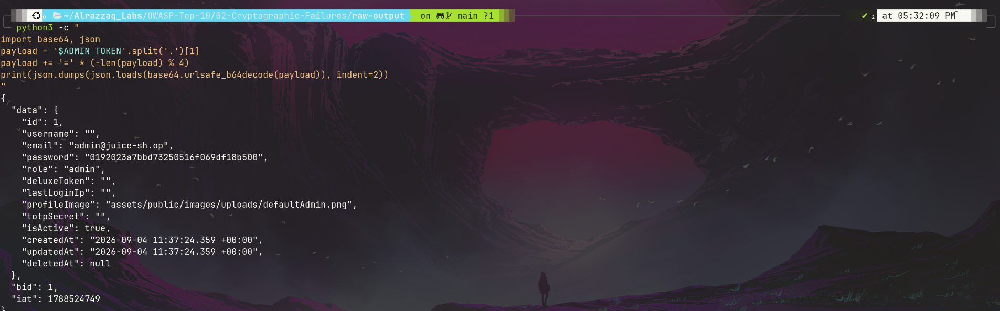

# OWASP A02:2021 — Cryptographic Failures

**Target:** [OWASP Juice Shop](https://owasp.org/www-project-juice-shop/) — local Docker instance (`127.0.0.1:3000`)
**Category:** [A02:2021 – Cryptographic Failures](https://owasp.org/Top10/A02_2021-Cryptographic_Failures/)
**Status:** Complete

---

## Overview

This lab targets weaknesses in how Juice Shop handles authentication secrets and sensitive data. Testing uncovered three chained issues: a well-known default admin credential pair that still works, a JWT payload that leaks more than it should to the client, and password storage using unsalted MD5 — an algorithm considered cryptographically broken. Together these show how a single weak link (predictable credentials) can expose a deeper structural flaw (weak hashing) once you're positioned to look.

## Summary of Findings

| # | Title | Location | Severity | Result |
|---|-------|----------|----------|--------|
| 1 | Default admin credentials accepted | `POST /rest/user/login` | Critical | **Vulnerable** |
| 2 | Sensitive data exposed in JWT payload | Auth token (client-decodable) | High | **Vulnerable** |
| 3 | Unsalted MD5 password hashing | Password storage | Critical | **Vulnerable** |

Full write-up with reproduction steps and impact analysis: [`findings.md`](./findings.md)

## Methodology

Testing followed a linear chain: try known default credentials → inspect what the resulting token reveals → confirm the hashing weakness that token exposes. Full approach and reasoning: [`methodology.md`](./methodology.md)

## Evidence

### 1 — Default admin credentials accepted

### 2 — JWT decode revealing role and password hash

### 3 — Unsalted MD5 hash match (proof of weak hashing)

Raw request/response data for every command executed is saved in [`raw-output/`](./raw-output/).

## Remediation

Concrete fixes for each finding — credential policy, minimal JWT payloads, and migration to a modern salted hashing algorithm — are documented in [`remediation.md`](./remediation.md).

## Reproducing This Lab

Every command run during testing, in order, is logged in [`commands.md`](./commands.md). Requires a local Juice Shop instance running on `localhost:3000`.

---

*Part of an ongoing OWASP Top 10 lab series against OWASP Juice Shop. See the previous lab: A01 — Broken Access Control.*
