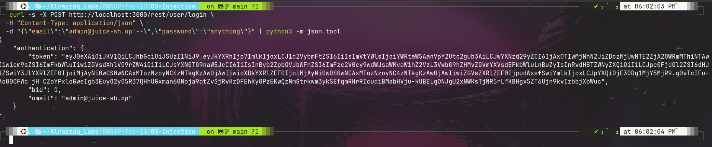
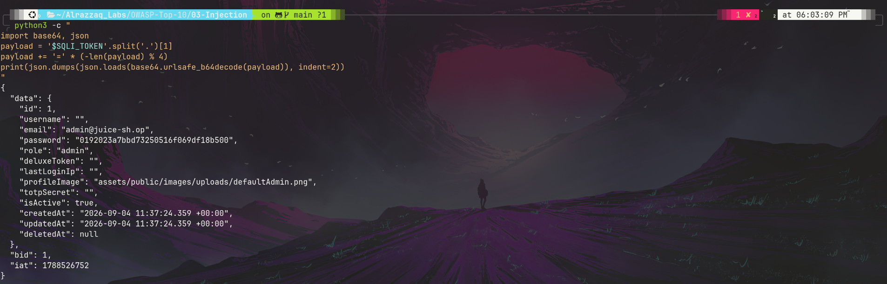
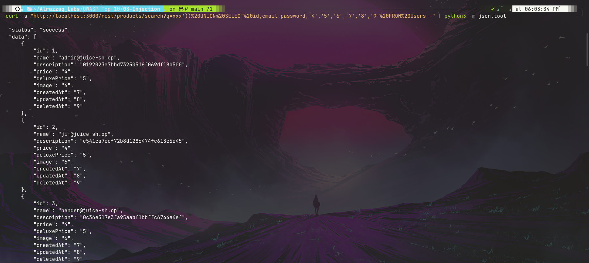

# OWASP A03:2021 — Injection


**Target:** [OWASP Juice Shop](https://owasp.org/www-project-juice-shop/) — local Docker instance (`127.0.0.1:3000`)
**Category:** [A03:2021 – Injection](https://owasp.org/Top10/A03_2021-Injection/)
**Lab series:** OWASP Top 10 vs. Juice Shop — Lab 3 of 10
([← Lab 2: A02 Cryptographic Failures](../02-Cryptographic-Failures/README.md) · [← Lab 1: A01 Broken Access Control](../01-Broken-Access-Control/README.md))

---

## Table of Contents
- [Overview](#overview)
- [Attack Chain](#attack-chain)
- [Summary of Findings](#summary-of-findings)
- [Evidence](#evidence)
- [Methodology](#methodology)
- [Remediation](#remediation)
- [Key Takeaway](#key-takeaway)
- [Reproducing This Lab](#reproducing-this-lab)
- [Skills Demonstrated](#skills-demonstrated)

---

## Overview

This lab targets classic SQL injection in two of Juice Shop's most exposed surfaces: the login form and the public product search box. Both stem from the exact same root cause — untrusted input concatenated directly into SQL queries — but the payloads and impact differ sharply. The login injection bypasses authentication entirely with a single comment character. The search injection goes further, using a UNION-based payload to pull the *entire user table*, hashes included, out through an endpoint that requires no login at all.

## Attack Chain

```
Login field accepts raw SQL syntax     Search field accepts raw SQL syntax
         (Finding 1)                            (Finding 2)
              │                                       │
              ▼                                       ▼
   Comment ('--) strips password    UNION SELECT matches 9-column
        check from query               product schema exactly
              │                                       │
              ▼                                       ▼
     Full admin session issued      Entire Users table (26 accounts,
     with zero valid credentials    emails + password hashes) dumped
```

## Summary of Findings

| # | Title | Location | Severity | Result |
|---|-------|----------|----------|--------|
| 1 | SQL injection — authentication bypass | `POST /rest/user/login` | 🔴 Critical | **Vulnerable** |
| 2 | SQL injection — UNION-based data exfiltration | `GET /rest/products/search` | 🔴 Critical | **Vulnerable** |

Full write-up with reproduction steps, evidence, and impact analysis: **[`findings.md`](./findings.md)**

## Evidence

| # | Description | Screenshot |
|---|--------------|------------|
| 1 | Login succeeds via `' --` comment injection, no valid password used | [`01-sqli-login-bypass.png`](./screenshots/01-sqli-login-bypass.png) |
| 2 | Decoded JWT confirms genuine `role: admin` session, not a fluke response | [`02-sqli-jwt-decode-admin.png`](./screenshots/02-sqli-jwt-decode-admin.png) |
| 3 | UNION-based payload dumps all 26 user emails + password hashes | [`03-sqli-union-users-dump.png`](./screenshots/03-sqli-union-users-dump.png) |





Raw request/response data for every command executed is saved in **[`raw-output/`](./raw-output/)**.

## Methodology

Testing moved from a simple, well-known comment-injection payload against login, to iterative UNION-based testing against search — starting with a baseline query, confirming a failed attempt behaved differently from a successful one, then matching the target table's column count to make the UNION viable. Full reasoning and tooling: **[`methodology.md`](./methodology.md)**

## Remediation

Both findings share the same underlying fix — parameterized queries instead of string concatenation — plus defense-in-depth measures like least-privilege database accounts and input validation. Full details: **[`remediation.md`](./remediation.md)**

## Key Takeaway

Two completely different-looking exploits — an auth bypass and a mass data dump — turned out to be the *same bug* exploited two different ways. This is the core lesson of injection vulnerabilities: fixing them isn't about patching individual payloads or endpoints one at a time, it's about eliminating the pattern (raw string concatenation into queries) everywhere it exists in a codebase. A single overlooked query builder can undermine both authentication and data confidentiality simultaneously.

## Reproducing This Lab

Requires a local Juice Shop instance running on `localhost:3000`. Every command run during testing, in exact order, is logged in **[`commands.md`](./commands.md)**.

## Skills Demonstrated

- SQL injection identification and exploitation (comment-based and UNION-based)
- Iterative payload refinement based on observed application behavior
- Schema inference (column-count matching) for blind UNION attacks
- JWT analysis to verify exploit impact, not just surface-level success
- Root-cause analysis connecting two distinct exploits to a single underlying flaw
- Security documentation for a mixed technical / non-technical audience

---

*Part of an ongoing OWASP Top 10 lab series against OWASP Juice Shop.*
