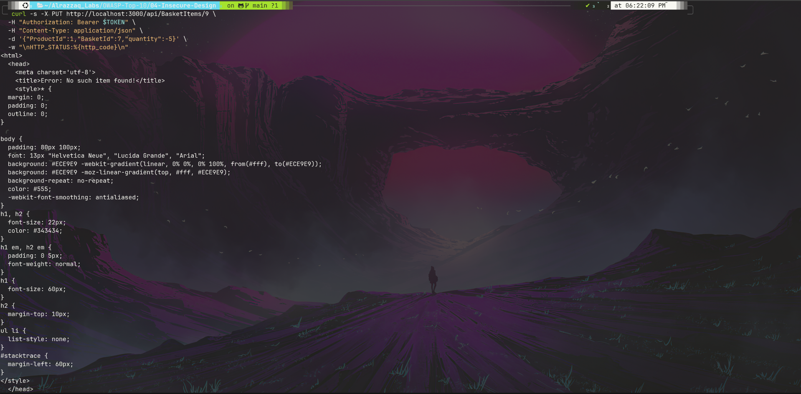
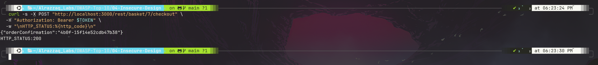
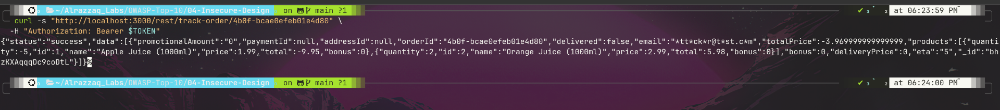

# OWASP A04:2021 — Insecure Design


**Target:** [OWASP Juice Shop](https://owasp.org/www-project-juice-shop/) — local Docker instance (`127.0.0.1:3000`)
**Category:** [A04:2021 – Insecure Design](https://owasp.org/Top10/A04_2021-Insecure_Design/)
**Lab series:** OWASP Top 10 vs. Juice Shop — Lab 4 of 10
([← Lab 3: A03 Injection](../03-Injection/README.md) · [← Lab 2: A02 Cryptographic Failures](../02-Cryptographic-Failures/README.md) · [← Lab 1: A01 Broken Access Control](../01-Broken-Access-Control/README.md))

---

## Table of Contents
- [Overview](#overview)
- [Attack Chain](#attack-chain)
- [Summary of Findings](#summary-of-findings)
- [Evidence](#evidence)
- [Methodology](#methodology)
- [Remediation](#remediation)
- [Key Takeaway](#key-takeaway)
- [Reproducing This Lab](#reproducing-this-lab)
- [Skills Demonstrated](#skills-demonstrated)

---

## Overview

This lab targets a business-logic flaw rather than a single coding bug: Juice Shop validates basket item quantity inconsistently across its own API. The item-creation endpoint accidentally rejects invalid quantities (via an unhandled database exception), but the update endpoint enforces no such check at all — allowing a legitimately-added item to be flipped to a negative quantity after the fact. That negative quantity flows unopposed into the basket total, through checkout, and into a permanently persisted order record, with no payment or address ever required.

## Attack Chain

```
Item added to basket normally         Same item updated via PUT
      (positive quantity)                  to quantity: -5
              │                                    │
              ▼                                    ▼
   CREATE path has accidental,          UPDATE path enforces
   badly-handled DB constraint          no validation at all
              │                                    │
              └───────────────┬────────────────────┘
                               ▼
                Negative quantity flows into
                basket total calculation (-$3.97)
                               │
                               ▼
              Checkout accepts negative-total basket
              (200 OK, no address/payment/delivery required)
                               │
                               ▼
        Confirmed order persisted with totalPrice: -$3.97,
              paymentId: null, addressId: null
```

## Summary of Findings

| # | Title | Location | Severity | Result |
|---|-------|----------|----------|--------|
| 1 | Inconsistent quantity validation (create vs. update) → negative-total checkout | `PUT /api/BasketItems/:id`, `POST /rest/basket/:id/checkout` | 🔴 Critical | **Vulnerable** |
| 2 | Unhandled exceptions leak internal stack traces | `POST /api/BasketItems` | 🟡 Medium | **Vulnerable** |

Full write-up with reproduction steps, evidence, and impact analysis: **[`findings.md`](./findings.md)**

## Evidence

| # | Description | Screenshot |
|---|--------------|------------|
| 1 | `PUT` request updates an existing basket item to `quantity: -5` with a clean `200 OK` | [`01-negative-quantity-put-accepted.png`](./screenshots/01-negative-quantity-put-accepted.png) |
| 2 | Checkout completes successfully despite a negative-total basket, no payment/address required | [`02-checkout-negative-total-succeeds.png`](./screenshots/02-checkout-negative-total-succeeds.png) |
| 3 | Persisted order record shows `totalPrice: -3.97`, `paymentId: null` — negative total survives to a trackable order | [`03-order-record-negative-total-tracked.png`](./screenshots/03-order-record-negative-total-tracked.png) |





Raw request/response data for every command executed is saved in **[`raw-output/`](./raw-output/)**.

## Methodology

Testing began with boundary-value checks on the item-creation endpoint, which surfaced unhandled `500` errors. Rather than treating those as the finding, a control test isolated them as unrelated database-constraint noise. The investigation then pivoted to the update endpoint — the actual source of the vulnerability — and traced the accepted negative quantity all the way through to a persisted, negative-total order to establish real business impact rather than stopping at "the API accepted a bad number." Full reasoning and tooling: **[`methodology.md`](./methodology.md)**

## Remediation

The core fix is a shared, endpoint-agnostic quantity validator applied to every mutating route for the resource, plus server-side recomputation and validation of any financially-impactful total at the point of checkout — never trusting a value carried over from a prior request. Full details: **[`remediation.md`](./remediation.md)**

## Key Takeaway

The most dangerous bugs in this category aren't the ones with no validation at all — they're the ones where validation exists *somewhere* and creates a false sense of security. Here, the create endpoint's accidental (and badly-implemented) rejection of bad quantities masked the fact that the update endpoint had no protection whatsoever. Insecure design isn't found by testing one endpoint thoroughly; it's found by testing every path that touches the same piece of state and asking whether they agree with each other.

## Reproducing This Lab

Requires a local Juice Shop instance running on `localhost:3000` and an authenticated user token. Every command run during testing, in exact order, is logged in **[`commands.md`](./commands.md)**.

## Skills Demonstrated

- Business-logic testing beyond single-parameter injection (cross-endpoint consistency checks)
- Distinguishing genuine findings from test artifacts (unique-constraint collision vs. real validation gap)
- Tracing an accepted bad value through to real, measurable business impact (basket total → checkout → persisted order)
- JWT payload reuse to avoid unnecessary re-authentication during testing
- Security documentation for a mixed technical / non-technical audience

---

*Part of an ongoing OWASP Top 10 lab series against OWASP Juice Shop.*
