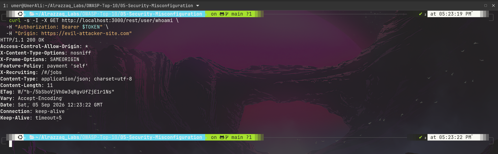
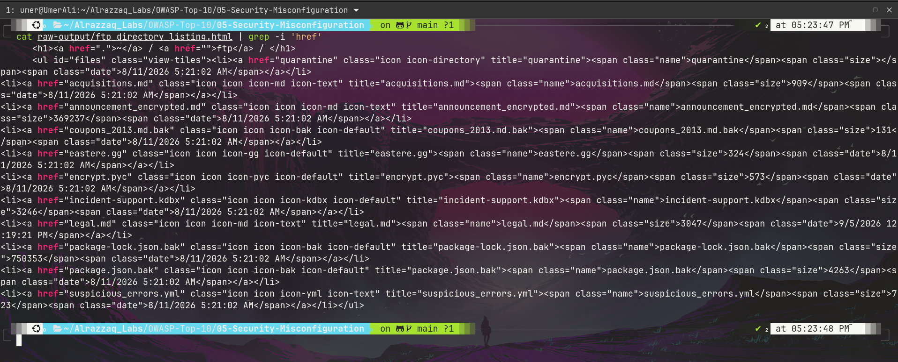
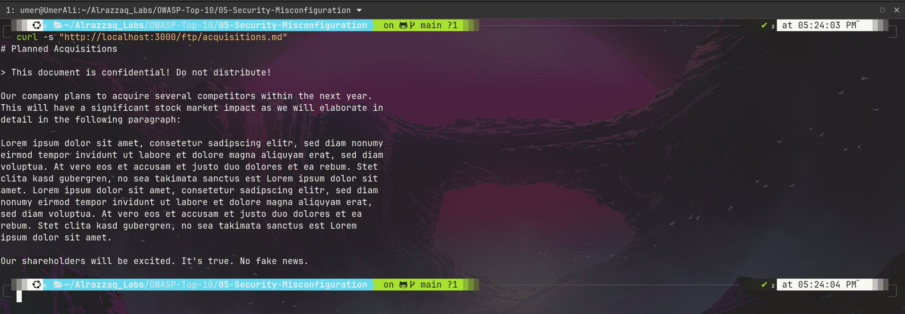

# OWASP A05:2021 — Security Misconfiguration


**Target:** [OWASP Juice Shop](https://owasp.org/www-project-juice-shop/) — local Docker instance (`127.0.0.1:3000`)
**Category:** [A05:2021 – Security Misconfiguration](https://owasp.org/Top10/A05_2021-Security_Misconfiguration/)
**Lab series:** OWASP Top 10 vs. Juice Shop — Lab 5 of 10
([← Lab 4: A04 Insecure Design](../04-Insecure-Design/README.md) · [← Lab 3: A03 Injection](../03-Injection/README.md) · [← Lab 2: A02 Cryptographic Failures](../02-Cryptographic-Failures/README.md) · [← Lab 1: A01 Broken Access Control](../01-Broken-Access-Control/README.md))

---

## Table of Contents
- [Overview](#overview)
- [Attack Chain](#attack-chain)
- [Summary of Findings](#summary-of-findings)
- [Evidence](#evidence)
- [Methodology](#methodology)
- [Remediation](#remediation)
- [Key Takeaway](#key-takeaway)
- [Reproducing This Lab](#reproducing-this-lab)
- [Skills Demonstrated](#skills-demonstrated)

---

## Overview

This lab tests a broad category — leftover defaults and unreviewed exposure rather than a single coding flaw. A quick header sweep on Juice Shop's root page surfaced a wildcard CORS policy and a non-standard information-leaking header, which led to testing whether the CORS misconfiguration was exploitable given the app's token-based auth. Separately, an exposed `/ftp` directory-listing feature was found to reveal filenames implying sensitive content (a password database, dependency manifests, old coupon data) and — most critically — served a document that labels itself "confidential" with no authentication at all.

## Attack Chain

```
Root page headers reveal wildcard CORS       /ftp/ directory listing reachable
   + non-standard info-leaking header              unauthenticated
              │                                            │
              ▼                                            ▼
   Confirmed on authenticated endpoint         Sensitive filenames revealed
   (no Allow-Credentials — impact capped        (.kdbx, .bak, old coupons)
    by Bearer-token auth model)                            │
                                                             ▼
                                              File-type filter blocks .bak/.kdbx
                                              download, but .md files are allowed
                                                             │
                                                             ▼
                                         acquisitions.md fetched — a document
                                         self-labeled "confidential! Do not
                                         distribute!" served to anyone, no login
```

## Summary of Findings

| # | Title | Location | Severity | Result |
|---|-------|----------|----------|--------|
| 1 | Unauthenticated disclosure of a confidential document | `GET /ftp/acquisitions.md` | 🔴 Critical | **Vulnerable** |
| 2 | Unauthenticated directory listing discloses sensitive filenames | `GET /ftp/` | 🟡 Medium | **Vulnerable** |
| 3 | Wildcard CORS policy on authenticated endpoints | All tested endpoints | 🟡 Medium | **Vulnerable** (limited by current auth model) |

Full write-up with reproduction steps, evidence, and impact analysis: **[`findings.md`](./findings.md)**

## Evidence

| # | Description | Screenshot |
|---|--------------|------------|
| 1 | Wildcard `Access-Control-Allow-Origin` returned on an authenticated request with a hostile `Origin` header | [`01-cors-wildcard-headers.png`](./screenshots/01-cors-wildcard-headers.png) |
| 2 | Unauthenticated `/ftp/` listing exposing filenames like `incident-support.kdbx`, `package.json.bak`, `coupons_2013.md.bak` | [`02-ftp-directory-listing-sensitive-files.png`](./screenshots/02-ftp-directory-listing-sensitive-files.png) |
| 3 | A document self-labeled "confidential! Do not distribute!" served with zero authentication | [`03-confidential-acquisitions-md-exposed.png`](./screenshots/03-confidential-acquisitions-md-exposed.png) |





Raw request/response data for every command executed is saved in **[`raw-output/`](./raw-output/)**.

## Methodology

Testing swept common misconfiguration categories starting with a header inspection baseline, then went a layer deeper than surface-level presence checks: the CORS finding was verified against an authenticated endpoint and checked specifically for the credentials-header combination that would make it critical (it wasn't present, capping severity honestly rather than overstating it), and the `/ftp` finding was followed through to an actual content fetch rather than stopping at "a directory listing exists." Full reasoning and tooling: **[`methodology.md`](./methodology.md)**

## Remediation

Every finding here traces back to a permissive default left unreviewed for production: wildcard CORS, enabled directory listing, and sensitive files sitting in a publicly served directory. Full details: **[`remediation.md`](./remediation.md)**

## Key Takeaway

Security misconfiguration findings reward going one step past the obvious. A wildcard CORS header alone isn't automatically critical — checking whether it pairs with credentialed auth is what determines real severity. Likewise, a directory listing alone isn't the finding — actually fetching a file and finding it self-labeled "confidential" is what turns a plausible-sounding issue into indisputable evidence. Precision in severity assessment builds more credibility than treating every misconfiguration as maximum severity by default.

## Reproducing This Lab

Requires a local Juice Shop instance running on `localhost:3000` and (for the CORS test) an authenticated user token. Every command run during testing, in exact order, is logged in **[`commands.md`](./commands.md)**.

## Skills Demonstrated

- Security header analysis and gap identification
- CORS policy testing with attention to the credentials-header distinction that determines real severity
- Directory-listing and exposed-file-server reconnaissance
- Honest severity calibration — not overstating findings capped by other controls (extension filter, lack of credentialed CORS)
- Security documentation for a mixed technical / non-technical audience

---

*Part of an ongoing OWASP Top 10 lab series against OWASP Juice Shop.*
