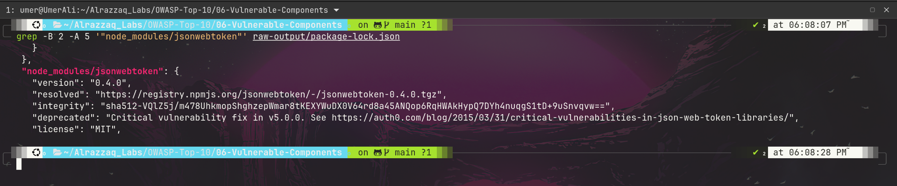
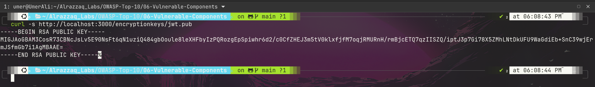
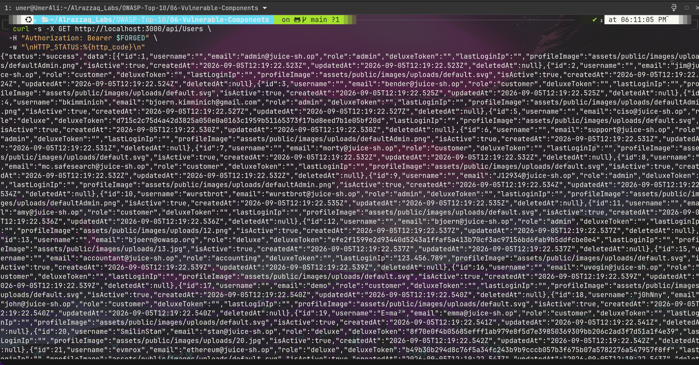
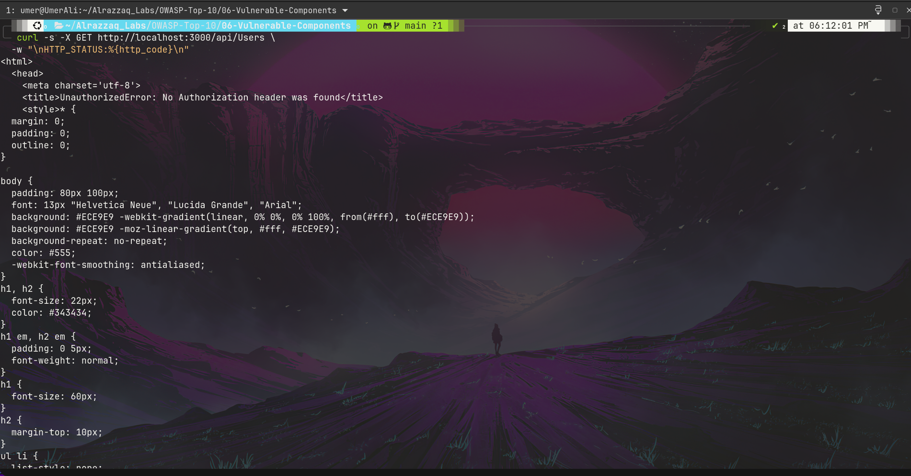

# OWASP A06:2021 — Vulnerable and Outdated Components


**Target:** [OWASP Juice Shop](https://owasp.org/www-project-juice-shop/) — local Docker instance (`127.0.0.1:3000`)
**Category:** [A06:2021 – Vulnerable and Outdated Components](https://owasp.org/Top10/A06_2021-Vulnerable_and_Outdated_Components/)
**Lab series:** OWASP Top 10 vs. Juice Shop — Lab 6 of 10
([← Lab 5: A05 Security Misconfiguration](../05-Security-Misconfiguration/README.md) · [← Lab 4: A04 Insecure Design](../04-Insecure-Design/README.md) · [← Lab 3: A03 Injection](../03-Injection/README.md) · [← Lab 2: A02 Cryptographic Failures](../02-Cryptographic-Failures/README.md) · [← Lab 1: A01 Broken Access Control](../01-Broken-Access-Control/README.md))

---

## Table of Contents
- [Overview](#overview)
- [Attack Chain](#attack-chain)
- [Summary of Findings](#summary-of-findings)
- [Evidence](#evidence)
- [Methodology](#methodology)
- [Remediation](#remediation)
- [Key Takeaway](#key-takeaway)
- [Reproducing This Lab](#reproducing-this-lab)
- [Skills Demonstrated](#skills-demonstrated)

---

## Overview

This lab identifies known-vulnerable dependencies by pulling the application's real `package.json`/`package-lock.json` directly from the running container, rather than guessing versions from banners. Three dependencies stood out for being pinned to old, exact versions while everything else in the manifest uses flexible caret ranges: `jsonwebtoken`, `express-jwt`, and `sanitize-html`. For the most severe of the three — a critical JWT algorithm-confusion bug in `jsonwebtoken@0.4.0` (CVE-2015-9235) — the lab goes beyond citing a CVE number and builds a full, working exploit: a self-forged admin token, signed using the server's own public verification key as an HMAC secret, accepted by a genuinely authentication-gated endpoint.

## Attack Chain

```
Dependency manifest pulled directly          Legitimate token's header
    from running container                     confirms alg: RS256
              │                                          │
              ▼                                          ▼
   jsonwebtoken pinned to 0.4.0            RSA public verification key
   (npm itself flags it deprecated,        fetched from an unauthenticated
    citing a critical vulnerability)              endpoint
              │                                          │
              └────────────────┬─────────────────────────┘
                                ▼
                Forged JWT built: alg switched to HS256,
                signed using the RSA public key as the
                HMAC secret, payload claims role: admin
                                │
                                ▼
              Submitted to a confirmed authentication-
              gated endpoint (401 with no token proven first)
                                │
                                ▼
                200 OK — full user table returned,
                including every admin account
```

## Summary of Findings

| # | Title | Location | Severity | Result |
|---|-------|----------|----------|--------|
| 1 | Critical algorithm-confusion vulnerability in `jsonwebtoken` (CVE-2015-9235) — full working exploit | `jsonwebtoken@0.4.0`, `GET /api/Users` | 🔴 Critical | **Vulnerable — exploited** |
| 2 | Authorization bypass in `express-jwt` (CVE-2020-15084) | `express-jwt@0.1.3` | 🟠 High | **Vulnerable (version-confirmed)** |
| 3 | Cross-site scripting in `sanitize-html` (CVE-2016-1000237) | `sanitize-html@1.4.2` | 🟡 Medium | **Vulnerable (version-confirmed)** |

Full write-up with reproduction steps, evidence, and impact analysis: **[`findings.md`](./findings.md)**

## Evidence

| # | Description | Screenshot |
|---|--------------|------------|
| 1 | npm's own metadata flags the installed `jsonwebtoken` version as deprecated, citing a critical vulnerability | [`01-jsonwebtoken-deprecated-critical-cve.png`](./screenshots/01-jsonwebtoken-deprecated-critical-cve.png) |
| 2 | RSA public verification key retrieved from an unauthenticated endpoint | [`02-rsa-public-key-exposed.png`](./screenshots/02-rsa-public-key-exposed.png) |
| 3 | Forged admin token accepted — full user table returned | [`03-forged-admin-token-bypasses-auth.png`](./screenshots/03-forged-admin-token-bypasses-auth.png) |
| 4 | Control: same endpoint, no token, clean `401` rejection | [`04-no-token-401-baseline.png`](./screenshots/04-no-token-401-baseline.png) |






Raw request/response data for every command executed is saved in **[`raw-output/`](./raw-output/)**.

## Methodology

Rather than inferring versions from error-page banners, the real dependency manifest was pulled directly from the container's filesystem. Every dependency pinned to an old exact version (breaking from the caret-range convention used elsewhere) was treated as a signal worth investigating, then cross-referenced against public CVE databases. For the most severe finding, the investigation went further than citation: the live signing algorithm was confirmed, the public key was retrieved, a forged token was constructed, and — critically — a clean control (`401` with no token) was established before the forged-token test, avoiding a false positive from an endpoint that might already be open by default. Full reasoning and tooling: **[`methodology.md`](./methodology.md)**

## Remediation

All three findings trace to the same pattern: dependencies pinned to old exact versions and never revisited. The concrete fix is upgrading each package and, for the JWT libraries specifically, always explicitly specifying allowed algorithms at verification time rather than trusting what a token claims about itself. Full details: **[`remediation.md`](./remediation.md)**

## Key Takeaway

A version number in a dependency file is a lead, not a finding. The difference between "this library has a CVE" and "this application is actually exploitable" is a working proof-of-concept — and building one requires the same discipline as any other test in this series: establish a clean baseline/control first, so a successful-looking result can't be mistaken for an endpoint that was never actually protected in the first place.

## Reproducing This Lab

Requires a local Juice Shop instance running on `localhost:3000` with Docker container filesystem access (`docker cp`/`docker exec`). Every command run during testing, in exact order, is logged in **[`commands.md`](./commands.md)**.

## Skills Demonstrated

- Direct container filesystem inspection to obtain ground-truth dependency versions
- Pattern-based triage (spotting version-pinning anomalies) rather than exhaustive manual review
- CVE/NVD and GitHub Advisory Database research and version-range matching
- Manual JWT construction and signature forgery without relying on a JWT library (`hmac`/`hashlib`/`base64` from first principles)
- Control-based verification methodology to avoid false-positive exploit claims
- Security documentation for a mixed technical / non-technical audience

---

*Part of an ongoing OWASP Top 10 lab series against OWASP Juice Shop.*
