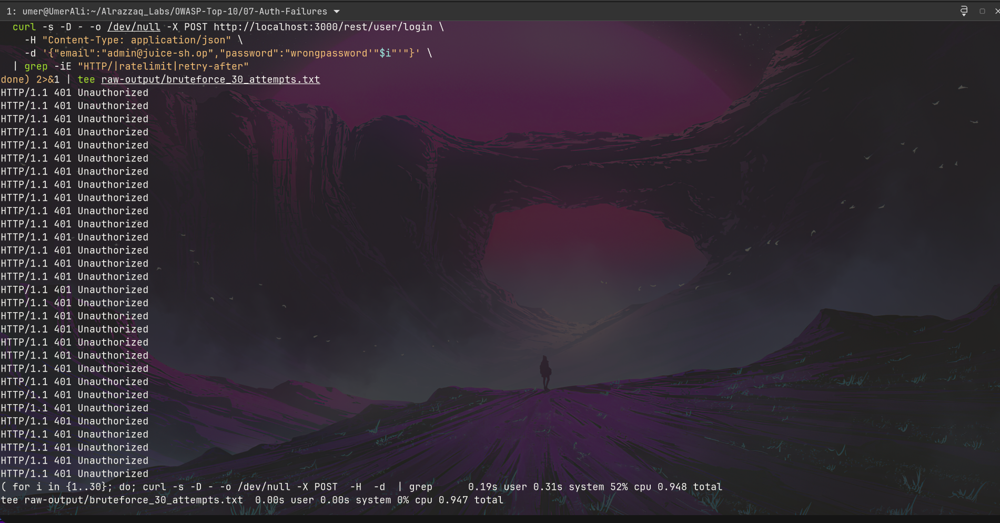
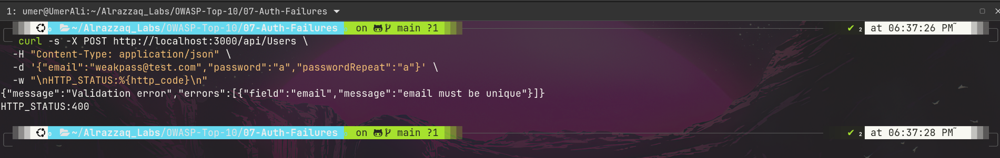
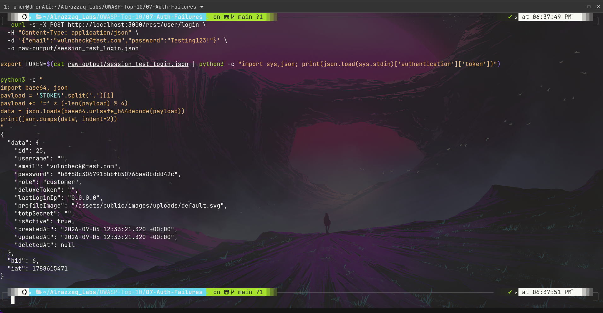

# OWASP A07:2021 — Identification and Authentication Failures


**Target:** [OWASP Juice Shop](https://owasp.org/www-project-juice-shop/) — local Docker instance (`127.0.0.1:3000`)
**Category:** [A07:2021 – Identification and Authentication Failures](https://owasp.org/Top10/A07_2021-Identification_and_Authentication_Failures/)
**Lab series:** OWASP Top 10 vs. Juice Shop — Lab 7 of 10
([← Lab 6: A06 Vulnerable Components](../06-Vulnerable-Components/README.md) · [← Lab 5: A05 Security Misconfiguration](../05-Security-Misconfiguration/README.md) · [← Lab 4: A04 Insecure Design](../04-Insecure-Design/README.md) · [← Lab 3: A03 Injection](../03-Injection/README.md) · [← Lab 2: A02 Cryptographic Failures](../02-Cryptographic-Failures/README.md) · [← Lab 1: A01 Broken Access Control](../01-Broken-Access-Control/README.md))

---

## Table of Contents
- [Overview](#overview)
- [Attack Chain](#attack-chain)
- [Summary of Findings](#summary-of-findings)
- [Evidence](#evidence)
- [Methodology](#methodology)
- [Remediation](#remediation)
- [Key Takeaway](#key-takeaway)
- [Reproducing This Lab](#reproducing-this-lab)
- [Skills Demonstrated](#skills-demonstrated)

---

## Overview

This lab tests the full lifecycle of authentication, not just the login form itself: whether attempts to guess a password are throttled, whether weak passwords are even allowed, and — perhaps most interestingly — what happens to a session after login. Juice Shop turned out to have no brute-force protection despite shipping a rate-limiting library, no password complexity enforcement, no token expiration, no real server-side logout, and — discovered while investigating the token's expiry — a password hash embedded directly inside every issued JWT.

## Attack Chain

```
Login endpoint tested with 30 rapid            Registration tested with a
   failed attempts, no delay                    single-character password
              │                                            │
              ▼                                            ▼
    All 30 return 401 in 1.25s,               201 Created — accepted with
    zero throttling despite                    zero complexity enforcement
    express-rate-limit being                              │
    present in the dependency tree                         │
              │                                            │
              └─────────────────┬──────────────────────────┘
                                 ▼
                  Session lifecycle investigated:
                  /rest/user/logout resolves to no real route
                                 │
                                 ▼
                Fresh token decoded — no 'exp' claim present,
                confirming indefinite validity with no
                server-side way to revoke it
                                 │
                                 ▼
                Same decoding also reveals the user's own
                password hash embedded in the token payload
```

## Summary of Findings

| # | Title | Location | Severity | Result |
|---|-------|----------|----------|--------|
| 1 | No brute-force protection on login | `POST /rest/user/login` | 🟠 High | **Vulnerable** |
| 2 | No password complexity enforcement | `POST /api/Users` | 🟡 Medium | **Vulnerable** |
| 3 | No token expiration + no server-side logout | Token issuance / session lifecycle | 🟠 High | **Vulnerable** |
| 4 | Password hash embedded in JWT payload | Token issuance (all logins) | 🟡 Medium | **Vulnerable** |

Full write-up with reproduction steps, evidence, and impact analysis: **[`findings.md`](./findings.md)**

## Evidence

| # | Description | Screenshot |
|---|--------------|------------|
| 1 | 30 rapid failed login attempts, all `401`, zero throttling, completed in 1.25 seconds | [`01-no-bruteforce-protection.png`](./screenshots/01-no-bruteforce-protection.png) |
| 2 | Registration accepts a single-character password with `201 Created` | [`02-weak-password-accepted.png`](./screenshots/02-weak-password-accepted.png) |
| 3 | Decoded JWT payload showing only `iat`, no `exp` claim — the token never expires | [`03-token-no-expiration-claim.png`](./screenshots/03-token-no-expiration-claim.png) |
| 4 | Same decoded payload showing the user's password hash embedded directly in the token | [`04-password-hash-in-token-payload.png`](./screenshots/04-password-hash-in-token-payload.png) |


*30 rapid login attempts against a known account, all returning `401` with zero throttling or lockout — despite `express-rate-limit` being present in the app's own dependencies.*


*A single-character password (`"a"`) accepted at registration with `201 Created` — no minimum length or complexity check enforced.*


*Decoded JWT payload containing only `iat` (issued-at) — no `exp` claim, meaning the token has no built-in expiry.*


*The same decoded payload also reveals the user's password hash embedded directly in the token, readable by anyone holding it.*

Raw request/response data for every command executed is saved in **[`raw-output/`](./raw-output/)**.

## Methodology

Testing started at the login boundary (can attempts be guessed unimpeded?) and moved outward to the full session lifecycle (can a resulting token ever be revoked, and what does it expose?). The brute-force test was deliberately scaled and timed to produce a citable, quantified result rather than a vague observation, and was sharpened by a callback to the A06 lab's dependency findings — `express-rate-limit` being present but apparently unused on this endpoint. The token-expiry investigation surfaced a second, unplanned finding (the embedded password hash) simply by decoding the payload thoroughly rather than checking only for the one claim being tested. Full reasoning and tooling: **[`methodology.md`](./methodology.md)**

## Remediation

The fixes span the full authentication lifecycle: applying the rate-limiting capability that already exists in the codebase to the login route specifically, enforcing a real password policy server-side, issuing short-lived tokens with genuine server-side revocation, and stripping unnecessary sensitive fields (like the password hash) out of the token payload entirely. Full details: **[`remediation.md`](./remediation.md)**

## Key Takeaway

Authentication isn't secured by a strong login check alone — every finding in this lab is a gap *after* that point: no throttling on repeated attempts, no policy on what a password can be, and no real control over a session once it exists. The most interesting finding here (the embedded password hash) wasn't even the target of the test that found it — it surfaced from decoding a token fully instead of checking only the one field being investigated, a reminder that thorough inspection of already-available data is often more productive than chasing a new attack surface.

## Reproducing This Lab

Requires a local Juice Shop instance running on `localhost:3000`. Every command run during testing, in exact order, is logged in **[`commands.md`](./commands.md)**.

## Skills Demonstrated

- Quantified brute-force testing (volume, timing, header inspection) rather than qualitative "seems unprotected" observations
- Cross-lab correlation (using A06's dependency findings to sharpen this lab's rate-limiting test)
- Full session-lifecycle analysis beyond the login boundary (logout behavior, token expiry, token content)
- JWT payload decoding and interpretation without any cracking or brute-forcing required
- Recognizing and documenting an incidental finding discovered during an unrelated test
- Security documentation for a mixed technical / non-technical audience

---

*Part of an ongoing OWASP Top 10 lab series against OWASP Juice Shop.*
