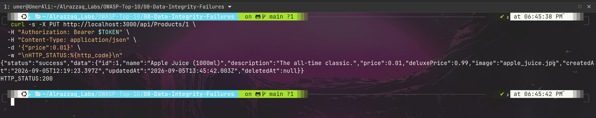
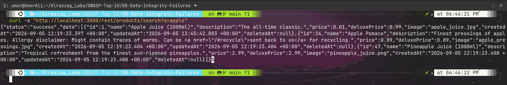
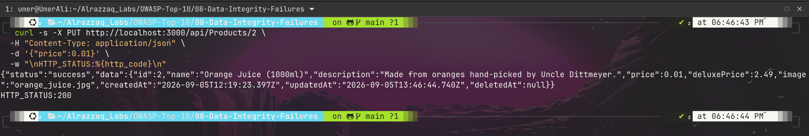

# OWASP A08:2021 - Software and Data Integrity Failures

**Target:** OWASP Juice Shop - Local Docker instance - http://127.0.0.1:3000

---

## At a Glance

| | |
|---|---|
| **Category** | A08:2021 - Software and Data Integrity Failures |
| **Vulnerable endpoint** | `PUT /api/Products/:id` |
| **Severity** | Critical |
| **Auth required to exploit** | None |
| **Impact** | Storefront-wide, publicly visible price tampering |

---

## Summary

Juice Shop's product-update endpoint accepts write requests with no authentication and no authorization check. Testing showed the flaw at two escalating levels of severity:

1. A customer-role account (no special privileges) could overwrite any product's price.
2. The exact same tamper succeeded with zero credentials - no token, no session, nothing.

In both cases, the tampered price was immediately visible in the public, unauthenticated storefront search - confirming this isn't just an API artifact but a real, storefront-wide integrity failure. This is the archetypal A08 issue: the application trusted incoming data to overwrite an authoritative business record without verifying who was allowed to send it.

---

## Findings

| # | Title | Endpoint | Auth Needed | Result |
|---|-------|----------|--------------|--------|
| 1 | Product Price Tampering (Customer Token) | `PUT /api/Products/:id` | Valid customer JWT | Succeeded |
| 1a | Product Price Tampering (Zero Auth) | `PUT /api/Products/:id` | None | Succeeded |

Full write-up with root cause and severity justification: [findings.md](./findings.md)

---

## Evidence

**1. Customer-role token tampers Apple Juice's price to $0.01**

**2. Tampered price confirmed live in public, unauthenticated search**

**3. Same tamper succeeds with zero authentication whatsoever**

Raw request/response payloads for every step: [raw-output/](./raw-output/)

---

## Methodology

Full testing approach - baseline capture, escalation from authenticated to unauthenticated, and real-world impact verification via the public search endpoint: [methodology.md](./methodology.md)

---

## Remediation

Authentication enforcement, role-based authorization, and defense-in-depth recommendations (audit logging, default-deny scaffolding, regression tests): [remediation.md](./remediation.md)

---

## Commands

Complete, ordered list of every command executed during this lab (including cleanup/restoration): [commands.md](./commands.md)

---

## Structure

08-Data-Integrity-Failures/
├── commands.md
├── findings.md
├── methodology.md
├── raw-output/
├── README.md
├── remediation.md
└── screenshots/

