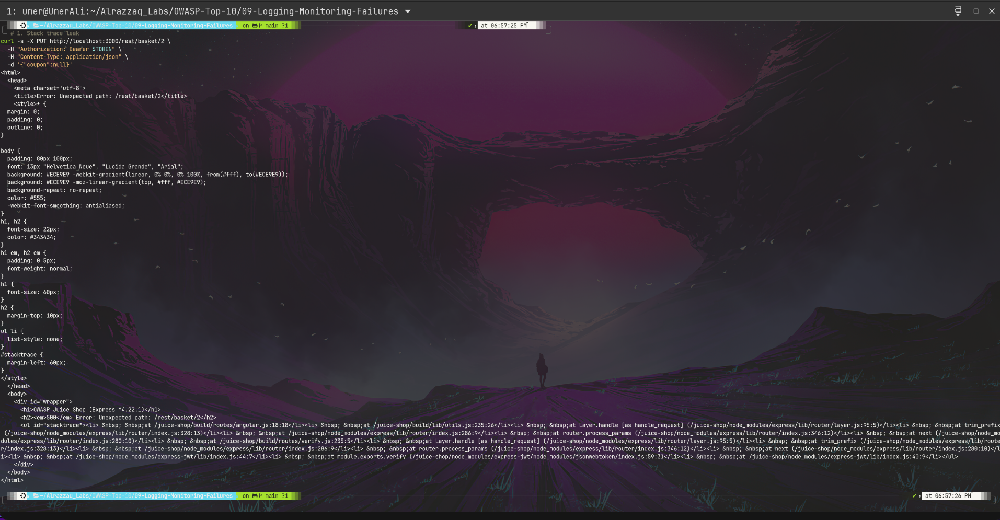
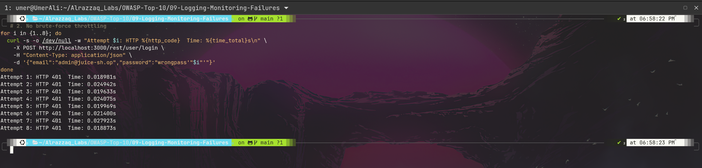
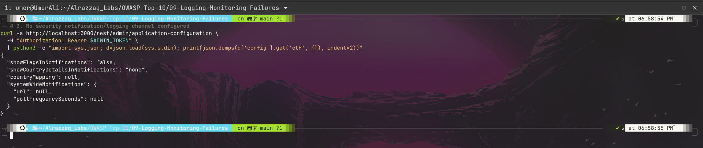

# OWASP A09:2021 - Security Logging and Monitoring Failures

**Target:** OWASP Juice Shop - Local Docker instance - http://127.0.0.1:3000

---

## At a Glance

| | |
|---|---|
| **Category** | A09:2021 - Security Logging and Monitoring Failures |
| **Findings** | 3 |
| **Nature** | Absence-of-control findings (no single exploitable endpoint) |
| **Systemic implication** | Every prior lab's attack (A01-A08) would go undetected |

---

## Summary

This lab tested whether Juice Shop detects, logs, or responds to malicious activity - independent of whether that activity succeeds. Three angles were tested, each confirming a gap:

1. Server errors leak full internal stack traces to the client instead of being caught and logged server-side.
2. Eight consecutive failed admin login attempts produced identical, unthrottled responses - no lockout, delay, or detection.
3. The application's own configuration confirms no security notification or audit-log channel is active.

Taken together, these findings mean that every vulnerability demonstrated earlier in this lab series - the basket IDOR, the default admin credentials, the forged JWT, the unauthenticated price tampering - would plausibly leave no trace in this application as configured.

---

## Findings

| # | Title | Evidence Type | Severity |
|---|-------|----------------|----------|
| 1 | Verbose stack trace exposure on server errors | Direct response leak | Medium |
| 2 | No brute-force detection/throttling on login | Timing + status analysis | High |
| 3 | No security notification/logging channel configured | Config inspection | Medium |

Full write-up: [findings.md](./findings.md)

---

## Evidence

**1. Full internal stack trace leaked on a routine 500 error**

**2. Eight failed logins, zero throttling, zero detection**

**3. No security notification channel configured anywhere in the app**

Raw request/response evidence: [raw-output/](./raw-output/)

---

## Methodology

Approach for testing absence-of-control findings (error handling, brute-force response, audit trail discovery): [methodology.md](./methodology.md)

---

## Remediation

Centralized error handling, rate-limiting, and security event logging/alerting recommendations: [remediation.md](./remediation.md)

---

## Commands

Full command log for this lab: [commands.md](./commands.md)

---

## Structure

09-Logging-Monitoring-Failures/
├── commands.md
├── findings.md
├── methodology.md
├── raw-output/
├── README.md
├── remediation.md
└── screenshots/
