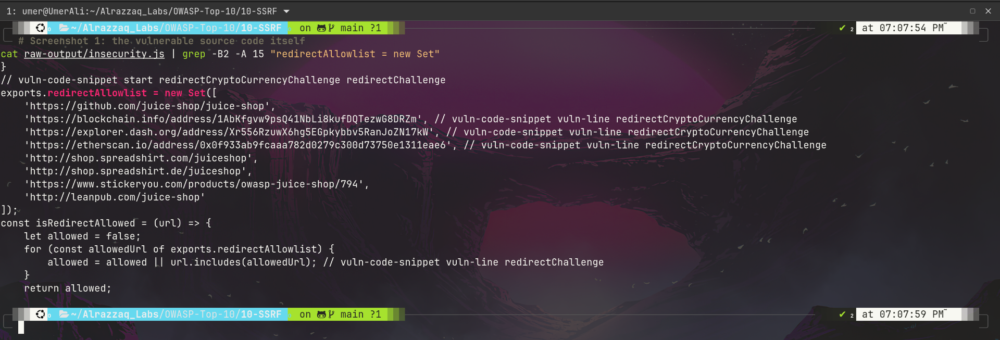
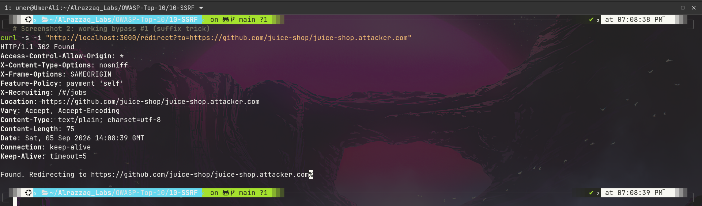
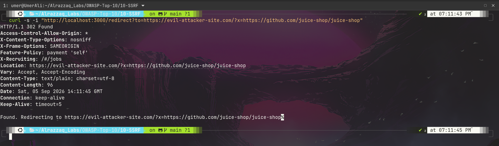

# OWASP A10:2021 - Server-Side Request Forgery

**Target:** OWASP Juice Shop - Local Docker instance - http://127.0.0.1:3000

---

## At a Glance

| | |
|---|---|
| **Category** | A10:2021 - Server-Side Request Forgery |
| **Vulnerable endpoint** | `GET /redirect?to=<url>` |
| **Severity** | High |
| **Root cause** | Substring-containment (`.includes()`) URL allowlist validation |
| **Confirmed exploits** | 2 distinct working bypass patterns |

---

## Summary

Juice Shop's redirect endpoint validates target URLs against an allowlist, but the validation function checks whether the allowed string appears **anywhere** in the supplied URL (`url.includes(allowedUrl)`) rather than properly parsing and matching the URL's actual host. This was confirmed by extracting the real server-side source code directly from the running container after black-box guessing failed to identify the correct allowlist entries.

Two distinct, independently working exploits were built directly from the confirmed root cause:

1. Appending an attacker-controlled domain as a suffix to an allowed URL string
2. Embedding an allowed URL string inside a query parameter on a completely attacker-controlled domain

Both produced a live `302 Found` redirect to attacker infrastructure from the application's own trusted domain - a textbook open redirect, and the exact class of validation flaw that leads to true SSRF wherever the same pattern is applied to server-side outbound requests rather than client-side redirects.

---

## Findings

| # | Title | Endpoint | Result |
|---|-------|----------|--------|
| 1 | Open Redirect via Flawed Allowlist (`.includes()` bypass) | `GET /redirect?to=` | Confirmed - 2 working exploit variants |

Full write-up with source-level root cause: [findings.md](./findings.md)

---

## Evidence

**1. The vulnerable validation logic, extracted directly from the running container**

**2. Bypass 1 - allowed string as prefix, attacker domain appended as suffix**

**3. Bypass 2 - allowed string embedded anywhere in a fully attacker-controlled URL**

Raw request/response evidence and extracted source files: [raw-output/](./raw-output/)

---

## Methodology

Includes the black-box-to-white-box escalation technique used when initial guessing failed (extracting real source via `docker cp` after discovering the container has no shell/exec capability): [methodology.md](./methodology.md)

---

## Remediation

Proper URL-parsing-based allowlist validation, plus general SSRF defense-in-depth recommendations: [remediation.md](./remediation.md)

---

## Commands

Full command log for this lab, including failed guesses and the successful root-cause-driven exploits: [commands.md](./commands.md)

---

## Structure

10-SSRF/
├── commands.md
├── findings.md
├── methodology.md
├── raw-output/
├── README.md
├── remediation.md
└── screenshots/
