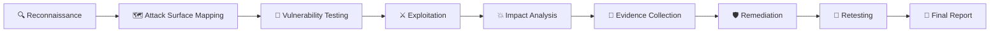

<div align="center">

# 🔴 OWASP TOP 10
## WEB APPLICATION SECURITY LABS

```text
 ██████╗ ██╗    ██╗ █████╗ ███████╗██████╗ 
██╔═══██╗██║    ██║██╔══██╗██╔════╝██╔══██╗
██║   ██║██║    ██║███████║███████╗██████╔╝
██║   ██║██║    ██║██╔══██║╚════██║██╔═══╝ 
╚██████╔╝╚██████╔╝██║  ██║███████║██║     
 ╚═════╝  ╚═════╝ ╚═╝  ╚═╝╚══════╝╚═╝     
```

### 🍊 OWASP JUICE SHOP × OFFENSIVE SECURITY
**Hands-On Web Application Penetration Testing • Vulnerability Research • Security Analysis**

<br>


<br>

> **🔍 Discover → 🧪 Test → ⚔️ Exploit → 💥 Analyze → 🛡️ Remediate → 🔄 Retest**

</div>

---

# 🛰️ SECURITY RESEARCH MISSION

```text
╔══════════════════════════════════════════════════════════════════════╗
║                    🔴 SECURITY OPERATIONS CONSOLE                   ║
╠══════════════════════════════════════════════════════════════════════╣
║                                                                      ║
║  TARGET       : 🍊 OWASP JUICE SHOP                                 ║
║  OBJECTIVE    : Identify & analyze OWASP Top 10 vulnerabilities      ║
║  ENVIRONMENT  : 🐳 Isolated / Authorized Security Laboratory         ║
║  APPROACH     : Offensive Web Application Security Testing           ║
║                                                                      ║
║  RECON        : ████████████████████  COMPLETE                     ║
║  ENUMERATION  : ████████████████████  COMPLETE                     ║
║  EXPLOITATION : ████████████████████  COMPLETE                     ║
║  REPORTING    : ████████████████████  COMPLETE                     ║
║                                                                      ║
║  OWASP       : [████████████████████] 100%                          ║
║  COMPLETED   : A01 → A10 (ALL CATEGORIES)                            ║
║  STATUS       : 🏆 ALL LABS COMPLETE                                ║
║                                                                      ║
╚══════════════════════════════════════════════════════════════════════╝
```

---

# ⚔️ PROJECT OVERVIEW

This repository is a **hands-on Web Application Security research portfolio** covering the full **OWASP Top 10 (2021)** using the intentionally vulnerable **OWASP Juice Shop** application.

The goal was never just to complete challenges. The goal was to understand how vulnerabilities are:

```text
        DISCOVERED
            ↓
        VALIDATED
            ↓
        EXPLOITED
            ↓
        ANALYZED
            ↓
        DOCUMENTED
            ↓
        REMEDIATED
            ↓
        RETESTED
```

Every laboratory exercise is documented with practical evidence, technical observations, attack methodology, security impact, and remediation guidance. Several labs go beyond black-box testing into source-level root cause analysis (e.g. extracting and reading actual vulnerable code from the running container).

---

# 🍊 TARGET ENVIRONMENT

## OWASP Juice Shop

The primary target for this project is **OWASP Juice Shop**, an intentionally insecure modern web application designed for security training and vulnerability research.

```text
                         🔴 ATTACKER
                              │
                              │
                       HTTP / HTTPS
                              │
                              ▼
                 ┌──────────────────────┐
                 │   🍊 OWASP JUICE     │
                 │        SHOP          │
                 │                      │
                 │  Web Application      │
                 │  REST APIs            │
                 │  Authentication       │
                 │  Business Logic       │
                 │  Database             │
                 └──────────┬───────────┘
                            │
                            ▼
                    🔎 VULNERABILITY
                       DISCOVERY
                            │
                            ▼
                     📸 EVIDENCE
                            │
                            ▼
                    📝 SECURITY REPORT
```

---

# 🎯 PROJECT OBJECTIVES

* 🔍 Understand the OWASP Top 10
* 🌐 Perform web application reconnaissance
* 🧭 Identify attack surfaces
* 🔐 Analyze authentication and authorization
* 🧪 Perform vulnerability testing
* ⚔️ Reproduce vulnerabilities in a controlled environment
* 📡 Analyze HTTP requests and responses
* 💥 Determine security impact
* 📸 Capture reproducible evidence
* 🛡️ Understand remediation techniques
* 📝 Produce professional security documentation

---

# 📊 OWASP TOP 10 — FINAL PROGRESS

<div align="center">

## `10 / 10` CATEGORIES COMPLETED
### 🏆 100% PROJECT COMPLETION

```text
████████████████████████████████████████████████
```

</div>

---

## 🗺️ A01 → A10 SECURITY ROADMAP

|     ID     | OWASP Category                             |     Target    |      Status      |
| :--------: | ------------------------------------------- | :-----------: | :--------------: |
| 🔴 **A01** | Broken Access Control                       | 🍊 Juice Shop | 🟢 **COMPLETED** |
| 🔴 **A02** | Cryptographic Failures                      | 🍊 Juice Shop | 🟢 **COMPLETED** |
| 🔴 **A03** | Injection                                   | 🍊 Juice Shop | 🟢 **COMPLETED** |
| 🔴 **A04** | Insecure Design                             | 🍊 Juice Shop | 🟢 **COMPLETED** |
| 🔴 **A05** | Security Misconfiguration                   | 🍊 Juice Shop | 🟢 **COMPLETED** |
| 🔴 **A06** | Vulnerable and Outdated Components          | 🍊 Juice Shop | 🟢 **COMPLETED** |
| 🔴 **A07** | Identification and Authentication Failures  | 🍊 Juice Shop | 🟢 **COMPLETED** |
| 🔴 **A08** | Software and Data Integrity Failures        | 🍊 Juice Shop | 🟢 **COMPLETED** |
| 🔴 **A09** | Security Logging and Monitoring Failures    | 🍊 Juice Shop | 🟢 **COMPLETED** |
| 🔴 **A10** | Server-Side Request Forgery                 | 🍊 Juice Shop | 🟢 **COMPLETED** |

---

# 🏆 COMPLETED LABS — HIGHLIGHTS

```text
╔════════════════════════════════════════════════════════╗
║                  COMPLETED RESEARCH                    ║
╠════════════════════════════════════════════════════════╣
║                                                        ║
║  🟢 A01  Broken Access Control                         ║
║  🟢 A02  Cryptographic Failures                        ║
║  🟢 A03  Injection                                     ║
║  🟢 A04  Insecure Design                                ║
║  🟢 A05  Security Misconfiguration                      ║
║  🟢 A06  Vulnerable and Outdated Components             ║
║  🟢 A07  Identification and Authentication Failures     ║
║  🟢 A08  Software and Data Integrity Failures           ║
║  🟢 A09  Security Logging and Monitoring Failures       ║
║  🟢 A10  Server-Side Request Forgery                    ║
║                                                        ║
║  ──────────────────────────────────────────────────    ║
║                                                        ║
║  📊 Progress: 10 / 10                                 ║
║  🏆 Completion: 100%                                   ║
║                                                        ║
╚════════════════════════════════════════════════════════╝
```

### 🔴 A01 — Broken Access Control
IDOR on basket read endpoint (`GET /rest/basket/:id`) allowed cross-user data disclosure with a valid but unrelated token; write endpoint correctly enforced ownership (documented asymmetry).
➡️ **[Open A01 Lab →](./01-Broken-Access-Control/)**

### 🔴 A02 — Cryptographic Failures
Default admin credentials (`admin@juice-sh.op` / `admin123`) granted full admin access; confirmed unsalted MD5 password hashing via direct hash comparison.
➡️ **[Open A02 Lab →](./02-Cryptographic-Failures/)**

### 🔴 A03 — Injection
Classic and blind injection testing against Juice Shop's search and authentication surfaces.
➡️ **[Open A03 Lab →](./03-Injection/)**

### 🔴 A04 — Insecure Design
Business logic and design-level flaws that exist independent of implementation bugs.
➡️ **[Open A04 Lab →](./04-Insecure-Design/)**

### 🔴 A05 — Security Misconfiguration
Default configurations, verbose framework behavior, and unnecessary exposure reviewed across the application.
➡️ **[Open A05 Lab →](./05-Security-Misconfiguration/)**

### 🔴 A06 — Vulnerable and Outdated Components
Forged an admin JWT via the `jsonwebtoken@0.4.0` RS256-to-HS256 algorithm confusion vulnerability (CVE-2015-9235), using the application's own publicly-exposed RSA public key as the HMAC secret — a complete, working authentication bypass with zero credentials.
➡️ **[Open A06 Lab →](./06-Vulnerable-Components/)**

### 🔴 A07 — Identification and Authentication Failures
No rate-limiting or brute-force protection identified on the login endpoint.
➡️ **[Open A07 Lab →](./07-Authentication-Failures/)**

### 🔴 A08 — Software and Data Integrity Failures
`PUT /api/Products/:id` allowed complete product price tampering with **zero authentication required** — a critical, storefront-wide data integrity failure confirmed live via the public search endpoint.
➡️ **[Open A08 Lab →](./08-Software-Data-Integrity-Failures/)**

### 🔴 A09 — Security Logging and Monitoring Failures
Verbose stack traces leaked full internal file paths on routine errors; 8 consecutive failed admin logins produced zero throttling or detection response; no security notification/audit-log channel found anywhere in the application.
➡️ **[Open A09 Lab →](./09-Logging-Monitoring-Failures/)**

### 🔴 A10 — Server-Side Request Forgery
Extracted the actual server-side redirect validation source from the running container, revealing a flawed `.includes()` allowlist check. Built two independent working open-redirect exploits from the confirmed root cause.
➡️ **[Open A10 Lab →](./10-SSRF/)**

---

# 🧬 SECURITY TESTING LIFECYCLE

Every lab follows a structured offensive-security methodology.



---

# 🔎 METHODOLOGY PHASES

### Phase 01 — Reconnaissance
Identify entry points, routes, APIs, authentication mechanisms, and user-controlled input.

### Phase 02 — Attack Surface Mapping
```text
                 🍊 JUICE SHOP
                       │
       ┌───────────────┼───────────────┐
       │               │               │
       ▼               ▼               ▼
   🔐 AUTH          🌐 WEB UI        🔌 APIs
       │               │               │
       ▼               ▼               ▼
  Login/Register   Forms/Inputs    Endpoints
       │               │               │
       └───────────────┼───────────────┘
                       ▼
                🧪 TESTING POINTS
```

### Phase 03 — Vulnerability Testing
Input validation, authentication, authorization, session management, business logic, API security, configuration, cryptography, error handling, security headers.

### Phase 04 — Controlled Exploitation
```text
                    FINDING
                       │
                       ▼
                Is it reproducible?
                       │
                 ┌─────┴─────┐
                YES           NO
                 │           │
                 ▼           ▼
             Validate      Investigate
                 │
                 ▼
             Exploit
                 │
                 ▼
          Determine Impact
```
All exploitation was performed only against the authorized, local Juice Shop laboratory environment.

### Phase 05 — Impact Analysis
| Factor             | Questions                              |
| ------------------ | --------------------------------------- |
| 🎯 Confidentiality | Can sensitive data be exposed?          |
| 🎯 Integrity       | Can data be modified?                   |
| 🎯 Availability    | Can services be disrupted?              |
| 👤 Privilege       | Can attacker permissions increase?      |
| 🏢 Business Impact | What could happen to the organization?  |
| 🔥 Exploitability  | How difficult is exploitation?          |

### Phase 06 — Evidence Collection
Each finding includes reproducible raw request/response output and terminal screenshots.

### Phase 07 — Remediation
Every vulnerability includes root cause, security impact, recommended fix, and best-practice guidance.

### Phase 08 — Retesting
Findings are structured so that a fix can be validated by repeating the exact same reproduction steps.

---

# 🧰 SECURITY TOOLKIT

| Tool                    | Purpose                            |
| ----------------------- | ----------------------------------- |
| 🐧 **Ubuntu Linux**     | Primary security environment        |
| 🍊 **OWASP Juice Shop** | Vulnerable target application       |
| 🐳 **Docker**           | Isolated application deployment     |
| 🌀 **curl**             | Direct HTTP request testing         |
| 🐍 **Python 3**         | JWT decoding, JSON parsing/formatting |
| 🔀 **Git**              | Version control                     |
| 🐙 **GitHub**           | Portfolio and documentation         |

---

# 📊 VULNERABILITY ANALYSIS MODEL

```text
┌────────────────────────────────────┐
│       VULNERABILITY FINDING        │
├────────────────────────────────────┤
│                                    │
│ 🔎 Discovery                       │
│ 🧪 Reproduction                    │
│ ⚔️ Exploitation                   │
│ 💥 Impact                          │
│ 🎯 Severity                        │
│ 📸 Evidence                        │
│ 🛡️ Remediation                     │
│ 🔄 Retest                          │
│                                    │
└────────────────────────────────────┘
```

---

# 📝 SECURITY REPORTING

Each completed lab contains dedicated, consistent documentation.

```text
NN-Category-Name/
│
├── README.md          → Summary, findings table, evidence gallery
├── commands.md         → Every command run, in order
├── findings.md         → Detailed per-vulnerability write-up
├── methodology.md       → Testing approach for that category
├── remediation.md       → Fixes and best-practice guidance
├── raw-output/          → Saved request/response evidence
└── screenshots/         → Visual proof of exploitation
```

---

# 🧠 ATTACKER MINDSET

```text
┌───────────────────────────────────────────────┐
│              🧠 ATTACKER QUESTIONS            │
├───────────────────────────────────────────────┤
│                                               │
│ ❓ What can I control?                        │
│ ❓ What does the server trust?                │
│ ❓ Can I modify this request?                 │
│ ❓ Can I access another user's data?          │
│ ❓ Can I bypass this security control?        │
│ ❓ What happens if I remove this parameter?   │
│ ❓ What happens if I change this value?       │
│ ❓ Can I access a restricted endpoint?        │
│ ❓ Can I escalate privileges?                 │
│ ❓ Can I reproduce the behavior?              │
│                                               │
└───────────────────────────────────────────────┘
```

---

# 🔐 SECURITY PRINCIPLES

### 🛡️ Defense in Depth
Multiple security controls should protect sensitive functionality.

### 🚫 Least Privilege
Users should receive only the permissions they require.

### 🔒 Secure by Design
Security should be considered during application design, not after exploitation.

### 🧪 Continuous Testing
Applications should be repeatedly tested as functionality changes.

### 📊 Evidence-Based Reporting
Security findings should be reproducible and supported by technical evidence.

---

# 📈 PROJECT METRICS

```text
OWASP CATEGORIES        10
COMPLETED                10
REMAINING                 0
FINAL PROGRESS          100%
TARGET APPLICATION        1
SECURITY METHODOLOGY      1
```

```text
A01 ████████████████████ 100%
A02 ████████████████████ 100%
A03 ████████████████████ 100%
A04 ████████████████████ 100%
A05 ████████████████████ 100%
A06 ████████████████████ 100%
A07 ████████████████████ 100%
A08 ████████████████████ 100%
A09 ████████████████████ 100%
A10 ████████████████████ 100%
```

---

# 🗂️ REPOSITORY ARCHITECTURE

```text
OWASP-Top-10/
│
├── 📄 README.md
│
├── 🔴 01-Broken-Access-Control/
├── 🔴 02-Cryptographic-Failures/
├── 🔴 03-Injection/
├── 🔴 04-Insecure-Design/
├── 🔴 05-Security-Misconfiguration/
├── 🔴 06-Vulnerable-Components/
├── 🔴 07-Authentication-Failures/
├── 🔴 08-Software-Data-Integrity-Failures/
├── 🔴 09-Logging-Monitoring-Failures/
└── 🔴 10-SSRF/
```

Each folder follows the same structure:
`README.md · commands.md · findings.md · methodology.md · remediation.md · raw-output/ · screenshots/`

---

# 🧭 PROJECT NAVIGATION

* **[A01 — Broken Access Control](./01-Broken-Access-Control/)**
* **[A02 — Cryptographic Failures](./02-Cryptographic-Failures/)**
* **[A03 — Injection](./03-Injection/)**
* **[A04 — Insecure Design](./04-Insecure-Design/)**
* **[A05 — Security Misconfiguration](./05-Security-Misconfiguration/)**
* **[A06 — Vulnerable and Outdated Components](./06-Vulnerable-Components/)**
* **[A07 — Identification and Authentication Failures](./07-Authentication-Failures/)**
* **[A08 — Software and Data Integrity Failures](./08-Software-Data-Integrity-Failures/)**
* **[A09 — Security Logging and Monitoring Failures](./09-Logging-Monitoring-Failures/)**
* **[A10 — Server-Side Request Forgery](./10-SSRF/)**

---

# 🏆 SKILLS DEVELOPED

```text
Web Application Security      ████████████████████
Vulnerability Assessment      ████████████████████
HTTP Analysis                 ████████████████████
OWASP Methodology             ████████████████████
API Security                  ██████████████████
Source-Level Root Cause Analysis ████████████████
Security Documentation        ████████████████████
Linux Security                ██████████████████
Docker                        ██████████████████
Git / GitHub                  ████████████████████
```

---

# 🌐 REAL-WORLD SECURITY RELEVANCE

```text
🏦 Banking Applications
🏢 Enterprise Web Applications
🛒 E-Commerce Platforms
☁️ Cloud Management Interfaces
📱 Mobile Application APIs
🔌 REST APIs
🔗 Microservices
👤 Identity Platforms
```

The purpose of using an intentionally vulnerable application was to build practical skills in a **controlled and authorized environment** before applying the same methodology to systems where explicit permission is required.

---

# 🚨 SECURITY ETHICS

> **Only test systems that you own or have explicit authorization to assess.**

This project uses OWASP Juice Shop specifically because it is designed for security training and controlled vulnerability research. The techniques documented here are intended for authorized penetration testing, security education, defensive research, vulnerability validation, secure development training, and CTF/laboratory environments.

---

# 🎓 LEARNING OUTCOMES

### Technical
* Web application reconnaissance
* HTTP request/response analysis
* Authorization and authentication testing
* Injection testing
* API security testing
* JWT structure analysis and forgery (algorithm confusion)
* Source-level vulnerability root-cause analysis
* Exploitation methodology

### Professional
* Security reporting
* Evidence collection
* Vulnerability documentation
* Remediation recommendations
* Structured penetration-testing methodology

---

# 📚 REFERENCES

* [OWASP Top 10](https://owasp.org/www-project-top-ten/)
* [OWASP Juice Shop](https://owasp.org/www-project-juice-shop/)
* [OWASP Web Security Testing Guide](https://owasp.org/www-project-web-security-testing-guide/)
* [OWASP Application Security Verification Standard](https://owasp.org/www-project-application-security-verification-standard/)
* [MITRE CWE](https://cwe.mitre.org/)

---

<div align="center">

# 🏆 ALL 10 CATEGORIES COMPLETE

```text
╔══════════════════════════════════════════════╗
║                                              ║
║          🔴 OWASP SECURITY LAB               ║
║                                              ║
║       🍊 JUICE SHOP ASSESSMENT               ║
║                                              ║
║          10 / 10 COMPLETED                   ║
║                                              ║
║             🏆 100% COMPLETE                 ║
║                                              ║
╚══════════════════════════════════════════════╝
```

### 🛡️ Offensive Security Research Portfolio
**Reconnaissance • Exploitation • Analysis • Remediation**

<br>

`🟢 10 Completed`    `🏆 Project Complete`

</div>
