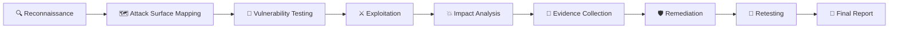

<div align="center">

# 🔴 OWASP TOP 10

## WEB APPLICATION SECURITY LABS

```text
 ██████╗ ██╗    ██╗ █████╗ ███████╗██████╗ 
██╔═══██╗██║    ██║██╔══██╗██╔════╝██╔══██╗
██║   ██║██║    ██║███████║███████╗██████╔╝
██║   ██║██║    ██║██╔══██║╚════██║██╔═══╝ 
╚██████╔╝╚██████╔╝██║  ██║███████║██║     
 ╚═════╝  ╚═════╝ ╚═╝  ╚═╝╚══════╝╚═╝     
```

### 🍊 OWASP JUICE SHOP × OFFENSIVE SECURITY

**Hands-On Web Application Penetration Testing • Vulnerability Research • Security Analysis**

<br>


<br>

> **🔍 Discover → 🧪 Test → ⚔️ Exploit → 💥 Analyze → 🛡️ Remediate → 🔄 Retest**

</div>

---

# 🛰️ SECURITY RESEARCH MISSION

```text
╔══════════════════════════════════════════════════════════════════════╗
║                    🔴 SECURITY OPERATIONS CONSOLE                   ║
╠══════════════════════════════════════════════════════════════════════╣
║                                                                      ║
║  TARGET       : 🍊 OWASP JUICE SHOP                                 ║
║  OBJECTIVE    : Identify & analyze OWASP Top 10 vulnerabilities      ║
║  ENVIRONMENT  : 🐳 Isolated / Authorized Security Laboratory         ║
║  APPROACH     : Offensive Web Application Security Testing           ║
║                                                                      ║
║  RECON        : ████████████████████  ACTIVE                        ║
║  ENUMERATION  : ████████████████████  ACTIVE                        ║
║  EXPLOITATION : ████████████████████  ACTIVE                        ║
║  REPORTING    : ████████████████████  ACTIVE                        ║
║                                                                      ║
║  OWASP       : [██████░░░░░░░░░░░░] 30%                             ║
║  COMPLETED   : A01 • A02 • A03                                      ║
║  NEXT TARGET : A04 — Insecure Design                                ║
║                                                                      ║
║  STATUS       : 🟢 ACTIVE SECURITY RESEARCH                         ║
║                                                                      ║
╚══════════════════════════════════════════════════════════════════════╝
```

---

# ⚔️ PROJECT OVERVIEW

This repository is a **hands-on Web Application Security research portfolio** focused on understanding and testing the **OWASP Top 10** using the intentionally vulnerable **OWASP Juice Shop** application.

The goal is not simply to complete challenges.

The goal is to understand how vulnerabilities are:

```text
        DISCOVERED
            ↓
        VALIDATED
            ↓
        EXPLOITED
            ↓
        ANALYZED
            ↓
        DOCUMENTED
            ↓
        REMEDIATED
            ↓
        RETESTED
```

Every laboratory exercise is documented with practical evidence, technical observations, attack methodology, security impact, and remediation guidance.

---

# 🍊 TARGET ENVIRONMENT

## OWASP Juice Shop

The primary target for this project is **OWASP Juice Shop**, an intentionally insecure modern web application designed for security training and vulnerability research.

```text
                         🔴 ATTACKER
                              │
                              │
                       HTTP / HTTPS
                              │
                              ▼
                 ┌──────────────────────┐
                 │   🍊 OWASP JUICE     │
                 │        SHOP          │
                 │                      │
                 │  Web Application      │
                 │  REST APIs            │
                 │  Authentication       │
                 │  Business Logic       │
                 │  Database             │
                 └──────────┬───────────┘
                            │
                            ▼
                    🔎 VULNERABILITY
                       DISCOVERY
                            │
                            ▼
                     📸 EVIDENCE
                            │
                            ▼
                    📝 SECURITY REPORT
```

---

# 🎯 PROJECT OBJECTIVES

The primary objectives of this portfolio are:

* 🔍 Understand the OWASP Top 10
* 🌐 Perform web application reconnaissance
* 🧭 Identify attack surfaces
* 🔐 Analyze authentication and authorization
* 🧪 Perform vulnerability testing
* ⚔️ Reproduce vulnerabilities in a controlled environment
* 📡 Analyze HTTP requests and responses
* 🕵️ Use interception proxies for testing
* 💥 Determine security impact
* 📸 Capture reproducible evidence
* 🛡️ Understand remediation techniques
* 🔄 Retest vulnerabilities after mitigation
* 📝 Produce professional security documentation

---

# 📊 OWASP TOP 10 — LIVE PROGRESS

<div align="center">

## `03 / 10` CATEGORIES COMPLETED

### 🔥 30% PROJECT COMPLETION

```text
████████████████████████████░░░░░░░░░░░░░░░░░░░░░░
```

</div>

---

## 🗺️ A01 → A10 SECURITY ROADMAP

|     ID     | OWASP Category                             |     Target    |      Status      |
| :--------: | ------------------------------------------ | :-----------: | :--------------: |
| 🔴 **A01** | Broken Access Control                      | 🍊 Juice Shop | 🟢 **COMPLETED** |
| 🔴 **A02** | Cryptographic Failures                     | 🍊 Juice Shop | 🟢 **COMPLETED** |
| 🔴 **A03** | Injection                                  | 🍊 Juice Shop | 🟢 **COMPLETED** |
| 🟡 **A04** | Insecure Design                            | 🍊 Juice Shop |    🟡 **NEXT**   |
|  ⚪ **A05** | Security Misconfiguration                  | 🍊 Juice Shop |     ⏳ Pending    |
|  ⚪ **A06** | Vulnerable and Outdated Components         | 🍊 Juice Shop |     ⏳ Pending    |
|  ⚪ **A07** | Identification and Authentication Failures | 🍊 Juice Shop |     ⏳ Pending    |
|  ⚪ **A08** | Software and Data Integrity Failures       | 🍊 Juice Shop |     ⏳ Pending    |
|  ⚪ **A09** | Security Logging and Monitoring Failures   | 🍊 Juice Shop |     ⏳ Pending    |
|  ⚪ **A10** | Server-Side Request Forgery                | 🍊 Juice Shop |     ⏳ Pending    |

---

# 🟢 COMPLETED LABS

```text
╔════════════════════════════════════════════════════════╗
║                  COMPLETED RESEARCH                    ║
╠════════════════════════════════════════════════════════╣
║                                                        ║
║  🟢 A01  Broken Access Control                         ║
║  🟢 A02  Cryptographic Failures                        ║
║  🟢 A03  Injection                                     ║
║                                                        ║
║  ──────────────────────────────────────────────────    ║
║                                                        ║
║  📊 Progress: 3 / 10                                  ║
║  🔥 Completion: 30%                                    ║
║                                                        ║
╚════════════════════════════════════════════════════════╝
```

### 🔴 A01 — Broken Access Control

Focus areas:

```text
Authorization
      ↓
Object Access
      ↓
IDOR
      ↓
Privilege Boundaries
      ↓
Authorization Bypass
```

➡️ **[Open A01 Lab →](./01-Broken-Access-Control/)**

---

### 🔴 A02 — Cryptographic Failures

Focus areas:

```text
Sensitive Data
      ↓
Cryptography
      ↓
Weak Protection
      ↓
Information Exposure
      ↓
Security Impact
```

➡️ **[Open A02 Lab →](./02-Cryptographic-Failures/)**

---

### 🔴 A03 — Injection

Focus areas:

```text
User Input
      ↓
Input Validation
      ↓
Injection Point
      ↓
Payload Processing
      ↓
Unexpected Execution
```

➡️ **[Open A03 Lab →](./03-Injection/)**

---

# 🟡 NEXT MISSION

## A04 — INSECURE DESIGN

```text
              CURRENT POSITION
                     │
                     ▼
              🟢 A01 COMPLETED
                     │
                     ▼
              🟢 A02 COMPLETED
                     │
                     ▼
              🟢 A03 COMPLETED
                     │
                     ▼
              🟡 A04 NEXT TARGET
                     │
                     ▼
              ⚪ A05 → A10
```

---

# 🧬 SECURITY TESTING LIFECYCLE

Every lab follows a structured offensive-security methodology.



---

# 🔎 PHASE 01 — RECONNAISSANCE

The first stage focuses on understanding the target.

### Activities

```text
✓ Identify application entry points
✓ Discover available functionality
✓ Map application routes
✓ Identify APIs
✓ Observe authentication mechanisms
✓ Identify user-controlled input
✓ Identify interesting parameters
✓ Identify security boundaries
```

Example reconnaissance targets:

```text
/
├── login
├── register
├── account
├── admin
├── api
├── products
├── basket
├── orders
└── search
```

---

# 🗺️ PHASE 02 — ATTACK SURFACE MAPPING

The application is broken into attack surfaces.

```text
                 🍊 JUICE SHOP
                       │
       ┌───────────────┼───────────────┐
       │               │               │
       ▼               ▼               ▼
   🔐 AUTH          🌐 WEB UI        🔌 APIs
       │               │               │
       ▼               ▼               ▼
  Login/Register   Forms/Inputs    Endpoints
       │               │               │
       └───────────────┼───────────────┘
                       ▼
                🧪 TESTING POINTS
```

---

# 🧪 PHASE 03 — VULNERABILITY TESTING

Testing focuses on identifying weaknesses in:

* Input validation
* Authentication
* Authorization
* Session management
* Business logic
* API security
* Configuration
* Cryptographic controls
* Error handling
* Security headers
* File handling
* Request processing

---

# ⚔️ PHASE 04 — CONTROLLED EXPLOITATION

Once a vulnerability is identified:

```text
                    FINDING
                       │
                       ▼
                Is it reproducible?
                       │
                 ┌─────┴─────┐
                 │           │
                YES           NO
                 │           │
                 ▼           ▼
             Validate      Investigate
                 │
                 ▼
             Exploit
                 │
                 ▼
          Determine Impact
```

All exploitation is performed only against the authorized Juice Shop laboratory environment.

---

# 💥 PHASE 05 — IMPACT ANALYSIS

Each finding is evaluated based on:

| Factor             | Questions                              |
| ------------------ | -------------------------------------- |
| 🎯 Confidentiality | Can sensitive data be exposed?         |
| 🎯 Integrity       | Can data be modified?                  |
| 🎯 Availability    | Can services be disrupted?             |
| 👤 Privilege       | Can attacker permissions increase?     |
| 🏢 Business Impact | What could happen to the organization? |
| 🔥 Exploitability  | How difficult is exploitation?         |

---

# 📸 PHASE 06 — EVIDENCE COLLECTION

Every important finding should contain reproducible evidence.

Recommended evidence:

```text
📸 Screenshot
    ↓
🌐 Request
    ↓
📨 Response
    ↓
⚔️ Payload / Manipulation
    ↓
💥 Result
```

Example evidence structure:

```text
screenshots/
│
├── 01-recon.png
├── 02-request.png
├── 03-modified-request.png
├── 04-exploitation.png
├── 05-impact.png
└── 06-remediation.png
```

---

# 🛡️ PHASE 07 — REMEDIATION

A professional assessment doesn't stop at exploitation.

Each vulnerability includes:

```text
Vulnerability
      ↓
Root Cause
      ↓
Security Impact
      ↓
Recommended Fix
      ↓
Security Best Practice
      ↓
Retest
```

---

# 🔄 PHASE 08 — RETESTING

After remediation:

```text
Original Test
     │
     ▼
Vulnerability Confirmed
     │
     ▼
Remediation Applied
     │
     ▼
Same Attack Repeated
     │
     ├───────► ❌ Still Vulnerable
     │
     └───────► ✅ Fixed
```

---

# 🧰 SECURITY TOOLKIT

| Tool                    | Purpose                            |
| ----------------------- | ---------------------------------- |
| 🐧 **Ubuntu Linux**     | Primary security environment       |
| 🍊 **OWASP Juice Shop** | Vulnerable target application      |
| 🕵️ **Burp Suite**      | HTTP interception and manipulation |
| 🛡️ **OWASP ZAP**       | Web application security testing   |
| 🔎 **Nmap**             | Network/service enumeration        |
| 📡 **Wireshark**        | Traffic analysis                   |
| 🐳 **Docker**           | Isolated application deployment    |
| 🔀 **Git**              | Version control                    |
| 🐙 **GitHub**           | Portfolio and documentation        |

---

# 🕵️ BURP SUITE WORKFLOW

```text
Browser
   │
   ▼
┌──────────────┐
│  Burp Proxy  │
└──────┬───────┘
       │
       ▼
🍊 Juice Shop
       │
       ▼
 HTTP Response
       │
       ▼
 Burp Analysis
       │
       ├── Modify
       ├── Replay
       ├── Compare
       └── Validate
```

Typical testing workflow:

```text
Proxy → HTTP History → Identify Request
                    ↓
                 Repeater
                    ↓
              Modify Request
                    ↓
              Send Request
                    ↓
              Analyze Response
```

---

# 📊 VULNERABILITY ANALYSIS MODEL

Every finding is analyzed using:

```text
┌────────────────────────────────────┐
│       VULNERABILITY FINDING        │
├────────────────────────────────────┤
│                                    │
│ 🔎 Discovery                       │
│ 🧪 Reproduction                    │
│ ⚔️ Exploitation                   │
│ 💥 Impact                          │
│ 🎯 Severity                        │
│ 📸 Evidence                        │
│ 🛡️ Remediation                     │
│ 🔄 Retest                          │
│                                    │
└────────────────────────────────────┘
```

---

# 📝 SECURITY REPORTING

Each completed lab contains dedicated documentation.

```text
01-Broken-Access-Control/
│
├── README.md
│
├── commands.sh
│
├── notes.md
│
├── checklist.md
│
├── security_report.md
│
└── screenshots/
    ├── 01-recon.png
    ├── 02-request.png
    ├── 03-exploit.png
    ├── 04-impact.png
    └── 05-remediation.png
```

---

# 📋 LAB DOCUMENTATION STANDARD

Every lab follows the same professional structure.

### 📄 README.md

Contains:

* Objective
* Background
* Target
* Methodology
* Tools
* Attack surface
* Testing process
* Evidence
* Impact
* Remediation
* Lessons learned

### ⚙️ commands.sh

Contains relevant commands used during the laboratory.

### 📝 notes.md

Contains technical observations and research notes.

### ☑️ checklist.md

Contains the security testing checklist.

### 🔐 security_report.md

Contains the professional vulnerability report.

---

# 🧠 ATTACKER MINDSET

During every assessment, ask:

```text
┌───────────────────────────────────────────────┐
│              🧠 ATTACKER QUESTIONS            │
├───────────────────────────────────────────────┤
│                                               │
│ ❓ What can I control?                        │
│ ❓ What does the server trust?                │
│ ❓ Can I modify this request?                 │
│ ❓ Can I access another user's data?          │
│ ❓ Can I bypass this security control?        │
│ ❓ What happens if I remove this parameter?   │
│ ❓ What happens if I change this value?       │
│ ❓ Can I access a restricted endpoint?        │
│ ❓ Can I escalate privileges?                 │
│ ❓ Can I reproduce the behavior?              │
│                                               │
└───────────────────────────────────────────────┘
```

---

# 🔐 SECURITY PRINCIPLES

This portfolio emphasizes:

### 🛡️ Defense in Depth

Multiple security controls should protect sensitive functionality.

### 🚫 Least Privilege

Users should receive only the permissions they require.

### 🔒 Secure by Design

Security should be considered during application design, not after exploitation.

### 🧪 Continuous Testing

Applications should be repeatedly tested as functionality changes.

### 📊 Evidence-Based Reporting

Security findings should be reproducible and supported by technical evidence.

---

# 📈 PROJECT METRICS

```text
OWASP CATEGORIES        10
COMPLETED                3
REMAINING                7
CURRENT PROGRESS        30%
TARGET APPLICATION       1
SECURITY METHODOLOGY     1
```

### Current Progress

```text
A01 ████████████████████ 100%
A02 ████████████████████ 100%
A03 ████████████████████ 100%

A04 ░░░░░░░░░░░░░░░░░░░░   0%
A05 ░░░░░░░░░░░░░░░░░░░░   0%
A06 ░░░░░░░░░░░░░░░░░░░░   0%
A07 ░░░░░░░░░░░░░░░░░░░░   0%
A08 ░░░░░░░░░░░░░░░░░░░░   0%
A09 ░░░░░░░░░░░░░░░░░░░░   0%
A10 ░░░░░░░░░░░░░░░░░░░░   0%
```

---

# 🗂️ REPOSITORY ARCHITECTURE

```text
OWASP-Top-10/
│
├── 📄 README.md
│
├── 🔴 01-Broken-Access-Control/
│   ├── README.md
│   ├── commands.sh
│   ├── notes.md
│   ├── checklist.md
│   ├── security_report.md
│   └── screenshots/
│
├── 🔴 02-Cryptographic-Failures/
│   ├── README.md
│   ├── commands.sh
│   ├── notes.md
│   ├── checklist.md
│   ├── security_report.md
│   └── screenshots/
│
├── 🔴 03-Injection/
│   ├── README.md
│   ├── commands.sh
│   ├── notes.md
│   ├── checklist.md
│   ├── security_report.md
│   └── screenshots/
│
├── 🟡 04-Insecure-Design/
├── ⚪ 05-Security-Misconfiguration/
├── ⚪ 06-Vulnerable-Components/
├── ⚪ 07-Authentication-Failures/
├── ⚪ 08-Software-Data-Integrity-Failures/
├── ⚪ 09-Logging-Monitoring-Failures/
└── ⚪ 10-SSRF/
```

---

# 🧭 PROJECT NAVIGATION

### 🔴 Completed

* **[A01 — Broken Access Control](./01-Broken-Access-Control/)**
* **[A02 — Cryptographic Failures](./02-Cryptographic-Failures/)**
* **[A03 — Injection](./03-Injection/)**

### 🟡 Next

* **[A04 — Insecure Design](./04-Insecure-Design/)**

### ⚪ Upcoming

* **[A05 — Security Misconfiguration](./05-Security-Misconfiguration/)**
* **[A06 — Vulnerable Components](./06-Vulnerable-Components/)**
* **[A07 — Authentication Failures](./07-Authentication-Failures/)**
* **[A08 — Software & Data Integrity Failures](./08-Software-Data-Integrity-Failures/)**
* **[A09 — Logging & Monitoring Failures](./09-Logging-Monitoring-Failures/)**
* **[A10 — SSRF](./10-SSRF/)**

---

# 🏆 SKILLS BEING DEVELOPED

```text
Web Application Security      ████████████████████
Vulnerability Assessment      ████████████████████
Burp Suite                    ██████████████████
HTTP Analysis                 ██████████████████
OWASP Methodology             ████████████████████
API Security                  ████████████████
Security Documentation        ████████████████████
Linux Security                ██████████████████
Docker                        ████████████████
Git / GitHub                  ████████████████████
```

---

# 🌐 REAL-WORLD SECURITY RELEVANCE

The techniques practiced in this laboratory environment translate to real-world security assessments involving:

```text
🏦 Banking Applications
🏢 Enterprise Web Applications
🛒 E-Commerce Platforms
☁️ Cloud Management Interfaces
📱 Mobile Application APIs
🔌 REST APIs
🔗 Microservices
👤 Identity Platforms
```

The purpose of using an intentionally vulnerable application is to build practical skills in a **controlled and authorized environment** before applying the same methodology to systems where explicit permission is required.

---

# 🚨 SECURITY ETHICS

> **Only test systems that you own or have explicit authorization to assess.**

This project uses OWASP Juice Shop specifically because it is designed for security training and controlled vulnerability research.

The techniques documented here are intended for:

* Authorized penetration testing
* Security education
* Defensive research
* Vulnerability validation
* Secure development training
* CTF / laboratory environments

---

# 🎓 LEARNING OUTCOMES

By completing this project, the following capabilities are being developed:

### Technical

* Web application reconnaissance
* HTTP request analysis
* Authorization testing
* Authentication testing
* Injection testing
* API security testing
* Vulnerability validation
* Exploitation methodology
* Security impact analysis

### Professional

* Security reporting
* Evidence collection
* Vulnerability documentation
* Remediation recommendations
* Risk communication
* Structured penetration-testing methodology

---

# 🚀 FINAL DESTINATION

```text
                         🔴 OWASP TOP 10
                               │
                               ▼
                     🍊 JUICE SHOP LAB
                               │
                ┌──────────────┼──────────────┐
                ▼              ▼              ▼
             🔍 RECON       🧪 TEST         ⚔️ EXPLOIT
                │              │              │
                └──────────────┼──────────────┘
                               ▼
                         💥 IMPACT
                               │
                               ▼
                        📸 EVIDENCE
                               │
                               ▼
                        🛡️ REMEDIATION
                               │
                               ▼
                          🔄 RETEST
                               │
                               ▼
                        📝 REPORT
                               │
                               ▼
                    🏆 SECURITY PORTFOLIO
```

---

# 📊 ROAD TO 100%

<div align="center">

```text
                    OWASP TOP 10 JOURNEY

A01 🟢 ━━━━━━━━━━━━━━━━━━━━ 100%
A02 🟢 ━━━━━━━━━━━━━━━━━━━━ 100%
A03 🟢 ━━━━━━━━━━━━━━━━━━━━ 100%
A04 🟡 ━━━━━━━━━━━━━━━━━━━━ NEXT
A05 ⚪ ──────────────────── PENDING
A06 ⚪ ──────────────────── PENDING
A07 ⚪ ──────────────────── PENDING
A08 ⚪ ──────────────────── PENDING
A09 ⚪ ──────────────────── PENDING
A10 ⚪ ──────────────────── PENDING


              🔥 CURRENT: 30%

       🟢🟢🟢⚪⚪⚪⚪⚪⚪⚪
```

### 🎯 MISSION: `10 / 10`

**From vulnerability discovery → professional security assessment**

</div>

---

# 📚 REFERENCES

* [OWASP Top 10](https://owasp.org/www-project-top-ten/)
* [OWASP Juice Shop](https://owasp.org/www-project-juice-shop/)
* [OWASP Web Security Testing Guide](https://owasp.org/www-project-web-security-testing-guide/)
* [OWASP Application Security Verification Standard](https://owasp.org/www-project-application-security-verification-standard/)
* [MITRE CWE](https://cwe.mitre.org/)

---

<div align="center">

# ⚔️ BREAK • ANALYZE • SECURE

```text
╔══════════════════════════════════════════════╗
║                                              ║
║          🔴 OWASP SECURITY LAB               ║
║                                              ║
║       🍊 JUICE SHOP ASSESSMENT               ║
║                                              ║
║          03 / 10 COMPLETED                   ║
║                                              ║
║             🔥 30% COMPLETE                  ║
║                                              ║
║       NEXT → A04: INSECURE DESIGN            ║
║                                              ║
╚══════════════════════════════════════════════╝
```

### 🛡️ Offensive Security Research Portfolio

**Reconnaissance • Exploitation • Analysis • Remediation**

<br>

`🟢 3 Completed`    `🟡 1 Next`    `⚪ 6 Remaining`

</div>
