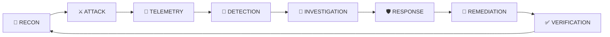
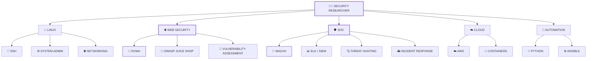
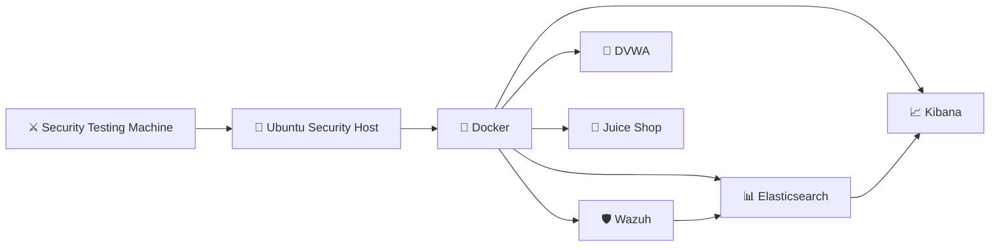
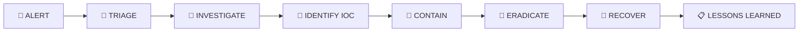

<!-- ═══════════════════════════════════════════════════════════════ -->

<!--                 CYBERSECURITY LAB PORTFOLIO                    -->

<!-- ═══════════════════════════════════════════════════════════════ -->

<div align="center">

# 🛡️ CYBERSECURITY LAB

### `OFFENSE • DEFENSE • AUTOMATION • CLOUD • SOC`


<br>


</div>

---

<p align="center">


</p>

# 🛰️ SECURITY OPERATIONS // ONLINE

```text
╔══════════════════════════════════════════════════════════════════════╗
║                    🛡️ CYBERSECURITY LABORATORY                     ║
╠══════════════════════════════════════════════════════════════════════╣
║                                                                      ║
║  OPERATOR       : Umer Ali                                           ║
║  MISSION        : Practical Cybersecurity & DevSecOps                ║
║  ENVIRONMENT    : Linux • Docker • Cloud • Security Labs             ║
║                                                                      ║
║  🔎 RECON             ████████████████████  ACTIVE                   ║
║  🐧 LINUX             ████████████████████  ACTIVE                   ║
║  🛡️ SIEM              ██████████████████░░  ACTIVE                   ║
║  🔍 THREAT HUNTING    ████████████████░░░░  ACTIVE                   ║
║  ⚔️ VULNERABILITY      █████████████████░░░  ACTIVE                   ║
║  ☁️ CLOUD             ██████████████░░░░░░  LEARNING                 ║
║  ⚙️ DEVSECOPS         ███████████████░░░░░  BUILDING                 ║
║                                                                      ║
║  SYSTEM STATUS : 🟢 OPERATIONAL                                     ║
║  SECURITY MODE : 🔐 AUTHORIZED LABS                                 ║
╚══════════════════════════════════════════════════════════════════════╝
```

---

# 🧠 ABOUT THIS LAB

This repository is my **hands-on cybersecurity laboratory and technical portfolio**.

Instead of only collecting certifications or studying theory, I use practical labs to understand how systems are:

```text
        🔎 DISCOVERED
             ↓
        🧪 TESTED
             ↓
        ⚔️ ATTACKED
             ↓
        📊 ANALYZED
             ↓
        🚨 DETECTED
             ↓
        🛡️ REMEDIATED
             ↓
        🔄 VERIFIED
```

The lab covers multiple areas of cybersecurity, including:

**Linux • Vulnerability Assessment • Web Security • SIEM • Threat Hunting • Cloud • DevSecOps • Python Automation • Security Controls**

---

# 🎯 THE MISSION

> **Learn how attacks work. Understand how to detect them. Build the skills to defend against them.**

This portfolio follows an **Attack → Detect → Investigate → Respond → Harden** mindset.



---

# 🗺️ SECURITY LAB ECOSYSTEM



---

# 🚀 LEARNING TRACKS

<table>
<tr>
<td width="50%" valign="top">

## 🐧 Linux Security

```text
████████████████████ 100%
```

* Linux Fundamentals
* Linux Deep Dive
* Users & Groups
* Permissions
* Processes
* Services
* Networking
* SSH
* System Administration
* Security Hardening

</td>

<td width="50%" valign="top">

## 🛡️ SOC & SIEM

```text
██████████████████░░ 90%
```

* SIEM Fundamentals
* Wazuh
* Elasticsearch
* Kibana
* Log Analysis
* Alert Investigation
* Incident Response
* Threat Hunting
* Detection Engineering

</td>
</tr>

<tr>
<td width="50%" valign="top">

## 🔎 Vulnerability Assessment

```text
████████████████░░░░ 80%
```

* Reconnaissance
* Network Enumeration
* Web Security
* DVWA
* OWASP Juice Shop
* Vulnerability Validation
* Risk Assessment
* Security Reporting

</td>

<td width="50%" valign="top">

## ⚙️ DevSecOps

```text
███████████████░░░░░ 75%
```

* Docker
* Git
* GitHub
* Ansible
* CI/CD Concepts
* Infrastructure Security
* Container Security
* Security Automation

</td>
</tr>

<tr>
<td width="50%" valign="top">

## ☁️ Cloud Security

```text
████████████░░░░░░░░ 60%
```

* AWS Fundamentals
* IAM
* Cloud Architecture
* Cloud Security
* Containers
* Infrastructure Security

</td>

<td width="50%" valign="top">

## 🐍 Security Automation

```text
██████████████░░░░░░ 70%
```

* Python
* Bash
* Security Scripts
* Log Processing
* Automation
* API Interaction
* SOC Automation

</td>
</tr>
</table>

---

# 🔥 CYBERSECURITY LABS

## 🎯 Web Application Security

| Lab                         | Focus                     | Status |
| --------------------------- | ------------------------- | :----: |
| 🎯 DVWA                     | Web Vulnerability Testing |   🟢   |
| 🍊 OWASP Juice Shop         | Web Security Assessment   |   🟢   |
| 🔎 Vulnerability Assessment | Security Testing          |   🟢   |
| 🛡️ Security Frameworks     | Assessment Methodology    |   🟡   |

### DVWA Attack Surface

```text
                       🎯 DVWA
                         │
       ┌─────────────────┼─────────────────┐
       │                 │                 │
       ▼                 ▼                 ▼
   🔐 AUTH            💉 INJECTION      ☣️ XSS
       │                 │                 │
   Brute Force       SQL Injection      Reflected
   CAPTCHA           Blind SQLi         Stored
   Sessions          Command Injection  DOM
       │                 │                 │
       └─────────────────┼─────────────────┘
                         │
                    📁 FILE SECURITY
                         │
                    File Upload
                    File Inclusion
                         │
                         ▼
                     💥 IMPACT
```

**DVWA labs include practical methodology, commands, screenshots, findings, impact, remediation, and lessons learned.**

---

# 🛡️ SOC & SIEM LABS

```text
             🖥️ ENDPOINT
                  │
                  ▼
            📜 LOG EVENTS
                  │
                  ▼
            🚨 SIEM / WAZUH
                  │
         ┌────────┴────────┐
         │                 │
         ▼                 ▼
    🔎 DETECTION       📊 CORRELATION
         │                 │
         └────────┬────────┘
                  ▼
            🚨 ALERT
                  │
                  ▼
          🔬 INVESTIGATION
                  │
                  ▼
             🚑 RESPONSE
                  │
                  ▼
             🛡️ REMEDIATION
```

### Security Operations Topics

* SIEM Architecture
* Wazuh
* Elasticsearch
* Kibana
* Log Collection
* Alert Investigation
* False Positive Analysis
* IOC / IOA
* MITRE ATT&CK
* Incident Response
* Threat Hunting
* Detection Engineering

---

# 🔎 VULNERABILITY ASSESSMENT

```text
┌────────────────────────────────────────────────────────┐
│                 VULNERABILITY WORKFLOW                 │
├────────────────────────────────────────────────────────┤
│                                                        │
│  01 🔎 Reconnaissance                                  │
│       ↓                                                │
│  02 🌐 Network Discovery                               │
│       ↓                                                │
│  03 🎯 Enumeration                                     │
│       ↓                                                │
│  04 🔍 Vulnerability Identification                    │
│       ↓                                                │
│  05 🧪 Validation                                      │
│       ↓                                                │
│  06 📊 Risk Assessment                                 │
│       ↓                                                │
│  07 📝 Security Report                                 │
│       ↓                                                │
│  08 🛡️ Remediation                                    │
│       ↓                                                │
│  09 🔄 Retesting                                       │
│                                                        │
└────────────────────────────────────────────────────────┘
```

---

# 🧰 SECURITY TOOLKIT

<p align="center">


</p>

<p align="center">


</p>

---

# 🏗️ LAB INFRASTRUCTURE



---

# 📂 REPOSITORY MAP

```text
Cybersecurity-Lab/
│
├── 🐧 Linux_DeepDive/
│
├── 🐍 Python_DeepDive/
│
├── 🛡️ SIEM/
│
├── 🔎 Elasticsearch/
│
├── 🔍 Elasticsearch_Threat_Hunting/
│
├── 🛡️ CISTop20_ControlsLabs/
│
├── 🔎 Vulnerability-Assessment/
│
├── 🎯 DVWA/
│
├── 🍊 OWASP-Juice-Shop/
│
├── 🐳 Docker/
│
├── ☁️ Cloud/
│
└── 📄 README.md
```

---

# 📚 DOCUMENTATION STANDARD

Every serious lab follows a structured security documentation model:

```text
LAB/
│
├── README.md
│
├── commands.md
│
├── methodology.md
│
├── findings.md
│
├── remediation.md
│
├── lessons-learned.md
│
└── screenshots/
    ├── evidence-01.png
    ├── evidence-02.png
    └── evidence-03.png
```

### Each Lab Documents

| Section            | Purpose                     |
| ------------------ | --------------------------- |
| 🎯 Objective       | What is being tested        |
| 🔎 Recon           | Attack-surface discovery    |
| 🧪 Methodology     | Testing approach            |
| ⚔️ Testing         | Controlled security testing |
| 📸 Evidence        | Visual proof                |
| 💥 Impact          | Security consequences       |
| 📊 Findings        | Vulnerability details       |
| 🛡️ Remediation    | Recommended controls        |
| 🔄 Retesting       | Verification                |
| 📚 Lessons Learned | Knowledge gained            |

---

# 🧠 SECURITY MINDSET

```text
                ┌─────────────────┐
                │   SECURITY      │
                │    MINDSET      │
                └────────┬────────┘
                         │
        ┌────────────────┼────────────────┐
        │                │                │
        ▼                ▼                ▼
    🔴 OFFENSE       🟡 ANALYSIS       🟢 DEFENSE
        │                │                │
    Recon             Evidence         Hardening
    Exploit           Logs             Detection
    Payload           Alerts           Response
    Enumeration       Correlation      Remediation
        │                │                │
        └────────────────┼────────────────┘
                         ▼
                  🛡️ SECURITY
```

---

# 📊 CURRENT CAPABILITY MATRIX

| Domain                      | Skills                        |         Level        |
| --------------------------- | ----------------------------- | :------------------: |
| 🐧 Linux                    | Administration / Security     | 🟢 Advanced Learning |
| 🌐 Networking               | TCP/IP / DNS / HTTP / Routing |       🟢 Active      |
| 🔎 Vulnerability Assessment | Recon / Enumeration / Testing |       🟢 Active      |
| 🌐 Web Security             | DVWA / Juice Shop / OWASP     |       🟢 Active      |
| 🛡️ SIEM                    | Wazuh / ELK / Alerts          |       🟢 Active      |
| 🔍 Threat Hunting           | Logs / IOC / IOA              |     🟡 Developing    |
| ☁️ Cloud                    | AWS / Architecture            |     🟡 Developing    |
| 🐳 Containers               | Docker                        |       🟢 Active      |
| 🐍 Python                   | Automation / Scripting        |     🟡 Developing    |
| ⚙️ DevSecOps                | Git / Ansible / Security      |     🟡 Developing    |

---

# 🚨 INCIDENT RESPONSE PIPELINE



---

# 🔐 SECURITY FRAMEWORKS

This laboratory incorporates concepts from:

```text
┌──────────────────────────────────────────────┐
│               SECURITY FRAMEWORKS            │
├──────────────────────────────────────────────┤
│                                              │
│  🛡️ OWASP Top 10                             │
│  🧭 MITRE ATT&CK                             │
│  🏛️ NIST Cybersecurity Framework             │
│  🔐 CIS Critical Security Controls            │
│  🚨 Incident Response Methodologies           │
│                                              │
└──────────────────────────────────────────────┘
```

---

# 📈 LAB PROGRESS

```text
🐧 Linux
████████████████████████████████████████ 100%

🔎 Vulnerability Assessment
████████████████████████████████░░░░░░░░  80%

🛡️ SIEM / SOC
██████████████████████████████████░░░░░░  90%

🌐 Web Security
██████████████████████████████░░░░░░░░░░  80%

🐍 Python Automation
██████████████████████████░░░░░░░░░░░░░░  70%

⚙️ DevSecOps
████████████████████████░░░░░░░░░░░░░░░░  65%

☁️ Cloud Security
██████████████████░░░░░░░░░░░░░░░░░░░░░░  55%
```

---

# 🔥 THE SECURITY LOOP

<p align="center">

```text
🔎 DISCOVER
     ↓
🎯 IDENTIFY
     ↓
⚔️ TEST
     ↓
💥 UNDERSTAND IMPACT
     ↓
📡 DETECT
     ↓
🔬 INVESTIGATE
     ↓
🛡️ REMEDIATE
     ↓
🔄 RETEST
     ↓
✅ SECURE
```

</p>

---

# 🧪 PRACTICAL PROJECTS

### 🛡️ Enterprise SOC Platform

A practical SOC environment designed around:

* Wazuh
* Docker
* Linux endpoints
* Security monitoring
* Alert investigation
* Incident response
* Detection engineering
* Security documentation

---

### 🎯 DVWA Security Labs

Hands-on testing of intentionally vulnerable web functionality:

* Authentication weaknesses
* SQL Injection
* Blind SQL Injection
* Command Injection
* XSS
* CSRF
* File Inclusion
* File Upload
* Session weaknesses
* Authorization issues

---

### 🍊 OWASP Juice Shop Assessment

Practical web application security assessment including:

* Reconnaissance
* Authentication testing
* Injection testing
* Access-control analysis
* Vulnerability documentation
* Security reporting

---

# 📸 VISUAL SECURITY EVIDENCE

Every practical project aims to include real evidence:

```text
             📸 EVIDENCE
                  │
        ┌─────────┼─────────┐
        │         │         │
        ▼         ▼         ▼
     🖥️ LAB     🌐 HTTP    💻 CLI
     SCREEN     REQUEST    OUTPUT
        │         │         │
        └─────────┼─────────┘
                  ▼
             📝 FINDING
                  │
                  ▼
             🛡️ FIX
```

Screenshots are stored with their respective labs rather than mixed together.

---

# 🧭 ROADMAP

```text
2026 CYBERSECURITY ROADMAP

[✓] Linux Fundamentals
[✓] Linux Deep Dive
[✓] Networking Fundamentals
[✓] Docker Fundamentals
[✓] SIEM Fundamentals
[✓] Wazuh Deployment
[✓] Vulnerability Assessment
[✓] DVWA Labs
[✓] Web Security Practice
[→] Advanced Threat Hunting
[→] Detection Engineering
[→] SOC Automation
[→] Cloud Security
[→] DevSecOps Security
[→] Advanced Incident Response
```

---

# ⚠️ ETHICAL USE

> **This repository is intended for educational and authorized security testing only.**

All vulnerable applications are used within controlled laboratory environments.

Security techniques documented here must not be used against systems, applications, networks, or accounts without explicit authorization.

```text
AUTHORIZED
    ↓
CONTROLLED
    ↓
TEST
    ↓
ANALYZE
    ↓
DOCUMENT
    ↓
DEFEND
```

---

# 👨‍💻 ABOUT THE RESEARCHER

<div align="center">

## Umer Ali

### `Cybersecurity • SOC • DevSecOps • Linux`

Hands-on learner building practical security skills through:

**Labs → Projects → Documentation → Automation → Detection**

<br>

<a href="https://github.com/ua4157489-code">


</a>

</div>

---

# 📊 GITHUB ACTIVITY

<p align="center">


</p>

<p align="center">


</p>

---

# 🟢 SYSTEM STATUS

<p align="center">


</p>

```text
╔══════════════════════════════════════════════════════════════╗
║                                                              ║
║                  🛡️ CYBERSECURITY LAB                       ║
║                                                              ║
║             ATTACK  →  ANALYZE  →  DEFEND                   ║
║                                                              ║
║             STATUS : 🟢 OPERATIONAL                         ║
║             MODE   : 🔬 PRACTICAL LEARNING                  ║
║             ACCESS : 🔐 AUTHORIZED LABS                     ║
║                                                              ║
╚══════════════════════════════════════════════════════════════╝
```

<p align="center">


</p>

<p align="center">

### 🔐 Learn the Attack. Detect the Threat. Build the Defense.

</p>
